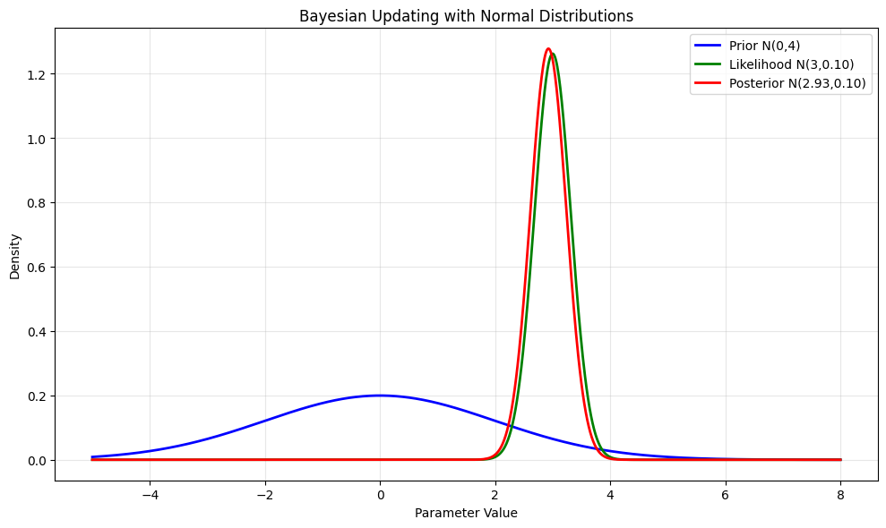
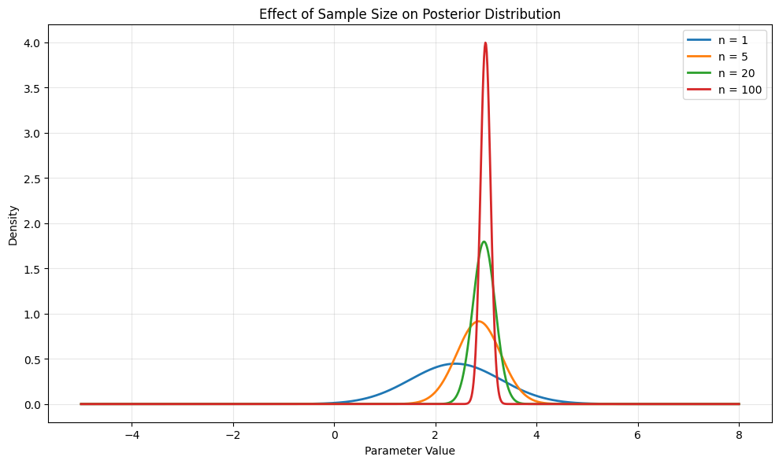
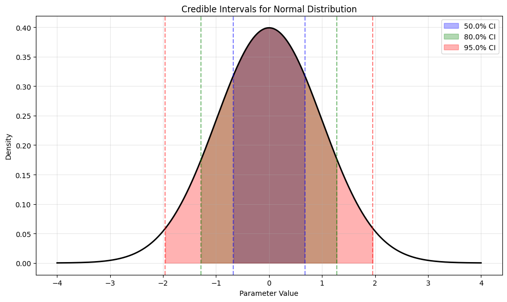
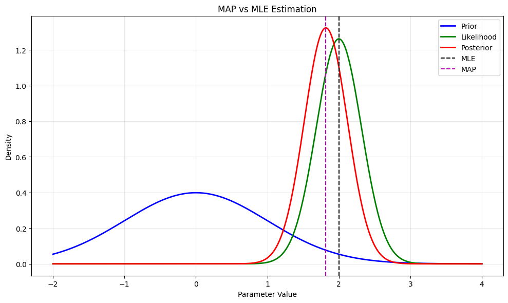

# Advanced Topics in Normal Distribution

This note covers advanced applications and properties of the Normal distribution in machine learning and statistics.

## Bayesian Applications

### Usage in Bayesian Inference

In Bayesian analysis, the Normal distribution is often used as:

- A **likelihood function** for continuous data with constant variance
- A **prior distribution** for location parameters
- A **posterior distribution** (when combined with the right prior)

### Effect of Standard Deviation in Bayesian Analysis

The standard deviation plays a crucial role in Bayesian analysis:

- In the prior: Controls the strength of our prior beliefs
  - Smaller σ₀ indicates stronger prior beliefs
  - Larger σ₀ indicates weaker prior beliefs
- In the likelihood: Represents the uncertainty in our data
  - Smaller σ indicates more precise measurements
  - Larger σ indicates more noisy data

## Advanced Visualizations

### 1. Bayesian Updating Process

- Shows how prior knowledge (blue) combines with new data (green) to form the posterior (red)
- Demonstrates the conjugate property of Normal distributions
- Illustrates how the posterior mean is a weighted average of prior and data

### 2. Effect of Sample Size

- Shows how increasing sample size affects the posterior distribution
- Demonstrates the convergence of Bayesian estimates
- Illustrates the relationship between sample size and posterior precision

### 3. Credible Intervals

- Shows different credible intervals (50%, 80%, 95%)
- Demonstrates how to quantify uncertainty in Bayesian estimates
- Illustrates the relationship between interval width and confidence level

### 4. MAP vs MLE Estimation

- Compares Maximum A Posteriori (MAP) and Maximum Likelihood (MLE) estimates
- Shows how prior information affects parameter estimation
- Demonstrates the trade-off between prior beliefs and data

## Mathematical Details

### Conjugate Prior Properties

For a Normal likelihood with known variance σ²:
- Prior: N(μ₀, σ₀²)
- Likelihood: N(μ, σ²/n)
- Posterior: N(μ₁, σ₁²)

Where:
- μ₁ = (μ₀/σ₀² + nμ/σ²) / (1/σ₀² + n/σ²)
- σ₁² = 1 / (1/σ₀² + n/σ²)

### MAP Estimation Formula

The MAP estimate for a Normal-Normal model is:

$$\mu_{MAP} = \frac{\mu_0/\sigma_0^2 + n\bar{x}/\sigma^2}{1/\sigma_0^2 + n/\sigma^2}$$

This is a weighted average of:
- Prior mean (μ₀) weighted by prior precision (1/σ₀²)
- Sample mean (x̄) weighted by data precision (n/σ²)

## Running the Advanced Examples

You can generate these advanced visualizations using:

```bash
python3 ML_Obsidian_Vault/Lectures/2/Codes/1_normal_distribution_advanced.py
```

## Related Topics

- [[L2_5_Bayesian_Inference|Bayesian Inference]]: Detailed coverage of Bayesian methods
- [[L2_3_Parameter_Estimation|Parameter Estimation]]: Methods for estimating distribution parameters
- [[L2_7_MAP_Estimation|MAP Estimation]]: Advanced topics in maximum a posteriori estimation
- [[L2_5_Conjugate_Priors|Conjugate Priors]]: Mathematical properties of conjugate distributions 