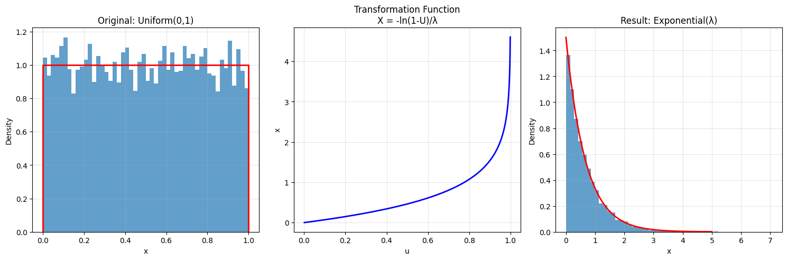
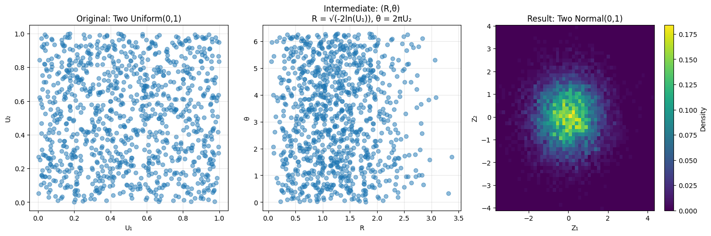
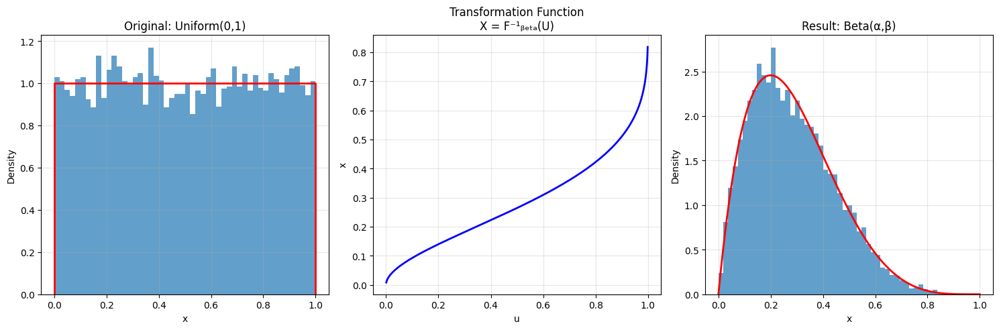
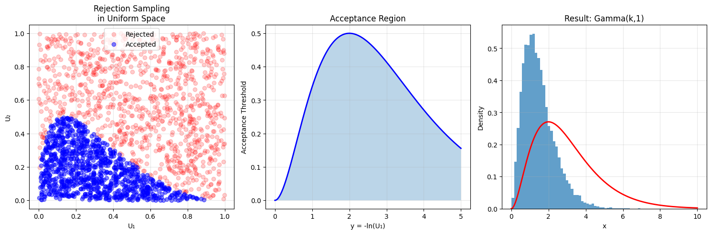

# Probability Distribution Transformations

This note covers the theory and practice of transforming random variables from one distribution to another, with a special focus on transformations starting from the Uniform distribution.

## Fundamental Concepts

### 1. Inverse Transform Sampling
- **Definition**: A method for generating samples from any probability distribution, given its cumulative distribution function (CDF)
- **Process**:
  1. Generate U ~ Uniform(0,1)
  2. Return X = F⁻¹(U), where F⁻¹ is the inverse CDF
- **Mathematical Basis**:
  $$P(X \leq x) = P(F^{-1}(U) \leq x) = P(U \leq F(x)) = F(x)$$

### 2. Change of Variables
- **Definition**: A technique for finding the distribution of a transformed random variable
- **Formula** (for Y = g(X)):
  $$f_Y(y) = f_X(g^{-1}(y)) \cdot |\frac{d}{dy}g^{-1}(y)|$$
- **Applications**: Used to derive many common distributions

## Common Transformations

### 1. Uniform to Exponential

- **Transformation**:
  $$X = -\frac{1}{\lambda}\ln(1-U)$$
- **Properties**:
  - Preserves the memoryless property
  - Rate parameter λ controls the scale
  - Widely used in survival analysis

### 2. Uniform to Normal (Box-Muller)

- **Transformation**:
  $$\begin{align*}
  Z_1 &= \sqrt{-2\ln(U_1)}\cos(2\pi U_2) \\
  Z_2 &= \sqrt{-2\ln(U_1)}\sin(2\pi U_2)
  \end{align*}$$
- **Properties**:
  - Generates two independent standard normal variables
  - More efficient than inverse CDF method
  - Widely used in random number generation

### 3. Uniform to Beta

- **Transformation**:
  $$X = F^{-1}_{\text{Beta}}(U; \alpha, \beta)$$
- **Properties**:
  - Shape parameters α, β control the distribution
  - Useful for modeling proportions
  - Requires numerical methods for inverse CDF

### 4. Uniform to Gamma

- **Transformation**: Uses composition method
  1. Generate U₁, U₂ ~ Uniform(0,1)
  2. Y = -ln(U₁)
  3. If U₂ ≤ Y^(k-1)e^(-Y)/Γ(k), accept Y as Gamma(k,1)
- **Properties**:
  - More complex than direct inverse CDF
  - Efficient for certain parameter values
  - Basis for many other distributions

## Advanced Applications

### 1. Multivariate Transformations
- **Copulas**: Transform uniform marginals to joint distributions
- **Spherical Coordinates**: Transform uniform to spherical distributions
- **Probability Integral Transform**: Transform any continuous distribution to uniform

### 2. Importance Sampling
- **Definition**: Use one distribution to sample from another
- **Weight Function**:
  $$w(x) = \frac{f_{\text{target}}(x)}{f_{\text{proposal}}(x)}$$
- **Applications**: Monte Carlo integration, rare event simulation

### 3. Rejection Sampling
- **Definition**: Generate samples from complex distributions
- **Process**:
  1. Sample from simple distribution
  2. Accept/reject based on ratio of densities
- **Efficiency**: Depends on how well proposal matches target

## Mathematical Details

### 1. Probability Integral Transform

For continuous random variable X with CDF F:
$$U = F(X) \sim \text{Uniform}(0,1)$$

### 2. Inverse Transform Method

For U ~ Uniform(0,1):
$$X = F^{-1}(U) \sim F$$

### 3. Transformation Efficiency

Acceptance rate for rejection sampling:
$$\text{rate} = \frac{1}{M} \text{ where } M = \sup_x \frac{f_{\text{target}}(x)}{f_{\text{proposal}}(x)}$$

## Running the Examples

You can generate these transformation visualizations using:

```bash
python3 ML_Obsidian_Vault/Lectures/2/Codes/1_transformations.py
```

## Related Topics

- [[L2_1_Uniform_Distribution|Uniform Distribution]]: Base distribution for transformations
- [[L2_6_Monte_Carlo_Methods|Monte Carlo Methods]]: Applications of transformations
- [[L2_1_Random_Number_Generation|Random Number Generation]]: Using transformations
- [[L2_1_Sampling_Methods|Sampling Methods]]: Advanced sampling techniques
- [[L2_1_Copulas|Copulas]]: Multivariate transformations 