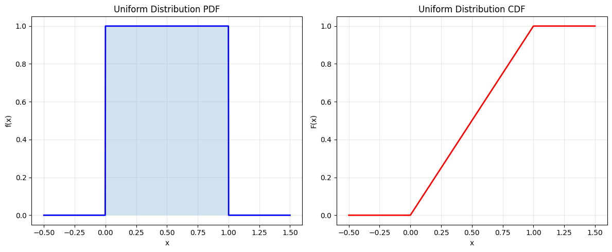
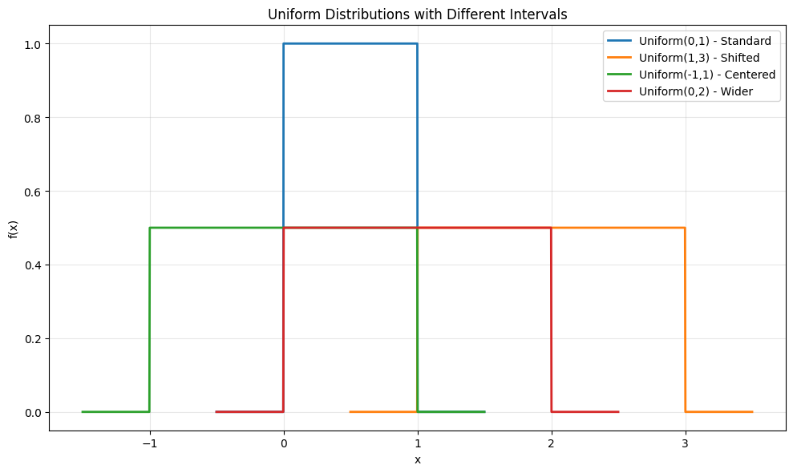
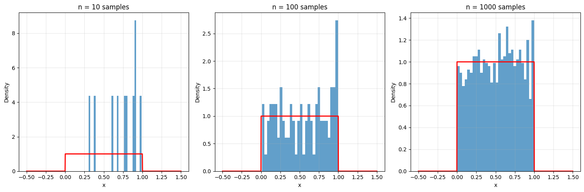
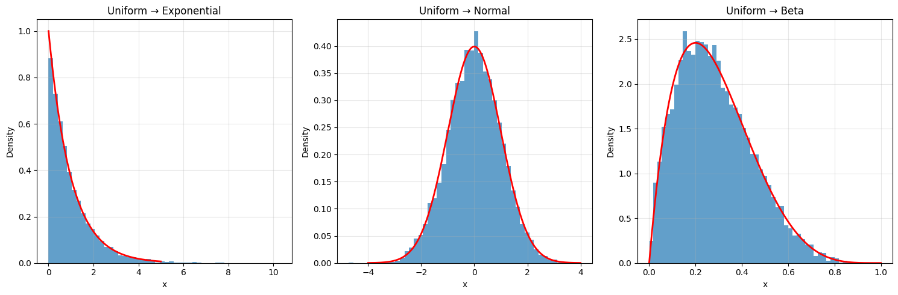

# Uniform Distribution

The Uniform distribution is a continuous probability distribution where all outcomes in a given interval are equally likely. It's characterized by its constant probability density function over a specified range.

## Definition

The probability density function (PDF) of the Uniform distribution is:

$$f(x; a, b) = \begin{cases}
\frac{1}{b-a} & \text{for } x \in [a,b] \\
0 & \text{otherwise}
\end{cases}$$

Where:
- $a$ is the minimum value (lower bound)
- $b$ is the maximum value (upper bound)
- $b > a$

## Properties

- **Mean**: $\mu = \frac{a+b}{2}$
- **Variance**: $\sigma^2 = \frac{(b-a)^2}{12}$
- **Moment Generating Function**: $M_X(t) = \frac{e^{bt} - e^{at}}{t(b-a)}$ for $t \neq 0$
- **Cumulative Distribution Function**: $F(x) = \frac{x-a}{b-a}$ for $x \in [a,b]$
- **Memoryless Property**: The Uniform distribution is not memoryless
- **Maximum Entropy**: Among all continuous distributions on [a,b], the uniform distribution has the maximum entropy

## Usage in Machine Learning

The Uniform distribution is important in machine learning because:
- It's commonly used as a non-informative prior in Bayesian inference
- It's fundamental for random number generation
- It's used in Monte Carlo methods and sampling
- It's the basis for many other distributions through transformations

## Visualizations

The following visualizations demonstrate key properties of the uniform distribution:

1. **Basic Properties**:
   
   - Shows the constant probability density function (PDF)
   - Demonstrates the linear cumulative distribution function (CDF)
   - Illustrates the equal probability across the interval

2. **Different Intervals**:
   
   - Compares Uniform(0,1) with Uniform(1,3)
   - Shows how changing the interval affects the distribution
   - Demonstrates the relationship between interval width and probability density

3. **Sampling Properties**:
   
   - Shows the distribution of samples from a uniform distribution
   - Demonstrates the law of large numbers
   - Illustrates the central limit theorem in action

4. **Transformation Examples**:
   
   - Shows how uniform random variables can be transformed
   - Demonstrates common transformations to other distributions
   - Illustrates the inverse transform sampling method

## Running the Examples

You can run the code that generates the probability examples and visualizations using:

```bash
python3 ML_Obsidian_Vault/Lectures/2/Codes/1_uniform_distribution.py
```

## Related Topics

- [[L2_1_Uniform_Distribution_Advanced|Advanced Topics]]: Bayesian applications, conjugacy, and MAP estimation
- [[L2_1_Continuous_Distributions|Continuous Distributions]]: Overview of continuous probability distributions
- [[L2_1_Probability_Distributions|Probability Distributions]]: General properties of probability distributions
- [[L2_6_Monte_Carlo_Methods|Monte Carlo Methods]]: Using uniform distribution for sampling
- [[L2_5_Bayesian_Inference|Bayesian Inference]]: Using uniform distribution as prior
- [[L2_1_Transformations|Transformations]]: Transforming uniform random variables
