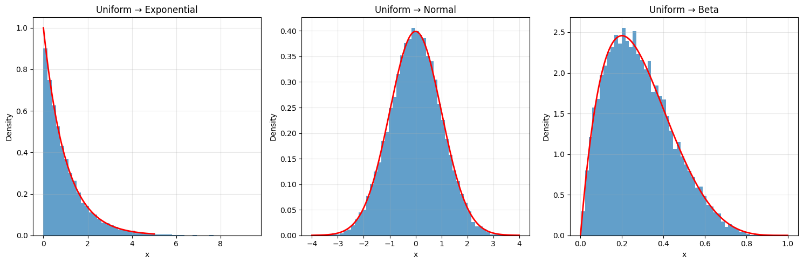
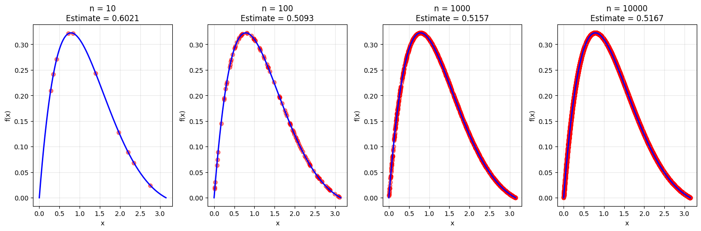
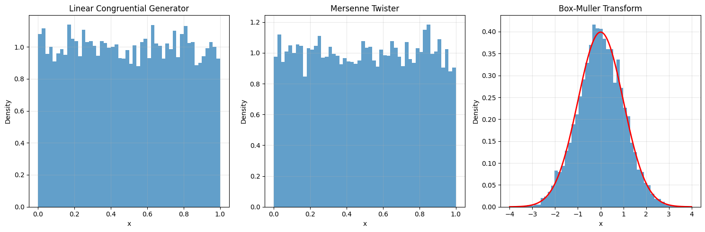
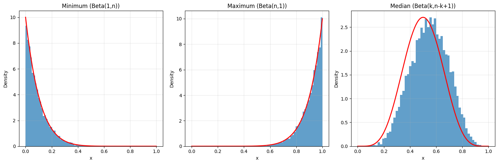
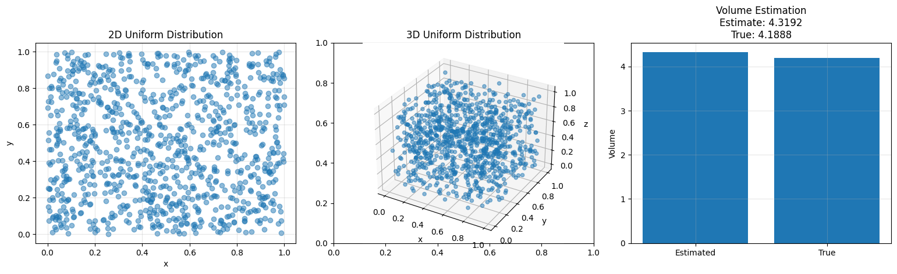

# Advanced Topics in Uniform Distribution

This note covers advanced applications and properties of the Uniform distribution in machine learning and statistics.

## Special Cases and Transformations

### 1. Standard Uniform Distribution
- **Definition**: U(0,1) - The most basic form
- **Properties**:
  - Basis for random number generation
  - Used in inverse transform sampling
  - Fundamental for Monte Carlo methods
- **Mathematical Form**:
  $$f(x) = \begin{cases} 1 & \text{for } 0 \leq x \leq 1 \\ 0 & \text{otherwise} \end{cases}$$

### 2. Discrete Uniform Distribution
- **Definition**: Equal probability for a finite set of values
- **Properties**:
  - Special case of continuous uniform
  - Used in dice rolls and card games
  - Basis for many discrete probability distributions
- **PMF**:
  $$P(X = k) = \frac{1}{n} \text{ for } k \in \{1, 2, ..., n\}$$

### 3. Circular Uniform Distribution
- **Definition**: Uniform distribution on a circle
- **Properties**:
  - Used in directional statistics
  - Important in circular data analysis
  - Applications in navigation and astronomy
- **PDF**:
  $$f(\theta) = \frac{1}{2\pi} \text{ for } 0 \leq \theta < 2\pi$$

## Advanced Visualizations

### 1. Transformation Examples

- Shows how uniform random variables transform to other distributions:
  - **Exponential**: X = -ln(1-U)/λ
  - **Normal**: X = Φ⁻¹(U) (inverse CDF method)
  - **Beta**: X = F⁻¹(U) where F is Beta CDF
- Demonstrates the inverse transform sampling method
- Illustrates how uniform distribution serves as a basis for generating other distributions

### 2. Monte Carlo Integration

- Shows convergence of Monte Carlo integration with increasing sample sizes
- Demonstrates how uniform sampling approximates definite integrals
- Mathematical basis:
  $$\int_a^b f(x)dx \approx (b-a)\frac{1}{n}\sum_{i=1}^n f(X_i)$$
  where X_i ~ U(a,b)

### 3. Random Number Generation

- Demonstrates three key methods:
  1. **Linear Congruential Generator (LCG)**:
     $$X_{n+1} = (aX_n + c) \mod m$$
  2. **Mersenne Twister**: Industry standard for high-quality RNG
  3. **Box-Muller Transform**: Generating normal from uniform
     $$Z = \sqrt{-2\ln(U_1)}\cos(2\pi U_2)$$

### 4. Order Statistics

- Shows distributions of:
  - Minimum (follows Beta(1,n))
  - Maximum (follows Beta(n,1))
  - Median (follows Beta(k,n-k+1))
- Demonstrates the relationship between uniform order statistics and beta distribution
- Key property: k-th order statistic follows Beta(k,n-k+1)

### 5. Multidimensional Uniform

- Demonstrates uniform distribution in higher dimensions:
  1. 2D uniform on unit square
  2. 3D uniform on unit cube
  3. Monte Carlo volume estimation of a sphere:
     $$V_{sphere} \approx 8 \cdot \frac{\text{points inside sphere}}{\text{total points}}$$

## Mathematical Details

### Order Statistics Properties

For n independent U(0,1) random variables:
- k-th order statistic X₍ₖ₎ follows Beta(k,n-k+1)
- PDF of k-th order statistic:
  $$f_{X_{(k)}}(x) = \frac{n!}{(k-1)!(n-k)!}x^{k-1}(1-x)^{n-k}$$
- Expected value:
  $$E[X_{(k)}] = \frac{k}{n+1}$$

### Transformation Properties

Key transformations from U(0,1):
1. **Exponential(λ)**:
   $$X = -\frac{1}{\lambda}\ln(1-U)$$
2. **Normal(0,1)**:
   $$X = \Phi^{-1}(U)$$
3. **Beta(α,β)**:
   $$X = F^{-1}_{\text{Beta}}(U; \alpha, \beta)$$

### Monte Carlo Integration Theory

For a function f(x) on [a,b]:
$$\int_a^b f(x)dx = (b-a)E[f(X)]$$
where X ~ U(a,b)

Monte Carlo estimate:
$$\hat{I} = (b-a)\frac{1}{n}\sum_{i=1}^n f(X_i)$$

Error bound:
$$P(|\hat{I} - I| \geq \epsilon) \leq \frac{\text{Var}(f(X))}{n\epsilon^2}$$

## Running the Advanced Examples

You can generate these advanced visualizations using:

```bash
python3 ML_Obsidian_Vault/Lectures/2/Codes/1_uniform_distribution_advanced.py
```

## Related Topics

- [[L2_1_Uniform_Distribution|Basic Topics]]: Fundamental concepts and properties
- [[L2_6_Monte_Carlo_Methods|Monte Carlo Methods]]: Applications in numerical integration
- [[L2_1_Random_Number_Generation|Random Number Generation]]: Generating random numbers
- [[L2_1_Transformations|Transformations]]: Converting between distributions
- [[L2_1_Order_Statistics|Order Statistics]]: Properties of ordered samples 