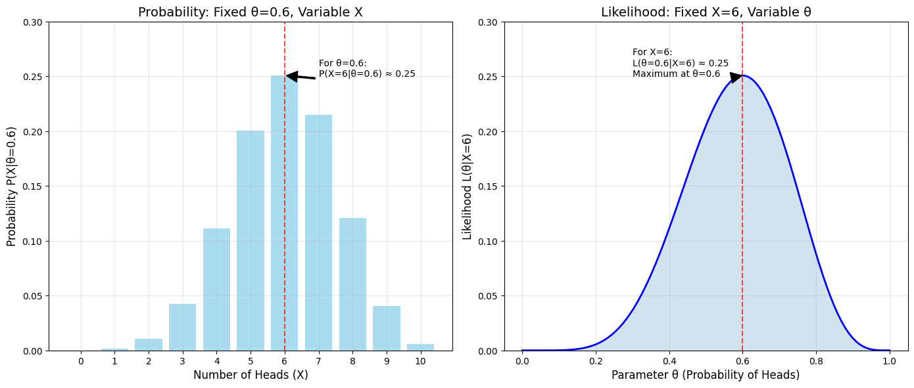
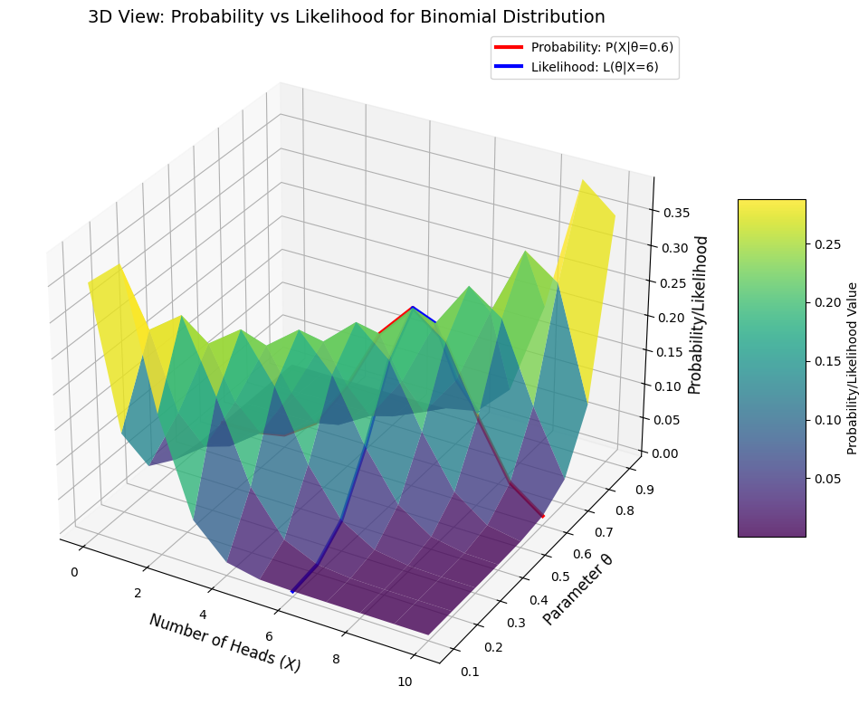
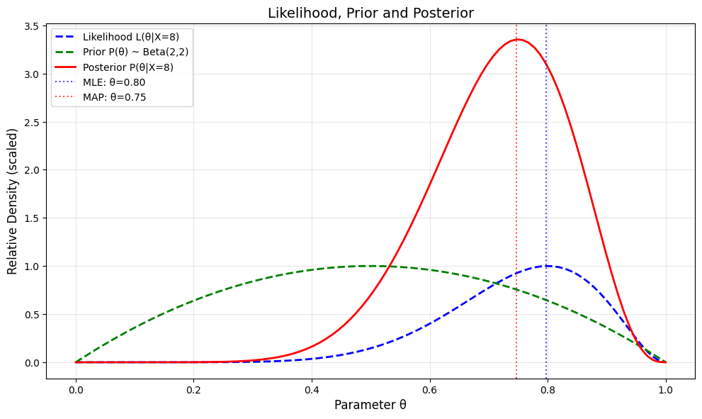

# Probability vs. Likelihood

This note explores the crucial distinction between probability and likelihood, two related but fundamentally different concepts in statistics and machine learning.

## Conceptual Overview

### Probability
Probability measures the chance of observing data given fixed parameters.
- **Definition**: P(X|θ) - probability of data X given parameters θ
- **Perspective**: Function of outcomes (X) for fixed parameters (θ)
- **Property**: Sums/integrates to 1 over all possible outcomes
- **Usage**: Making predictions, assessing risks, hypothesis testing

See [[L2_1_Basic_Probability|Basic Probability]] for detailed theoretical foundations.

### Likelihood
- **Function of parameters given fixed observations**
- Measures how well different parameter values explain observed data
- Does NOT need to sum/integrate to 1 over parameter space
- Written as $L(\theta|X)$ - likelihood of parameters $\theta$ given data $X$
- Used for parameter estimation, model comparison, and inference

See [[L2_3_Likelihood|Likelihood]] for detailed theoretical foundations.

## Mathematical Relationship

The same mathematical function is used for both:
$$P(X|\theta) = L(\theta|X)$$

However, they are interpreted differently:
- For **probability**, $\theta$ is fixed and we vary $X$
- For **likelihood**, $X$ is fixed and we vary $\theta$

This distinction creates fundamentally different perspectives:
- Probability answers: "Given this model, how likely is this data?"
- Likelihood answers: "Given this data, how plausible is this model?"

## Visual Comparison

The fundamental difference between probability and likelihood can be visualized clearly:

- **Left side (Probability)**: Shows the probability distribution when $\theta=0.6$ is fixed. Each bar represents the probability of observing a different number of heads.
- **Right side (Likelihood)**: Shows the likelihood function when the observation $X=6$ heads is fixed. The curve represents how likely different values of $\theta$ are to produce this observation.

This relationship can also be understood as different slices of the same underlying function:

## Mathematical Properties

### Probability Properties
1. For discrete variables: $0 \leq P(X|\theta) \leq 1$
2. For continuous variables: $P(X|\theta) \geq 0$
3. Normalization: $\sum_X P(X|\theta) = 1$ (discrete) or $\int_X P(X|\theta)dX = 1$ (continuous)
4. Conditioning: $P(X,Y|\theta) = P(X|Y,\theta)P(Y|\theta)$

### Likelihood Properties
1. Proportionality: Only relative values matter
2. No normalization requirement
3. Often analyzed in log form (log-likelihood) for computational convenience
4. Products of independent likelihoods: $L(\theta|X,Y) = L(\theta|X) \times L(\theta|Y)$ when X and Y are independent given θ

## Practical Uses

### Probability Use Cases
1. **Prediction**: Calculating the chance of future outcomes
2. **Risk assessment**: Evaluating the probability of undesirable events
3. **Simulation**: Generating random samples based on a known model
4. **Hypothesis testing**: Determining if observed data is likely under a null hypothesis

See [[L2_1_Examples|Probability_Examples]] for detailed examples.

### Likelihood Use Cases
1. **Parameter estimation**: Finding the model parameters that best explain observations
2. **Model comparison**: Evaluating which model better fits the observed data
3. **Statistical inference**: Making conclusions about parameters from data
4. **Feature selection**: Identifying which variables contribute most to explaining observations

See [[L2_3_Likelihood_Examples|Likelihood_Examples]] for detailed examples.

## Applications in Machine Learning

### Maximum Likelihood Estimation (MLE)
- Finds parameters that maximize the likelihood of observed data
- $\hat{\theta}_{MLE} = \arg\max_{\theta} L(\theta|X)$
- Used in training various models including regression, neural networks, etc.
- Commonly implemented by minimizing the negative log-likelihood
- See [[L2_4_MLE_Examples|MLE_Examples]] for detailed examples

### Maximum A Posteriori (MAP) Estimation
- Uses likelihood to update prior beliefs about parameters
- $\hat{\theta}_{MAP} = \arg\max_{\theta} P(\theta|X) = \arg\max_{\theta} L(\theta|X) \cdot P(\theta)$
- Provides a regularized version of MLE that incorporates prior knowledge
- Balances observed data with prior beliefs
- See [[L2_7_MAP_Examples|MAP Examples]] for detailed examples

### Bayesian Inference
- Uses likelihood to update prior beliefs about parameters
- $P(\theta|X) \propto L(\theta|X) \cdot P(\theta)$
- Provides a complete distribution over parameters rather than point estimates
- Allows incorporation of domain knowledge through prior distributions
- See [[L2_5_Bayesian_Inference|Bayesian_Inference]] for theoretical foundation
- See [[L2_7_Full_Bayesian_Inference|Full_Bayesian_Inference]] for detailed examples

## Common Misconceptions

1. **Likelihood is probability**: Likelihood is not a probability distribution over parameters
2. **Likelihood must sum to 1**: Likelihood functions don't need to be normalized
3. **Probability of parameters**: In frequentist statistics, parameters are fixed (not random), so they don't have probabilities
4. **Same interpretation**: Despite using the same mathematical formula, probability and likelihood have different interpretations and uses

## Common Statistical Techniques Using Likelihood

1. **Likelihood Ratio Tests**: Compare relative support for competing models
2. **Profile Likelihood**: Function of a subset of parameters with others fixed at their MLE values
3. **Partial Likelihood**: Used in survival analysis (Cox proportional hazards model)
4. **Empirical Likelihood**: Nonparametric approach to inference based on likelihood principles

## Application to Different Distributions

### Bernoulli/Binomial
- **Probability**: $P(X=k|n,\theta) = {n \choose k}\theta^k(1-\theta)^{n-k}$
- **Likelihood**: $L(\theta|X=k,n) = {n \choose k}\theta^k(1-\theta)^{n-k}$
- **MLE**: $\hat{\theta} = k/n$

### Normal
- **Probability**: $P(X|\mu,\sigma) = \frac{1}{\sigma\sqrt{2\pi}}e^{-\frac{(X-\mu)^2}{2\sigma^2}}$
- **Likelihood**: $L(\mu,\sigma|X) = \frac{1}{\sigma\sqrt{2\pi}}e^{-\frac{(X-\mu)^2}{2\sigma^2}}$
- **MLE**: $\hat{\mu} = \frac{1}{n}\sum_{i=1}^n X_i$, $\hat{\sigma}^2 = \frac{1}{n}\sum_{i=1}^n (X_i - \hat{\mu})^2$

## Examples and Practice

For detailed examples and practice problems illustrating the difference between probability and likelihood, see:
- [[L2_1_Examples|Probability_Examples]]: Examples focusing specifically on probability calculations
- [[L2_3_Likelihood_Examples|Likelihood_Examples]]: Examples focusing specifically on likelihood calculations
- [[L2_3_Probability_vs_Likelihood_Examples|Probability_vs_Likelihood_Examples]]: Practical examples with dice, coins, normal distributions, and real-world applications

## Related Topics

- [[L2_3_Likelihood|Likelihood]]: Detailed exploration of likelihood functions and their applications
- [[L2_3_Likelihood_Examples|Likelihood_Examples]]: Practical examples of likelihood calculations
- [[L2_1_Examples|Probability_Examples]]: Examples focusing specifically on probability calculations
- [[L2_4_Maximum_Likelihood|Maximum_Likelihood]]: Using likelihood for parameter estimation
- [[L2_7_MAP_Estimation|MAP_Estimation]]: Combining likelihood with prior beliefs
- [[L2_1_Basic_Probability|Basic Probability]]: Detailed exploration of probability theory
- [[L2_1_Beta_Distribution|Beta_Distribution]]: Key distribution for modeling probabilities
- [[L2_1_Normal_Distribution|Normal_Distribution]]: Key distribution for modeling continuous variables 