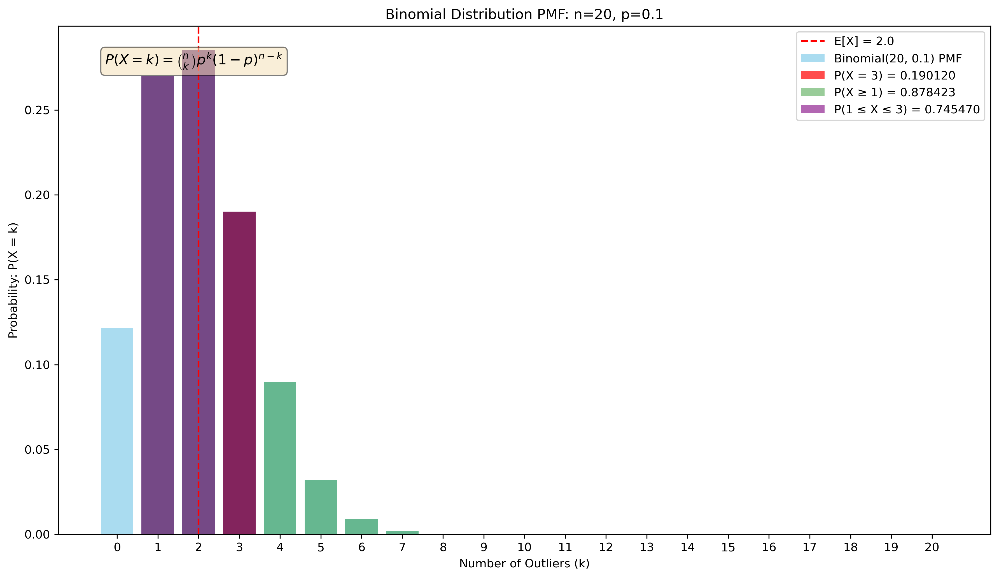
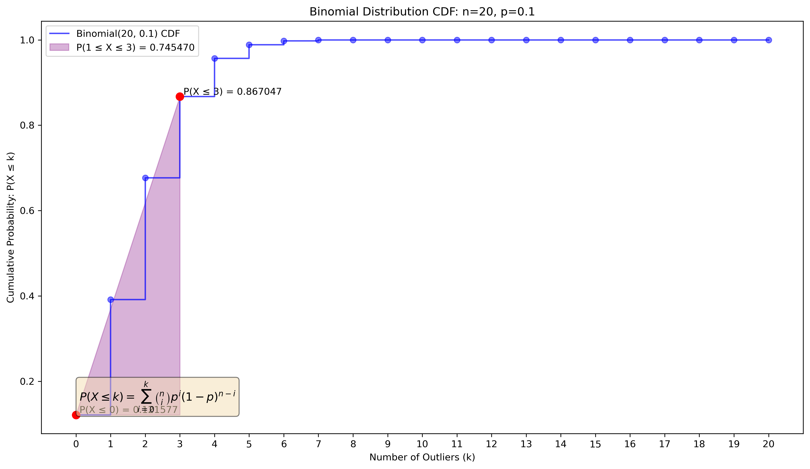
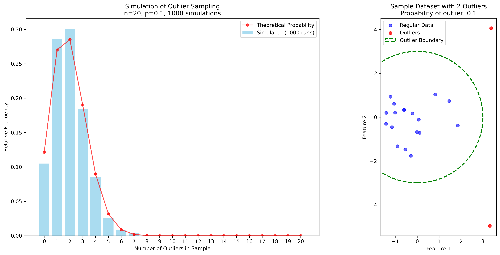

# Question 10: Outlier Probability

## Problem Statement
A machine learning engineer is working with a dataset where each data point has a 0.1 probability of being an outlier. The engineer decides to randomly sample 20 data points for a preliminary analysis.

### Task
1. What is the probability that the sample contains exactly 3 outliers?
2. What is the probability that the sample contains at least 1 outlier?
3. What is the expected number of outliers in the sample?
4. Calculate the probability that the sample contains between 1 and 3 outliers, inclusive

## Understanding the Problem
This problem involves analyzing random sampling from a dataset where each data point has a fixed probability of being an outlier. Since each data point independently has the same probability of being an outlier, and we're interested in the count of outliers in a fixed-size sample, this is a classic application of the binomial distribution.

## Solution

### Step 1: Probability of exactly 3 outliers
The probability of getting exactly $k$ successes in $n$ independent trials, where each trial has probability $p$ of success, follows a binomial distribution:

$$P(X = k) = \binom{n}{k} p^k (1-p)^{n-k}$$

In our case:
- $n = 20$ (sample size)
- $p = 0.1$ (probability of an outlier)
- $k = 3$ (number of outliers)

Substituting these values:

$$P(X = 3) = \binom{20}{3} (0.1)^3 (0.9)^{17}$$

$$P(X = 3) = \frac{20!}{3!(20-3)!} \cdot (0.1)^3 \cdot (0.9)^{17}$$

$$P(X = 3) = 1140 \cdot 0.001 \cdot 0.1668 \approx 0.1901$$

Therefore, the probability of getting exactly 3 outliers is approximately 0.1901 or 19.01%.

### Step 2: Probability of at least 1 outlier
To find the probability of at least 1 outlier, we can use the complement rule:

$$P(X \geq 1) = 1 - P(X = 0)$$

Using the binomial formula for $P(X = 0)$:

$$P(X = 0) = \binom{20}{0} (0.1)^0 (0.9)^{20}$$

$$P(X = 0) = 1 \cdot 1 \cdot (0.9)^{20} \approx 0.1216$$

Therefore:

$$P(X \geq 1) = 1 - 0.1216 \approx 0.8784$$

The probability of getting at least 1 outlier is approximately 0.8784 or 87.84%.

### Step 3: Expected number of outliers
For a binomial distribution, the expected value (mean) is:

$$E[X] = n \cdot p$$

In our case:
$$E[X] = 20 \cdot 0.1 = 2$$

The variance is given by:

$$Var(X) = n \cdot p \cdot (1-p)$$

$$Var(X) = 20 \cdot 0.1 \cdot 0.9 = 1.8$$

The standard deviation is:

$$\sigma = \sqrt{Var(X)} = \sqrt{1.8} \approx 1.342$$

Therefore, the expected number of outliers in the sample is 2, with a standard deviation of about 1.342.

### Step 4: Probability of between 1 and 3 outliers, inclusive
We need to calculate $P(1 \leq X \leq 3)$. This can be done using the cumulative distribution function (CDF) of the binomial distribution:

$$P(1 \leq X \leq 3) = P(X \leq 3) - P(X \leq 0) = F(3) - F(0)$$

Where $F(k)$ is the CDF evaluated at $k$.

$$F(3) = \sum_{i=0}^{3} \binom{20}{i} (0.1)^i (0.9)^{20-i} \approx 0.8670$$

$$F(0) = \binom{20}{0} (0.1)^0 (0.9)^{20} \approx 0.1216$$

Therefore:

$$P(1 \leq X \leq 3) = 0.8670 - 0.1216 \approx 0.7455$$

The probability of getting between 1 and 3 outliers, inclusive, is approximately 0.7455 or 74.55%.

## Visual Explanations

### Binomial Probability Mass Function

This graph shows the probability mass function (PMF) of the binomial distribution with $n=20$ and $p=0.1$. The height of each bar represents the probability of getting exactly that many outliers in the sample. Key features:
- The red bar highlights $P(X = 3) \approx 0.1901$
- The green bars collectively represent $P(X \geq 1) \approx 0.8784$
- The purple bars highlight $P(1 \leq X \leq 3) \approx 0.7455$
- The red dashed line shows the expected value $E[X] = 2$

### Binomial Cumulative Distribution Function

This graph shows the cumulative distribution function (CDF) of the binomial distribution with $n=20$ and $p=0.1$. The CDF gives the probability $P(X \leq k)$ for each value of $k$. Key features:
- The point at $k=0$ shows $P(X \leq 0) \approx 0.1216$
- The point at $k=3$ shows $P(X \leq 3) \approx 0.8670$
- The purple shaded region represents $P(1 \leq X \leq 3) \approx 0.7455$

### Sampling Simulation

The left plot shows the results of a simulation where we repeatedly sampled 20 data points and counted the number of outliers in each sample. The blue bars show the empirical frequency from the simulation, while the red dots show the theoretical probability. The right plot provides a visual representation of outliers in a dataset, with regular data points clustered around the center and outliers appearing farther away from the mean.

## Key Insights

### Binomial Distribution Properties
- The binomial distribution is appropriate when we have a fixed number of independent trials, each with the same probability of success
- The distribution is characterized by two parameters: $n$ (number of trials) and $p$ (probability of success)
- The expected value is $E[X] = np$ and the variance is $Var(X) = np(1-p)$
- The shape of the distribution is symmetric when $p = 0.5$ and becomes increasingly skewed as $p$ approaches 0 or 1

### Outlier Detection Implications
- With a 10% outlier rate and a sample size of 20, we're very likely (87.84%) to encounter at least one outlier
- The most likely outcome is to observe 1 or 2 outliers in the sample
- The probability of having more than 5 outliers is very small (approximately 2%)
- When working with outlier detection algorithms, we should expect that most reasonable-sized samples will contain some outliers

### Statistical Applications
- Understanding the probability of encountering outliers is crucial for designing robust machine learning algorithms
- The binomial distribution can help in power analysis and determining appropriate sample sizes for experiments
- Knowing the expected number of outliers can inform decisions about threshold settings in anomaly detection

## Conclusion

For a dataset with a 10% outlier rate and a sample of 20 data points:
- The probability of exactly 3 outliers is 0.1901 (19.01%)
- The probability of at least 1 outlier is 0.8784 (87.84%)
- The expected number of outliers is 2
- The probability of between 1 and 3 outliers, inclusive, is 0.7455 (74.55%)

These findings highlight the importance of handling outliers in machine learning workflows, as they are likely to be present in most real-world samples. The binomial distribution provides a powerful framework for quantifying the probability of encountering different numbers of outliers and for making informed decisions about outlier detection and handling strategies. 