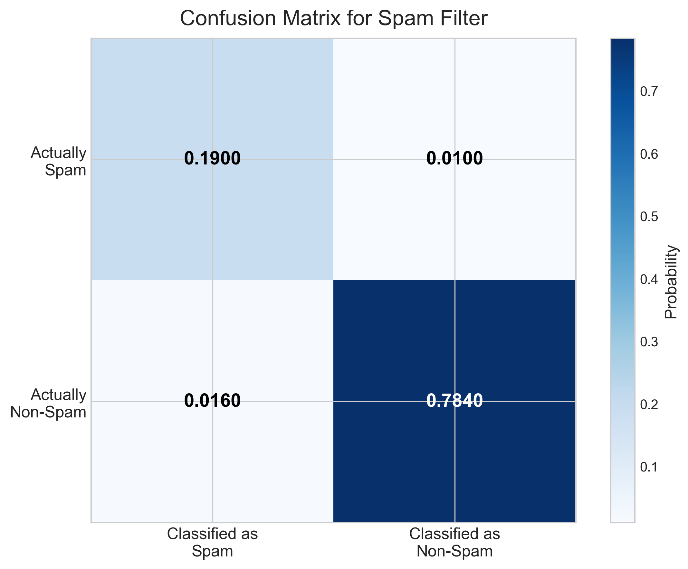
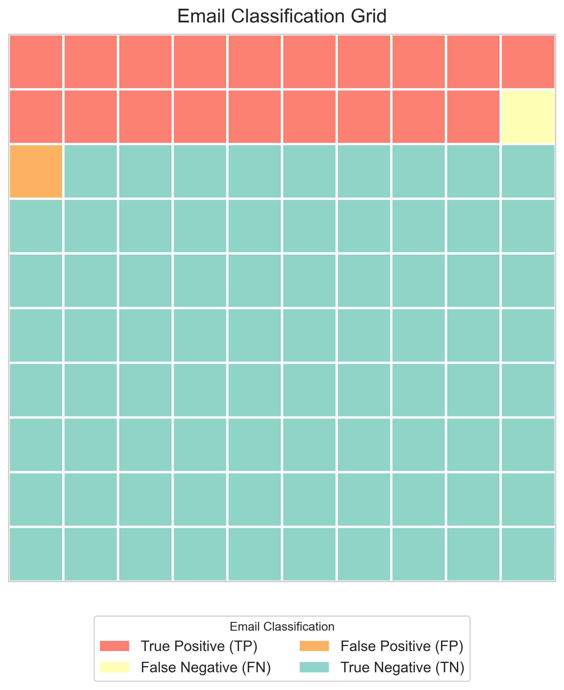
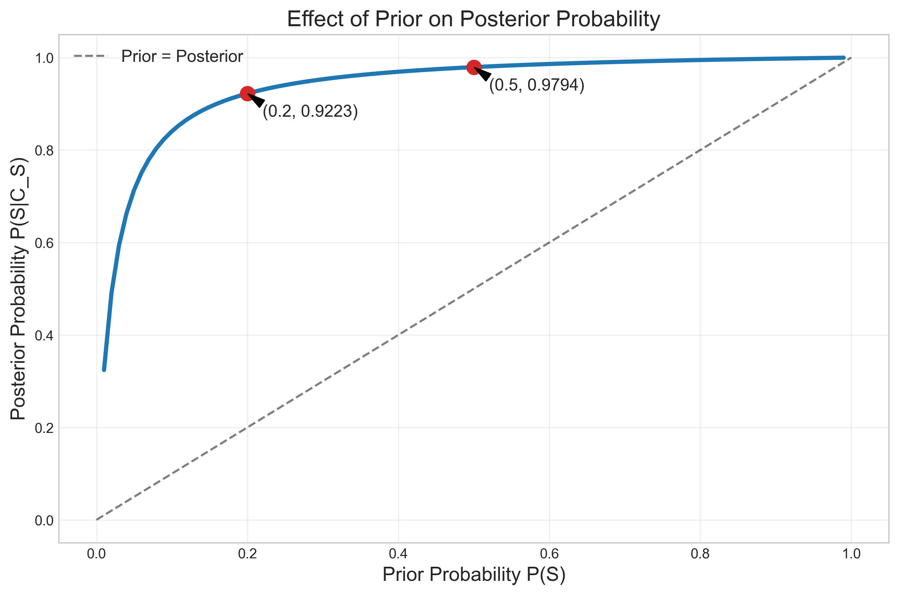
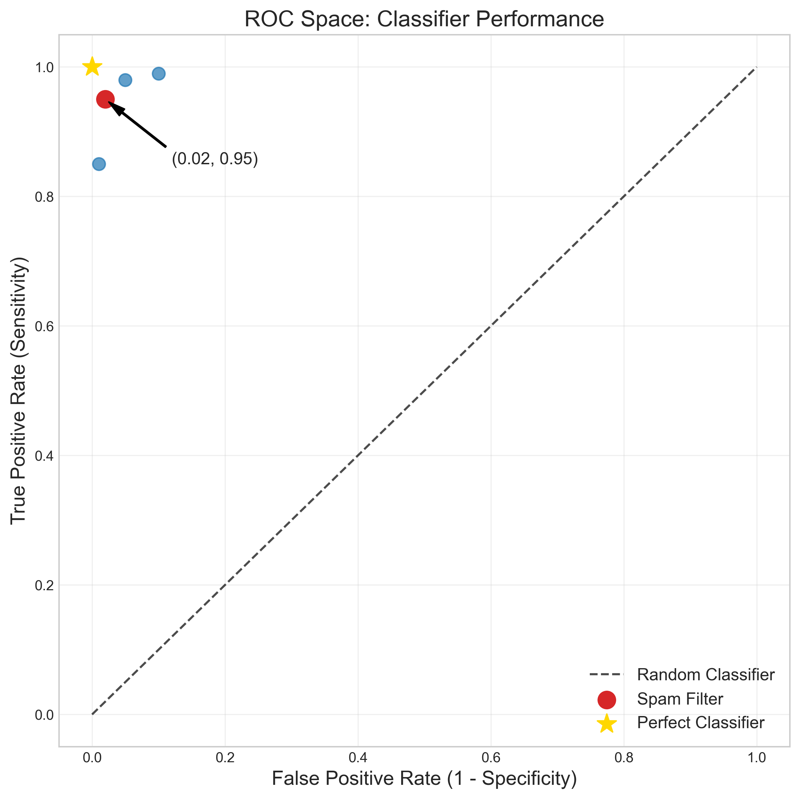

# Question 11: Spam Filter Probability

## Problem Statement
A spam filter analyzes incoming emails. Based on historical data, 20% of all incoming emails are spam. The filter correctly identifies spam emails 95% of the time (true positive rate) and correctly identifies non-spam emails 98% of the time (true negative rate).

### Task
1. If an email is classified as spam by the filter, what is the probability that it is actually spam?
2. If an email is classified as non-spam by the filter, what is the probability that it is actually spam?
3. What is the overall accuracy of the filter?
4. How does changing the prior probability of spam to 50% affect the probability in task 1?

## Understanding the Problem
This problem tests our understanding of conditional probability and Bayes' theorem in the context of classification. We have a binary classifier (spam filter) with known performance metrics, and we need to determine various probabilities related to its performance.

Key concepts in this problem:
- Prior probability: $P(S) = 0.2$, the base rate of spam in all emails
- Sensitivity or True Positive Rate (TPR): $P(C_S|S) = 0.95$, probability that spam is correctly classified
- Specificity or True Negative Rate (TNR): $P(C_{NS}|\neg S) = 0.98$, probability that non-spam is correctly classified
- We need to find the Positive Predictive Value (PPV): $P(S|C_S)$, probability that an email classified as spam is actually spam

## Solution

### Step 1: Define the variables and known probabilities
Let's define our notation:
- $S$: Email is spam
- $\neg S$: Email is not spam
- $C_S$: Email is classified as spam
- $C_{NS}$: Email is classified as not spam

Known probabilities:
- $P(S) = 0.2$ (prior probability of spam)
- $P(\neg S) = 1 - P(S) = 0.8$ (prior probability of non-spam)
- $P(C_S|S) = 0.95$ (sensitivity/TPR)
- $P(C_{NS}|\neg S) = 0.98$ (specificity/TNR)

We can derive:
- $P(C_{NS}|S) = 1 - P(C_S|S) = 0.05$ (false negative rate)
- $P(C_S|\neg S) = 1 - P(C_{NS}|\neg S) = 0.02$ (false positive rate)

### Step 2: Calculate the joint probabilities
Joint probabilities can be calculated using the conditional probability formula $P(A \cap B) = P(A|B) \times P(B)$:

- $P(S \cap C_S) = P(C_S|S) \times P(S) = 0.95 \times 0.2 = 0.19$ (spam emails classified as spam)
- $P(\neg S \cap C_S) = P(C_S|\neg S) \times P(\neg S) = 0.02 \times 0.8 = 0.016$ (non-spam emails classified as spam)
- $P(S \cap C_{NS}) = P(C_{NS}|S) \times P(S) = 0.05 \times 0.2 = 0.01$ (spam emails classified as non-spam)
- $P(\neg S \cap C_{NS}) = P(C_{NS}|\neg S) \times P(\neg S) = 0.98 \times 0.8 = 0.784$ (non-spam emails classified as non-spam)

### Step 3: Task 1 - Calculate $P(S|C_S)$ using Bayes' theorem
We need to find the probability that an email is actually spam, given that it was classified as spam. Using Bayes' theorem:

$$P(S|C_S) = \frac{P(C_S|S) \times P(S)}{P(C_S)}$$

The denominator $P(C_S)$ is the total probability of classifying an email as spam:
$$P(C_S) = P(C_S|S) \times P(S) + P(C_S|\neg S) \times P(\neg S) = 0.19 + 0.016 = 0.206$$

Therefore:
$$P(S|C_S) = \frac{0.19}{0.206} \approx 0.9223$$

This means if the filter classifies an email as spam, there's a 92.23% probability that it's actually spam.

### Step 4: Task 2 - Calculate $P(S|C_{NS})$
The probability that an email is spam given that it was classified as non-spam:

$$P(S|C_{NS}) = \frac{P(C_{NS}|S) \times P(S)}{P(C_{NS})}$$

The denominator $P(C_{NS})$ is:
$$P(C_{NS}) = P(C_{NS}|S) \times P(S) + P(C_{NS}|\neg S) \times P(\neg S) = 0.01 + 0.784 = 0.794$$

Therefore:
$$P(S|C_{NS}) = \frac{0.01}{0.794} \approx 0.0126$$

This means there's only a 1.26% chance that an email classified as non-spam is actually spam.

### Step 5: Task 3 - Calculate the overall accuracy
The accuracy is the proportion of all emails that are correctly classified:

$$\text{Accuracy} = P(S \cap C_S) + P(\neg S \cap C_{NS}) = 0.19 + 0.784 = 0.974$$

The filter has an overall accuracy of 97.4%.

### Step 6: Task 4 - Calculate $P(S|C_S)$ with a different prior
When the prior probability changes to $P(S) = 0.5$ (and consequently $P(\neg S) = 0.5$):

- $P(S \cap C_S) = P(C_S|S) \times P(S) = 0.95 \times 0.5 = 0.475$
- $P(\neg S \cap C_S) = P(C_S|\neg S) \times P(\neg S) = 0.02 \times 0.5 = 0.01$
- $P(C_S) = 0.475 + 0.01 = 0.485$

$$P(S|C_S) = \frac{0.475}{0.485} \approx 0.9794$$

With a 50% prior probability of spam, the posterior probability that an email classified as spam is actually spam increases to 97.94%.

## Visual Explanations

### Confusion Matrix Visualization

This confusion matrix shows the joint probabilities of the actual class (spam or non-spam) and the predicted class (classified as spam or non-spam). The cells represent:
- True Positives (TP): Spam correctly classified as spam (0.19)
- False Positives (FP): Non-spam wrongly classified as spam (0.016)
- False Negatives (FN): Spam wrongly classified as non-spam (0.01)
- True Negatives (TN): Non-spam correctly classified as non-spam (0.784)

The visualization uses a color gradient where darker blue indicates higher probabilities. Note that most emails fall in the True Negative category (bottom right) as 78.4% of all emails are correctly identified as non-spam. The key performance metrics for our classifier can be derived from this matrix:

- True positive rate (sensitivity): $P(C_S|S) = 0.95$
- True negative rate (specificity): $P(C_{NS}|\neg S) = 0.98$
- Positive predictive value: $P(S|C_S) = 0.9223$
- Negative predictive value: $P(\neg S|C_{NS}) = 0.9874$
- Overall accuracy: 0.974

### Email Classification Grid

This visualization represents all emails in a 10×10 grid (100 cells). Each cell represents 1% of all emails, and they are colored according to their classification outcome:
- Red cells (True Positives): Spam emails correctly classified as spam (19 cells)
- Yellow cells (False Negatives): Spam emails incorrectly classified as non-spam (1 cell)
- Orange cells (False Positives): Non-spam emails incorrectly classified as spam (2 cells)
- Teal cells (True Negatives): Non-spam emails correctly classified as non-spam (78 cells)

This grid illustrates Bayes' theorem application: when looking only at emails classified as spam (red + orange = 21 cells), 19 of them are actually spam, resulting in $P(S|C_S) = 19/21 \approx 0.9223$. The formula for calculating this using Bayes' theorem is:

$$P(S|C_S) = \frac{P(C_S|S) \cdot P(S)}{P(C_S|S) \cdot P(S) + P(C_S|\neg S) \cdot P(\neg S)} = \frac{0.95 \cdot 0.2}{0.95 \cdot 0.2 + 0.02 \cdot 0.8} = \frac{0.19}{0.206} \approx 0.9223$$

### Effect of Prior Probability

This graph shows how changing the prior probability of spam $P(S)$ affects the posterior probability $P(S|C_S)$. The blue curve represents the relationship between prior and posterior probabilities according to the formula:

$$P(S|C_S) = \frac{0.95 \cdot P(S)}{0.95 \cdot P(S) + 0.02 \cdot (1-P(S))}$$

Two key points are highlighted:
1. When $P(S) = 0.2$ (our original scenario), the posterior $P(S|C_S) \approx 0.9223$
2. When $P(S) = 0.5$ (scenario in task 4), the posterior $P(S|C_S) \approx 0.9794$

The dashed diagonal line represents where prior equals posterior. Note that the posterior is always higher than the prior (except at the extremes of 0 and 1) because our classifier has good performance characteristics. As the prior probability increases, the posterior probability also increases, demonstrating how base rates influence Bayesian inference.

### ROC Space Visualization

This visualization shows the performance of our spam filter in ROC (Receiver Operating Characteristic) space:
- The x-axis represents the False Positive Rate (1-Specificity): $P(C_S|\neg S) = 0.02$
- The y-axis represents the True Positive Rate (Sensitivity): $P(C_S|S) = 0.95$

Our spam filter is shown as a red dot at coordinates (0.02, 0.95), which indicates excellent performance with high sensitivity and high specificity. The diagonal dashed line represents the performance of a random classifier (50-50 guessing), while the gold star at (0, 1) represents a perfect classifier.

The ROC space illustrates the inherent trade-offs in binary classification:
- Moving up/right increases sensitivity but reduces specificity (more false positives)
- Moving down/left increases specificity but reduces sensitivity (more false negatives)

Our spam filter has an almost ideal location in ROC space, very close to the perfect classifier point, which explains its high accuracy of 97.4%.

## Key Insights

### Bayesian Inference and Classification
- Bayes' theorem allows us to invert conditional probabilities, calculating $P(A|B)$ from $P(B|A)$
- The posterior probability $P(S|C_S)$ depends on both the classifier's performance (sensitivity and specificity) and the prior probability $P(S)$
- Even a highly accurate classifier can give misleading results when the prior probability is very low or very high (the base rate fallacy)

### Diagnostic Measures in Classification
- True Positive Rate (Sensitivity): Ability to correctly identify positive cases
- True Negative Rate (Specificity): Ability to correctly identify negative cases
- Positive Predictive Value (PPV): Reliability of positive classifications
- Negative Predictive Value (NPV): Reliability of negative classifications
- Accuracy: Overall proportion of correct classifications

### Practical Applications in ML
- Understanding these probability concepts is crucial for evaluating classifier performance
- In real-world applications like spam filtering, the costs of false positives and false negatives may be asymmetric
- The prior probability can change over time (e.g., the proportion of spam emails may vary), affecting the filter's predictive value
- When evaluating a classifier, we should consider not just accuracy, but also metrics like precision (PPV) and recall (sensitivity)

## Conclusion

For the spam filter problem:
- $P(S|C_S) = 0.9223$: If an email is classified as spam, there's a 92.23% probability it's actually spam
- $P(S|C_{NS}) = 0.0126$: If an email is classified as non-spam, there's only a 1.26% probability it's actually spam
- Overall accuracy = 0.974: The filter correctly classifies 97.4% of all emails
- When the prior probability changes from 0.2 to 0.5, $P(S|C_S)$ increases from 0.9223 to 0.9794

This problem demonstrates the power of Bayes' theorem in machine learning classification tasks and highlights how prior probabilities affect the interpretation of classifier outputs. The visualizations illustrate the relationship between prior and posterior probabilities, the concept of confusion matrices, and how classification performance can be represented in ROC space. 