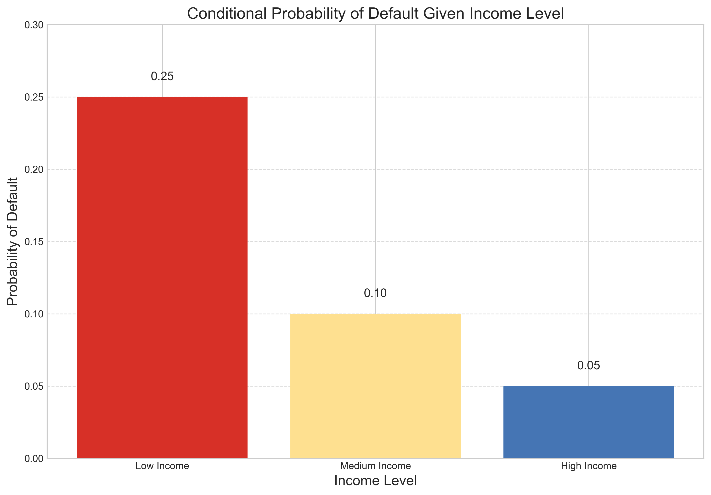

# Question 12: Conditional Probability in Finance

## Problem Statement
A dataset for a credit scoring system contains information on borrowers. Historical data shows that:
- 20% of loan applicants have low income
- 30% have medium income
- 50% have high income
- The probability of default is 25% for low income, 10% for medium income, and 5% for high income applicants.

### Task
1. Calculate the overall probability of default for a randomly selected loan applicant
2. If a borrower has defaulted, what is the probability they were from the low income category?
3. If a borrower has defaulted, what is the probability they were from the high income category?
4. What is the expected default rate if we only approve loans to medium and high income applicants?

## Understanding the Problem
This problem explores conditional probability and Bayes' theorem in the context of financial risk assessment. We need to analyze how income levels relate to loan default probabilities, which is a fundamental concept in credit scoring models used by banks and lending institutions.

Key concepts in this problem:
- Prior probabilities: The proportion of applicants in each income category
- Conditional probabilities: The likelihood of default given a specific income level
- Bayes' theorem: Used to find the probability of an income level given a default event
- Law of Total Probability: Used to find the overall default probability across all income levels

## Solution

### Step 1: Define variables and known probabilities
Let's start by defining our notation:
- $L$, $M$, and $H$: Events representing low, medium, and high income levels
- $D$: Event representing loan default

The given prior probabilities (income distribution):
- $P(L) = 0.20$ (20% of applicants have low income)
- $P(M) = 0.30$ (30% of applicants have medium income)
- $P(H) = 0.50$ (50% of applicants have high income)

The given conditional probabilities of default:
- $P(D|L) = 0.25$ (25% default rate for low income)
- $P(D|M) = 0.10$ (10% default rate for medium income)
- $P(D|H) = 0.05$ (5% default rate for high income)

### Step 2: Task 1 - Calculate the overall probability of default
To find the overall probability of default $P(D)$, we use the Law of Total Probability:

$$P(D) = P(D|L)P(L) + P(D|M)P(M) + P(D|H)P(H)$$

Substituting the values:

$$P(D) = 0.25 \times 0.20 + 0.10 \times 0.30 + 0.05 \times 0.50$$
$$P(D) = 0.05 + 0.03 + 0.025 = 0.105$$

Therefore, the overall probability of default for a randomly selected loan applicant is 0.105 or 10.5%.

### Step 3: Task 2 - Calculate P(L|D) using Bayes' theorem
We need to find the probability that a borrower is from the low income category given that they have defaulted, which is $P(L|D)$. Using Bayes' theorem:

$$P(L|D) = \frac{P(D|L)P(L)}{P(D)}$$

We already calculated $P(D) = 0.105$. Now:

$$P(L|D) = \frac{0.25 \times 0.20}{0.105} = \frac{0.05}{0.105} = 0.4762$$

Therefore, if a borrower has defaulted, there is a 47.62% probability they were from the low income category.

### Step 4: Task 3 - Calculate P(H|D) using Bayes' theorem
Similarly, we need to find the probability that a borrower is from the high income category given that they have defaulted, which is $P(H|D)$:

$$P(H|D) = \frac{P(D|H)P(H)}{P(D)}$$

Substituting the values:

$$P(H|D) = \frac{0.05 \times 0.50}{0.105} = \frac{0.025}{0.105} = 0.2381$$

Therefore, if a borrower has defaulted, there is a 23.81% probability they were from the high income category.

### Step 5: Task 4 - Calculate the default rate for medium and high income applicants
To find the expected default rate if we only approve loans to medium and high income applicants, we need to calculate $P(D|M \text{ or } H)$:

$$P(D|M \text{ or } H) = \frac{P(D \cap (M \cup H))}{P(M \cup H)}$$

The probability of an applicant being either medium or high income is:
$$P(M \cup H) = P(M) + P(H) = 0.30 + 0.50 = 0.80$$

The joint probability of default and being medium or high income is:
$$P(D \cap (M \cup H)) = P(D|M)P(M) + P(D|H)P(H) = 0.10 \times 0.30 + 0.05 \times 0.50 = 0.03 + 0.025 = 0.055$$

Now we can calculate:
$$P(D|M \text{ or } H) = \frac{0.055}{0.80} = 0.0687$$

Therefore, if we only approve loans to medium and high income applicants, the expected default rate would be 6.87%.

## Visual Explanations

### Joint Probability Distribution

This heatmap shows the joint probability distribution of income levels and default status. Each cell represents the probability of a specific combination of income level and default status. For example:
- The joint probability of low income and default is 0.05 (5% of all applicants)
- The joint probability of high income and default is 0.025 (2.5% of all applicants)
- The joint probability of high income and no default is 0.475 (47.5% of all applicants)

The darker blue colors represent higher probabilities. Notice that the highest probability is for high income borrowers who do not default (0.475), while the lowest probability is for low income borrowers who default (0.05).

### Conditional Probabilities of Default

This bar chart illustrates the conditional probabilities of default given each income level:
- Low income: P(D|L) = 0.25 (25% default rate)
- Medium income: P(D|M) = 0.10 (10% default rate)
- High income: P(D|H) = 0.05 (5% default rate)

The chart clearly shows the inverse relationship between income level and default risk. Low income borrowers are 5 times more likely to default than high income borrowers, and 2.5 times more likely to default than medium income borrowers.

### Bayes' Theorem Application

This stacked bar chart illustrates the application of Bayes' theorem by showing the posterior probabilities of income categories given default. The chart shows:
- P(L|D) = 0.4762 (47.62% of defaulters are from low income category)
- P(M|D) = 0.2857 (28.57% of defaulters are from medium income category)
- P(H|D) = 0.2381 (23.81% of defaulters are from high income category)

Let's examine the detailed calculation for the probability that a defaulted borrower is from the low income category using Bayes' theorem:

$$P(L|D) = \frac{P(D|L) \times P(L)}{P(D)}$$

Substituting the known values:
$$P(L|D) = \frac{0.25 \times 0.20}{0.1050} = \frac{0.0500}{0.1050} = 0.4762$$

Similarly, for the medium income category:
$$P(M|D) = \frac{P(D|M) \times P(M)}{P(D)} = \frac{0.10 \times 0.30}{0.1050} = \frac{0.0300}{0.1050} = 0.2857$$

And for the high income category:
$$P(H|D) = \frac{P(D|H) \times P(H)}{P(D)} = \frac{0.05 \times 0.50}{0.1050} = \frac{0.0250}{0.1050} = 0.2381$$

Note the dramatic difference between prior probabilities (20% low income, 50% high income) and posterior probabilities given default (47.62% low income, 23.81% high income). This illustrates how conditioning on the default event significantly shifts the probability distribution. Despite making up only 20% of all applicants, low income borrowers account for nearly half of all defaults. Conversely, high income borrowers, who make up 50% of all applicants, account for less than a quarter of all defaults.

This transformation of probabilities is the essence of Bayes' theorem: it allows us to update our prior beliefs about income distribution when we observe a default event. The high default rates in the low income group make them overrepresented in the defaulted population, while the low default rates in the high income group make them underrepresented.

### Loan Approval Policy Comparison

This bar chart compares the expected default rates under two different approval policies:
- Approving all applicants: 10.50% default rate
- Approving only medium and high income applicants: 6.87% default rate

By implementing the more selective policy (excluding low income applicants), the default rate decreases by 34.57%. This demonstrates the potential impact of using income as a criterion in loan approval decisions.

## Key Insights

### Application of Probability in Financial Risk Assessment
- The Law of Total Probability enables us to calculate overall risk by combining segment-specific risks
- Bayes' theorem allows us to update our beliefs about borrowers based on observed default behavior
- The significant difference between prior and posterior distributions highlights the value of conditional information
- Selective approval policies can significantly reduce overall default rates, as demonstrated by the 34.57% improvement

### Interpretation of Conditional vs. Joint Probabilities
- Conditional probabilities (P(D|L) = 0.25) tell us the risk within a specific segment
- Joint probabilities (P(L ∩ D) = 0.05) tell us the proportion of the overall population in a specific category
- The relationship between these probabilities is crucial for understanding how different segments contribute to overall risk
- Although high income borrowers have the lowest default rate (5%), they still contribute significantly to the total number of defaults due to their larger representation in the population

### Ethical and Business Considerations
- While exclusionary policies (like not lending to low income applicants) can improve portfolio performance, they raise ethical questions about financial inclusion
- Financial institutions must balance risk management with their social responsibility to provide credit access
- Alternative approaches might include risk-based pricing (charging higher interest rates to higher-risk customers) rather than outright exclusion
- The probabilistic framework can guide intermediate solutions like requiring additional collateral or co-signers for higher-risk applications

## Conclusion

This problem illustrates the application of conditional probability and Bayes' theorem in credit risk assessment:

- The overall default probability for all applicants is 10.5%
- If a borrower has defaulted, there is a 47.62% probability they were from the low income category, despite only making up 20% of all applicants
- If a borrower has defaulted, there is a 23.81% probability they were from the high income category, despite making up 50% of all applicants
- The expected default rate for a selective policy that only approves medium and high income applicants is 6.87%, representing a 34.57% improvement

This analysis demonstrates how financial institutions can use probability theory to assess risk, make lending decisions, and develop credit scoring models. The techniques shown here form the foundation of more sophisticated credit scoring algorithms used in modern banking and fintech applications. 