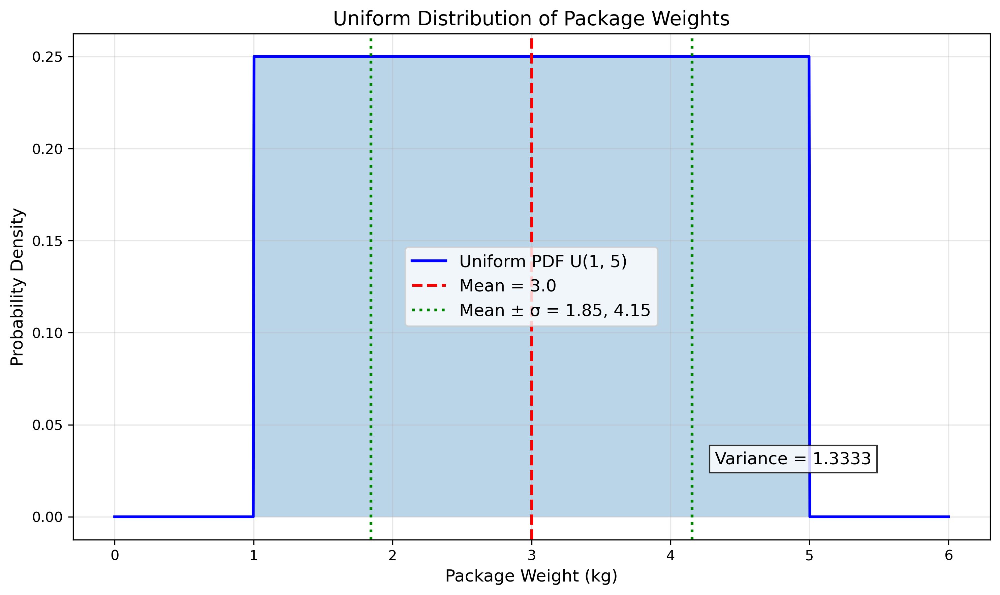
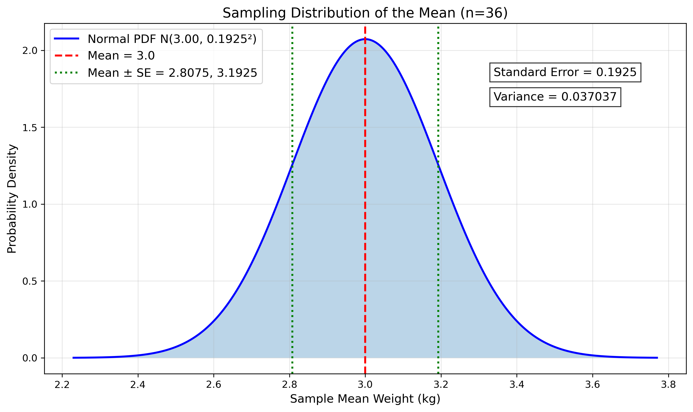
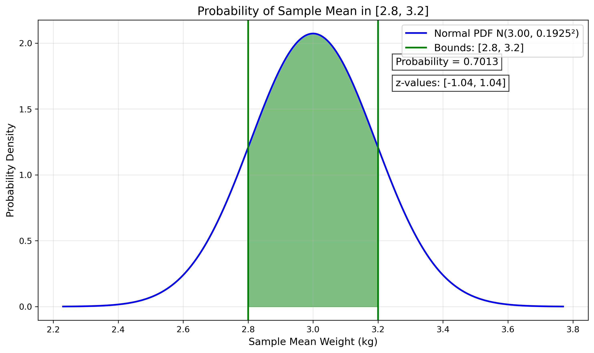
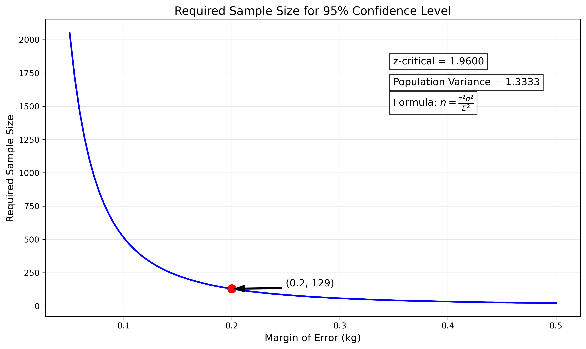
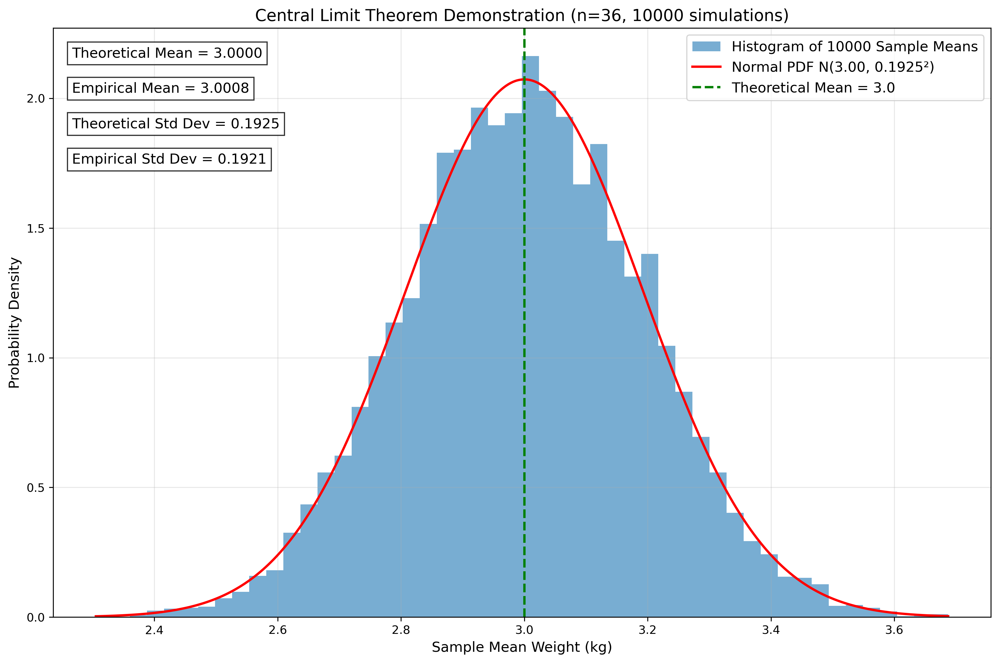

# Question 13: Central Limit Theorem Application

## Problem Statement
A data scientist is analyzing the weights of packages shipped by a company. The weights follow a uniform distribution between 1kg and 5kg. The company randomly samples 36 packages daily for quality control.

### Task
1. What is the expected value and variance of a single package weight?
2. What is the approximate distribution of the sample mean weight for the 36 sampled packages?
3. Calculate the probability that the sample mean weight is between 2.8kg and 3.2kg
4. If the company wants to be 95% confident that the sample mean is within 0.2kg of the true population mean, how many packages should they sample?

## Understanding the Problem
This problem explores the application of the Central Limit Theorem (CLT) in a quality control context. We have a population of package weights that follows a uniform distribution, and we need to understand the behavior of sample means taken from this population.

Key concepts in this problem:
- Uniform distribution and its properties
- Sampling distribution of the mean
- Central Limit Theorem (CLT)
- Confidence intervals and sample size determination

## Solution

### Step 1: Calculate expected value and variance of a single package weight
For a uniform distribution on the interval [a, b], the expected value and variance are given by:

$$\text{E}[X] = \frac{a + b}{2}$$
$$\text{Var}(X) = \frac{(b - a)^2}{12}$$

With a = 1 kg and b = 5 kg:

$$\text{E}[X] = \frac{1 + 5}{2} = 3 \text{ kg}$$
$$\text{Var}(X) = \frac{(5 - 1)^2}{12} = \frac{16}{12} = \frac{4}{3} \approx 1.333 \text{ kg}^2$$

Therefore, the expected value is 3 kg and the variance is 1.333 kg².

### Step 2: Determine the approximate distribution of the sample mean
According to the Central Limit Theorem, when we take samples of size n from any distribution with mean μ and variance σ², the sampling distribution of the sample mean will be approximately normal with:

$$\text{E}[\bar{X}] = \mu$$
$$\text{Var}(\bar{X}) = \frac{\sigma^2}{n}$$

For our problem:
- Population mean μ = 3 kg
- Population variance σ² = 1.333 kg²
- Sample size n = 36

Therefore:
$$\text{E}[\bar{X}] = 3 \text{ kg}$$
$$\text{Var}(\bar{X}) = \frac{1.333}{36} \approx 0.037 \text{ kg}^2$$
$$\text{SE}(\bar{X}) = \sqrt{\text{Var}(\bar{X})} \approx 0.1925 \text{ kg}$$

The sample mean follows approximately a normal distribution: N(3, 0.037) or N(3, 0.1925²) where 0.1925 is the standard error.

### Step 3: Calculate the probability that the sample mean is between 2.8kg and 3.2kg
To find this probability, we use the CDF of the normal distribution:

$$P(2.8 \leq \bar{X} \leq 3.2) = P\left(\frac{2.8 - 3}{0.1925} \leq Z \leq \frac{3.2 - 3}{0.1925}\right) = P(-1.04 \leq Z \leq 1.04)$$

Where Z follows the standard normal distribution. Using the standard normal table or a statistical calculator:

$$P(-1.04 \leq Z \leq 1.04) = \Phi(1.04) - \Phi(-1.04) = \Phi(1.04) - (1 - \Phi(1.04)) = 2\Phi(1.04) - 1$$

Where Φ is the CDF of the standard normal distribution. Computing this probability:

$$P(2.8 \leq \bar{X} \leq 3.2) \approx 0.7013$$

There's approximately a 70.13% chance that the sample mean weight will be between 2.8kg and 3.2kg.

### Step 4: Determine the required sample size for 95% confidence
For a 95% confidence level, we want to find the sample size n such that:

$$P(|\bar{X} - \mu| \leq 0.2) = 0.95$$

We can express this in terms of the standard normal distribution:

$$P\left(|Z| \leq \frac{0.2}{\sigma/\sqrt{n}}\right) = 0.95$$

For a 95% confidence level, we need $P(|Z| \leq z_{critical}) = 0.95$, which gives $z_{critical} = 1.96$.

Setting up the equation:
$$\frac{0.2}{\sigma/\sqrt{n}} = 1.96$$

Solving for n:
$$\sqrt{n} = \frac{1.96 \times \sigma}{0.2}$$
$$n = \left(\frac{1.96 \times \sqrt{1.333}}{0.2}\right)^2 \approx 128.4$$

Rounding up to ensure the desired precision, the company should sample at least 129 packages.

## Visual Explanations

### Uniform Distribution of Package Weights

This visualization shows the uniform probability density function for package weights. The weights follow a uniform distribution on the interval [1, 5] kg, meaning all weights in this range are equally likely. The red dashed line indicates the mean (3 kg), and the green dotted lines show the boundaries of one standard deviation (± 1.15 kg) from the mean.

### Sampling Distribution of the Mean

This graph illustrates the sampling distribution of the mean for samples of size n=36. According to the Central Limit Theorem, this distribution is approximately normal with mean 3 kg and standard error 0.1925 kg. The standard error is much smaller than the population standard deviation, reflecting how sample means vary less than individual observations.

### Probability of Sample Mean in Interval [2.8, 3.2]

This visualization highlights the probability that the sample mean will fall between 2.8kg and 3.2kg, which is the green shaded region under the normal curve. The calculated probability is 0.7013 or about 70.13%. The z-values corresponding to these bounds are approximately -1.04 and 1.04.

### Required Sample Size Calculation

This graph shows how the required sample size varies with different margins of error, while maintaining a 95% confidence level. The red dot indicates that for a margin of error of 0.2 kg, we need a sample size of 129 packages. The curve demonstrates the inverse square relationship between margin of error and required sample size.

### Central Limit Theorem Simulation

This simulation validates the Central Limit Theorem empirically. 10,000 sample means (each from n=36 packages) were generated, and their distribution closely matches the theoretical normal distribution (red curve). The histogram of sample means is approximately normal, even though the underlying population distribution is uniform, demonstrating the Central Limit Theorem in action.

## Key Insights

### Theoretical Foundations
- The uniform distribution has equal probability density across its range, making it intuitive but with specific statistical properties.
- The Central Limit Theorem states that the distribution of sample means approaches a normal distribution as sample size increases, regardless of the original population distribution.
- The standard error (SE) decreases proportionally to the square root of the sample size, showing diminishing returns for larger samples.

### Practical Applications
- Quality control processes often rely on sampling distributions to make inferences about large populations.
- Sample size determination is crucial for balancing precision with resource constraints.
- The Central Limit Theorem allows us to use normal approximations for non-normal data when working with sample means of sufficient size.

### Common Pitfalls and Considerations
- The CLT approximation improves with larger sample sizes; n=36 is generally sufficient for most practical applications.
- When calculating required sample sizes, always round up to ensure meeting or exceeding the desired confidence level.
- While the CLT guarantees convergence to normality, the rate of convergence depends on the original distribution; uniform distributions converge relatively quickly.

## Conclusion

For the package weight problem:
- The expected value of a single package weight is 3 kg, with a variance of 1.333 kg².
- The sample mean of 36 packages follows approximately a normal distribution N(3, 0.037) with standard error 0.1925 kg.
- There's a 70.13% probability that the sample mean weight will be between 2.8kg and 3.2kg.
- To be 95% confident that the sample mean is within 0.2kg of the true population mean, the company should sample at least 129 packages.

This problem demonstrates the practical application of the Central Limit Theorem in quality control scenarios, showing how statistical theory can inform sampling strategies and provide probabilistic guarantees about sample mean accuracy. 