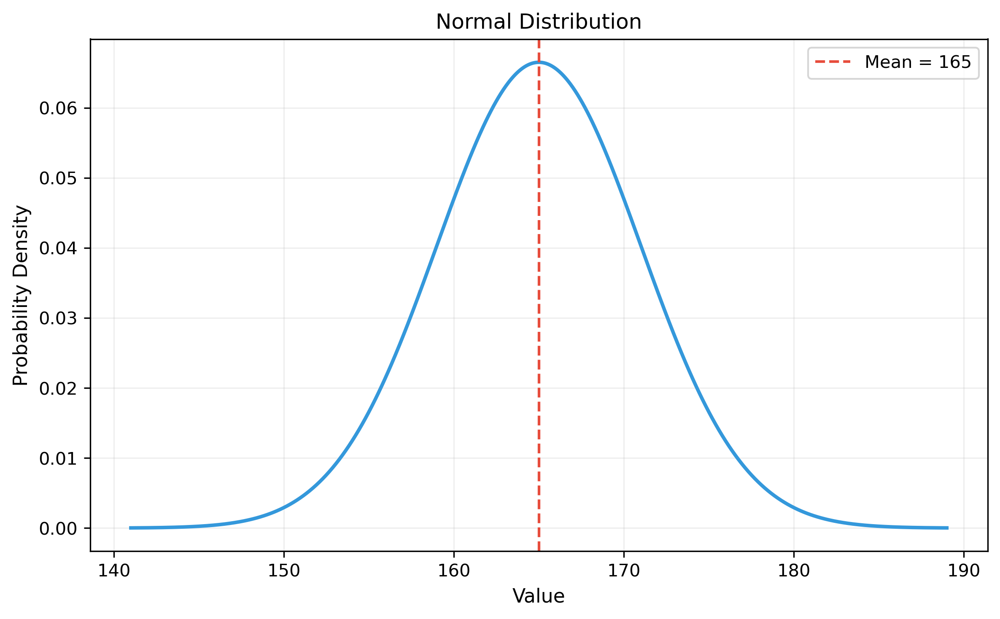
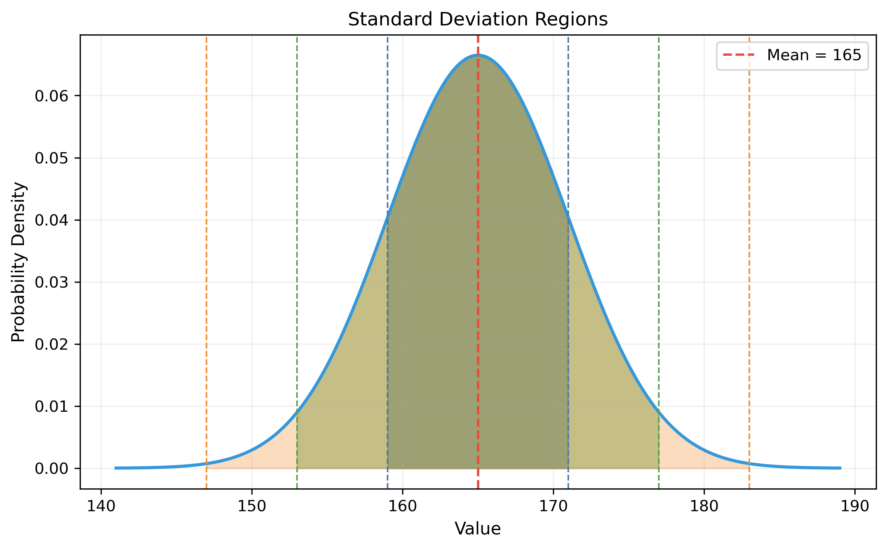
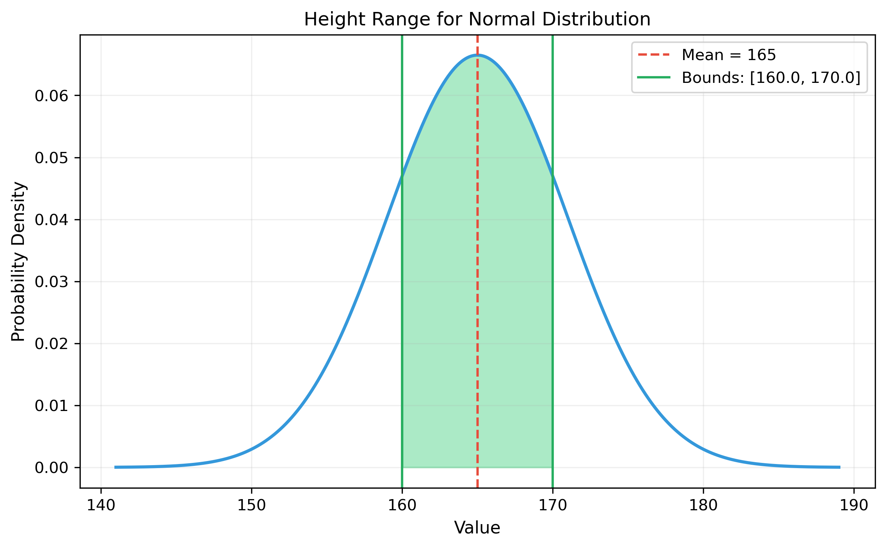
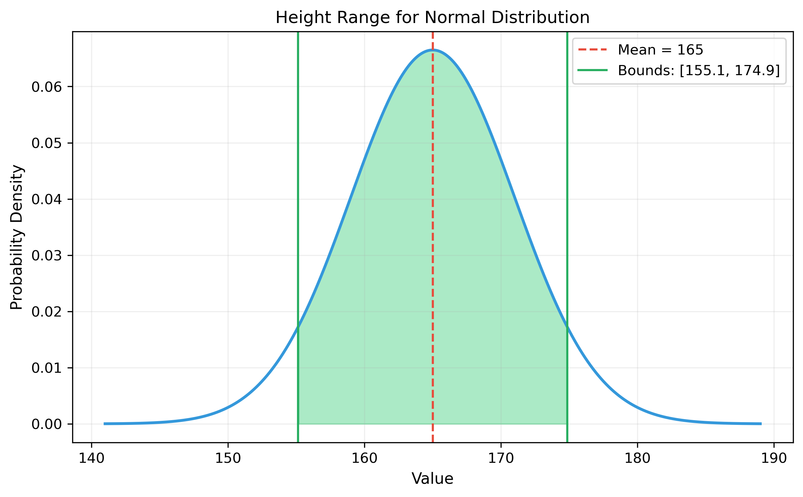
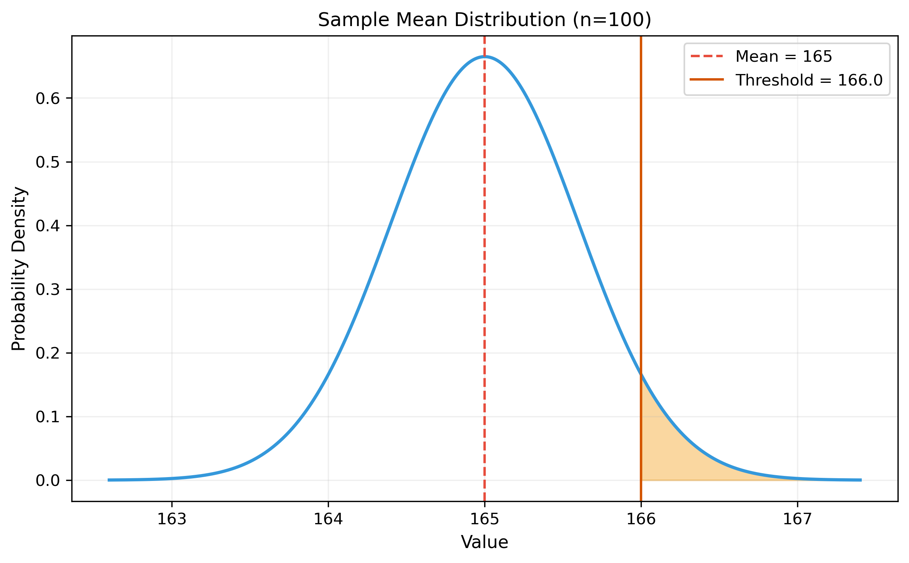
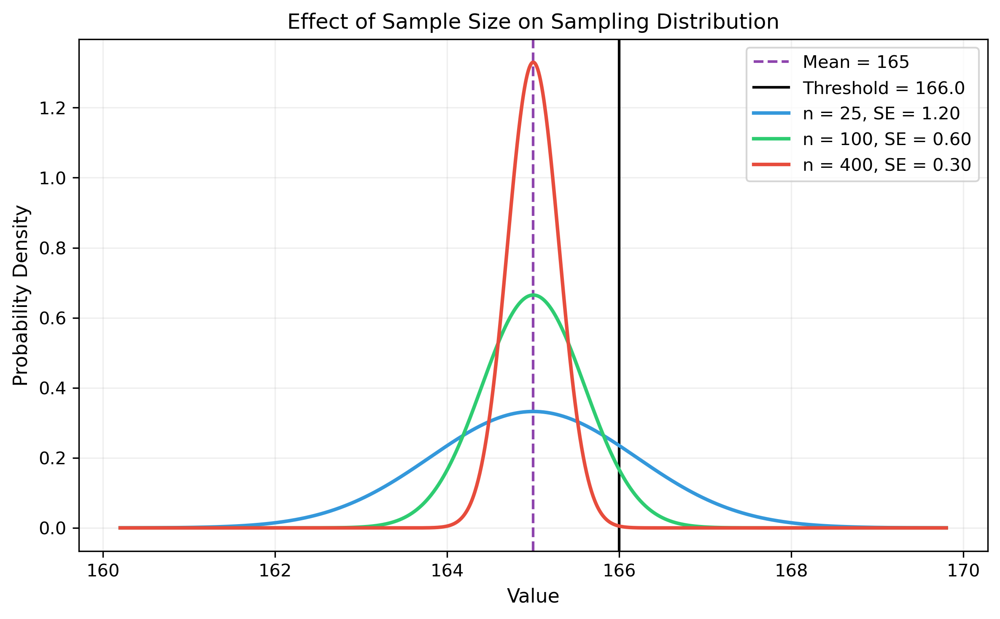
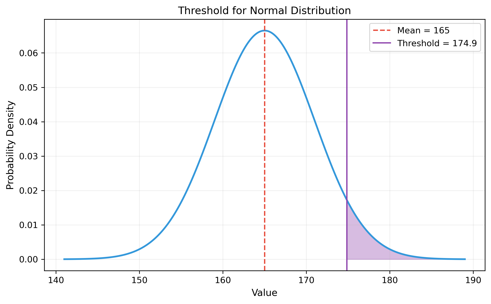

# Question 14: Normal Distribution Application

## Problem Statement
The heights of adult females in a certain population are normally distributed with a mean of 165 cm and a standard deviation of 6 cm. A clothing company designs dresses for women.

### Task
1. What percentage of women in the population have heights between 160 cm and 170 cm?
2. The company wants to design a dress that fits at least 90% of women. If they design for heights from $x_{min}$ to $x_{max}$ symmetrically around the mean, what values should $x_{min}$ and $x_{max}$ be?
3. If 100 women are randomly selected, what is the probability that their average height exceeds 166 cm?
4. The company decides to define "tall" as being in the top 5% of the height distribution. What is the minimum height to be considered "tall"?

## Understanding the Problem
This problem addresses the application of the normal distribution in a practical business context related to clothing design. We need to work with properties of the normal distribution and the Central Limit Theorem to answer questions about population proportions, interval estimation, and sampling distributions.

Key concepts:
- Normal distribution properties
- Standardizing normal random variables (z-scores)
- Calculating probabilities using the normal CDF
- Sampling distribution of the mean
- Quantiles of the normal distribution

For a visual introduction to the normal distribution with our parameters, see the basic distribution plot:

The normal distribution has important properties related to standard deviations, often called the empirical rule (68-95-99.7 rule):

The normal distribution follows the empirical rule, with data falling within standard deviations as shown below:

| Region | Range | Probability |
|--------|-------|------------|
| ±1σ | 159.00 to 171.00 | 68.3% |
| ±2σ | 153.00 to 177.00 | 95.4% |
| ±3σ | 147.00 to 183.00 | 99.7% |

## Solution

### Step 1: Calculate the percentage of women with heights between 160 cm and 170 cm
For a normal distribution with mean $\mu = 165$ cm and standard deviation $\sigma = 6$ cm, we need to find:

$$P(160 \leq X \leq 170)$$

We can convert these bounds to standardized z-scores:
$$z_{160} = \frac{160 - 165}{6} = -\frac{5}{6} \approx -0.833$$
$$z_{170} = \frac{170 - 165}{6} = \frac{5}{6} \approx 0.833$$

Using the standard normal CDF $\Phi$:
$$P(160 \leq X \leq 170) = \Phi(z_{170}) - \Phi(z_{160}) = \Phi(0.833) - \Phi(-0.833)$$

Computing this:
$$P(160 \leq X \leq 170) \approx 0.5953 \text{ or } 59.53\%$$

Therefore, approximately 59.53% of women in the population have heights between 160 cm and 170 cm. This range represents heights that are within about ±0.83 standard deviations from the mean, covering a significant portion of the height distribution.

### Step 2: Determine the dress design height range for 90% coverage
We need to find values $x_{min}$ and $x_{max}$ symmetrically around the mean such that:
$$P(x_{min} \leq X \leq x_{max}) = 0.90$$

Since we want the interval to be symmetric around $\mu = 165$ cm, we need to find a value $k$ such that:
$$P(\mu - k \leq X \leq \mu + k) = 0.90$$

The corresponding z-scores would be $z_{min} = -\frac{k}{\sigma}$ and $z_{max} = \frac{k}{\sigma}$. 
For a 90% coverage of a symmetric interval in a normal distribution, we need $\Phi(z_{max}) - \Phi(z_{min}) = 0.90$.

Given symmetry: $\Phi(z_{max}) - (1 - \Phi(z_{max})) = 0.90$, which simplifies to $\Phi(z_{max}) = 0.95$.

Looking up the value corresponding to the 95th percentile of the standard normal distribution, we get $z_{max} \approx 1.645$.

Therefore:
$$k = z_{max} \times \sigma = 1.645 \times 6 \approx 9.87 \text{ cm}$$

The dress should be designed for heights from:
$$x_{min} = \mu - k = 165 - 9.87 = 155.13 \text{ cm}$$
$$x_{max} = \mu + k = 165 + 9.87 = 174.87 \text{ cm}$$

This means the dress design should accommodate heights ranging from approximately 155.13 cm to 174.87 cm, which corresponds to heights within ±1.645 standard deviations from the mean. This range will fit 90% of the women in the population.

### Step 3: Calculate the probability that the average height of 100 women exceeds 166 cm
We need to find $P(\bar{X} > 166)$, where $\bar{X}$ is the sample mean of 100 women's heights.

According to the Central Limit Theorem, the sampling distribution of the mean follows:
$$\bar{X} \sim N\left(\mu, \frac{\sigma^2}{n}\right)$$

With $\mu = 165$, $\sigma = 6$, and $n = 100$:
$$\bar{X} \sim N\left(165, \frac{6^2}{100}\right) = N(165, 0.36)$$

The standard error of the mean is $SE = \sqrt{0.36} = 0.6$ cm. This represents how much we expect the sample mean to vary from sample to sample.

Computing the z-score for the threshold:
$$z = \frac{166 - 165}{0.6} = \frac{1}{0.6} \approx 1.667$$

The probability is:
$$P(\bar{X} > 166) = 1 - \Phi(z) = 1 - \Phi(1.667) \approx 1 - 0.9522 = 0.0478$$

Therefore, there's approximately a 4.78% probability that the average height of 100 randomly selected women exceeds 166 cm. Note that while 166 cm is only 1 cm above the population mean, the sample mean of 100 women has much less variability than individual heights, which is why this probability is relatively low.

The effect of sample size on the sampling distribution is illustrated in the following comparison, showing how increasing the sample size narrows the distribution:

The probability of the sample mean exceeding the threshold of 166 cm decreases dramatically as the sample size increases:

| Sample Size (n) | Standard Error | $P(\bar{X} > 166)$ |
|----------------|----------------|------------|
| 25 | 1.20 | 0.202 |
| 100 | 0.60 | 0.048 |
| 400 | 0.30 | 0.000 |

### Step 4: Determine the minimum height to be considered "tall"
We need to find the 95th percentile of the height distribution, which represents the threshold above which someone is considered "tall" (top 5%).

For a normal distribution, the 95th percentile is given by:
$$x_{0.95} = \mu + z_{0.95} \times \sigma$$

Where $z_{0.95} \approx 1.645$ is the z-score corresponding to the 95th percentile of the standard normal distribution.

Computing this:
$$x_{0.95} = 165 + 1.645 \times 6 \approx 165 + 9.87 = 174.87 \text{ cm}$$

Therefore, the minimum height to be considered "tall" is approximately 174.87 cm. This is the same z-score as in part 2 but applied to define the upper tail threshold rather than a symmetric interval. A woman with this height would be taller than 95% of the population.

## Key Insights

### Theoretical Foundations
- The normal distribution is completely characterized by its mean and standard deviation, making calculations straightforward once these parameters are known.
- The empirical rule states that approximately 68% of data falls within 1 standard deviation of the mean, 95% within 2 standard deviations, and 99.7% within 3 standard deviations, as illustrated in the standard deviation regions visualization.
- Z-scores standardize normal distributions, allowing us to use the standard normal table for any normally distributed variable.
- The Central Limit Theorem ensures that sample means follow a normal distribution regardless of the original population distribution (though in this case, the original distribution is already normal). This is demonstrated in the sample size comparison visualization.

### Practical Applications
- In clothing design, understanding the distribution of body measurements is crucial for creating products that fit the target market well.
- Setting appropriate size ranges based on statistical analysis can help companies maximize market coverage while minimizing production complexity.
- Quality control processes often use statistical sampling to ensure products meet specifications without testing every item.
- Defining terms like "tall" (as in the tall threshold visualization) can be done objectively by specifying percentiles in the relevant distribution.

### Common Misconceptions and Pitfalls
- It's important to distinguish between statements about individual heights and statements about sample means (which have much less variability), as shown in the sample mean distribution visualization.
- When working with normal distributions, approximately 95% of observations fall within ±2 standard deviations of the mean, not exactly 95% (the precise z-score is about ±1.96).
- Coverage percentages in the tails need to account for the asymmetry of the normal CDF - calculations often require careful attention to whether we're looking at one-sided or two-sided intervals.

## Conclusion

For the women's height problem:
- 59.53% of women in the population have heights between 160 cm and 170 cm.
- To design a dress that fits at least 90% of women, the company should design for heights from 155.13 cm to 174.87 cm.
- There's a 4.78% probability that the average height of 100 randomly selected women will exceed 166 cm.
- The minimum height to be considered "tall" (top 5% of the height distribution) is 174.87 cm.

This problem demonstrates the practical application of normal distribution properties in product design and market segmentation. Understanding the statistical properties of customer attributes allows companies to make informed decisions about product specifications and marketing strategies.

For additional visualizations and detailed explanations of normal distribution concepts, see [[Normal_Distribution_Visual_Explanations]]. 