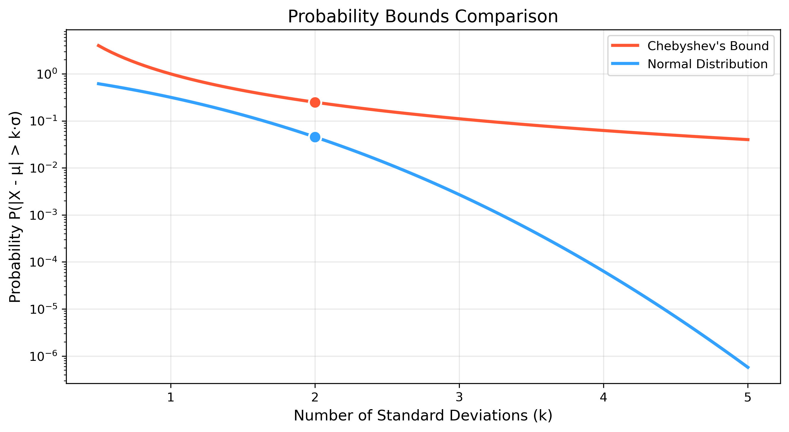
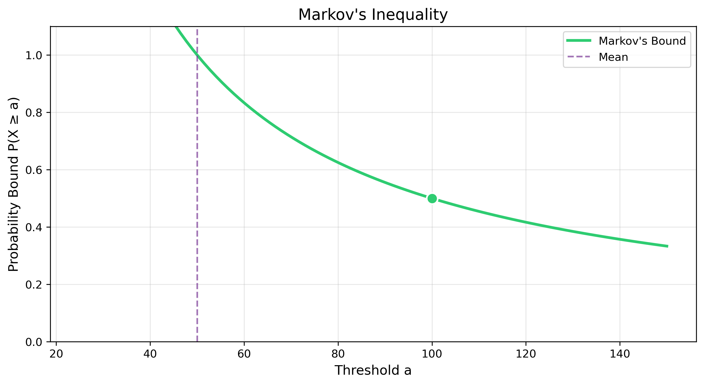
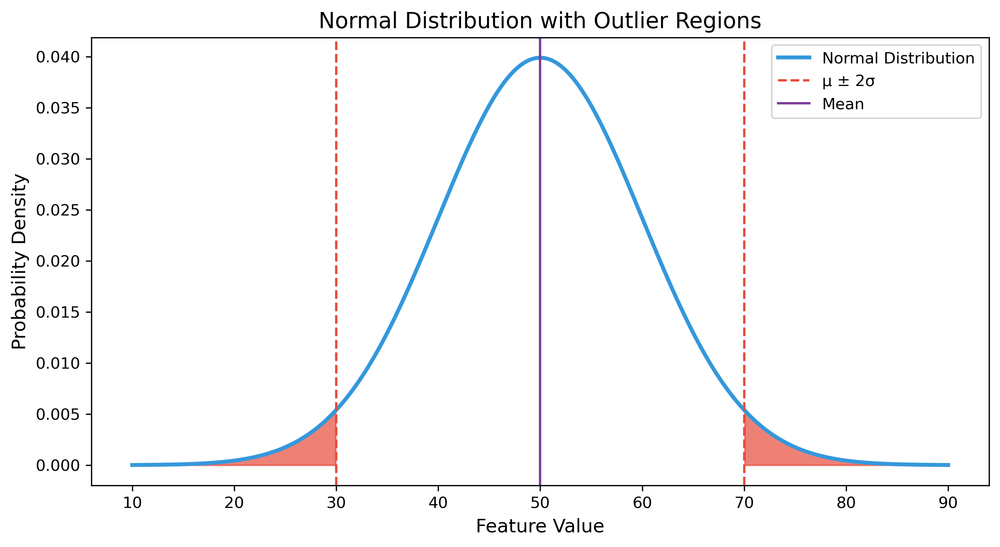
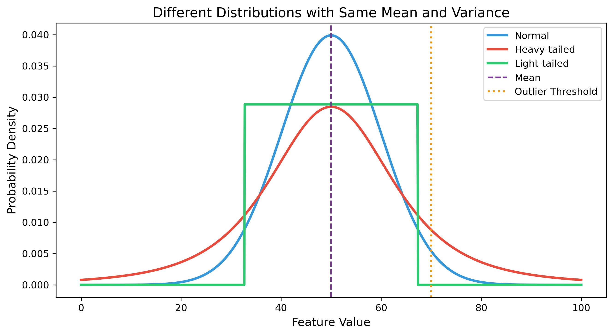
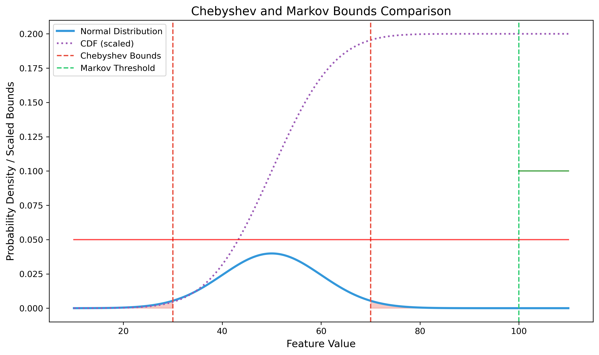
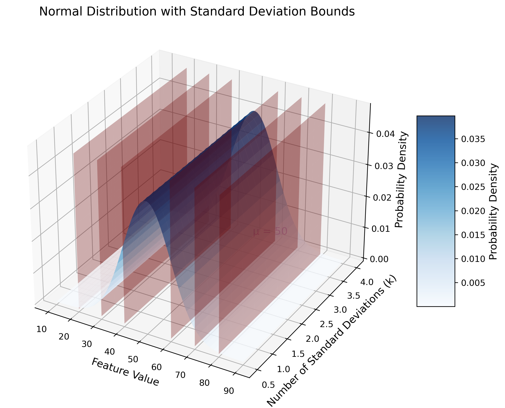

# Question 15: Probability Inequalities in ML

## Problem Statement
A machine learning algorithm uses a dataset where the feature values have unknown distribution. The only information available is that the feature X has a mean of 50 and a standard deviation of 10.

### Task
1. Using Chebyshev's inequality, calculate an upper bound on the probability that a randomly selected data point has a feature value that deviates from the mean by more than 20 units
2. Using Markov's inequality and assuming X is non-negative, calculate an upper bound on the probability that a randomly selected data point has a feature value greater than 100
3. How would you interpret these bounds in the context of outlier detection?
4. If we know the distribution is actually normal, calculate the exact probability for the scenario in task 1 and compare it to the Chebyshev bound

## Understanding the Problem
This problem explores probability inequalities that are useful in machine learning, particularly when the exact distribution of data is unknown. We'll apply two important inequalities (Chebyshev's and Markov's) to derive probability bounds and then compare these conservative bounds with exact probabilities when the distribution is known.

Key concepts in this problem:
- Chebyshev's inequality for bounding probabilities of deviations from the mean
- Markov's inequality for bounding probabilities of exceeding a threshold for non-negative random variables
- Application of these inequalities in outlier detection
- Comparison of distribution-free bounds with exact probabilities for specific distributions

## Solution

### Step 1: Apply Chebyshev's inequality to bound the probability of large deviations
Chebyshev's inequality states that for any random variable X with mean μ and variance σ², and for any k > 0:

$$P(|X - \mu| \geq k) \leq \frac{\sigma^2}{k^2}$$

In our case:
- μ = 50 (mean of feature X)
- σ = 10 (standard deviation of feature X)
- k = 20 (deviation from the mean)

The inequality becomes:
$$P(|X - 50| \geq 20) \leq \frac{10^2}{20^2} = \frac{100}{400} = \frac{1}{4} = 0.25$$

Therefore, the probability that a randomly selected data point has a feature value that deviates from the mean by more than 20 units is at most 0.25 or 25%.

### Step 2: Apply Markov's inequality to bound the probability of exceeding a large value
Markov's inequality states that for any non-negative random variable X with mean μ, and for any threshold a > 0:

$$P(X \geq a) \leq \frac{\mu}{a}$$

In our case:
- μ = 50 (mean of feature X)
- a = 100 (threshold)

The inequality becomes:
$$P(X \geq 100) \leq \frac{50}{100} = \frac{1}{2} = 0.5$$

Therefore, the probability that a randomly selected data point has a feature value greater than 100 is at most 0.5 or 50%.

### Step 3: Interpret these bounds in the context of outlier detection
These bounds provide distribution-free guarantees about the occurrence of extreme values, which is valuable for outlier detection:

1. **Chebyshev's bound for outlier detection**:
   - The bound indicates that at most 25% of data points can deviate from the mean by more than 20 units (i.e., be outside the interval [30, 70]).
   - This gives a conservative threshold for identifying outliers: if we classify points outside [30, 70] as outliers, we know we're flagging at most 25% of the data.
   - However, this is a loose upper bound, and the actual percentage of outliers may be much smaller depending on the true distribution.

2. **Markov's bound for outlier detection**:
   - The bound states that at most 50% of data points can exceed the value 100.
   - This is particularly useful for skewed or heavy-tailed distributions where large values might occur more frequently than in a normal distribution.
   - Since this bound only considers deviations above the mean (one-sided), it's useful for datasets where extremely large values are of particular concern.

3. **Advantages in ML applications**:
   - These bounds work without knowledge of the exact distribution, making them robust for real-world datasets.
   - They provide worst-case guarantees, which can be important for safety-critical applications.
   - They help set conservative thresholds when defining outliers in the absence of distribution information.

### Step 4: Calculate the exact probability for a normal distribution and compare
If the feature X follows a normal distribution with mean μ = 50 and standard deviation σ = 10, then we can calculate the exact probability:

$$P(|X - 50| > 20) = P(X < 30) + P(X > 70)$$

Since the normal distribution is symmetric around the mean:
$$P(|X - 50| > 20) = 2 \times P(X > 70)$$

Converting to a standard normal random variable Z:
$$P(X > 70) = P\left(Z > \frac{70 - 50}{10}\right) = P(Z > 2)$$

Using the standard normal table or calculator:
$$P(Z > 2) \approx 0.02275$$

Therefore:
$$P(|X - 50| > 20) = 2 \times 0.02275 \approx 0.0455 \text{ or } 4.55\%$$

Comparing with the Chebyshev bound:
- Chebyshev bound: P(|X - 50| > 20) ≤ 0.25 or 25%
- Exact probability (normal): P(|X - 50| > 20) ≈ 0.0455 or 4.55%

The Chebyshev bound is approximately 5.5 times larger than the exact probability for a normal distribution. This illustrates how distribution-free bounds like Chebyshev's inequality are necessarily conservative to accommodate all possible distributions with the given mean and variance.

## Visual Explanations

### Comparison of Chebyshev's Bound and Normal Distribution

This visualization compares Chebyshev's inequality bound (red line) with the actual probability for a normal distribution (blue line) across different numbers of standard deviations. The y-axis uses a logarithmic scale to better show the differences. For k = 2 (i.e., 2 standard deviations or 20 units in our case), Chebyshev's bound gives 0.25, while the actual probability for a normal distribution is only 0.0455. This illustrates how Chebyshev's inequality provides a conservative upper bound that works for any distribution with the given mean and variance, at the cost of being less tight than distribution-specific calculations.

### Markov's Inequality Bound

This graph illustrates Markov's inequality, showing how the probability bound P(X ≥ a) decreases as the threshold 'a' increases. The green line represents the bound E[X]/a, which equals 0.5 when a = 100 in our problem. The vertical dashed line indicates the mean (50). Markov's inequality becomes more informative for thresholds significantly above the mean, as the bound becomes tighter. However, for thresholds close to or below the mean, the bound is less useful (note that the bound can exceed 1 but actual probabilities cannot).

### Normal Distribution with Outlier Regions

This visualization shows a normal distribution N(50, 10²) with the tails beyond 2 standard deviations (the regions where |X - 50| > 20) highlighted in red. The red dashed vertical lines mark the boundaries at 30 and 70. For a normal distribution, the probability mass in these tails is approximately 0.0455 or 4.55%. In contrast, Chebyshev's inequality provides a more conservative bound of 0.25 or 25%. This visualization helps understand the considerable difference between the distribution-free bound and the exact probability for a specific distribution.

### Different Distributions in Outlier Detection

This graph compares three distributions with the same mean (50) and variance (10²): a normal distribution (blue), a heavy-tailed distribution (red), and a light-tailed (uniform) distribution (green). The orange dotted line marks the threshold at μ + 2σ = 70. The probabilities of exceeding this threshold for each distribution are:
- Normal: ~0.0228 (2.28%)
- Heavy-tailed: ~0.1096 (10.96%)
- Uniform: 0 (no probability mass beyond the bounds)
- One-sided Chebyshev bound: 0.125 (12.5%)

This illustrates why distribution-free bounds like Chebyshev's are valuable in machine learning: they provide guarantees that hold regardless of the true underlying distribution, which is often unknown or may change over time.

### Comprehensive Comparison of Both Bounds

This visualization provides a unified view of both Chebyshev's and Markov's bounds applied to the normal distribution. The blue curve shows the normal distribution density. The vertical red dashed lines at x=30 and x=70 indicate the Chebyshev bound region (deviation of 2σ from the mean), while the green dashed line at x=100 shows the Markov threshold. The red-shaded areas represent the actual probability mass in the tails beyond the Chebyshev bounds (total of 4.55%), while the green-shaded area shows the probability mass above the Markov threshold (approximately 0% for normal distribution). The horizontal lines indicate the probability bounds: Chebyshev bound at 0.25 and Markov bound at 0.5. This comprehensive view helps compare the actual probabilities with their theoretical bounds.

### 3D Visualization of Normal Distribution with Standard Deviation Bounds

This 3D visualization provides an intuitive understanding of how the normal distribution relates to standard deviation bounds. The x-axis represents feature values, the y-axis shows the number of standard deviations (k), and the z-axis represents probability density. The blue surface is the normal distribution density, and the red vertical planes mark the boundaries at 1, 2, and 3 standard deviations from the mean. This visualization helps understand how the probability mass is distributed across different regions of the distribution and how it relates to standard deviation-based thresholds used in Chebyshev's inequality.

## Key Insights

### Theoretical Foundations
- Chebyshev's inequality provides a distribution-free bound on the probability of deviations from the mean, using only the mean and variance.
- Markov's inequality gives a bound on the probability that a non-negative random variable exceeds a threshold, using only the mean.
- Both inequalities are tight in the sense that there exist distributions for which the bounds are exactly attained.
- These inequalities become more useful as the deviation from the mean or threshold value increases.

### Practical Applications in Machine Learning
- In outlier detection, these inequalities help set conservative thresholds when the data distribution is unknown.
- For robust machine learning algorithms, distribution-free bounds provide worst-case guarantees on model performance.
- In anomaly detection, Chebyshev's inequality can help determine how many data points might be flagged as anomalies.
- When dealing with new or evolving data streams, these bounds remain valid even if the distribution changes, as long as the mean and variance remain similar.

### Limitations and Extensions
- The bounds from these inequalities are often loose for well-behaved distributions like the normal distribution.
- They become tighter for more pathological distributions with heavy tails or multiple modes.
- More refined concentration inequalities (like Hoeffding's or Chernoff's) can provide tighter bounds under additional assumptions.
- In practice, a balance should be struck between conservative distribution-free methods and more powerful distribution-specific approaches.

## Conclusion

For the feature value problem:
- Using Chebyshev's inequality, we found that P(|X - 50| > 20) ≤ 0.25, meaning at most 25% of data points can deviate from the mean by more than 20 units.
- Using Markov's inequality, we found that P(X ≥ 100) ≤ 0.5, meaning at most 50% of data points can exceed the value 100.
- These bounds are useful for outlier detection as they provide distribution-free guarantees on the frequency of extreme values.
- When the distribution is known to be normal, the exact probability P(|X - 50| > 20) ≈ 0.0455, which is about 5.5 times smaller than the Chebyshev bound.

This problem illustrates the power and limitations of probability inequalities in machine learning applications. While they provide robust guarantees without requiring knowledge of the exact distribution, they are necessarily conservative. When additional information about the distribution is available, more precise calculations can be made, but the distribution-free bounds remain valuable as worst-case guarantees. 