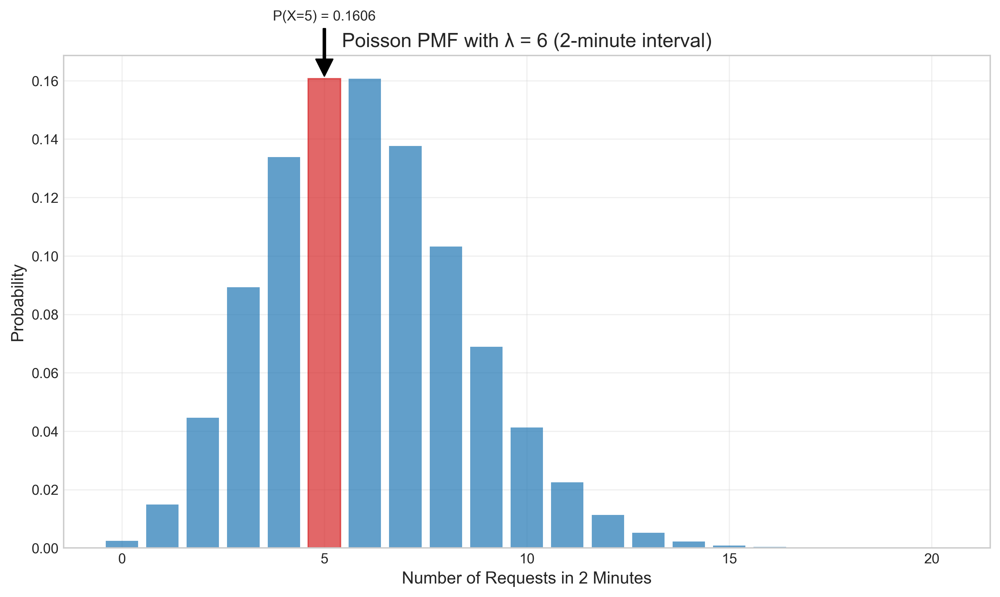

# Question 16: Poisson Distribution Application

## Problem Statement
A machine learning system receives requests at a rate of 3 requests per minute on average, following a Poisson distribution.

### Task
1. What is the probability of receiving exactly 5 requests in a 2-minute interval?
2. What is the probability of receiving no requests in a 1-minute interval?
3. What is the expected number of requests in a 10-minute interval?
4. If the system can handle at most 8 requests in a 2-minute interval, what is the probability that the system becomes overloaded?

## Understanding the Problem
This problem tests our understanding of the Poisson distribution, which models the number of events occurring in a fixed time interval, assuming events occur independently and at a constant average rate. It's particularly useful in queueing theory and system load modeling.

Key concepts in this problem:
- Poisson distribution: Models count data for events occurring over fixed time intervals
- Rate parameter (λ): The average number of events per unit time (3 requests per minute in this case)
- Time scaling property: For Poisson processes, the rate parameter scales linearly with time
- System capacity analysis: Determining the probability of exceeding a threshold

## Solution

### Step 1: Identify the Poisson parameters for each time interval
The Poisson distribution has a single parameter λ (lambda), which represents the average number of events in the given time interval. Since we're told the system receives requests at a rate of 3 per minute, we need to calculate λ for different time intervals:

- For 1 minute: λ₁ = 3
- For 2 minutes: λ₂ = 3 × 2 = 6
- For 10 minutes: λ₁₀ = 3 × 10 = 30

The Poisson probability mass function (PMF) is given by:

$$P(X = k) = \frac{e^{-\lambda} \lambda^k}{k!}$$

Where:
- X is the random variable representing the number of events
- k is the specific number of events we're calculating the probability for
- λ is the average number of events in the time interval
- e is the base of the natural logarithm (approximately 2.71828)

### Step 2: Task 1 - Calculate the probability of exactly 5 requests in a 2-minute interval
For this task, we need to find P(X = 5) where X follows a Poisson distribution with λ = 6.

$$P(X = 5) = \frac{e^{-6} \times 6^5}{5!}$$

$$P(X = 5) = \frac{e^{-6} \times 7776}{120}$$

$$P(X = 5) = \frac{0.00248 \times 7776}{120}$$

$$P(X = 5) \approx 0.16062$$

Therefore, the probability of receiving exactly 5 requests in a 2-minute interval is approximately 0.16062 or 16.06%.

### Step 3: Task 2 - Calculate the probability of no requests in a 1-minute interval
For this task, we need to find P(X = 0) where X follows a Poisson distribution with λ = 3.

$$P(X = 0) = \frac{e^{-3} \times 3^0}{0!}$$

$$P(X = 0) = e^{-3} \times 1$$

$$P(X = 0) = e^{-3}$$

$$P(X = 0) \approx 0.04979$$

Therefore, the probability of receiving no requests in a 1-minute interval is approximately 0.04979 or 4.98%.

### Step 4: Task 3 - Calculate the expected number of requests in a 10-minute interval
For a Poisson distribution, the expected value (mean) is equal to the parameter λ. Since λ = 3 requests per minute, for a 10-minute interval:

$$E[X] = \lambda_{10} = 3 \times 10 = 30$$

Therefore, the expected number of requests in a 10-minute interval is 30.

### Step 5: Task 4 - Calculate the probability of system overload
The system becomes overloaded if it receives more than 8 requests in a 2-minute interval. We need to calculate P(X > 8) where X follows a Poisson distribution with λ = 6.

We can calculate this as:
$$P(X > 8) = 1 - P(X \leq 8)$$

The cumulative distribution function (CDF) gives us P(X ≤ 8):
$$P(X \leq 8) = \sum_{k=0}^{8} \frac{e^{-6} \times 6^k}{k!}$$

Using the CDF formula:
$$P(X \leq 8) \approx 0.84724$$

Therefore:
$$P(X > 8) = 1 - 0.84724 \approx 0.15276$$

The probability that the system becomes overloaded (receives more than 8 requests in a 2-minute interval) is approximately 0.15276 or 15.28%.

## Visual Explanations

### Poisson Probability Mass Function (PMF)

This visualization shows the probability mass function (PMF) of the Poisson distribution with λ = 6 for a 2-minute interval. Each bar represents the probability of observing exactly k requests in a 2-minute interval. The bar for k = 5 is highlighted in red, corresponding to Task 1. We can see that the probability P(X = 5) ≈ 0.16062 is close to the peak of the distribution, indicating that observing 5 requests in a 2-minute interval is quite likely. The distribution is slightly right-skewed, with the peak probability occurring at k = 6 (which is equal to λ).

### System Overload Analysis

This visualization illustrates the concept of system overload from Task 4. The blue bars represent the probabilities of request counts that the system can handle (≤ 8 requests in 2 minutes), while the red bars represent the probabilities of request counts that would overload the system (> 8 requests). The red vertical dashed line marks the threshold between normal operation and overload. The annotation shows that P(X > 8) ≈ 0.15276, meaning there's about a 15.28% chance the system will become overloaded in a 2-minute interval.

### Cumulative Distribution Function (CDF)

This visualization shows the cumulative distribution function (CDF) of the Poisson distribution with λ = 6. The CDF gives the probability that the number of requests is less than or equal to a certain value. The point at k = 8 is highlighted in red, showing that P(X ≤ 8) ≈ 0.84724. The complement of this probability, P(X > 8) ≈ 0.15276, is the probability of system overload. The step function nature of the CDF reflects the discrete nature of the Poisson distribution.

### Time Scaling of Poisson Distribution

This visualization demonstrates how the Poisson distribution changes as the time interval increases. It shows the PMF for four different time intervals: 1, 2, 5, and 10 minutes, with corresponding λ values of 3, 6, 15, and 30. As the time interval increases, the distribution shifts to the right and becomes more spread out, with the peak of the distribution occurring at the value of λ. The vertical dashed lines mark the expected values (E[X] = λ) for each time interval. This illustrates the time scaling property of Poisson processes, where both the mean and variance increase linearly with time.

## Key Insights

### Theoretical Properties of the Poisson Distribution
- The Poisson distribution has a single parameter λ, which equals both the mean and variance of the distribution
- The probability mass function (PMF) is given by P(X = k) = e^(-λ) × λ^k / k!
- The mode of the distribution (most likely value) is floor(λ) when λ is not an integer
- As λ increases, the Poisson distribution approaches a normal distribution with mean λ and variance λ

### Time Scaling Properties
- For a Poisson process, the parameter λ scales linearly with time: λ_t = λ × t
- This means the expected number of events in t time units is t times the expected number in one time unit
- The variance also scales linearly with time
- The probability of zero events decreases exponentially as time increases: P(X = 0) = e^(-λt)

### Applications in Machine Learning Systems
- Poisson distributions are useful for modeling arrival rates in queueing systems
- System capacity planning can use overload probabilities to determine appropriate resources
- Load balancing algorithms can leverage Poisson probabilities to distribute requests
- Anomaly detection systems can identify when request patterns deviate from expected Poisson behavior

### Practical Considerations
- The Poisson assumption is only valid when events are independent and occur at a constant average rate
- In real systems, arrival rates often vary over time (e.g., peak vs. off-peak hours)
- For very large λ values, normal approximation to Poisson can simplify calculations
- The memoryless property means the system doesn't "remember" previous requests, which may not be realistic for all systems

## Conclusion

For the Poisson distribution problem:
- P(X = 5) in a 2-minute interval = 0.16062: There's a 16.06% probability of receiving exactly 5 requests in 2 minutes
- P(X = 0) in a 1-minute interval = 0.04979: There's a 4.98% probability of receiving no requests in 1 minute
- Expected requests in a 10-minute interval = 30: On average, the system will receive 30 requests in 10 minutes
- P(X > 8) in a 2-minute interval = 0.15276: There's a 15.28% probability that the system becomes overloaded

This problem demonstrates the application of the Poisson distribution in modeling request arrivals to a machine learning system. The visualizations illustrate key properties of the distribution and provide intuition about system load probabilities. Understanding these concepts is crucial for capacity planning, load balancing, and ensuring system reliability in production machine learning deployments. 