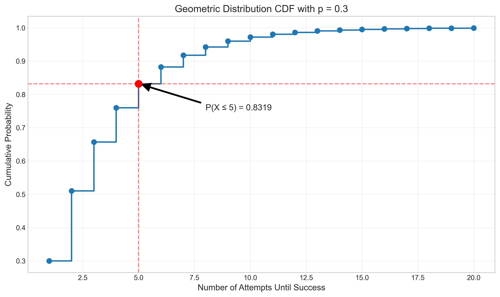

# Question 17: Geometric Distribution in RL

## Problem Statement
In a reinforcement learning environment, an agent attempts to reach a goal state. Each attempt has a 0.3 probability of success, independent of previous attempts.

### Task
1. What is the probability that the agent succeeds on exactly the 4th attempt?
2. What is the probability that the agent succeeds within the first 5 attempts?
3. What is the expected number of attempts needed to reach the goal state?
4. If the agent has already failed 3 times, what is the probability it will succeed on the next attempt?

## Understanding the Problem
This problem introduces the geometric distribution in the context of a reinforcement learning scenario. The geometric distribution models the number of trials needed to achieve the first success in a series of independent Bernoulli trials, each with the same probability of success.

Key concepts in this problem:
- Geometric distribution: Models the number of trials until the first success
- Bernoulli trials: Independent trials with two possible outcomes (success/failure)
- Memoryless property: Past failures don't affect future success probability
- Expected value: The average number of trials needed to achieve success

In reinforcement learning, this relates to scenarios where an agent repeatedly attempts to reach a goal state or complete a task, with each attempt having a fixed probability of success regardless of previous failures.

## Solution

### Step 1: Define the geometric distribution
The geometric distribution is a discrete probability distribution that models the number of trials needed to get the first success in a sequence of independent Bernoulli trials, each with probability of success p.

If X follows a geometric distribution with parameter p, then:
$$P(X = k) = (1-p)^{k-1} \cdot p$$

Where:
- X is the random variable representing the number of attempts until the first success
- k is a specific number of attempts (k ≥ 1)
- p is the probability of success on each attempt (p = 0.3 in our problem)

The cumulative distribution function (CDF) is:
$$P(X \leq k) = 1 - (1-p)^k$$

### Step 2: Task 1 - Calculate the probability of success on exactly the 4th attempt
For this task, we need to calculate P(X = 4) where X follows a geometric distribution with p = 0.3.

$$P(X = 4) = (1-p)^{4-1} \times p = (1-0.3)^3 \times 0.3$$
$$P(X = 4) = (0.7)^3 \times 0.3 = 0.343 \times 0.3 = 0.1029$$

Therefore, the probability that the agent succeeds exactly on the 4th attempt is 0.1029 or approximately 10.29%.

### Step 3: Task 2 - Calculate the probability of success within the first 5 attempts
For this task, we need to calculate P(X ≤ 5), the probability that the agent succeeds on any of the first 5 attempts.

Using the CDF formula:
$$P(X \leq 5) = 1 - (1-p)^5 = 1 - (1-0.3)^5 = 1 - (0.7)^5$$
$$P(X \leq 5) = 1 - 0.16807 = 0.83193$$

Therefore, the probability that the agent succeeds within the first 5 attempts is 0.83193 or approximately 83.19%.

### Step 4: Task 3 - Calculate the expected number of attempts
For a geometric distribution with parameter p, the expected value (mean) is given by:
$$E[X] = \frac{1}{p}$$

Using p = 0.3:
$$E[X] = \frac{1}{0.3} = 3.33333$$

Therefore, the expected number of attempts needed to reach the goal state is 3.33333 attempts.

### Step 5: Task 4 - Calculate the probability of success after 3 failures
This is where we apply the memoryless property of the geometric distribution. The memoryless property states that the probability of success on the next attempt is independent of how many failures have already occurred.

Mathematically, for any n and k:
$$P(X = n+k \mid X > n) = P(X = k)$$

In our case, we want to find P(X = 4 | X > 3), which by the memoryless property is equal to P(X = 1) = p = 0.3.

Therefore, after 3 failures, the probability that the agent succeeds on the next attempt is still 0.3 or 30%.

## Visual Explanations

### Geometric Probability Mass Function (PMF)

This visualization shows the probability mass function (PMF) of the geometric distribution with p = 0.3. Each bar represents the probability of succeeding on exactly the kth attempt. The bar for k = 4 is highlighted in red, corresponding to Task 1. We can see that the PMF is monotonically decreasing, indicating that earlier successes are more likely than later ones. The annotation shows that P(X = 4) ≈ 0.1029, meaning there's about a 10.29% chance that the agent will succeed exactly on the 4th attempt.

### Cumulative Distribution Function (CDF)

This visualization shows the cumulative distribution function (CDF) of the geometric distribution with p = 0.3. The CDF gives the probability that success will occur within a certain number of attempts. The point at k = 5 is highlighted in red, showing that P(X ≤ 5) ≈ 0.8319, which means there's an 83.19% probability of success within the first 5 attempts (Task 2). The step function nature of the CDF reflects the discrete nature of the geometric distribution, and we can see that as k increases, the CDF asymptotically approaches 1, indicating that success becomes increasingly certain with more attempts.

### Expected Number of Attempts

This visualization illustrates the expected number of attempts needed for success (Task 3). The red vertical dashed line shows the expected value $E[X] = 1/p = 1/0.3 ≈ 3.33$. This means that, on average, the agent will need approximately 3.33 attempts to reach the goal state. The expected value is greater than the mode (k = 1) because the geometric distribution is right-skewed, with a long tail representing the possibility of requiring many attempts before success.

### Memoryless Property

This visualization demonstrates the memoryless property of the geometric distribution, which is relevant to Task 4. The left panel shows the original probability distribution P(X = k), while the right panel shows the conditional distribution P(X = k | X > 3), which represents the distribution of outcomes given that the first 3 attempts have failed. 

Note that P(X = 4 | X > 3) = 0.3, which is the same as the original probability of success on the first attempt, P(X = 1) = 0.3. This illustrates that the probability of success on the next attempt after 3 failures remains p = 0.3, unchanged from the original probability of success. The shape of the conditional distribution is identical to the original distribution, just shifted by 3 attempts, which is the essence of the memoryless property.

### Effect of Different Success Probabilities

This visualization compares geometric distributions with different success probabilities (p). Higher success probabilities (e.g., p = 0.7, shown in red) lead to distributions that are more concentrated on smaller values of k, indicating that fewer attempts are typically needed. Lower success probabilities (e.g., p = 0.1, shown in blue) result in more spread-out distributions with longer tails, indicating that more attempts may be required. The expected value for each distribution ($E[X] = 1/p$) is marked with a vertical dashed line of the corresponding color.

## Key Insights

### Theoretical Properties of the Geometric Distribution
- The geometric distribution models the number of trials until the first success
- It has a single parameter p, the probability of success on each trial
- The PMF is $P(X = k) = (1-p)^{k-1} \cdot p$
- The CDF is $P(X \leq k) = 1 - (1-p)^k$
- The expected value (mean) is $E[X] = \frac{1}{p}$
- The variance is $\text{Var}(X) = \frac{1-p}{p^2}$
- The mode is always 1 (the first attempt is always the most likely to succeed)

### Memoryless Property
- The geometric distribution is the only discrete distribution with the memoryless property
- P(X = n+k | X > n) = P(X = k) for any n and k
- This means the probability of success on the next attempt remains p, regardless of how many failures have already occurred
- In reinforcement learning terms, the agent's chance of success on the next attempt doesn't depend on its history of failures

### Applications in Reinforcement Learning
- Geometric distributions model trial-and-error learning scenarios
- They can represent the number of episodes needed for an agent to achieve a goal for the first time
- The memoryless property relates to Markov processes, which are fundamental to many RL algorithms
- Understanding expected attempts (1/p) helps in setting appropriate exploration budgets
- Success probability p can be increased through better algorithms, more informative rewards, or curriculum learning

### Practical Considerations
- The geometric distribution assumes constant success probability, which may not hold if:
  - The agent learns from failures (success probability increases over time)
  - The environment changes dynamically (success probability varies)
  - There are dependencies between attempts (violating independence)
- In practice, RL agents often improve their policy over time, making p time-dependent
- For very small p, the expected number of attempts (1/p) can be prohibitively large, necessitating more efficient exploration strategies

## Conclusion

For the geometric distribution problem in the reinforcement learning context:
- $P(X = 4) = 0.1029$: There's a 10.29% probability that the agent succeeds exactly on the 4th attempt
- $P(X ≤ 5) = 0.8319$: There's an 83.19% probability that the agent succeeds within the first 5 attempts
- $E[X] = 3.33$: On average, the agent will need 3.33 attempts to reach the goal state
- P(success on 4th attempt | failed first 3) = 0.3: Due to the memoryless property, the probability of success on the next attempt remains 0.3 even after 3 failures

This problem demonstrates how the geometric distribution can model the number of attempts needed for success in reinforcement learning scenarios. The memoryless property highlights an important characteristic of many RL environments: the probability of success on the current attempt depends only on the current state and action, not on the history of previous failures. Understanding these probabilistic concepts helps in designing efficient exploration strategies, setting appropriate learning horizons, and analyzing the sample complexity of reinforcement learning algorithms.