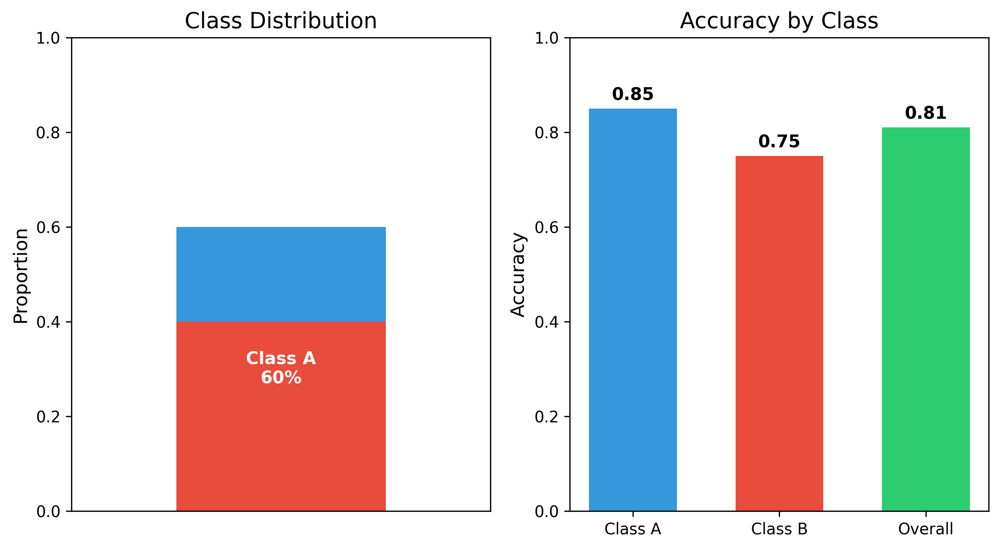
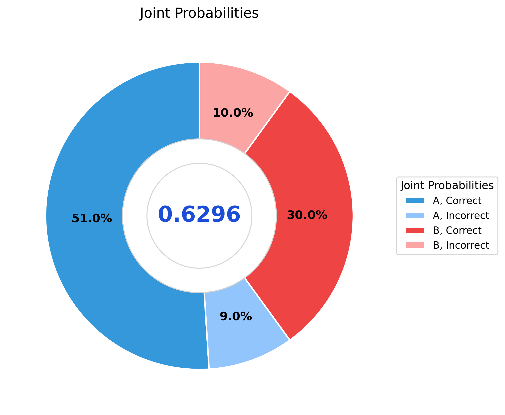
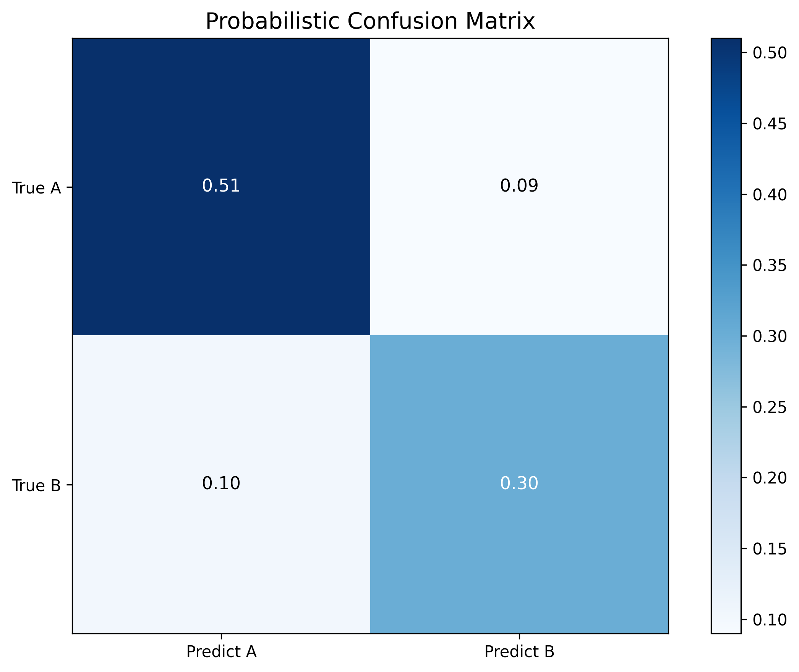
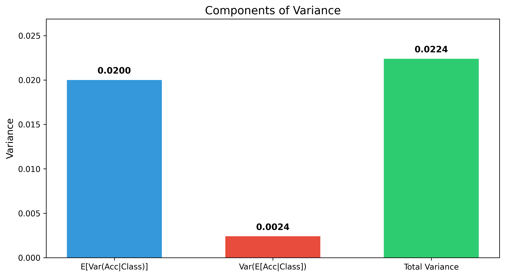
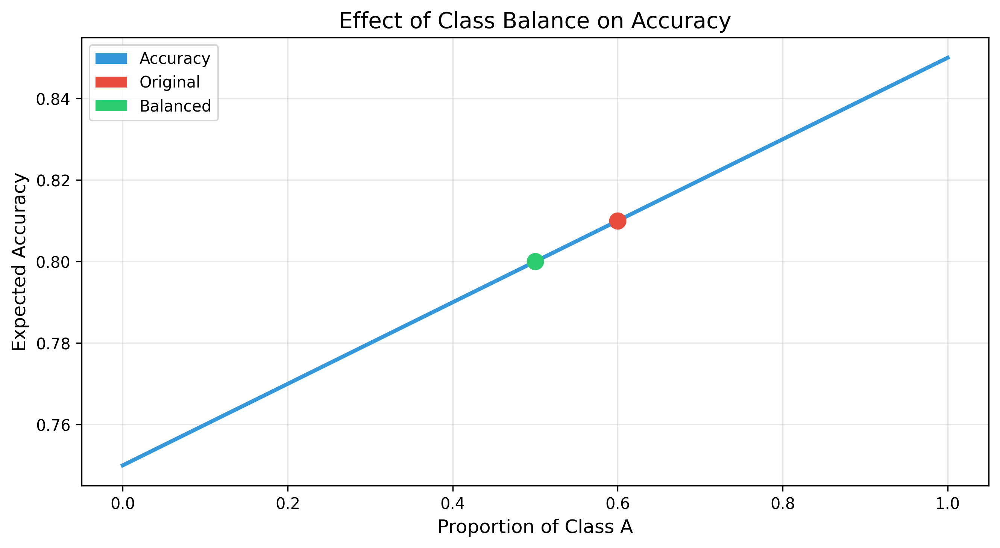

# Question 18: Expected Model Performance

## Problem Statement
A machine learning model is trained on a dataset where 60% of the samples are from class A and 40% are from class B. When predicting on samples from class A, the model has an accuracy of 0.85. When predicting on samples from class B, the model has an accuracy of 0.75.

### Task
1. What is the overall expected accuracy of the model on the entire dataset?
2. If a prediction is correct, what is the probability that the sample was from class A?
3. Using the Law of Total Variance, calculate the variance of the model's accuracy if the variance within each class is 0.02.
4. If we balance the dataset to have 50% samples from each class, what would be the new expected accuracy?

## Understanding the Problem
This problem explores how to calculate overall performance metrics for a classification model when we have class-specific accuracy information. It tests understanding of the Law of Total Expectation and the Law of Total Variance, which are fundamental concepts in probability theory and model evaluation.

Key concepts in this problem:
- Law of Total Expectation (or Tower Property): $E[X] = E[E[X|Y]]$
- Law of Total Variance: $Var(X) = E[Var(X|Y)] + Var(E[X|Y])$
- Bayes' theorem: $P(A|B) = P(B|A)P(A)/P(B)$
- Class imbalance and its effect on overall model performance

## Solution

### Step 1: Calculate the overall expected accuracy using Law of Total Expectation
The Law of Total Expectation states that the expected value of a random variable X can be computed as the weighted average of its conditional expectations, with weights being the probabilities of the conditioning events.

In our case, if we let A represent the event "model accuracy" and C represent the class (A or B), we have:
$$E[A] = E[E[A|C]] = P(C = A) \cdot E[A|C = A] + P(C = B) \cdot E[A|C = B]$$

Given:
- $P(C = A) = 0.6$ (60% of samples are from class A)
- $P(C = B) = 0.4$ (40% of samples are from class B)
- $E[A|C = A] = 0.85$ (accuracy on class A)
- $E[A|C = B] = 0.75$ (accuracy on class B)

We compute:
$$E[A] = 0.6 \cdot 0.85 + 0.4 \cdot 0.75 = 0.51 + 0.30 = 0.81$$

Therefore, the overall expected accuracy of the model on the entire dataset is 0.81 or 81%.

### Step 2: Calculate the probability that a correct prediction came from class A
This task requires applying Bayes' theorem to find P(C = A | correct prediction).

Using Bayes' theorem:
$$P(C = A | \text{correct}) = \frac{P(\text{correct} | C = A) \cdot P(C = A)}{P(\text{correct})}$$

We know:
- P(correct | C = A) = 0.85 (accuracy on class A)
- P(C = A) = 0.6 (prior probability of class A)
- P(correct) = overall accuracy = 0.81 (calculated in Step 1)

Substituting:
$$P(C = A | \text{correct}) = \frac{0.85 \cdot 0.6}{0.81} = \frac{0.51}{0.81} \approx 0.6296$$

Therefore, if a prediction is correct, there's approximately a 62.96% probability that the sample was from class A.

### Step 3: Calculate the variance of the model's accuracy using Law of Total Variance
The Law of Total Variance decomposes the total variance into two components:
$$\text{Var}(X) = E[\text{Var}(X|Y)] + \text{Var}(E[X|Y])$$

The first term, E[Var(X|Y)], is called the expected conditional variance. The second term, Var(E[X|Y]), is called the variance of conditional expectation.

Given:
- Var(A|C = A) = 0.02 (variance within class A)
- Var(A|C = B) = 0.02 (variance within class B)
- E[A|C = A] = 0.85 (mean accuracy for class A)
- E[A|C = B] = 0.75 (mean accuracy for class B)
- E[A] = 0.81 (overall expected accuracy)

Expected conditional variance:
$$E[\text{Var}(A|C)] = P(C = A) \cdot \text{Var}(A|C = A) + P(C = B) \cdot \text{Var}(A|C = B)$$
$$E[\text{Var}(A|C)] = 0.6 \cdot 0.02 + 0.4 \cdot 0.02 = 0.012 + 0.008 = 0.02$$

Variance of conditional expectation:
$$\text{Var}(E[A|C]) = P(C = A) \cdot (E[A|C = A] - E[A])^2 + P(C = B) \cdot (E[A|C = B] - E[A])^2$$
$$\text{Var}(E[A|C]) = 0.6 \cdot (0.85 - 0.81)^2 + 0.4 \cdot (0.75 - 0.81)^2$$
$$\text{Var}(E[A|C]) = 0.6 \cdot 0.0016 + 0.4 \cdot 0.0036$$
$$\text{Var}(E[A|C]) = 0.00096 + 0.00144 = 0.0024$$

Total variance:
$$\text{Var}(A) = E[\text{Var}(A|C)] + \text{Var}(E[A|C]) = 0.02 + 0.0024 = 0.0224$$

Therefore, the total variance of the model's accuracy is 0.0224.

### Step 4: Calculate the expected accuracy with balanced classes
If we balance the dataset to have 50% samples from each class, the class probabilities change to:
- $P(C = A) = 0.5$
- $P(C = B) = 0.5$

Using the Law of Total Expectation again:
$$E[A] = P(C = A) \cdot E[A|C = A] + P(C = B) \cdot E[A|C = B]$$
$$E[A] = 0.5 \cdot 0.85 + 0.5 \cdot 0.75 = 0.425 + 0.375 = 0.8$$

Therefore, with balanced classes, the expected accuracy would be 0.8 or 80%.

## Visual Explanations

### Accuracy by Class and Class Distribution

This visualization provides a dual-panel view that clearly shows both the class distribution and the accuracy metrics. 

On the left panel, a stacked bar chart illustrates the imbalanced dataset composition: 60% Class A (blue) and 40% Class B (red). This visual representation makes it easy to see the class imbalance that affects the overall model performance.

On the right panel, a bar chart displays three key accuracy metrics:
- Class A accuracy: 0.85 (blue bar)
- Class B accuracy: 0.75 (red bar)
- Overall accuracy: 0.81 (green bar)

The overall accuracy of 0.81 is precisely the weighted average calculated using the Law of Total Expectation. This visualization directly illustrates how the overall accuracy is influenced more heavily by Class A due to its higher proportion in the dataset. The numerical values are displayed on top of each bar for easy reference.

### Joint Probabilities and Bayes' Theorem Application

This visualization presents a donut chart showing the joint probabilities of class membership and prediction correctness:

1. Class A, Correct: 51.0% (dark blue)
2. Class A, Incorrect: 9.0% (light blue)
3. Class B, Correct: 30.0% (red)
4. Class B, Incorrect: 10.0% (pink)

The center displays 0.6296, which is the answer to Task 2: P(Class A | Correct). This value is calculated using Bayes' theorem:

P(A|Correct) = P(Correct|A) × P(A) / P(Correct) = (0.85 × 0.60) / 0.81 = 0.51 / 0.81 = 0.6296

This means that when the model makes a correct prediction, there's approximately a 63% chance the sample was from class A. This probability is higher than the prior probability of class A (60%) because the model has higher accuracy on class A samples (85%) than on class B samples (75%).

### Probabilistic Confusion Matrix

This heatmap visualization shows the probabilistic confusion matrix, representing joint probabilities of true class and predicted class:

- Top-left: P(True A, Predict A) = 0.51 (True Positive for class A)
- Top-right: P(True A, Predict B) = 0.09 (False Negative for class A)
- Bottom-left: P(True B, Predict A) = 0.10 (False Positive for class A)
- Bottom-right: P(True B, Predict B) = 0.30 (True Negative for class A)

Unlike traditional confusion matrices that show counts, this matrix displays joint probabilities, providing insights into both the model's performance and the dataset's class distribution.

From these values, we can derive important performance metrics:
- Precision for class A: 0.8361 (proportion of predicted class A that are actually class A)
- Recall for class A: 0.8500 (proportion of actual class A correctly predicted)
- F1 Score for class A: 0.8430 (harmonic mean of precision and recall)

Similarly, for class B:
- Precision: 0.7692
- Recall: 0.7500
- F1 Score: 0.7595

This visualization complements the previous ones by showing how class imbalance affects various performance metrics differently.

### Law of Total Variance

This bar chart visualization breaks down the total variance of the model's accuracy into its two components:

1. Expected Conditional Variance [E[Var(Acc|Class)]]: 0.0200
   - This represents the inherent variability within each class, weighted by the class proportions
   - Calculated as: 0.6 × 0.02 + 0.4 × 0.02 = 0.02

2. Variance of Conditional Expectation [Var(E[Acc|Class])]: 0.0024
   - This represents the additional variance due to differences in accuracy between classes
   - Calculated as: 0.6 × (0.85 - 0.81)² + 0.4 × (0.75 - 0.81)² = 0.0024

3. Total Variance: 0.0224
   - The sum of the two components: 0.02 + 0.0024 = 0.0224

The visualization shows that the majority of the variance (about 89%) comes from the expected conditional variance, while only about 11% comes from the variance of conditional expectation. This suggests that the main source of variability in the model's accuracy is the inherent randomness within each class, rather than the difference in accuracy between classes.

### Effect of Class Balance on Expected Accuracy

This graph illustrates how the expected accuracy of the model changes as the proportion of Class A samples varies from 0% to 100%. The blue curve shows the expected accuracy as calculated by the Law of Total Expectation:

$$E[Accuracy] = p × 0.85 + (1-p) × 0.75 = 0.75 + 0.1p$$

Where p is the proportion of Class A samples.

The visualization highlights two key points:

1. Original scenario (red dot): With 60% Class A samples, the expected accuracy is 0.81
2. Balanced scenario (green dot): With 50% Class A samples, the expected accuracy is 0.80

Since the model performs better on Class A (0.85 accuracy) than on Class B (0.75 accuracy), increasing the proportion of Class A samples leads to higher overall accuracy. This explains why balancing the classes (moving from 60% to 50% Class A) causes a slight drop in expected accuracy from 0.81 to 0.80.

This visualization is particularly valuable for understanding the trade-offs in dataset balancing. While balanced datasets often provide more robust and generalizable models, they may show lower accuracy on evaluation metrics if the model performs differently across classes.

## Key Insights

### Law of Total Expectation (Tower Property)
- The overall expected value can be calculated as a weighted sum of conditional expectations
- For model performance, the overall accuracy is the weighted average of class-specific accuracies
- The weights are determined by the class distribution in the dataset
- This property allows us to predict how changes in class distribution will affect overall performance

### Law of Total Variance
- Total variance decomposes into expected conditional variance and variance of conditional expectation
- Expected conditional variance represents the weighted average of within-class variances
- Variance of conditional expectation captures the added uncertainty due to differences between classes
- This decomposition helps identify whether performance variability comes from within-class inconsistency or between-class differences

### Bayesian Analysis in Model Evaluation
- Bayes' theorem allows calculating the probability of class given correctness (posterior) from the probability of correctness given class (likelihood)
- The posterior is influenced by both the likelihood and the prior class distribution
- These calculations are important for understanding what happens after deployment, such as the probability that a positively classified sample truly belongs to the positive class

### Class Imbalance Effects
- Class imbalance affects overall expected accuracy based on the relative performance on different classes
- If a model performs better on the majority class, overall accuracy will be artificially inflated
- Balancing classes may lead to a more honest assessment of model performance
- When comparing models, it's essential to consider both overall metrics and class-specific metrics

## Confusion Matrix Insights
- Joint probabilities in the confusion matrix provide a complete picture of model performance
- These probabilities incorporate both class distribution and class-specific accuracies
- From these joint probabilities, we can derive precision, recall, and F1 scores for both classes
- In our example, Class A has higher precision (0.84) and recall (0.85) than Class B (0.77 and 0.75)
- This difference is partly due to the class imbalance and partly due to the model's better performance on Class A

## Conclusion

For the expected model performance problem:
- Overall expected accuracy = 0.81: The weighted average of class-specific accuracies reflects the model's expected performance on the imbalanced dataset
- P(Class A | Correct) = 0.6296: When the model makes a correct prediction, there's about a 63% chance the sample was from class A
- Total variance = 0.0224: The variance of the model's accuracy is composed of expected conditional variance (0.02) and variance of conditional expectation (0.0024)
- Balanced accuracy = 0.80: If the dataset were balanced, the expected accuracy would slightly decrease to 80%

This problem demonstrates how probabilistic concepts like conditional expectations, Bayes' theorem, and variance decomposition apply to machine learning model evaluation. Understanding these concepts is crucial for properly interpreting model performance metrics in the presence of class imbalance and for making informed decisions about model deployment and dataset rebalancing. 