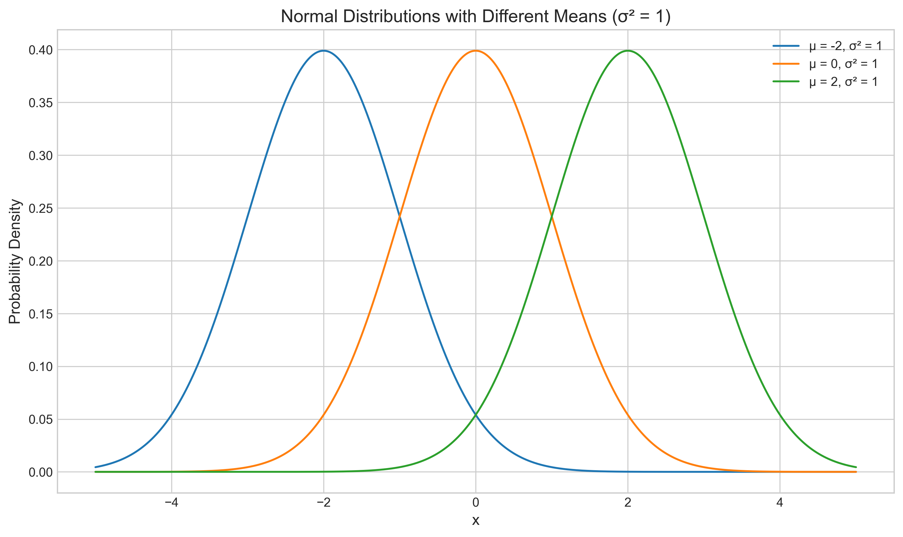
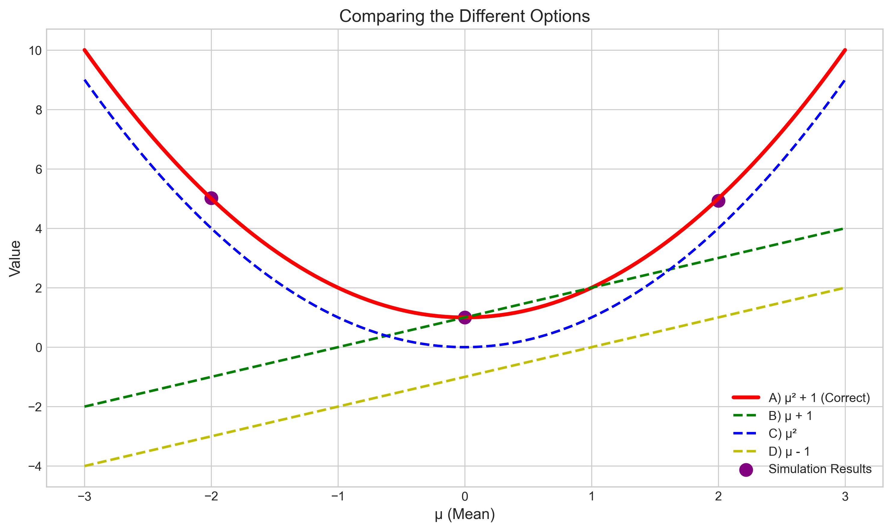

# Question 19: Expected Value of Statistics in Normal Distribution

## Problem Statement
Consider a random sample $X_1, X_2, \ldots, X_n$ from a normal population $N(\mu, 1)$.

## Task
What is the expected value of the following statistic: $X_i^2$?

**Options:**
A) $\mu^2 + 1$
B) $\mu + 1$
C) $\mu^2$
D) $\mu - 1$

## Correct Answer
A) $\mu^2 + 1$

## Solution

To solve this problem, we need to understand the properties of the normal distribution and apply the rules of expectation.

### Step 1: Identify the Distribution Properties
- We have a random sample $X_1, X_2, \ldots, X_n$ from $N(\mu, 1)$
- Each $X_i$ has mean $\mu$ and variance 1
- The random variables are independent

### Step 2: Visualize the Normal Distribution
Let's first understand what the normal distribution $N(\mu, 1)$ looks like for different values of $\mu$:

The plot shows normal distributions with means $\mu = -2, 0,$ and $2$, all with variance $\sigma^2 = 1$. The mean $\mu$ shifts the distribution left or right along the x-axis, while the variance controls the spread.

### Step 3: Recall Basic Properties of Expectations
For a random variable $X$ with mean $\mu_X$ and variance $\sigma_X^2$:
- $E[X] = \mu_X$
- $Var(X) = E[(X - \mu_X)^2] = E[X^2] - (E[X])^2$
- Therefore, $E[X^2] = Var(X) + (E[X])^2 = \sigma_X^2 + \mu_X^2$

This last equation is the key to solving our problem, as it relates the second moment $E[X^2]$ to the variance and mean.

### Step 4: Apply to Our Normal Distribution
For each $X_i \sim N(\mu, 1)$:
- $E[X_i] = \mu$
- $Var(X_i) = 1$
- Therefore, $E[X_i^2] = Var(X_i) + (E[X_i])^2 = 1 + \mu^2$

### Step 5: Verify with Simulations
We can verify this result through simulations by generating samples from normal distributions with different means and calculating the empirical second moment:

The simulation results (blue dots) match the theoretical curve $E[X^2] = 1 + \mu^2$ (red line), confirming our analytical derivation.

The empirical values from our simulation:
- For $\mu = -2$: Empirical $E[X^2] = 5.0154$ (Theoretical: 5)
- For $\mu = 0$: Empirical $E[X^2] = 1.0021$ (Theoretical: 1)
- For $\mu = 2$: Empirical $E[X^2] = 4.9331$ (Theoretical: 5)

### Step 6: Algebraic Verification
We can also verify this result through direct algebraic manipulation:
- $E[X_i^2] = E[(X_i - \mu + \mu)^2]$
- $= E[(X_i - \mu)^2 + 2\mu(X_i - \mu) + \mu^2]$
- $= E[(X_i - \mu)^2] + 2\mu E[X_i - \mu] + \mu^2$
- $= Var(X_i) + 2\mu \cdot 0 + \mu^2$ (since $E[X_i - \mu] = E[X_i] - \mu = 0$)
- $= 1 + \mu^2$

This algebraic approach illustrates how the second moment $E[X^2]$ can be decomposed into the variance (which measures the spread around the mean) and the squared mean:

The left panel shows the normal distribution with $\mu = 1.5$, highlighting that the variance is 1. The right panel illustrates how $E[X^2] = 1 + \mu^2$ is the sum of the constant variance (blue dashed line) and the quadratic term $\mu^2$ (green dashed line).

### Step 7: Compare All Options
Finally, we can compare all possible answers to see which one matches our derivation:

The plot shows:
- Option A: $\mu^2 + 1$ (red solid line) - This matches our derivation and the simulation results
- Option B: $\mu + 1$ (green dashed line) - This is linear in $\mu$ and doesn't match
- Option C: $\mu^2$ (blue dashed line) - This is missing the constant term from the variance
- Option D: $\mu - 1$ (yellow dashed line) - This is linear and decreases with $\mu$, which doesn't match

## Key Insights
1. **The Second Moment Formula**: For any random variable, $E[X^2] = Var(X) + (E[X])^2$. This is a fundamental relationship in probability theory.

2. **For Normal Distributions**: When $X \sim N(\mu, \sigma^2)$, the second moment is $E[X^2] = \sigma^2 + \mu^2$. In our specific case with $\sigma^2 = 1$, this becomes $E[X^2] = 1 + \mu^2$.

3. **Interpreting the Result**: The second moment $E[X^2]$ can be understood as having two components:
   - A constant component from the variance ($\sigma^2 = 1$)
   - A quadratic component from the squared mean ($\mu^2$)

4. **Asymptotic Behavior**: As $|\mu|$ increases, the $\mu^2$ term dominates, causing $E[X^2]$ to grow quadratically.

## Conclusion
The expected value of $X_i^2$ for a random variable $X_i \sim N(\mu, 1)$ is $1 + \mu^2$.

Therefore, the answer is A) $\mu^2 + 1$.

This result demonstrates the fundamental relationship between the second moment, variance, and mean of a random variable, which is applicable not just to normal distributions but to any random variable with a finite variance. 