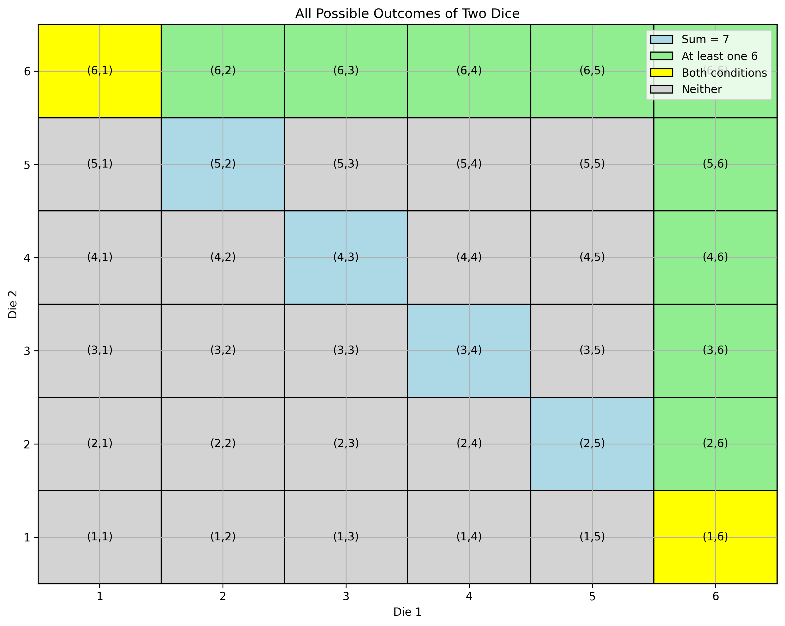
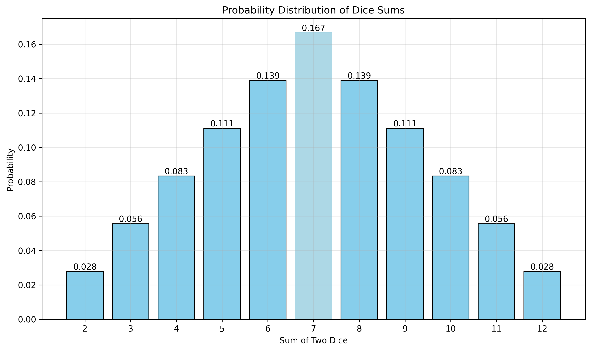

# Question 1: Dice Probability Fundamentals

## Problem Statement
Consider a random experiment where we roll two fair six-sided dice. Let event A be "the sum of the dice equals 7" and event B be "at least one die shows a 6."

### Task
Calculate:
1. P(A)
2. P(B)
3. P(A ∩ B)
4. P(A ∪ B)
5. Are events A and B independent? Justify your answer.

## Understanding the Problem
When rolling two fair six-sided dice, there are 36 possible outcomes (6 × 6 = 36). Each outcome is equally likely with a probability of 1/36. We need to find the probabilities of various events and determine if they are independent.

## Solution

The dice rolling experiment involves a discrete sample space with 36 equally likely outcomes. Each outcome has probability 1/36.

### Step 1: Calculate P(A) - Probability that the sum equals 7
- There are 6 outcomes where the sum equals 7: (1,6), (2,5), (3,4), (4,3), (5,2), (6,1)
- P(A) = 6/36 = 1/6 ≈ 0.1667

### Step 2: Calculate P(B) - Probability that at least one die shows 6
- First die shows 6, second die shows any number: (6,1), (6,2), (6,3), (6,4), (6,5), (6,6)
- Second die shows 6, first die shows any number except 6: (1,6), (2,6), (3,6), (4,6), (5,6)
- Total outcomes: 11
- P(B) = 11/36 ≈ 0.3056

### Step 3: Calculate P(A ∩ B) - Probability of both events occurring
- Only two outcomes satisfy both conditions: (1,6) and (6,1)
- P(A ∩ B) = 2/36 = 1/18 ≈ 0.0556

### Step 4: Calculate P(A ∪ B) - Probability of either event occurring
- Using the inclusion-exclusion principle: P(A ∪ B) = P(A) + P(B) - P(A ∩ B)
- P(A ∪ B) = 6/36 + 11/36 - 2/36 = 15/36 = 5/12 ≈ 0.4167

### Step 5: Check for independence
Two events A and B are independent if P(A ∩ B) = P(A) × P(B)

Let's verify:
- P(A) × P(B) = (6/36) × (11/36) = 66/1296 ≈ 0.0509
- P(A ∩ B) = 2/36 ≈ 0.0556

Since P(A ∩ B) ≠ P(A) × P(B), the events A and B are not independent.

## Visual Explanations

### Sample Space Visualization

In the visualization above:
- Light blue squares represent outcomes where the sum is 7 (Event A)
- Light green squares represent outcomes where at least one die shows 6 (Event B)
- Yellow squares represent outcomes where both conditions are met (Event A ∩ B)
- Gray squares represent outcomes where neither condition is met

### Probability Distribution of Dice Sums

This bar chart shows the probability distribution of all possible sums when rolling two dice:
- The most likely sum is 7 (highlighted in light blue)
- The distribution is symmetric
- The probabilities decrease as we move away from 7 in either direction

## Key Insights

### Probability Concepts
- The sample space for two dice has 36 equally likely outcomes
- Events can be represented as subsets of the sample space
- The inclusion-exclusion principle is essential for calculating the probability of unions

### Independence Analysis
- Events A and B are not independent
- This makes intuitive sense: knowing that at least one die shows 6 affects the probability of getting a sum of 7
- Independence is a mathematical property that can be verified by checking if P(A ∩ B) = P(A) × P(B)

### Practical Applications
- Understanding dice probabilities forms the foundation for analyzing many games of chance
- The symmetry of the sum distribution explains why 7 is often a key number in dice games

## Conclusion

For the dice probability experiment:
- P(A) = 1/6 ≈ 0.1667
- P(B) = 11/36 ≈ 0.3056
- P(A ∩ B) = 1/18 ≈ 0.0556
- P(A ∪ B) = 5/12 ≈ 0.4167

Events A and B are not independent because P(A ∩ B) ≠ P(A) × P(B). This demonstrates that in probability theory, intuitive notions of relatedness can be precisely formalized through mathematical concepts like independence. 