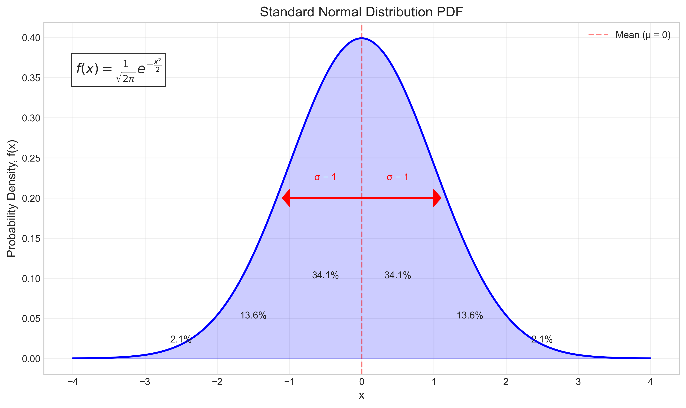
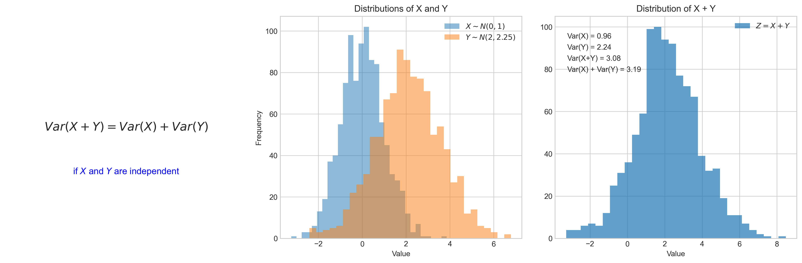
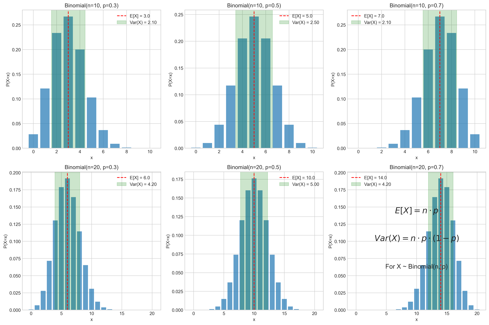
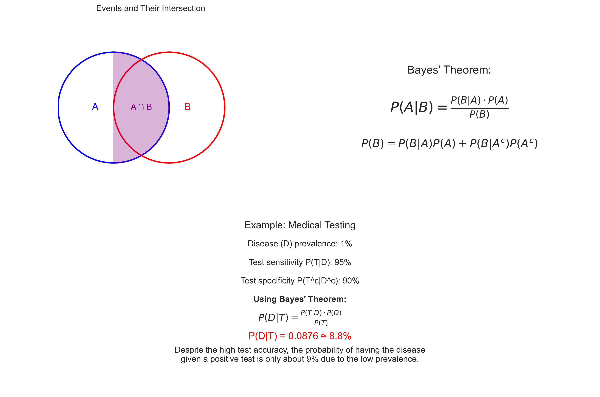
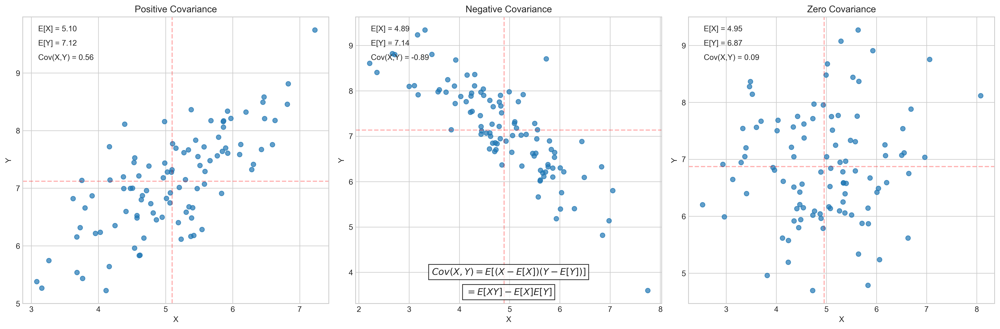
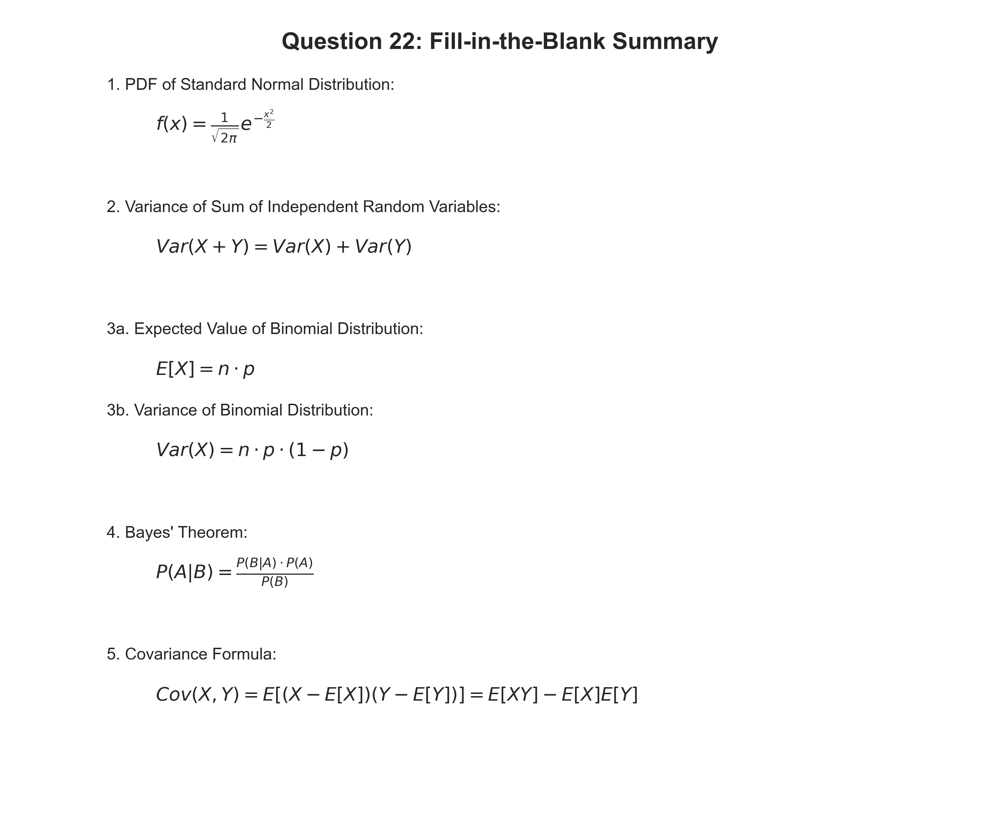

# Question 22: Probability Fill-in-the-Blank

## Problem Statement
Complete each statement with the appropriate mathematical expression or term.

## Task
1. The probability density function of a standard normal distribution is given by $\_\_\_\_\_\_\_\_\_\_\_\_\_\_$.
2. For two independent random variables $X$ and $Y$, the variance of their sum $X + Y$ equals $\_\_\_\_\_\_\_\_\_\_\_\_\_\_$.
3. If $X$ follows a binomial distribution with parameters $n$ and $p$, then the expected value of $X$ is $\_\_\_\_\_\_\_\_\_\_\_\_\_\_$ and its variance is $\_\_\_\_\_\_\_\_\_\_\_\_\_\_$.
4. The conditional probability $P(A|B)$ can be expressed in terms of $P(B|A)$ using $\_\_\_\_\_\_\_\_\_\_\_\_\_\_$ theorem.
5. The covariance between random variables $X$ and $Y$ can be calculated using the formula $\_\_\_\_\_\_\_\_\_\_\_\_\_\_$.

## Answer Key
1. $\frac{1}{\sqrt{2\pi}} e^{-\frac{x^2}{2}}$
2. $Var(X) + Var(Y)$
3. $n \cdot p$ and $n \cdot p \cdot (1-p)$
4. Bayes'
5. $E[(X - E[X])(Y - E[Y])]$ or $E[XY] - E[X]E[Y]$

## Detailed Explanation

### Part 1: PDF of a Standard Normal Distribution

#### Solution
The probability density function (PDF) of a standard normal distribution is given by:

$$f(x) = \frac{1}{\sqrt{2\pi}} e^{-\frac{x^2}{2}}$$

This is the standard normal distribution with mean $\mu = 0$ and standard deviation $\sigma = 1$. The PDF has several notable properties:

- It is symmetric around $x = 0$
- The total area under the curve equals 1
- Approximately 68.2% of the distribution falls within 1 standard deviation of the mean
- Approximately 95.4% falls within 2 standard deviations
- Approximately 99.7% falls within 3 standard deviations (the "empirical rule")

The standard normal distribution is a fundamental probability distribution in statistics and serves as the basis for many statistical tests, approximations, and theorems, including the Central Limit Theorem.

### Part 2: Variance of the Sum of Independent Random Variables

#### Solution
For two independent random variables $X$ and $Y$, the variance of their sum $X + Y$ equals:

$$Var(X + Y) = Var(X) + Var(Y)$$

This is a key property in probability theory when dealing with the sum of independent random variables. Importantly, this property only holds when the variables are independent.

For dependent variables, the correct formula would include a covariance term:
$$Var(X + Y) = Var(X) + Var(Y) + 2Cov(X, Y)$$

This property has numerous applications in statistical analysis, including:
- Error propagation in experimental measurements
- Portfolio risk assessment in finance
- Noise analysis in signal processing
- Statistical quality control

### Part 3: Expected Value and Variance of a Binomial Distribution

#### Solution
If $X$ follows a binomial distribution with parameters $n$ and $p$, then:

**Expected value**: $E[X] = n \cdot p$

**Variance**: $Var(X) = n \cdot p \cdot (1-p)$

These formulas can be derived from first principles by considering the binomial distribution as the sum of $n$ independent Bernoulli random variables, each with probability $p$ of success.

The binomial distribution is used to model the number of successes in a fixed number of independent Bernoulli trials. Some applications include:
- Quality control (number of defective items in a batch)
- A/B testing (number of conversions in a fixed sample size)
- Genetic inheritance (number of offspring with a particular trait)

As $n$ increases, the binomial distribution can be approximated by a normal distribution with the same mean and variance, when $np > 5$ and $n(1-p) > 5$.

### Part 4: Bayes' Theorem

#### Solution
The conditional probability $P(A|B)$ can be expressed in terms of $P(B|A)$ using **Bayes'** theorem:

$$P(A|B) = \frac{P(B|A) \cdot P(A)}{P(B)}$$

Where:
- $P(A|B)$ is the posterior probability of $A$ given $B$
- $P(B|A)$ is the likelihood of $B$ given $A$
- $P(A)$ is the prior probability of $A$
- $P(B)$ is the marginal probability of $B$, which can be expanded as $P(B) = P(B|A)P(A) + P(B|A^c)P(A^c)$

Bayes' theorem is fundamental in modern statistics and machine learning, forming the basis of:
- Bayesian inference
- Medical diagnostics (disease probability given test results)
- Spam filtering
- Machine learning algorithms (Naive Bayes classifiers)
- Recommender systems

The theorem allows us to update our beliefs about hypotheses as new evidence is observed, making it crucial for scientific reasoning and decision-making under uncertainty.

### Part 5: Covariance Formula

#### Solution
The covariance between random variables $X$ and $Y$ can be calculated using the formula:

$$Cov(X, Y) = E[(X - E[X])(Y - E[Y])] = E[XY] - E[X]E[Y]$$

Covariance measures the joint variability of two random variables and indicates the direction of their linear relationship:
- Positive covariance suggests that the variables tend to increase together
- Negative covariance suggests that as one variable increases, the other tends to decrease
- Zero covariance indicates no linear relationship (though nonlinear relationships may still exist)

Covariance is often standardized to form the correlation coefficient:

$$\rho(X, Y) = \frac{Cov(X, Y)}{\sigma_X \sigma_Y}$$

Where $\sigma_X$ and $\sigma_Y$ are the standard deviations of $X$ and $Y$, respectively. This normalization creates a value between -1 and 1, making it easier to interpret the strength of the relationship.

Covariance and correlation are widely used in:
- Portfolio theory in finance
- Principal Component Analysis (PCA)
- Feature selection in machine learning
- Signal processing
- Multivariate statistical analysis

## Summary

These foundational concepts in probability theory are essential for understanding statistical inference, machine learning, and data analysis. They provide the mathematical framework for modeling uncertainty, quantifying relationships between variables, and making predictions based on observed data.

The ability to correctly identify and apply these formulas is crucial for solving complex problems in statistics and machine learning, where understanding the underlying probability distributions and their properties can lead to more accurate models and better-informed decisions. 