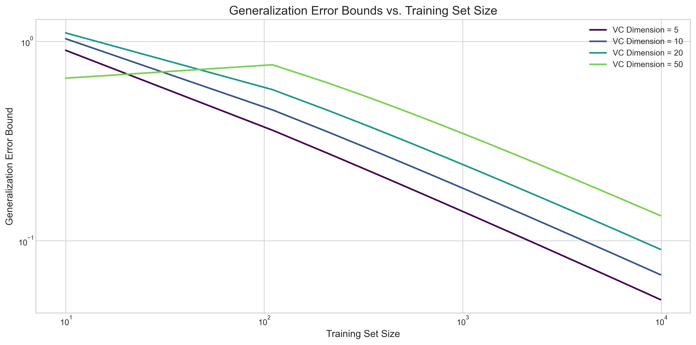

# Question 23: Concentration Inequalities

## Problem Statement
Provide brief answers to the following questions about concentration inequalities.

## Tasks
1. State the Markov inequality and explain its practical implications.
2. How does Chebyshev's inequality improve upon Markov's inequality?
3. What does Hoeffding's inequality tell us about the convergence of sample means?
4. How can concentration inequalities be applied to evaluate the generalization error in machine learning models?
5. Compare and contrast the assumptions required for applying the Law of Large Numbers versus the Central Limit Theorem.

## Solution

### 1. Markov's Inequality

**Statement:** For a non-negative random variable X with mean μ, for any positive value a > 0:

$$P(X \geq a) \leq \frac{\mu}{a}$$

**Practical Implications:**
- It provides an upper bound on the probability of exceeding a threshold without requiring knowledge of the full distribution
- Only requires knowledge of the mean (first moment)
- The bound is often loose, especially for symmetric distributions
- Useful as a starting point for deriving more powerful concentration inequalities

As shown in the figure, Markov's inequality provides an upper bound on the tail probability that becomes tighter as the threshold increases. For an exponential distribution with mean μ = 2, we can observe that the actual probabilities are typically much smaller than the Markov bounds, demonstrating that while the inequality is valid, it's often not tight.

### 2. Chebyshev's Inequality

Chebyshev's inequality states that for any random variable X with mean μ and variance σ²:

$$P(|X - \mu| \geq k\sigma) \leq \frac{1}{k^2}$$

for any k > 0.

**Improvements over Markov's Inequality:**
- It provides tighter bounds for distributions with finite variance
- It accounts for the spread of the distribution via the variance (second moment)
- It's applicable to both sides of the mean (two-sided bound)
- Works for both positive and negative random variables
- More informative by connecting the probability to standard deviations

The visualization shows how Chebyshev's inequality bounds the probability of deviating from the mean by k standard deviations. For k = 1, 2, and 3, the bounds are 1, 0.25, and 0.11 respectively, becoming tighter as k increases. For normal distributions, the actual probabilities are much smaller than Chebyshev's bounds, especially at higher values of k.

### 3. Hoeffding's Inequality

Hoeffding's inequality provides a bound on the probability that the sum (or average) of bounded independent random variables deviates from its expected value.

For independent bounded random variables X₁, X₂, ..., Xₙ with aᵢ ≤ Xᵢ ≤ bᵢ and mean μ, the inequality states:

$$P(|\bar{X} - \mu| \geq \epsilon) \leq 2\exp\left(-\frac{2n\epsilon^2}{\sum_i (b_i-a_i)^2}\right)$$

If all Xᵢ are in [0,1], this simplifies to:

$$P(|\bar{X} - \mu| \geq \epsilon) \leq 2\exp(-2n\epsilon^2)$$

**Convergence of Sample Means:**
- The probability of the sample mean deviating from the true mean by more than ε decreases **exponentially** with sample size n
- This provides quantitative guarantees on how quickly sample means converge to population means
- Enables calculation of the minimum sample size needed to achieve a desired level of confidence
- Unlike Markov and Chebyshev, it gives exponential rather than polynomial decay in probability

The figure illustrates how Hoeffding's bound decreases exponentially with sample size. As the sample size increases, the probability that the sample mean deviates from the true mean by more than ε = 0.1 approaches zero rapidly. This demonstrates why modest increases in sample size can significantly improve estimation reliability.

### 4. Applications to Generalization Error in Machine Learning

Concentration inequalities provide theoretical foundations for bounding generalization error in machine learning:

1. **Generalization Error Bounds:**
   - PAC (Probably Approximately Correct) learning theory uses concentration inequalities to bound the difference between training and test error
   - Provides theoretical guarantees on model performance on unseen data
   - Enables confidence intervals on predictions

2. **Sample Complexity Analysis:**
   - Determines how many training examples are required to achieve a desired error rate
   - Guides dataset size decisions in practical ML applications
   - Relates model complexity to necessary sample size

3. **Model Selection and Regularization:**
   - Provides theoretical foundation for techniques like cross-validation
   - Explains why regularization helps prevent overfitting
   - Guides hyperparameter selection

The figure shows how generalization error bounds decrease with training set size for models with different complexities (VC dimensions). Higher complexity models require more data to achieve the same generalization error bound, illustrating the bias-variance tradeoff. These bounds help explain why complex models might overfit on small datasets.

### 5. Law of Large Numbers vs. Central Limit Theorem

**Law of Large Numbers (LLN):**
- **Assumptions:** Random variables X₁, X₂, ... are independent and identically distributed (i.i.d.) with finite mean μ
- **Statement:** The sample mean X̄ₙ converges to the population mean μ as n → ∞
- **Types:** Weak LLN (convergence in probability) and Strong LLN (almost sure convergence)

**Central Limit Theorem (CLT):**
- **Assumptions:** Random variables X₁, X₂, ... are i.i.d. with finite mean μ and finite variance σ²
- **Statement:** The distribution of √n(X̄ₙ - μ)/σ converges to a standard normal distribution as n → ∞
- **Application:** Enables approximate confidence intervals and hypothesis tests

**Key Differences:**
1. **Purpose:** LLN describes *if* convergence happens; CLT describes *how* it happens (distribution)
2. **Requirements:** CLT requires finite variance, while weak LLN only requires finite mean
3. **Information:** CLT provides information about the rate of convergence and distribution shape
4. **Applications:** LLN justifies the use of sample means as estimators; CLT justifies statistical inference procedures

The visualization demonstrates both theorems in action. The left panels show the Law of Large Numbers as the running sample mean (blue line) approaches the true mean (red line) with increasing sample size for uniform and exponential distributions. The right panels show the Central Limit Theorem, where sample means from these non-normal distributions approach a normal distribution (red line) when standardized, regardless of the original distribution's shape.

## Summary of Concentration Inequalities

Concentration inequalities provide increasingly powerful tools for bounding probabilities of deviation:

1. **Markov's Inequality** provides basic bounds using only the mean, but they're often loose
2. **Chebyshev's Inequality** improves on Markov by incorporating variance information
3. **Hoeffding's Inequality** gives exponentially decreasing bounds for sums of bounded random variables

These inequalities form the foundation of statistical learning theory, providing guarantees on estimation accuracy, sample complexity, and generalization performance. They bridge theoretical probability concepts with practical machine learning applications, helping explain why learning algorithms work and how to make them more effective. 