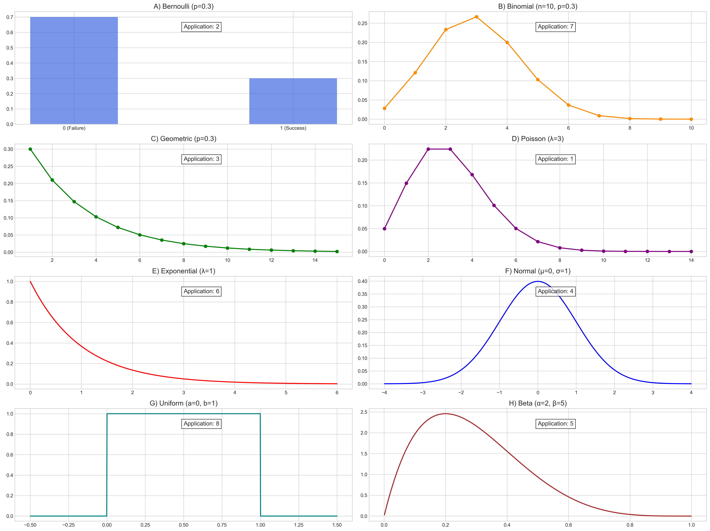
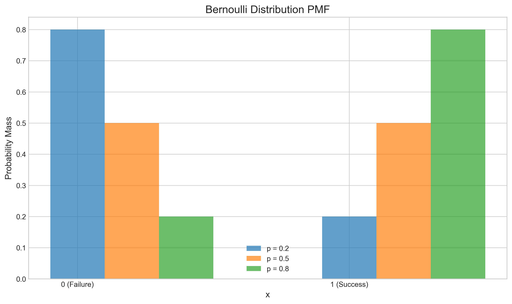
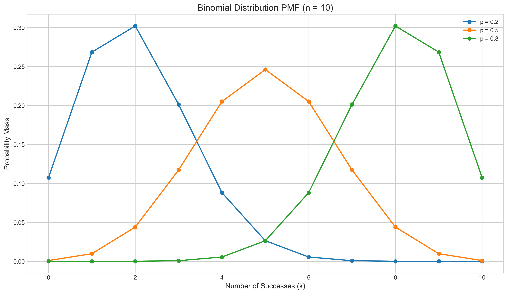
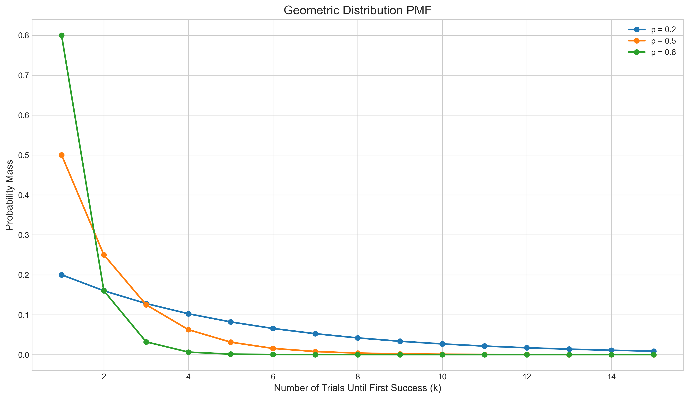
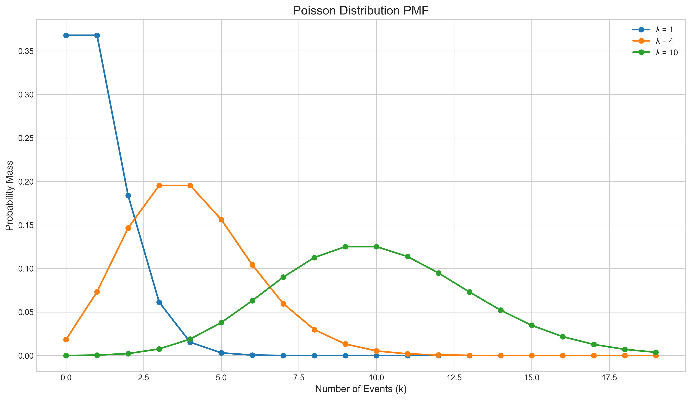
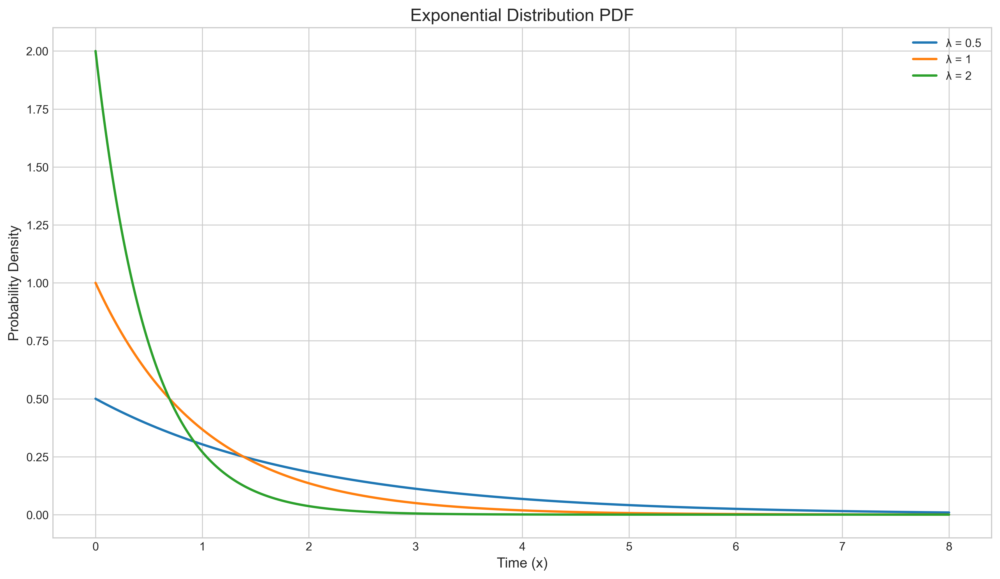
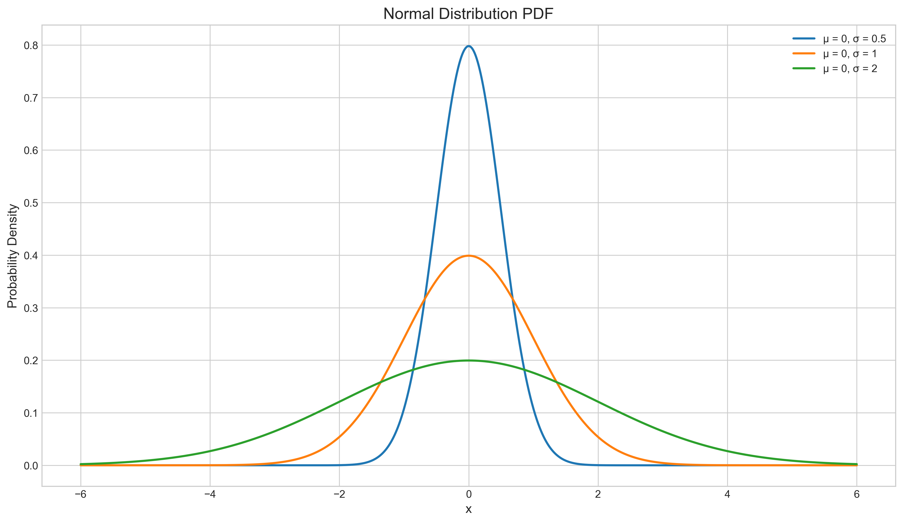
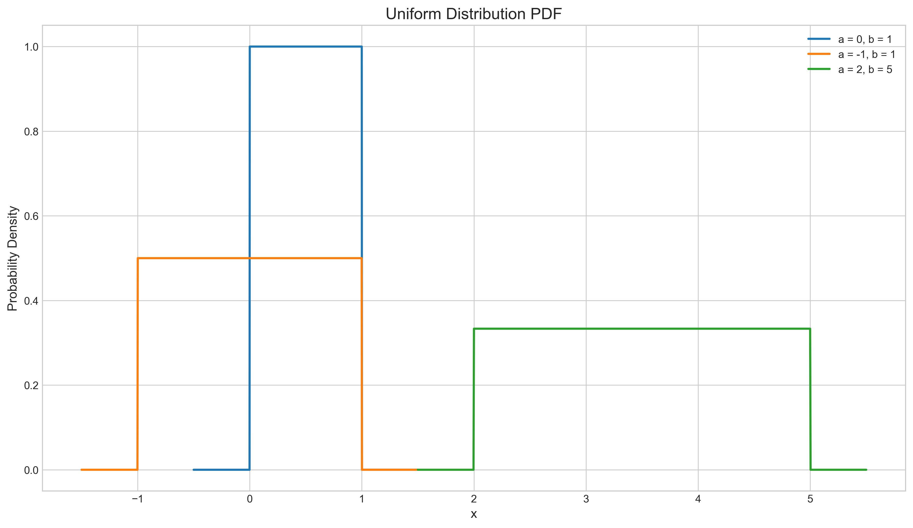
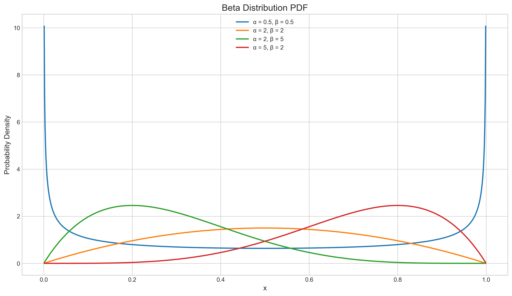
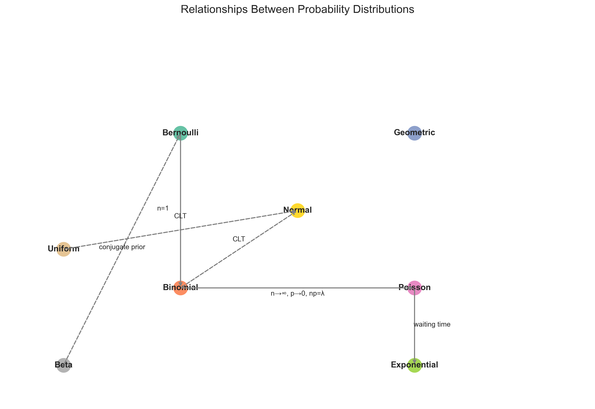

# Question 24: Distribution Applications

## Problem Statement
Match each probability distribution with its most appropriate application scenario.

## Task
**Distributions:**
A) Bernoulli
B) Binomial
C) Geometric
D) Poisson
E) Exponential
F) Normal
G) Uniform
H) Beta

**Application Scenarios:**
1. Modeling the number of rare events occurring in a fixed time interval
2. Representing the probability of success in a single trial
3. Modeling the number of trials needed until the first success
4. Representing the distribution of errors in physical measurements
5. Modeling the prior distribution of a probability parameter
6. Representing the waiting time between events in a Poisson process
7. Modeling the number of successes in a fixed number of independent trials
8. Representing a random variable that is equally likely to take any value in a range

## Solution

The correct matching is:

| Distribution | Application Scenario |
|--------------|----------------------|
| A) Bernoulli | 2. Representing the probability of success in a single trial |
| B) Binomial | 7. Modeling the number of successes in a fixed number of independent trials |
| C) Geometric | 3. Modeling the number of trials needed until the first success |
| D) Poisson | 1. Modeling the number of rare events occurring in a fixed time interval |
| E) Exponential | 6. Representing the waiting time between events in a Poisson process |
| F) Normal | 4. Representing the distribution of errors in physical measurements |
| G) Uniform | 8. Representing a random variable that is equally likely to take any value in a range |
| H) Beta | 5. Modeling the prior distribution of a probability parameter |

## Distribution Explanations

### A) Bernoulli Distribution

The Bernoulli distribution models a single random experiment with exactly two possible outcomes: "success" (typically denoted as 1) and "failure" (typically denoted as 0).

**Key properties:**
- Probability mass function: P(X = 1) = p, P(X = 0) = 1-p
- Mean: p
- Variance: p(1-p)

**Application:** Representing the probability of success in a single trial

**Example:** A single coin flip where "heads" is considered success with probability p.

The graph shows Bernoulli distributions with different success probabilities p. Each distribution has only two possible outcomes (0 and 1), with the height of each bar representing the probability of that outcome.

### B) Binomial Distribution

The binomial distribution models the number of successes in a fixed number (n) of independent Bernoulli trials, each with the same probability of success (p).

**Key properties:**
- Probability mass function: P(X = k) = (n choose k) × p^k × (1-p)^(n-k)
- Mean: np
- Variance: np(1-p)

**Application:** Modeling the number of successes in a fixed number of independent trials

**Example:** The number of heads in 10 coin flips.

The graph shows binomial distributions with n = 10 trials and different values of p. As p increases, the distribution shifts rightward, indicating a higher expected number of successes. When p = 0.5, the distribution is symmetric around n/2 = 5.

### C) Geometric Distribution

The geometric distribution models the number of trials required to achieve the first success in a sequence of independent Bernoulli trials, each with probability of success p.

**Key properties:**
- Probability mass function: P(X = k) = (1-p)^(k-1) × p
- Mean: 1/p
- Variance: (1-p)/p²

**Application:** Modeling the number of trials needed until the first success

**Example:** The number of dice rolls needed to get a 6.

The graph shows geometric distributions with different success probabilities p. For smaller values of p, the distribution is more spread out, indicating that more trials are likely needed to achieve the first success. For larger values of p, the distribution is more concentrated near the origin, as success is likely to occur sooner.

### D) Poisson Distribution

The Poisson distribution models the number of events occurring in a fixed interval of time or space, assuming these events occur independently and at a constant average rate.

**Key properties:**
- Probability mass function: P(X = k) = (λ^k × e^(-λ))/k!
- Mean: λ
- Variance: λ

**Application:** Modeling the number of rare events occurring in a fixed time interval

**Example:** The number of emails arriving in an hour, the number of typos on a page.

The graph shows Poisson distributions with different rate parameters λ. As λ increases, the distribution shifts rightward and becomes more spread out, indicating a higher expected number of events with more variability.

### E) Exponential Distribution

The exponential distribution models the time between events in a Poisson process. It is the continuous analog to the geometric distribution.

**Key properties:**
- Probability density function: f(x) = λe^(-λx) for x ≥ 0
- Mean: 1/λ
- Variance: 1/λ²

**Application:** Representing the waiting time between events in a Poisson process

**Example:** Time between customer arrivals at a service counter, time until equipment failure.

The graph shows exponential distributions with different rate parameters λ. Higher values of λ correspond to higher event rates and thus shorter expected waiting times between events. The distribution is always skewed right with a peak at x = 0.

### F) Normal Distribution

The normal (or Gaussian) distribution is a continuous probability distribution characterized by its bell-shaped curve, symmetric around the mean.

**Key properties:**
- Probability density function: f(x) = (1/(σ√(2π))) × e^(-(x-μ)²/(2σ²))
- Mean: μ
- Variance: σ²

**Application:** Representing the distribution of errors in physical measurements

**Example:** Heights of people in a population, measurement errors, IQ scores.

The graph shows normal distributions with mean μ = 0 and different standard deviations σ. As σ increases, the bell curve becomes wider and flatter, indicating greater variability. The distribution is always symmetric around the mean μ.

### G) Uniform Distribution

The uniform distribution models a random variable that is equally likely to take any value within a given range [a,b].

**Key properties:**
- Probability density function: f(x) = 1/(b-a) for a ≤ x ≤ b
- Mean: (a+b)/2
- Variance: (b-a)²/12

**Application:** Representing a random variable that is equally likely to take any value in a range

**Example:** Random number generators, rounding errors.

The graph shows uniform distributions over different ranges. Each distribution has constant probability density over its range [a,b] and zero probability outside this range. The wider the range, the lower the height of the PDF, since the total probability must equal 1.

### H) Beta Distribution

The beta distribution is a versatile distribution for random variables constrained to the interval [0,1], such as probabilities and proportions.

**Key properties:**
- Probability density function: f(x) ∝ x^(α-1) × (1-x)^(β-1) for 0 ≤ x ≤ 1
- Mean: α/(α+β)
- Variance: αβ/((α+β)²(α+β+1))

**Application:** Modeling the prior distribution of a probability parameter

**Example:** Prior beliefs about success rates, proportions, or probabilities in Bayesian analysis.

The graph shows beta distributions with different shape parameters α and β. When α = β = 0.5, the distribution is U-shaped. When α = β = 2, it is symmetric and bell-shaped. When α > β, the distribution is skewed to the right, and when α < β, it is skewed to the left.

## Relationships Between Distributions

Many of these distributions are related to each other in important ways:

Key relationships include:

1. **Bernoulli and Binomial**: The Bernoulli distribution is a special case of the binomial distribution with n = 1.

2. **Binomial and Poisson**: The Poisson distribution can be derived as a limit of the binomial distribution as n approaches infinity, p approaches 0, while keeping np = λ constant.

3. **Poisson and Exponential**: The exponential distribution models the waiting time between consecutive events in a Poisson process.

4. **Central Limit Theorem**: The normal distribution emerges as the limiting distribution of standardized sums of many independent, identically distributed random variables (regardless of their original distribution).

5. **Bayesian Analysis**: The beta distribution is the conjugate prior for the Bernoulli and binomial distributions, making it computationally convenient for Bayesian inference.

## Conclusion

Understanding these probability distributions and their appropriate applications is fundamental for statistical modeling and machine learning. Each distribution captures different aspects of randomness that occur in natural processes, experimental settings, and data-generating mechanisms.

The matching between distributions and applications in this problem demonstrates the importance of selecting the appropriate probabilistic model based on the underlying phenomenon being studied. 