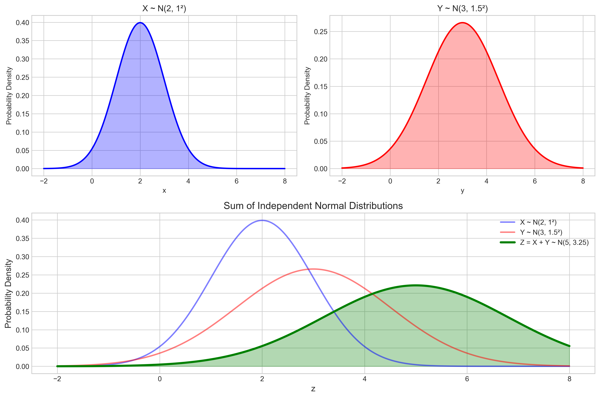
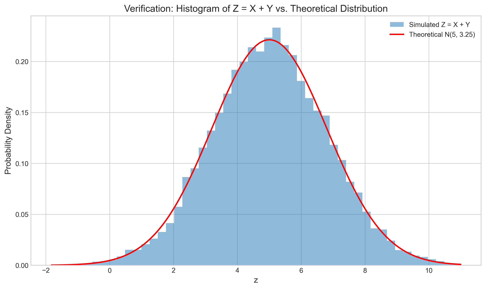
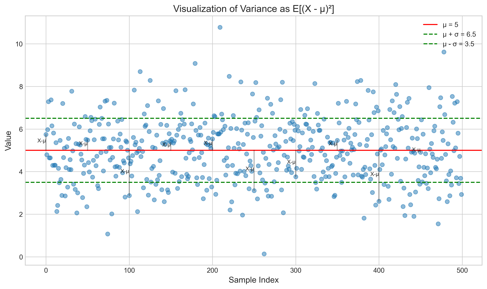
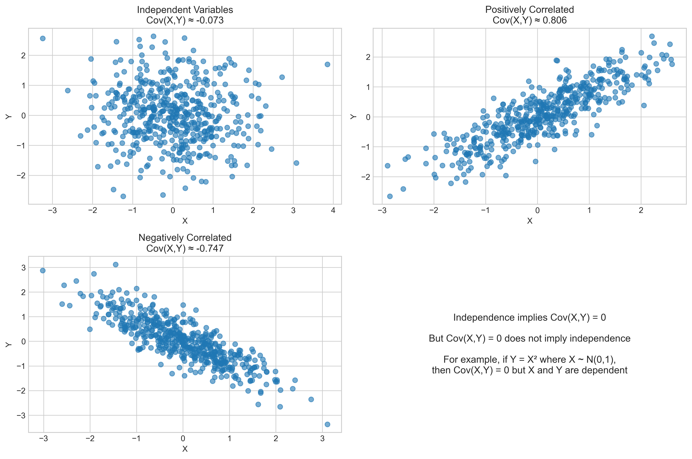
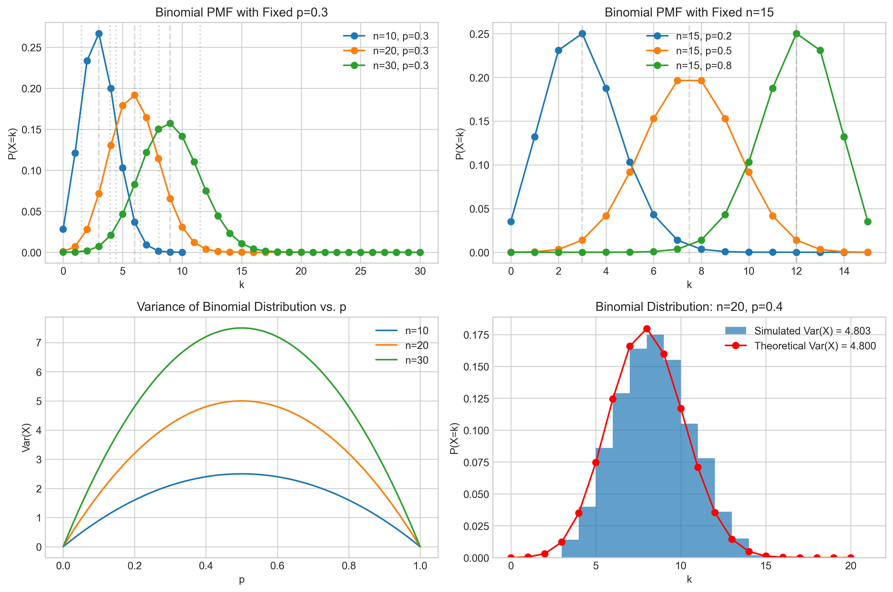

# Question 25: Probability Proofs

## Problem Statement
Provide a mathematical proof for each of the following statements:

1. The sum of two independent normally distributed random variables is also normally distributed.
2. For any random variable $X$ with finite mean $\mu$ and variance $\sigma^2$, prove that $E[(X - \mu)^2] = \sigma^2$.
3. Prove that if random variables $X$ and $Y$ are independent, then $\text{Cov}(X, Y) = 0$.
4. Derive the formula for the variance of a binomial random variable with parameters $n$ and $p$.

## Proof 1: Sum of Independent Normal Random Variables

### The Statement
If $X \sim N(\mu_1, \sigma_1^2)$ and $Y \sim N(\mu_2, \sigma_2^2)$ are independent random variables, then $Z = X + Y \sim N(\mu_1 + \mu_2, \sigma_1^2 + \sigma_2^2)$.

### Approach Using Moment Generating Functions
The most elegant proof uses the moment generating function (MGF) approach:

1. The MGF of a random variable $X$ is defined as $M_X(t) = E[e^{tX}]$
2. For a normal distribution $X \sim N(\mu, \sigma^2)$, the MGF is $M_X(t) = \exp(\mu t + \sigma^2 t^2/2)$

### Key MGF Properties
- If $X$ and $Y$ are independent, then $M_{X+Y}(t) = M_X(t) \cdot M_Y(t)$
- If two distributions have the same MGF, they are the same distribution

### Step-by-Step Proof
1. For $X \sim N(\mu_1, \sigma_1^2)$, we have $M_X(t) = \exp(\mu_1 t + \sigma_1^2 t^2/2)$
2. For $Y \sim N(\mu_2, \sigma_2^2)$, we have $M_Y(t) = \exp(\mu_2 t + \sigma_2^2 t^2/2)$
3. For $Z = X + Y$, since $X$ and $Y$ are independent:
   $M_Z(t) = M_X(t) \cdot M_Y(t)$
   $= \exp(\mu_1 t + \sigma_1^2 t^2/2) \cdot \exp(\mu_2 t + \sigma_2^2 t^2/2)$
   $= \exp((\mu_1 + \mu_2)t + (\sigma_1^2 + \sigma_2^2)t^2/2)$
4. This is exactly the MGF of a normal distribution with mean $\mu_1 + \mu_2$ and variance $\sigma_1^2 + \sigma_2^2$

Therefore, $Z = X + Y \sim N(\mu_1 + \mu_2, \sigma_1^2 + \sigma_2^2)$.

### Visual Demonstration

The figure shows:
- Top left: PDF of $X \sim N(2, 1)$
- Top right: PDF of $Y \sim N(3, 1.5^2)$
- Bottom: The PDFs of $X$, $Y$, and their sum $Z = X + Y \sim N(5, 3.25)$

A simulation with 10,000 samples further verifies this result:

The histogram of the sum closely follows the theoretical normal distribution.

## Proof 2: Expectation of Squared Deviation Equals Variance

### The Statement
For any random variable $X$ with finite mean $\mu$ and variance $\sigma^2$, prove that $E[(X - \mu)^2] = \sigma^2$.

### Direct Proof
This is actually true by definition, as the variance is defined as the expected squared deviation from the mean:

$\text{Var}(X) = E[(X - \mu)^2]$ where $\mu = E[X]$

### Alternative Computation
We can also demonstrate this by expanding the expression:

1. $E[(X - \mu)^2] = E[X^2 - 2\mu X + \mu^2]$
2. $= E[X^2] - 2\mu E[X] + \mu^2$
3. $= E[X^2] - 2\mu^2 + \mu^2$
4. $= E[X^2] - \mu^2$

This matches the alternative formula for variance: $\text{Var}(X) = E[X^2] - (E[X])^2 = E[X^2] - \mu^2$

Therefore, $E[(X - \mu)^2] = \sigma^2$.

### Visual Demonstration

The figure shows a sample of data points with mean $\mu = 5$ and standard deviation $\sigma = 1.5$. The vertical lines represent the deviations $(X - \mu)$ for some sample points. The variance $\sigma^2$ is the average of the squared lengths of these deviations.

## Proof 3: Independence Implies Zero Covariance

### The Statement
If random variables $X$ and $Y$ are independent, then $\text{Cov}(X, Y) = 0$.

### Definition of Covariance
The covariance between random variables $X$ and $Y$ is defined as:
$\text{Cov}(X, Y) = E[(X - \mu_X)(Y - \mu_Y)]$
where $\mu_X = E[X]$ and $\mu_Y = E[Y]$

### Step-by-Step Proof
1. Expand the covariance formula:
   $\text{Cov}(X, Y) = E[XY - \mu_Y X - \mu_X Y + \mu_X \mu_Y]$
   $= E[XY] - \mu_Y E[X] - \mu_X E[Y] + \mu_X \mu_Y$
   $= E[XY] - \mu_Y \mu_X - \mu_X \mu_Y + \mu_X \mu_Y$
   $= E[XY] - \mu_X \mu_Y$

2. If $X$ and $Y$ are independent, then:
   $E[XY] = E[X] \cdot E[Y] = \mu_X \mu_Y$

3. Substituting this into the covariance formula:
   $\text{Cov}(X, Y) = \mu_X \mu_Y - \mu_X \mu_Y = 0$

Therefore, if $X$ and $Y$ are independent, then $\text{Cov}(X, Y) = 0$.

### Important Note
The converse is not generally true: $\text{Cov}(X, Y) = 0$ does not necessarily imply independence. For example, if $X \sim N(0,1)$ and $Y = X^2$, then $\text{Cov}(X, Y) = 0$ but $X$ and $Y$ are clearly dependent.

### Visual Demonstration

The figure shows:
- Top left: Independent variables with covariance near zero
- Top right: Positively correlated variables with positive covariance
- Bottom left: Negatively correlated variables with negative covariance
- Bottom right: A reminder that zero covariance doesn't imply independence

## Proof 4: Variance of Binomial Distribution

### The Statement
For a binomial random variable $X \sim \text{Bin}(n, p)$, the variance is $\text{Var}(X) = np(1-p)$.

### Approach Using Sum of Bernoulli Trials
A binomial random variable with parameters $n$ and $p$ can be represented as the sum of $n$ independent Bernoulli random variables:

$X = X_1 + X_2 + \ldots + X_n$

where each $X_i \sim \text{Bernoulli}(p)$

### Step-by-Step Proof
1. For a Bernoulli random variable $X_i$ with parameter $p$:
   $E[X_i] = p$
   $\text{Var}(X_i) = E[X_i^2] - (E[X_i])^2 = p - p^2 = p(1-p)$

2. Using the property that for independent random variables, the variance of their sum is the sum of their variances:
   $\text{Var}(X) = \text{Var}(X_1 + X_2 + \ldots + X_n) = \text{Var}(X_1) + \text{Var}(X_2) + \ldots + \text{Var}(X_n)$

3. Since each $\text{Var}(X_i) = p(1-p)$ and there are $n$ terms:
   $\text{Var}(X) = n \cdot p(1-p)$

Therefore, for $X \sim \text{Bin}(n, p)$, $\text{Var}(X) = np(1-p)$.

### Visual Demonstration

The figure shows:
- Top left: Binomial PMFs for different values of $n$ with fixed $p = 0.3$
- Top right: Binomial PMFs for different values of $p$ with fixed $n = 15$
- Bottom left: Variance as a function of $p$ for different values of $n$, showing that variance is maximized at $p = 0.5$
- Bottom right: Comparison of theoretical and simulated binomial distributions, verifying the variance formula

## Significance in Machine Learning

These four proofs are fundamental in probability theory and have significant applications in machine learning:

1. **Sum of Normal Distributions**: Used in Bayesian inference, noise modeling, and understanding the behavior of weighted sums of features

2. **Definition of Variance**: Essential for understanding model variance, estimation error, and the bias-variance tradeoff

3. **Independence and Covariance**: Critical in feature engineering, correlation analysis, and understanding when variables provide complementary information

4. **Binomial Variance**: Applied in classification error analysis, sampling theory, and modeling processes with binary outcomes

Understanding these principles provides the theoretical foundation for many machine learning algorithms and techniques. 