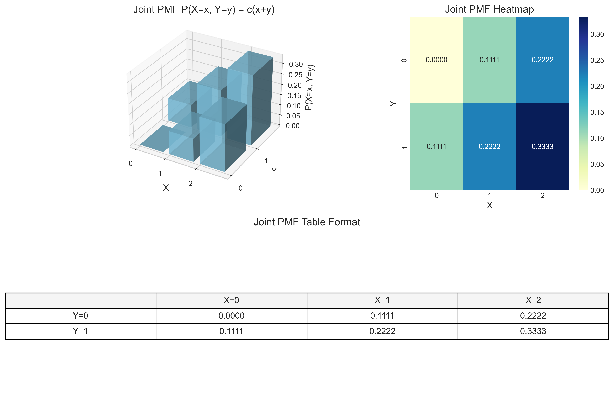
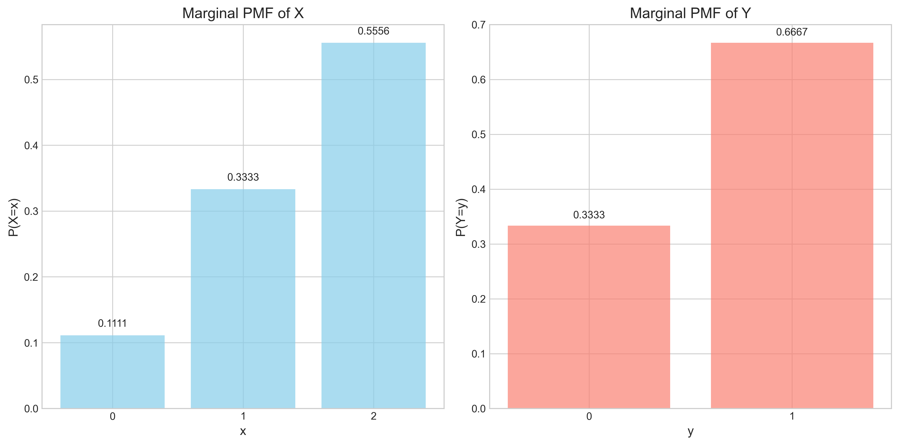
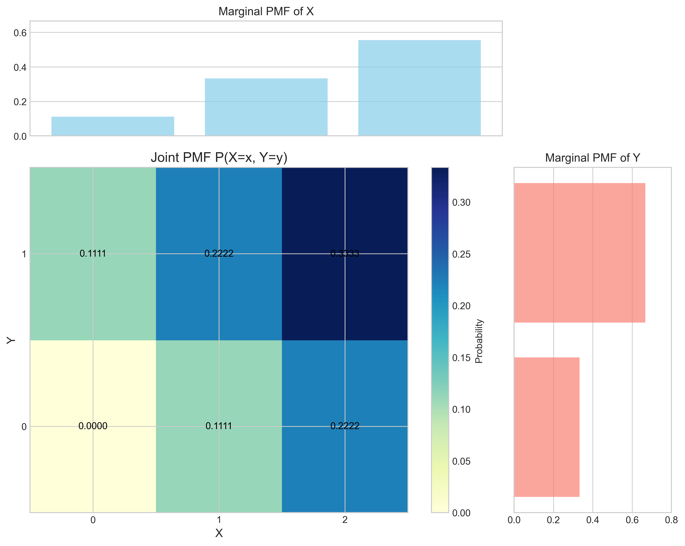
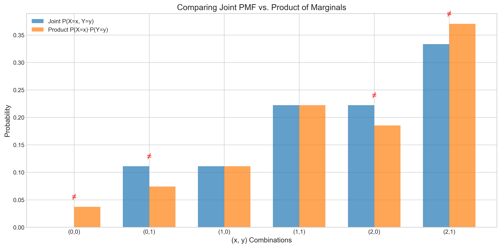
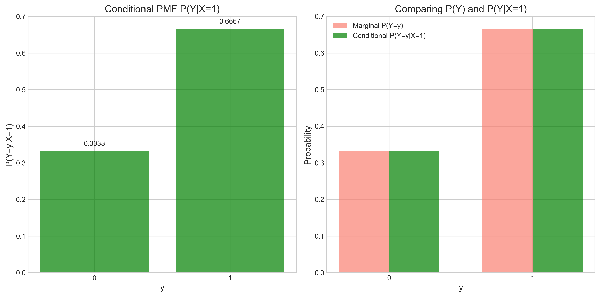
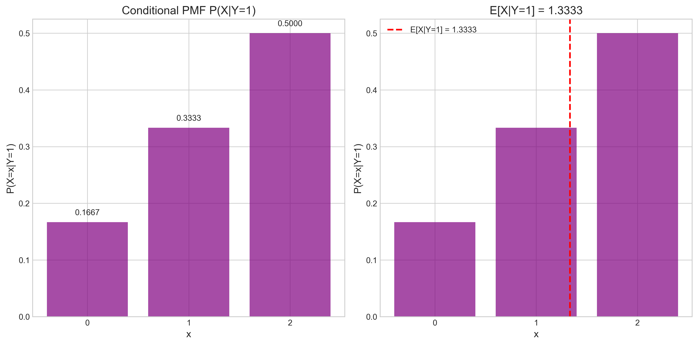
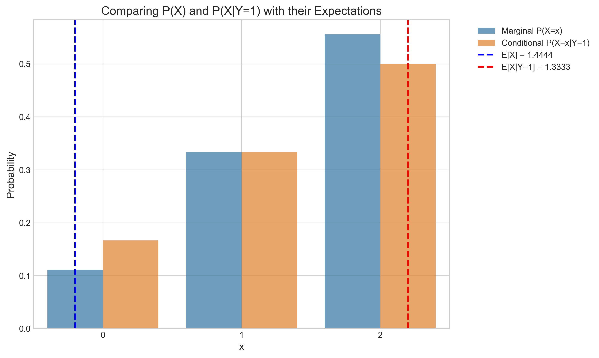

# Question 26: Joint Distributions Analysis

## Problem Statement
Random variables $X$ and $Y$ have the following joint probability mass function:

$$P(X=x, Y=y) = \begin{cases}
c(x+y) & \text{for } x \in \{0,1,2\} \text{ and } y \in \{0,1\} \\
0 & \text{otherwise}
\end{cases}$$

## Tasks
1. Find the value of the constant $c$
2. Calculate the marginal probability mass functions for $X$ and $Y$
3. Determine if $X$ and $Y$ are independent
4. Calculate the conditional probability mass function $P(Y|X=1)$
5. Compute $E[X|Y=1]$ and interpret its meaning

## Solution

### Task 1: Finding the Constant $c$

To find the value of $c$, we use the fact that the sum of all probabilities in a valid PMF must equal 1:

$$\sum_{x,y} P(X=x, Y=y) = 1$$

Substituting our joint PMF:

$$\sum_{x \in \{0,1,2\}, y \in \{0,1\}} c(x+y) = 1$$

This gives us:
$$c(0+0) + c(1+0) + c(2+0) + c(0+1) + c(1+1) + c(2+1) = 1$$
$$c(0 + 1 + 2 + 1 + 2 + 3) = 1$$
$$c \cdot 9 = 1$$

Therefore, $c = \frac{1}{9}$

With this value, we can now calculate all the joint probabilities:

| $x$ | $y$ | $P(X=x, Y=y)$ |
|-----|-----|---------------|
| 0   | 0   | $\frac{1}{9} \cdot 0 = 0$ |
| 0   | 1   | $\frac{1}{9} \cdot 1 = \frac{1}{9}$ |
| 1   | 0   | $\frac{1}{9} \cdot 1 = \frac{1}{9}$ |
| 1   | 1   | $\frac{1}{9} \cdot 2 = \frac{2}{9}$ |
| 2   | 0   | $\frac{1}{9} \cdot 2 = \frac{2}{9}$ |
| 2   | 1   | $\frac{1}{9} \cdot 3 = \frac{3}{9}$ |

The visualization below shows the joint PMF:

We can verify that these probabilities sum to 1, confirming that $c = \frac{1}{9}$ is correct.

### Task 2: Calculating the Marginal PMFs

The marginal PMFs are calculated by summing the joint PMF over the other variable:

For $X$:
$$P(X=x) = \sum_{y} P(X=x, Y=y)$$

For $Y$:
$$P(Y=y) = \sum_{x} P(X=x, Y=y)$$

Calculating each marginal probability:

**Marginal PMF for X:**
- $P(X=0) = P(X=0, Y=0) + P(X=0, Y=1) = 0 + \frac{1}{9} = \frac{1}{9}$
- $P(X=1) = P(X=1, Y=0) + P(X=1, Y=1) = \frac{1}{9} + \frac{2}{9} = \frac{3}{9}$
- $P(X=2) = P(X=2, Y=0) + P(X=2, Y=1) = \frac{2}{9} + \frac{3}{9} = \frac{5}{9}$

**Marginal PMF for Y:**
- $P(Y=0) = P(X=0, Y=0) + P(X=1, Y=0) + P(X=2, Y=0) = 0 + \frac{1}{9} + \frac{2}{9} = \frac{3}{9}$
- $P(Y=1) = P(X=0, Y=1) + P(X=1, Y=1) + P(X=2, Y=1) = \frac{1}{9} + \frac{2}{9} + \frac{3}{9} = \frac{6}{9}$

Each marginal PMF sums to 1, confirming our calculations are correct.

The following visualization shows the relationship between the joint PMF and the marginal distributions:

### Task 3: Testing for Independence

For $X$ and $Y$ to be independent, the joint PMF must equal the product of the marginal PMFs for all values of $x$ and $y$:

$$P(X=x, Y=y) = P(X=x) \cdot P(Y=y) \text{ for all } x, y$$

Let's check this condition for each combination:

| $x$ | $y$ | $P(X=x, Y=y)$ | $P(X=x) \cdot P(Y=y)$ | Equal? |
|-----|-----|---------------|------------------------|--------|
| 0   | 0   | 0             | $\frac{1}{9} \cdot \frac{3}{9} = \frac{3}{81}$ | No |
| 0   | 1   | $\frac{1}{9}$ | $\frac{1}{9} \cdot \frac{6}{9} = \frac{6}{81}$ | No |
| 1   | 0   | $\frac{1}{9}$ | $\frac{3}{9} \cdot \frac{3}{9} = \frac{9}{81}$ | Yes |
| 1   | 1   | $\frac{2}{9}$ | $\frac{3}{9} \cdot \frac{6}{9} = \frac{18}{81}$ | Yes |
| 2   | 0   | $\frac{2}{9}$ | $\frac{5}{9} \cdot \frac{3}{9} = \frac{15}{81}$ | No |
| 2   | 1   | $\frac{3}{9}$ | $\frac{5}{9} \cdot \frac{6}{9} = \frac{30}{81}$ | No |

Since the joint probability doesn't equal the product of marginals for all combinations, $X$ and $Y$ are dependent. The relationship between them is visualized below:

### Task 4: Calculating Conditional PMF $P(Y|X=1)$

The conditional PMF is calculated using:

$$P(Y=y|X=x) = \frac{P(X=x, Y=y)}{P(X=x)}$$

For $X=1$:
- $P(Y=0|X=1) = \frac{P(X=1, Y=0)}{P(X=1)} = \frac{\frac{1}{9}}{\frac{3}{9}} = \frac{1}{3}$
- $P(Y=1|X=1) = \frac{P(X=1, Y=1)}{P(X=1)} = \frac{\frac{2}{9}}{\frac{3}{9}} = \frac{2}{3}$

We can verify that these conditional probabilities sum to 1, as required for a valid PMF.

The comparison between the marginal PMF of $Y$ and the conditional PMF $P(Y|X=1)$ is shown below:

This visualization illustrates how knowing $X=1$ changes our probability distribution for $Y$.

### Task 5: Computing $E[X|Y=1]$

To compute the conditional expectation $E[X|Y=1]$, we first need to find the conditional PMF $P(X|Y=1)$:

$$P(X=x|Y=1) = \frac{P(X=x, Y=1)}{P(Y=1)}$$

Calculating each conditional probability:
- $P(X=0|Y=1) = \frac{P(X=0, Y=1)}{P(Y=1)} = \frac{\frac{1}{9}}{\frac{6}{9}} = \frac{1}{6}$
- $P(X=1|Y=1) = \frac{P(X=1, Y=1)}{P(Y=1)} = \frac{\frac{2}{9}}{\frac{6}{9}} = \frac{1}{3}$
- $P(X=2|Y=1) = \frac{P(X=2, Y=1)}{P(Y=1)} = \frac{\frac{3}{9}}{\frac{6}{9}} = \frac{1}{2}$

Now we can compute the conditional expectation:

$$E[X|Y=1] = \sum_{x} x \cdot P(X=x|Y=1)$$
$$= 0 \cdot \frac{1}{6} + 1 \cdot \frac{1}{3} + 2 \cdot \frac{1}{2}$$
$$= 0 + \frac{1}{3} + 1 = \frac{4}{3}$$

Therefore, $E[X|Y=1] = \frac{4}{3}$

For comparison, the unconditional expectation of $X$ is:
$$E[X] = \sum_{x} x \cdot P(X=x) = 0 \cdot \frac{1}{9} + 1 \cdot \frac{3}{9} + 2 \cdot \frac{5}{9} = \frac{13}{9} \approx 1.44$$

The comparison of the marginal and conditional distributions with their respective expectations is shown below:

### Interpretation

$E[X|Y=1] = \frac{4}{3} \approx 1.33$ means that when we observe $Y=1$, the expected value of $X$ is approximately 1.33. This is slightly lower than the unconditional expectation $E[X] \approx 1.44$.

This indicates that knowing $Y=1$ gives us information that shifts our expectation of $X$ slightly downward. This makes sense intuitively since the joint PMF $P(X=x, Y=y) = c(x+y)$ means that $X$ and $Y$ have a positive relationship (as one increases, the other tends to increase), but observing $Y=1$ (which is the maximum value $Y$ can take) doesn't provide as much upward pressure on $X$ as we might initially think.

## Conclusion

This problem demonstrates several key concepts in joint probability distributions:

1. **Normalization of Joint PMFs**: Finding the constant $c$ ensures the joint PMF sums to 1
2. **Marginal Distributions**: Derived from the joint distribution by summing over other variables
3. **Independence Testing**: Comparing joint probabilities with products of marginals
4. **Conditional Distributions**: How knowledge of one variable changes the probability distribution of another
5. **Conditional Expectation**: How the expected value of a random variable changes given information about another variable

These concepts are fundamental in probability theory and have important applications in machine learning, particularly in Bayesian inference, graphical models, and modeling dependencies between variables. 