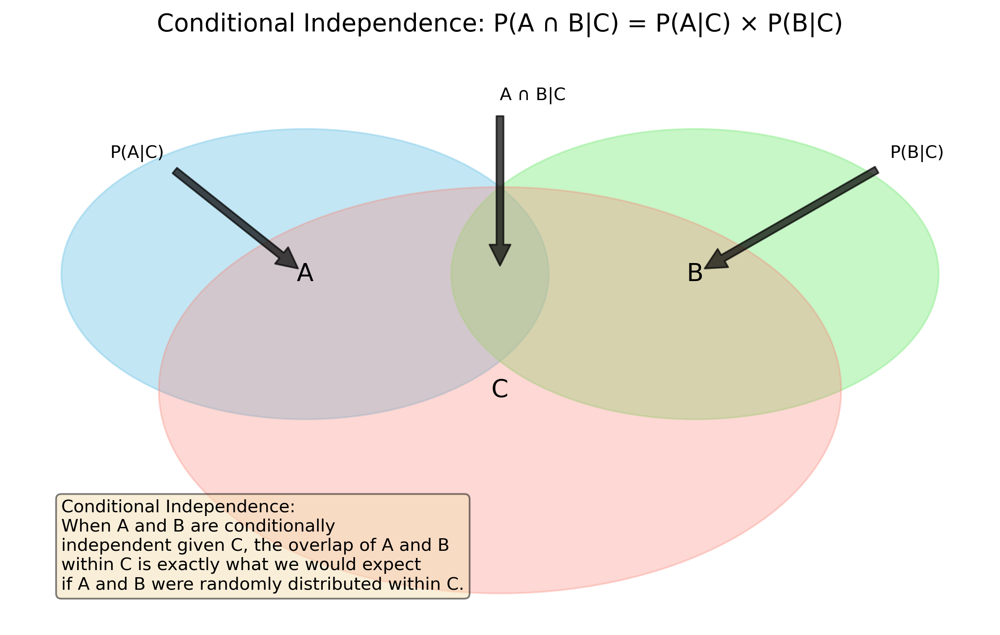
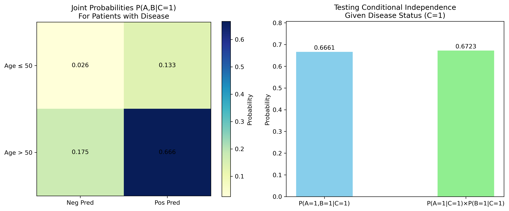
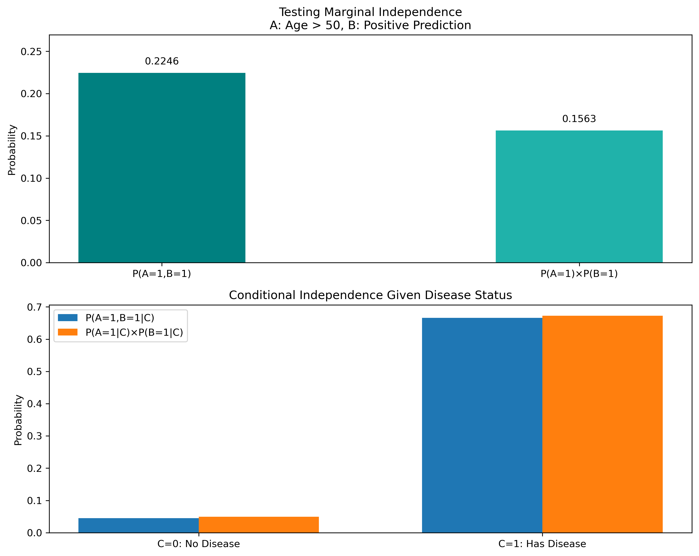
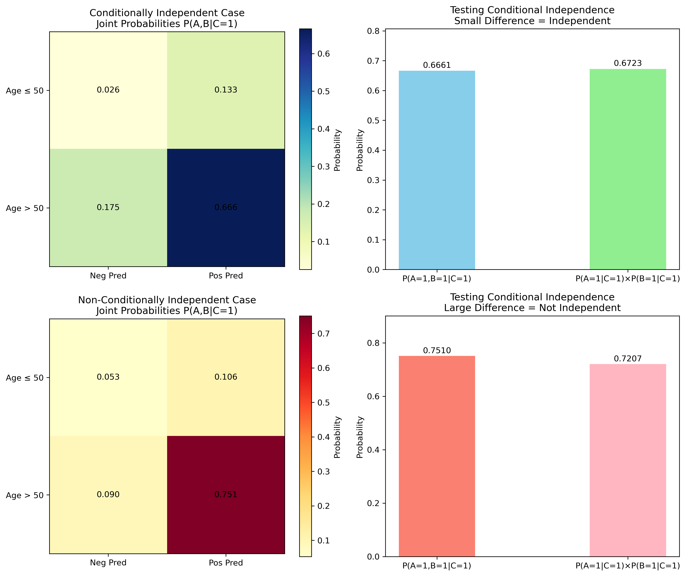
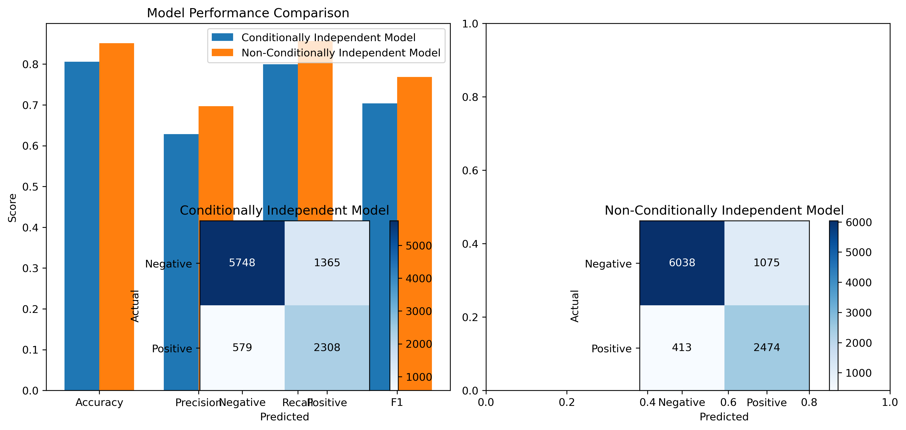

# Question 27: Conditional Independence in ML

## Problem Statement
In a machine learning context, consider three events:
- $A$: "The input feature $X$ exceeds threshold $t$"
- $B$: "The model prediction is positive"
- $C$: "The true label is positive"

## Tasks
1. Explain what it means for events $A$ and $B$ to be conditionally independent given event $C$.
2. If $A$ and $B$ are conditionally independent given $C$, write the mathematical equation expressing this relationship.
3. In a classification scenario, provide an example where conditional independence might be a reasonable assumption.
4. How does conditional independence differ from marginal independence?
5. How might violating a conditional independence assumption impact a machine learning model's performance?

## Solutions

### Task 1: Explaining Conditional Independence

Two events $A$ and $B$ are conditionally independent given event $C$ if, once we know that $C$ has occurred, knowledge about whether $A$ occurred provides no additional information about whether $B$ occurred, and vice versa.

In the machine learning context of our problem:
- If we already know the true label is positive ($C$), then knowing whether the feature exceeds the threshold ($A$) gives us no additional information about whether the model will predict positive ($B$).
- Similarly, once we know the true label, knowing the model's prediction gives us no additional information about the feature value.

As illustrated in the Venn diagram, conditional independence means that within the context of event $C$ (represented by the salmon circle), the overlap between events $A$ (blue) and $B$ (green) is exactly what we would expect if $A$ and $B$ were randomly distributed within $C$.

### Task 2: Mathematical Equation for Conditional Independence

Mathematically, events $A$ and $B$ are conditionally independent given $C$ if and only if:

$$P(A \cap B | C) = P(A | C) \times P(B | C)$$

This can be equivalently expressed as:

$$P(A | B, C) = P(A | C)$$
or
$$P(B | A, C) = P(B | C)$$

These equations formalize the idea that knowing one event provides no additional information about the other, once we condition on $C$.

### Task 3: Example of Conditional Independence in Classification

A medical diagnosis system provides a good example of conditional independence:

- $A$: "Patient's age exceeds 50 years"
- $B$: "Model predicts disease"
- $C$: "Patient actually has the disease"

Conditional independence would occur if, for patients who actually have the disease (C = 1), the model's prediction accuracy is the same regardless of the patient's age. In other words, once we know the true disease status, the patient's age and the model's prediction are unrelated.

For example, if the model correctly identifies the disease 80% of the time for all patients with the disease, regardless of whether they're over 50 or not, then $A$ and $B$ are conditionally independent given $C$.

Our simulation demonstrates this case:

In the conditionally independent case (left image), we see that:
- $P(A=1, B=1 | C=1) = 0.6661$
- $P(A=1 | C=1) \times P(B=1 | C=1) = 0.6723$
- The difference is very small (0.0063), suggesting conditional independence

### Task 4: Conditional Independence vs. Marginal Independence

**Marginal Independence** means that events $A$ and $B$ are unrelated in the entire population:
$$P(A \cap B) = P(A) \times P(B)$$

**Conditional Independence** means that events $A$ and $B$ are unrelated within subpopulations defined by event $C$:
$$P(A \cap B | C) = P(A | C) \times P(B | C)$$

Key differences:
1. **Scope**: Marginal independence considers the relationship across the entire population, while conditional independence considers it within specific subgroups defined by $C$.
2. **Relationship with $C$**: Conditional independence involves a third event $C$, while marginal independence only concerns two events.
3. **Coexistence**: Two events can be marginally independent but conditionally dependent, or vice versa.

Our simulation shows this distinction:

The top graph shows that $A$ and $B$ are not marginally independent in the entire population (difference = 0.0683), while the bottom graph shows they are conditionally independent when we consider disease status (small difference in the C=1 group).

### Task 5: Impact of Violating Conditional Independence

Violating conditional independence assumptions in a machine learning model can lead to:

1. **Suboptimal Model Performance**: If the model doesn't account for important feature interactions that exist conditionally on the target variable, it may not capture the full predictive power of the features.

2. **Biased Predictions**: The model might systematically over or under-predict certain classes for specific feature combinations.

3. **Decreased Accuracy and Reliability**: Overall metrics like accuracy, precision, recall, and F1 score may suffer.

4. **Missed Opportunities for Model Improvement**: By not capturing conditional dependencies, the model misses opportunities to improve through feature engineering or more complex model architectures.

Our simulation compares a conditionally independent scenario with a non-conditionally independent scenario:

The non-conditionally independent model (bottom) shows a larger difference between $P(A \cap B | C)$ and $P(A | C) \times P(B | C)$, indicating that feature $A$ (age) and prediction $B$ are not independent given disease status $C$.

When we compare model performance:

The model that recognizes and utilizes the conditional dependence (non-conditionally independent model) achieves:
- Higher accuracy: 0.8512 vs. 0.8056
- Better precision: 0.6971 vs. 0.6284
- Improved recall: 0.8569 vs. 0.7994
- Superior F1 score: 0.7688 vs. 0.7037

This demonstrates that acknowledging and leveraging conditional dependencies can significantly improve model performance.

## Conclusion

Conditional independence is a fundamental concept in probability theory and machine learning. It describes a situation where two events become independent when conditioned on a third event. Understanding and properly modeling conditional dependencies can lead to more accurate and reliable machine learning models.

In practical applications, such as medical diagnostics or other classification tasks, recognizing when features and predictions are conditionally dependent given the true label allows us to build more sophisticated models that capture these relationships, resulting in improved performance across key metrics. 