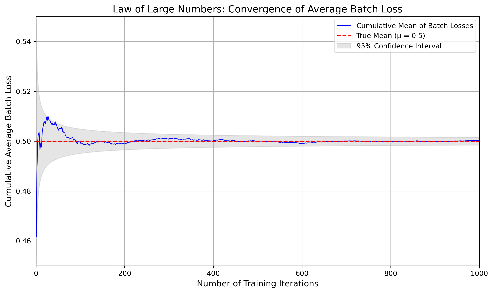
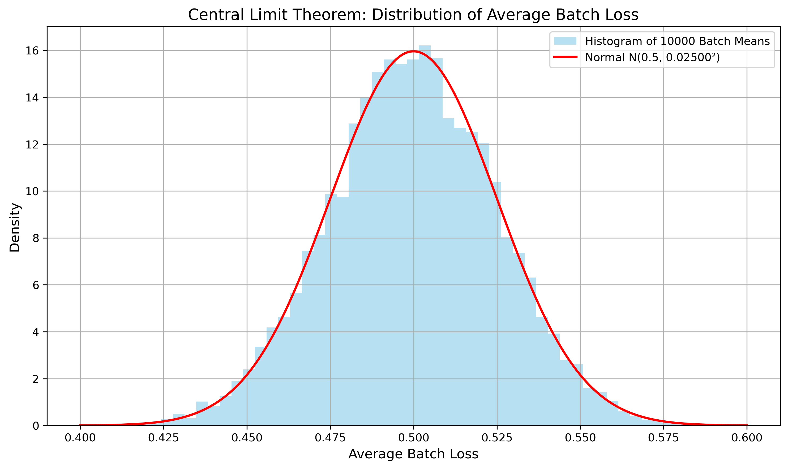
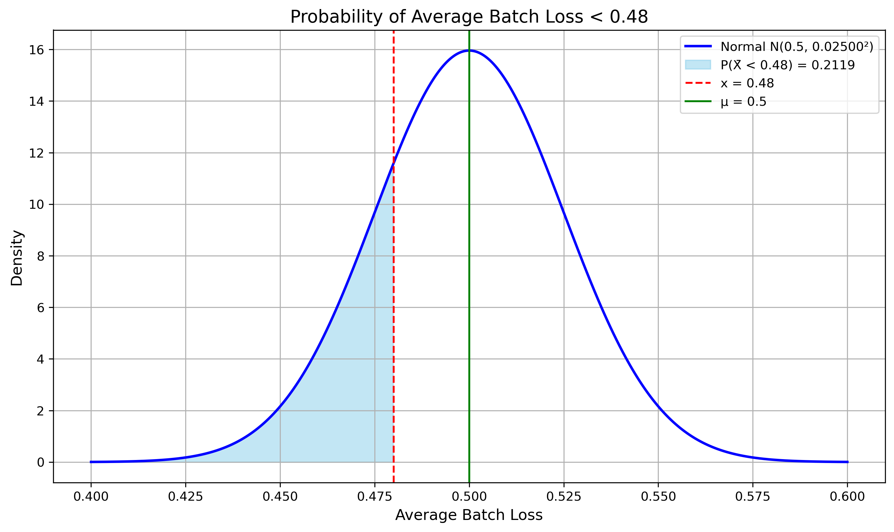
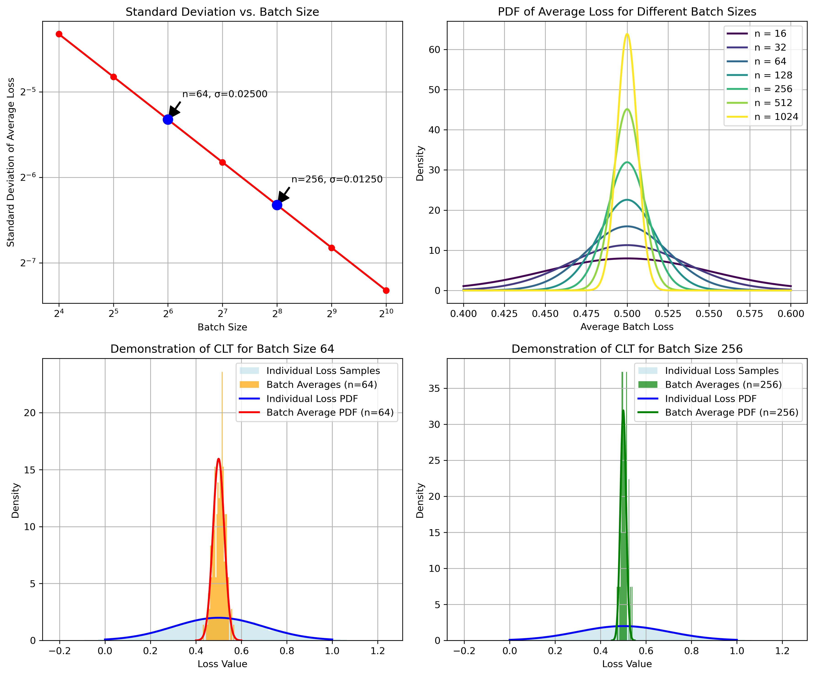
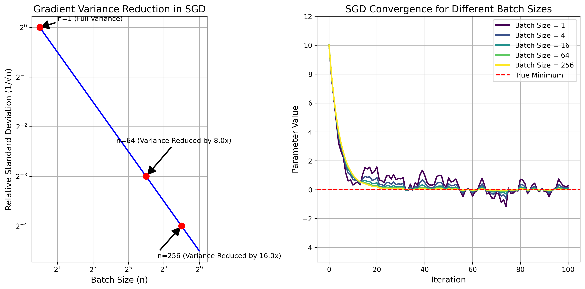

# Question 28: Limit Theorems in Neural Networks

## Problem Statement
A neural network is trained on batches of data, where each batch contains 64 samples. The loss for a single sample has a mean of 0.5 and a standard deviation of 0.2.

## Tasks
1. Using the Law of Large Numbers, what happens to the average batch loss as the number of training iterations approaches infinity?
2. Apply the Central Limit Theorem to characterize the distribution of the average loss per batch.
3. Calculate the probability that the average loss for a batch is less than 0.48.
4. If we increase the batch size to 256, how does this affect the standard deviation of the average batch loss?
5. Explain how the Central Limit Theorem relates to the concept of reducing variance in stochastic gradient descent.

## Solutions

### Task 1: Law of Large Numbers

According to the Law of Large Numbers (LLN), as the number of independent, identically distributed random variables increases, their sample mean converges to the expected value (the true population mean).

In our neural network scenario:
- Each sample loss has mean μ = 0.5 and standard deviation σ = 0.2
- As the number of training iterations approaches infinity, the average batch loss will converge to the true mean of 0.5.

This means that over a long training process, the fluctuations in the average batch loss will diminish, and the average will stabilize around the expected value of 0.5.

The graph demonstrates how the cumulative average of batch losses (blue line) converges to the true mean of 0.5 (red dashed line) as the number of training iterations increases. The gray shaded area represents the 95% confidence interval, which narrows as more iterations are completed, reflecting the increasing certainty about the true mean.

### Task 2: Central Limit Theorem Application

The Central Limit Theorem (CLT) states that when independent random variables are averaged, their normalized sum tends toward a normal distribution regardless of the original distribution of the individual variables.

For our neural network with a batch size of 64:
- Each individual loss has mean μ = 0.5 and variance σ² = 0.04
- The average batch loss will be approximately normally distributed with:
  - Mean = μ = 0.5
  - Variance = σ²/n = 0.04/64 = 0.000625
  - Standard deviation = σ/√n = 0.2/√64 = 0.025

Therefore, the distribution of the average batch loss can be characterized as approximately N(0.5, 0.025²), a normal distribution with mean 0.5 and standard deviation 0.025.

The histogram shows the distribution of average batch losses from 10,000 simulated batches. The red curve represents the theoretical normal distribution N(0.5, 0.025²). The close match between the histogram and the theoretical curve demonstrates the Central Limit Theorem in action.

Our simulation confirms this theoretical expectation:
- Empirical mean of batch means: 0.49982 (very close to the theoretical 0.5)
- Empirical standard deviation: 0.02515 (very close to the theoretical 0.025)

### Task 3: Probability Calculation

To calculate the probability that the average loss for a batch is less than 0.48, we use the properties of the normal distribution:

1. Calculate the z-score: z = (0.48 - 0.5)/0.025 = -0.8
2. Find the cumulative probability: P(X̄ < 0.48) = Φ(-0.8) = 0.2119

Therefore, the probability that the average batch loss is less than 0.48 is approximately 21.19%.

The visualization shows the probability density function of the average batch loss, with the area representing P(X̄ < 0.48) shaded in blue. The red dashed line marks x = 0.48, while the green line indicates the mean μ = 0.5.

### Task 4: Effect of Increasing Batch Size

When we increase the batch size from 64 to 256, the standard deviation of the average batch loss is affected as follows:

For batch size 64:
- Standard deviation = σ/√n = 0.2/√64 = 0.025

For batch size 256:
- Standard deviation = σ/√n = 0.2/√256 = 0.0125

The standard deviation is reduced by a factor of 2 (from 0.025 to 0.0125). This is because the standard deviation of the sample mean is inversely proportional to the square root of the sample size: σ/√n.

The visualization illustrates several important aspects of increasing batch size:
1. The top-left panel shows how standard deviation decreases with increasing batch size following a 1/√n relationship.
2. The top-right panel displays how the probability distribution becomes narrower (more concentrated around the mean) as batch size increases.
3. The bottom panels compare the distributions of individual losses with batch averages for n=64 and n=256, demonstrating the CLT and the narrowing effect of larger batch sizes.

### Task 5: Central Limit Theorem and Stochastic Gradient Descent

The Central Limit Theorem is fundamental to understanding variance reduction in Stochastic Gradient Descent (SGD):

1. **Gradient Estimation:** In SGD, we estimate the gradient of the loss function using a batch of samples instead of the entire dataset. Each sample provides a noisy estimate of the true gradient.

2. **Variance Reduction:** By averaging gradients over a batch, we reduce the variance of our gradient estimate by a factor of 1/n (or the standard deviation by 1/√n). The CLT tells us that this average gradient will be approximately normally distributed around the true gradient.

3. **Batch Size Trade-offs:** Larger batch sizes reduce the variance of gradient estimates, leading to more stable but still stochastic optimization. However, the improvement follows a square root law (1/√n), meaning we get diminishing returns as we increase the batch size.

4. **Optimization Dynamics:** The reduced variance from larger batches typically results in smoother convergence paths but may require more computation per step and can sometimes lead to poorer generalization compared to the noisier updates of smaller batches.

5. **Practical Implications:** This explains why increasing batch size from 64 to 256 (4x) only reduces standard deviation by 2x. To reduce standard deviation by 10x, we would need to increase batch size by 100x.

The left panel shows how relative gradient variance decreases with batch size following a 1/√n relationship. The right panel simulates SGD convergence paths for different batch sizes, demonstrating that larger batches (greener lines) provide more stable convergence to the minimum, while smaller batches (yellower lines) result in more erratic trajectories.

## Conclusion

The Law of Large Numbers and Central Limit Theorem are fundamental statistical principles that explain key behaviors in neural network training:

1. Over many iterations, the average batch loss converges to the true expected loss (LLN).
2. The distribution of batch averages follows a normal distribution with variance inversely proportional to batch size (CLT).
3. Increasing batch size reduces variance of estimates, but with diminishing returns following a square root relationship.
4. These principles directly explain why larger batch sizes in SGD lead to more stable optimization trajectories.

Understanding these statistical foundations helps machine learning practitioners make informed decisions about batch sizes and interpret the behavior of training metrics during the optimization process. 