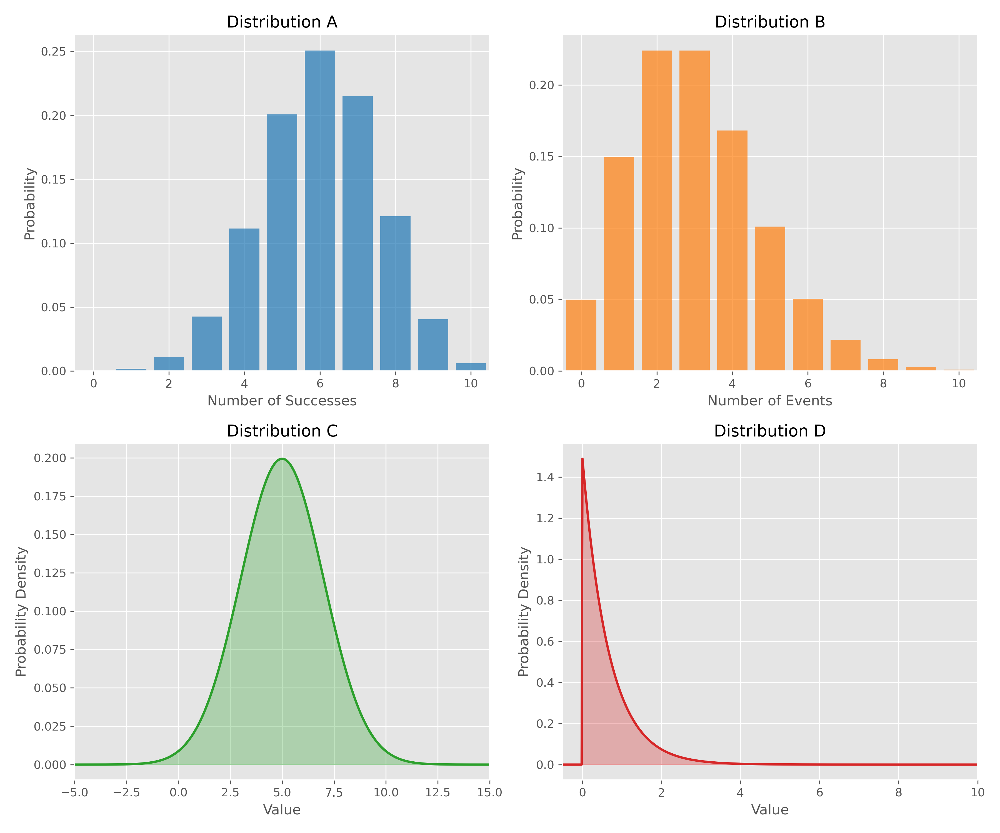
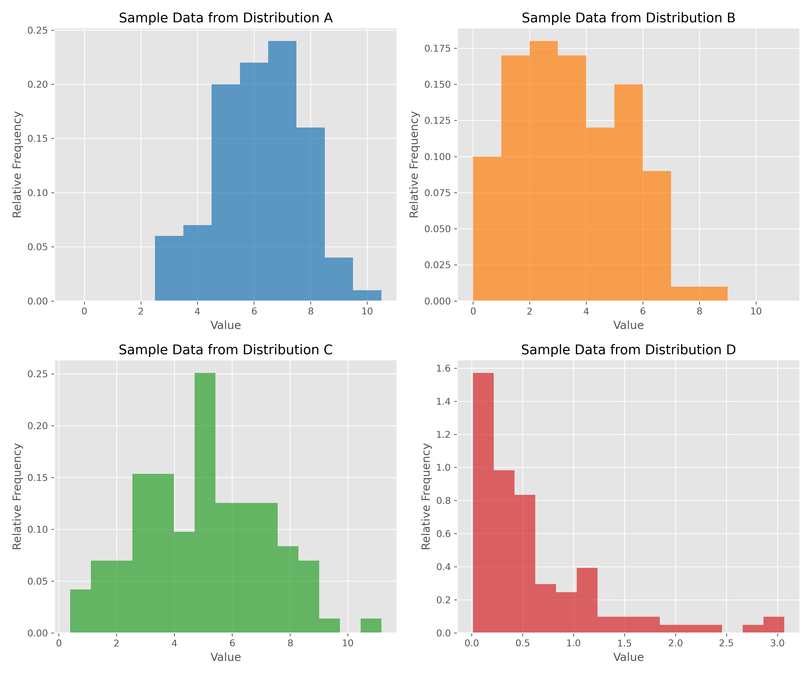
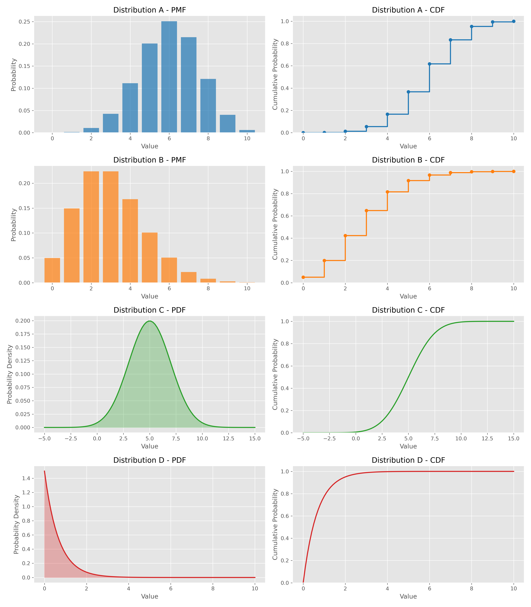

# Question 29: Probability Distribution Identification and Properties

## Problem Statement
Below are visualizations of four different probability distributions (A-D) that are commonly used in machine learning. Each distribution has distinct characteristics and properties that make it suitable for different modeling tasks.

The following figure shows samples drawn from each of these distributions:

And the figure below shows the PMF/PDF and CDF for each distribution:

### Task
1. Identify each of the distributions A, B, C, and D. Name the distribution and specify its key parameters.
2. For each distribution, write the formula for its PMF or PDF.
3. Calculate the mean and variance for each distribution using the parameters you identified.
4. Match each distribution with its most appropriate application from the following list:
   - Modeling the number of classification errors in a fixed number of predictions
   - Modeling the time between system failures
   - Modeling the arrival of rare events (e.g., fraudulent transactions)
   - Modeling measurement errors in a physical system
5. For each distribution, explain one key property that distinguishes it from the others (e.g., support, symmetry, relationship between mean and variance).

## Understanding the Problem
This problem tests our ability to recognize common probability distributions from their visual representations and understand their fundamental properties. Being able to identify distributions from their shapes, sample characteristics, and cumulative distribution functions is a crucial skill in statistical modeling and machine learning.

Probability distributions are mathematical functions that describe the likelihood of different outcomes in a random process. They serve as the foundation for statistical inference, predictive modeling, and uncertainty quantification in machine learning algorithms. The four distributions in this problem represent some of the most commonly used distributions in the field.

To solve this problem, we need to:
- Analyze the visual characteristics of each distribution
- Apply knowledge of common probability distributions and their defining properties
- Calculate statistical measures (mean and variance) using distribution parameters
- Connect theoretical properties to practical applications

## Solution

### Step 1: Distribution Identification

Based on visual analysis of the distributions and their characteristics:

- **Distribution A**: Binomial Distribution with parameters $n=10$, $p=0.6$
  - Discrete distribution with finite support
  - Bell-shaped but slightly asymmetric
  - Defined on integers from 0 to 10

- **Distribution B**: Poisson Distribution with parameter $\lambda=3$
  - Discrete distribution with infinite support (non-negative integers)
  - Right-skewed shape
  - Models count data

- **Distribution C**: Normal Distribution with parameters $\mu=5$, $\sigma=2$
  - Continuous distribution with infinite support
  - Symmetric bell-shaped curve
  - Defined on the entire real line

- **Distribution D**: Exponential Distribution with rate parameter $\lambda=1.5$
  - Continuous distribution with semi-infinite support
  - Sharply decreasing from origin
  - Models waiting times

### Step 2: Mathematical Formulation of PMF/PDF

#### Binomial Distribution (A)
The probability mass function (PMF) of a binomial random variable $X \sim \text{Binomial}(n,p)$ is:

$$P(X=k) = \binom{n}{k} p^k (1-p)^{n-k}, \quad k \in \{0,1,2,\ldots,n\}$$

Where:
- $\binom{n}{k} = \frac{n!}{k!(n-k)!}$ is the binomial coefficient
- $n = 10$ is the number of trials
- $p = 0.6$ is the probability of success in each trial

#### Poisson Distribution (B)
The probability mass function (PMF) of a Poisson random variable $X \sim \text{Poisson}(\lambda)$ is:

$$P(X=k) = \frac{e^{-\lambda} \lambda^k}{k!}, \quad k \in \{0,1,2,\ldots\}$$

Where:
- $\lambda = 3$ is the rate parameter (average number of events)
- $e \approx 2.71828$ is the base of the natural logarithm

#### Normal Distribution (C)
The probability density function (PDF) of a normal random variable $X \sim \mathcal{N}(\mu,\sigma^2)$ is:

$$f(x) = \frac{1}{\sigma\sqrt{2\pi}} e^{-\frac{(x-\mu)^2}{2\sigma^2}}, \quad x \in \mathbb{R}$$

Where:
- $\mu = 5$ is the mean parameter
- $\sigma = 2$ is the standard deviation parameter
- $\pi \approx 3.14159$ is the mathematical constant pi

#### Exponential Distribution (D)
The probability density function (PDF) of an exponential random variable $X \sim \text{Exp}(\lambda)$ is:

$$f(x) = \lambda e^{-\lambda x}, \quad x \geq 0$$

Where:
- $\lambda = 1.5$ is the rate parameter
- $e \approx 2.71828$ is the base of the natural logarithm

### Step 3: Calculating Mean and Variance

#### Binomial Distribution (A)
For $X \sim \text{Binomial}(n=10, p=0.6)$:
- Mean: $\mathbb{E}[X] = np = 10 \times 0.6 = 6$
- Variance: $\text{Var}(X) = np(1-p) = 10 \times 0.6 \times 0.4 = 2.4$

#### Poisson Distribution (B)
For $X \sim \text{Poisson}(\lambda=3)$:
- Mean: $\mathbb{E}[X] = \lambda = 3$
- Variance: $\text{Var}(X) = \lambda = 3$

#### Normal Distribution (C)
For $X \sim \mathcal{N}(\mu=5, \sigma^2=4)$:
- Mean: $\mathbb{E}[X] = \mu = 5$
- Variance: $\text{Var}(X) = \sigma^2 = 2^2 = 4$

#### Exponential Distribution (D)
For $X \sim \text{Exp}(\lambda=1.5)$:
- Mean: $\mathbb{E}[X] = \frac{1}{\lambda} = \frac{1}{1.5} \approx 0.67$
- Variance: $\text{Var}(X) = \frac{1}{\lambda^2} = \frac{1}{1.5^2} \approx 0.44$

### Step 4: Application Matching

| Distribution | Most Appropriate Application | Justification |
|-------------|------------------------------|---------------|
| A: Binomial | Modeling the number of classification errors in a fixed number of predictions | Binomial distribution models the number of "successes" (or errors) in a fixed number of independent trials when each trial has the same probability of success. This matches precisely with counting errors in a fixed set of predictions. |
| B: Poisson | Modeling the arrival of rare events (e.g., fraudulent transactions) | Poisson distribution models the number of events occurring in a fixed interval when these events happen at a constant average rate and independently of each other - perfect for rare events like fraud. |
| C: Normal | Modeling measurement errors in a physical system | Normal distribution arises naturally when modeling random errors in measurements due to the Central Limit Theorem. Physical measurements typically involve many small random effects that sum to create normally distributed errors. |
| D: Exponential | Modeling the time between system failures | Exponential distribution is commonly used to model waiting times between events in a Poisson process. Its memoryless property makes it ideal for modeling time between random failures. |

### Step 5: Key Distinguishing Properties

#### Binomial Distribution (A)
- **Key Property**: *Bounded discrete support*
- Support: $\{0, 1, 2, ..., n\}$ where $n$ is finite
- Models the number of successes in a fixed number of independent trials
- As $n$ increases and $p$ decreases (keeping $np$ constant), approaches the Poisson distribution
- Symmetric when $p=0.5$, right-skewed when $p<0.5$, and left-skewed when $p>0.5$

#### Poisson Distribution (B)
- **Key Property**: *Mean equals variance*
- The equality $\mathbb{E}[X] = \text{Var}(X) = \lambda$ is a unique characteristic
- Support: $\{0, 1, 2, ...\}$ (unbounded discrete)
- Approaches normal distribution as $\lambda$ increases
- Used for modeling rare events in a fixed time or space interval

#### Normal Distribution (C)
- **Key Property**: *Central Limit Theorem convergence*
- Symmetric around the mean with the classic bell-shaped curve
- Support: $(-\infty, \infty)$ (unbounded continuous)
- Completely characterized by its mean and variance
- Sum of independent normal random variables is also normally distributed

#### Exponential Distribution (D)
- **Key Property**: *Memoryless property*
- $P(X > s+t | X > s) = P(X > t)$ for all $s, t > 0$
- Support: $[0, \infty)$ (semi-bounded continuous)
- Maximum entropy distribution for positive random variables with a specified mean
- Coefficient of variation (ratio of standard deviation to mean) is always 1

## Visual Explanations

### Distribution Characteristics

This visualization compares the four distributions side-by-side, highlighting their distinct shapes. Notice how the Binomial (A) and Normal (C) distributions have bell-shaped curves, while the Poisson (B) shows a discrete right-skewed pattern, and the Exponential (D) has its maximum at the origin and decreases continuously.

### Key Properties

This figure illustrates the distinguishing properties of each distribution. Particularly important are:
- The discreteness of distributions A and B vs. the continuity of C and D
- The symmetry of distribution C vs. the asymmetry of the others
- The bounded support of A vs. the unbounded support of the others
- The exponential decay of distribution D

## Key Insights

### Theoretical Foundations
- The selection of an appropriate probability distribution is fundamental to statistical modeling
- Each distribution arises from different underlying random processes
- The parameters of these distributions have specific interpretations related to the phenomena they model
- The mean and variance provide basic but crucial information about the center and spread of a distribution

### Practical Applications
- Binomial is ideal for modeling binary outcomes in fixed-size samples
- Poisson excels at modeling rare events over fixed intervals
- Normal distribution is central to statistical inference due to the Central Limit Theorem
- Exponential distribution models waiting times between independent events

### Interrelationships Between Distributions
- Poisson can be derived as a limit of Binomial as $n \to \infty$, $p \to 0$ with $np = \lambda$ constant
- Normal approximation can be used for Binomial when $n$ is large and $p$ is not extreme
- Exponential distribution describes the waiting time between events in a Poisson process
- Sum of exponential random variables follows a gamma distribution

## Conclusion

Understanding these four fundamental probability distributions provides essential tools for modeling various phenomena in machine learning:

- **Binomial Distribution**: Critical for understanding and predicting binary outcomes in fixed-size samples
- **Poisson Distribution**: Fundamental for modeling count data and rare events
- **Normal Distribution**: Central to statistical inference and approximating many natural processes
- **Exponential Distribution**: Key for modeling time-based processes and failure analysis

These distributions form the foundation of probabilistic modeling in machine learning, enabling us to quantify uncertainty, make statistical inferences, and build predictive models across a wide range of applications. 