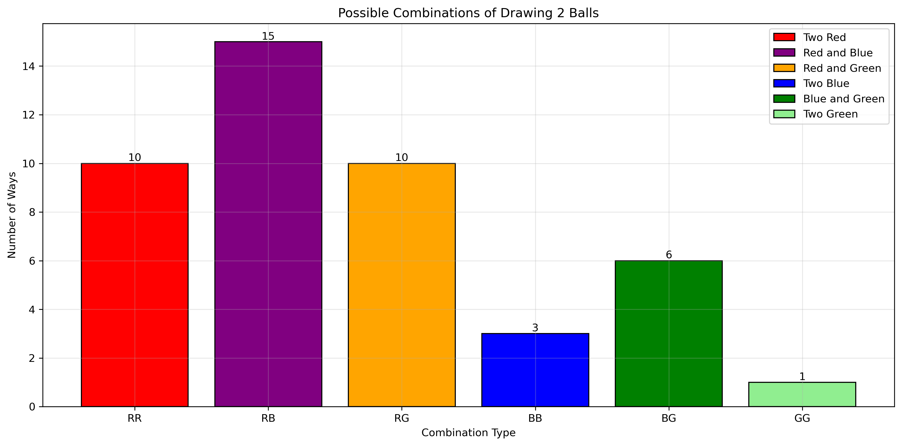
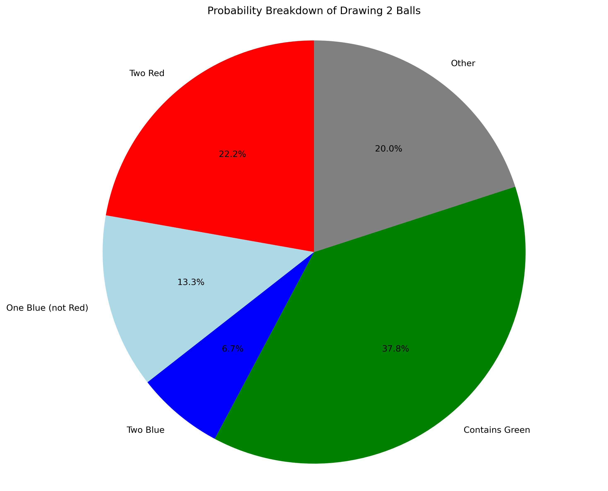
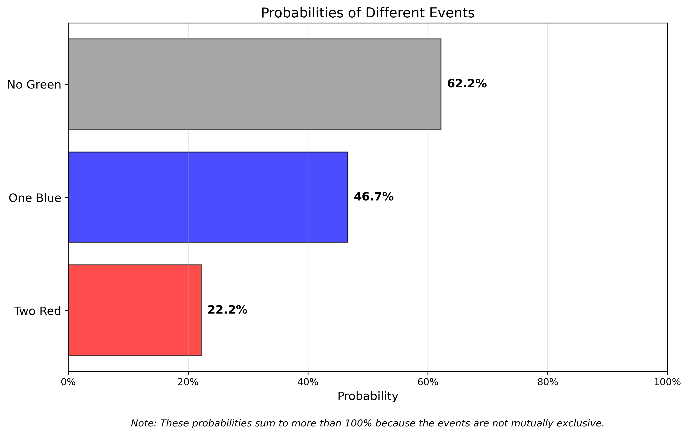

# Question 2: Ball Drawing Probabilities

## Problem Statement
Suppose we have a bag containing 5 red balls, 3 blue balls, and 2 green balls. We randomly draw 2 balls from the bag without replacement.

### Task
Calculate the probability of:
1. Drawing 2 red balls
2. Drawing exactly 1 blue ball
3. Drawing no green balls
4. Drawing at least one ball of each color

## Understanding the Problem
We have a bag with:
- 5 Red balls (R)
- 3 Blue balls (B)
- 2 Green balls (G)

Total number of balls = 5 + 3 + 2 = 10

When drawing 2 balls without replacement, the total number of possible combinations is:
$$ \binom{10}{2} = 45 $$

This is our sample space. We need to find the probability of specific events within this sample space by calculating the ratio of favorable outcomes to total possible outcomes.

## Solution

In this problem, we will use the counting principle and the definition of probability to calculate the requested probabilities.

### Step 1: Determine the sample space
The total number of ways to draw 2 balls from 10 balls without replacement is:
$$ \binom{10}{2} = \frac{10!}{2!(10-2)!} = \frac{10 \times 9}{2 \times 1} = 45 $$

This represents our sample space.

### Step 2: Calculate the probability of drawing 2 red balls
Number of ways to choose 2 red balls from 5 red balls:
$$ \binom{5}{2} = \frac{5!}{2!(5-2)!} = \frac{5 \times 4}{2 \times 1} = 10 $$

Probability of drawing 2 red balls:
$$ P(\text{2 red}) = \frac{10}{45} = \frac{2}{9} \approx 0.2222 $$

### Step 3: Calculate the probability of drawing exactly 1 blue ball
This can happen in two ways:
- One blue and one red: $\binom{3}{1} \times \binom{5}{1} = 3 \times 5 = 15$ ways
- One blue and one green: $\binom{3}{1} \times \binom{2}{1} = 3 \times 2 = 6$ ways

Total ways to draw exactly 1 blue ball: 15 + 6 = 21

Probability of drawing exactly 1 blue ball:
$$ P(\text{1 blue}) = \frac{21}{45} = \frac{7}{15} \approx 0.4667 $$

### Step 4: Calculate the probability of drawing no green balls
Drawing no green balls means drawing from red and blue balls only (8 balls in total).

Number of ways to choose 2 balls from 8 balls:
$$ \binom{8}{2} = \frac{8!}{2!(8-2)!} = \frac{8 \times 7}{2 \times 1} = 28 $$

Probability of drawing no green balls:
$$ P(\text{no green}) = \frac{28}{45} \approx 0.6222 $$

### Step 5: Calculate the probability of drawing at least one ball of each color
Since we are drawing only 2 balls but have 3 colors, it's impossible to get at least one ball of each color.

Therefore:
$$ P(\text{all colors}) = 0 $$

## Visual Explanations

### Possible Ball Combinations

This bar chart shows all possible combinations when drawing 2 balls:
- RR: Two red balls
- RB: One red and one blue
- RG: One red and one green
- BB: Two blue balls
- BG: One blue and one green
- GG: Two green balls

The height of each bar represents the number of ways each combination can occur, showing the relative frequency of each possible outcome in our sample space.

### Probability Distribution

This pie chart visualizes the breakdown of mutually exclusive outcomes in the sample space, showing relative proportions.

### Key Probabilities

This bar chart directly compares the probabilities of the three main events calculated in this problem:
- Two Red: 22.2%
- One Blue: 46.7%
- No Green: 62.2%

Note that these probabilities sum to more than 100% because these events are not mutually exclusive - for example, drawing one blue ball can overlap with drawing no green balls when we draw one blue and one red.

## Key Insights

### Probability Principles
- Probability is calculated as the ratio of favorable outcomes to the total number of possible outcomes.
- When drawing without replacement, the probabilities change after each draw, affecting how we calculate the combinations.
- The combination formula $\binom{n}{r}$ is used to count the number of ways to select r items from n distinct items.

### Problem-Specific Insights
- Impossible Events: Some events might be impossible given the constraints (drawing at least one of each color when only drawing 2 balls).
- Complementary Events: We could have also calculated the probability of drawing no green balls as 1 minus the probability of drawing at least one green ball.
- Combinatorial Counting: Understanding how to count combinations is crucial for solving probability problems involving multiple objects.

## Conclusion

The calculated probabilities are:
- P(Two Red) = 2/9 ≈ 0.2222
- P(One Blue) = 7/15 ≈ 0.4667
- P(No Green) = 28/45 ≈ 0.6222
- P(All Colors) = 0

These results demonstrate:
- Drawing no green balls is the most likely outcome
- Drawing exactly one blue ball is the next most likely
- Drawing two red balls is less likely
- Drawing at least one of each color is impossible with only two draws

This problem illustrates the application of combinatorial principles to calculate probabilities in a finite sample space with discrete outcomes. 