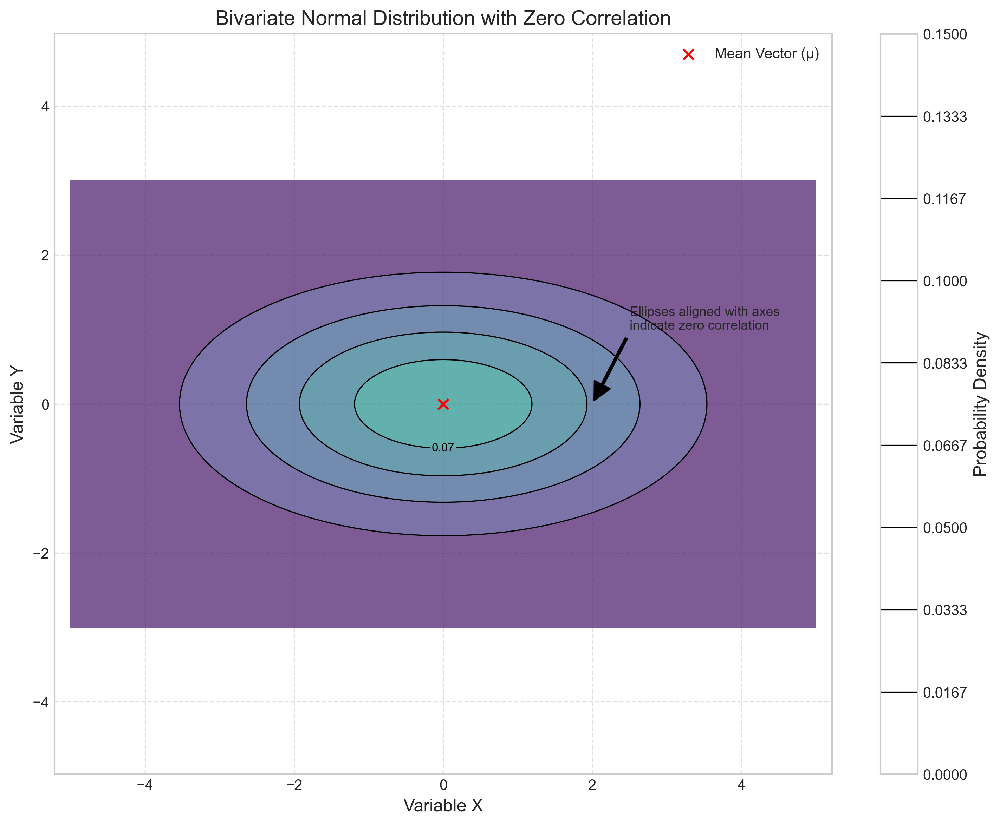

# Question 30: Contour Plot Interpretation

## Problem Statement
This problem asks you to interpret a contour plot of a bivariate normal distribution, focusing on understanding key statistical properties from visual cues.

### Task
1. Based on the orientation of the contour ellipses, determine whether the correlation between the two variables is positive, negative, or zero.
2. If the innermost contour is labeled as 0.15 and represents the highest density region, what does this tell you about the location of the mean vector of this distribution?
3. If the contours are more stretched along the x-axis than the y-axis, what can you conclude about the variances of the two variables?
4. Draw a rough sketch of how the contour plot would change if the correlation between the variables became zero.

## Understanding the Problem
Contour plots provide a powerful 2D visualization of multivariate distributions, particularly bivariate normal distributions. In these plots, each contour line represents points of equal probability density. By examining features of these contours (orientation, spacing, shape), we can infer important statistical properties of the underlying distribution.

For a bivariate normal distribution, the probability density function is given by:

$$f(x, y) = \frac{1}{2\pi\sigma_x\sigma_y\sqrt{1-\rho^2}} \exp\left(-\frac{1}{2(1-\rho^2)}\left[\frac{(x-\mu_x)^2}{\sigma_x^2} + \frac{(y-\mu_y)^2}{\sigma_y^2} - \frac{2\rho(x-\mu_x)(y-\mu_y)}{\sigma_x\sigma_y}\right]\right)$$

Where:
- $\mu_x, \mu_y$ are the means
- $\sigma_x, \sigma_y$ are the standard deviations
- $\rho$ is the correlation coefficient

The contours of this function form ellipses, and their properties directly reveal the statistical relationships in the data.

## Solution

### Task 1: Correlation Between Variables
**Based on the orientation of the contour ellipses, determine whether the correlation between the two variables is positive, negative, or zero.**

**Answer: Positive correlation**

**Explanation:**
The contour ellipses in the plot are tilted upward (from left to right). This indicates a positive correlation between the variables. When the ellipses are oriented in this direction, it means that as one variable increases, the other tends to increase as well.

The correlation coefficient $\rho$ determines the orientation of the ellipses:
- When $\rho > 0$ (positive correlation): Ellipses tilt upward from left to right
- When $\rho < 0$ (negative correlation): Ellipses tilt downward from left to right
- When $\rho = 0$ (no correlation): Ellipses align with the coordinate axes

This can be visualized clearly in the comparison below:

### Task 2: Location of the Mean Vector
**If the innermost contour is labeled as 0.15 and represents the highest density region, what does this tell you about the location of the mean vector of this distribution?**

**Answer: The mean vector is at the center of the innermost contour.**

**Explanation:**
For any bivariate normal distribution, the probability density function reaches its maximum value at the mean vector $\mu = [\mu_x, \mu_y]$. This is because:

$$f(x,y) \leq f(\mu_x, \mu_y) \text{ for all } x, y$$

Therefore, the innermost contour (with value 0.15) encloses the region of highest density, with the very center of this contour being precisely at the mean vector. In the plot, this is visibly marked at the point $(0,0)$.

As we move away from the mean, the density decreases exponentially according to the squared Mahalanobis distance:

$$d^2 = (x-\mu)^T \Sigma^{-1} (x-\mu)$$

Where $\Sigma$ is the covariance matrix. This creates concentric elliptical contours of equal density.

The visualizations below show how the contours move when the mean vector changes:

### Task 3: Variances of Variables
**If the contours are more stretched along the x-axis than the y-axis, what can you conclude about the variances of the two variables?**

**Answer: The variance of the x-variable is greater than the variance of the y-variable.**

**Explanation:**
The shape of the contour ellipses directly reflects the variances of the variables. The elongation of the ellipses indicates the relative variances:

- More stretching along the x-axis indicates higher variance in the x-direction ($\sigma_x^2 > \sigma_y^2$)
- More stretching along the y-axis would indicate higher variance in the y-direction ($\sigma_y^2 > \sigma_x^2$)
- Equal stretching in both directions would indicate equal variances ($\sigma_x^2 = \sigma_y^2$)

In the given contour plot, the ellipses are clearly more stretched horizontally than vertically, indicating that $\sigma_x^2 > \sigma_y^2$.

The following visualization compares different variance combinations:

### Task 4: Zero Correlation Sketch
**Draw a rough sketch of how the contour plot would change if the correlation between the variables became zero.**

**Answer: If the correlation were zero, the contour ellipses would align with the coordinate axes.**

**Explanation:**
When $\rho = 0$, the covariance term in the bivariate normal distribution becomes zero, simplifying the exponent to:

$$-\frac{1}{2}\left[\frac{(x-\mu_x)^2}{\sigma_x^2} + \frac{(y-\mu_y)^2}{\sigma_y^2}\right]$$

This results in contour ellipses with their major and minor axes perfectly aligned with the coordinate axes. There would be no tilting of the ellipses.

The distribution would still maintain the same variances, so the ellipses would remain stretched along the x-axis (assuming $\sigma_x^2 > \sigma_y^2$ as in the original plot).

A sketch would look similar to this:

## Visual Explanations

### Relationship Between 3D Surface and Contour Plot
A contour plot is essentially a top-down view of the 3D probability density function surface, with contour lines connecting points of equal height (density):

### How Correlation Affects Contour Shape
The correlation coefficient has a profound effect on the orientation of the contour ellipses. As $\rho$ varies from -1 to 1, the ellipses rotate accordingly:

### Covariance Matrix and Contour Shapes
The covariance matrix directly determines the shape, size, and orientation of the contour ellipses:

### Annotated Contour Plot
The following annotated plot highlights the key features of a bivariate normal contour plot:

## Key Insights

### Geometric Interpretation
- The contour ellipses are level sets of the probability density function
- The principal axes of the ellipses correspond to the eigenvectors of the covariance matrix
- The lengths of the semi-major and semi-minor axes are proportional to the square roots of the eigenvalues
- The orientation angle $\theta$ of the ellipses is related to the correlation coefficient by $\tan(2\theta) = \frac{2\rho\sigma_x\sigma_y}{\sigma_x^2-\sigma_y^2}$

### Statistical Properties
- The mean vector $\mu$ determines the center of the ellipses
- The variances $\sigma_x^2$ and $\sigma_y^2$ determine the spread along the respective axes
- The correlation coefficient $\rho$ determines the orientation of the ellipses
- When $\rho = 0$, the variables are independent, and the principal axes align with the coordinate axes

### Practical Applications
- Identifying correlation patterns between variables
- Visualizing confidence regions for parameter estimation
- Understanding the geometry of multivariate distributions
- Detecting outliers and anomalies in multivariate data

## Conclusion
The contour plot in this problem reveals several key properties of the underlying bivariate normal distribution:

- The variables exhibit a positive correlation, as indicated by the upward tilt of the ellipses
- The mean vector is located at the center of the innermost contour (0,0)
- The x-variable has greater variance than the y-variable, as shown by the horizontal stretching
- If the correlation became zero, the ellipses would align with the coordinate axes

Understanding how to interpret contour plots is essential for multivariate data analysis, as they provide intuitive visualizations of complex statistical relationships that might be difficult to grasp from equations alone. 