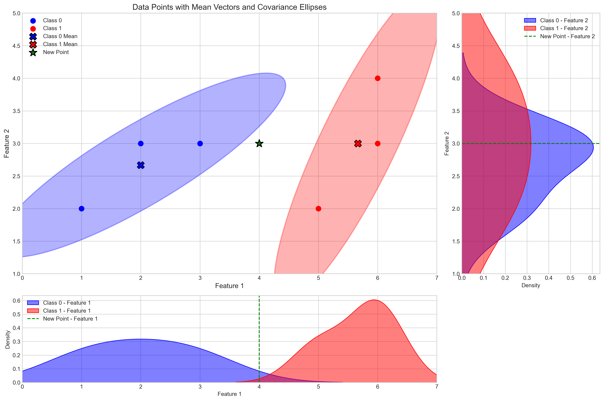
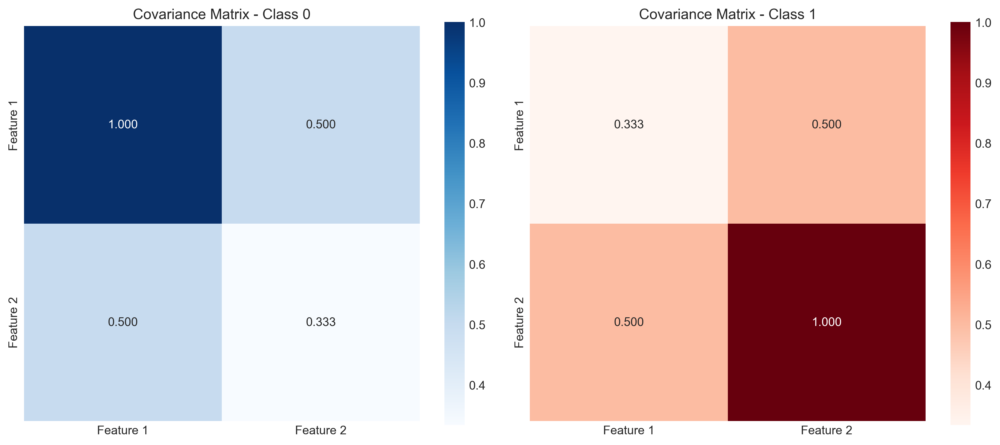
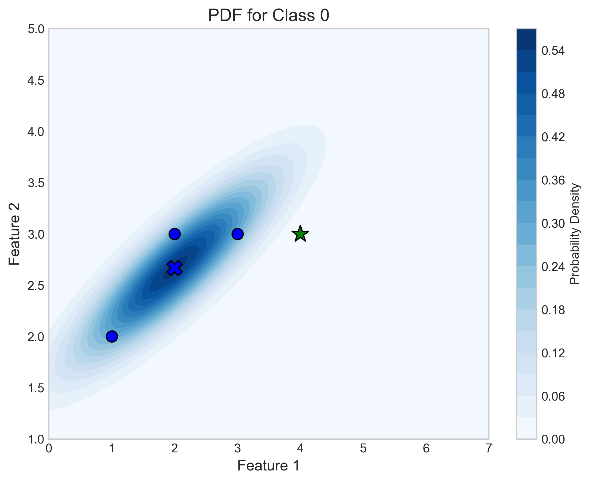
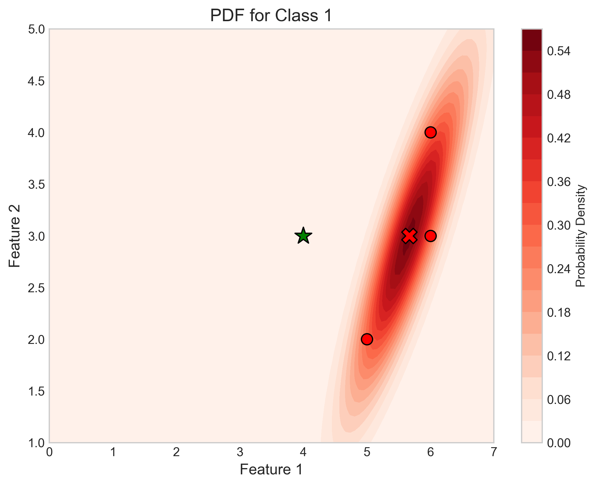
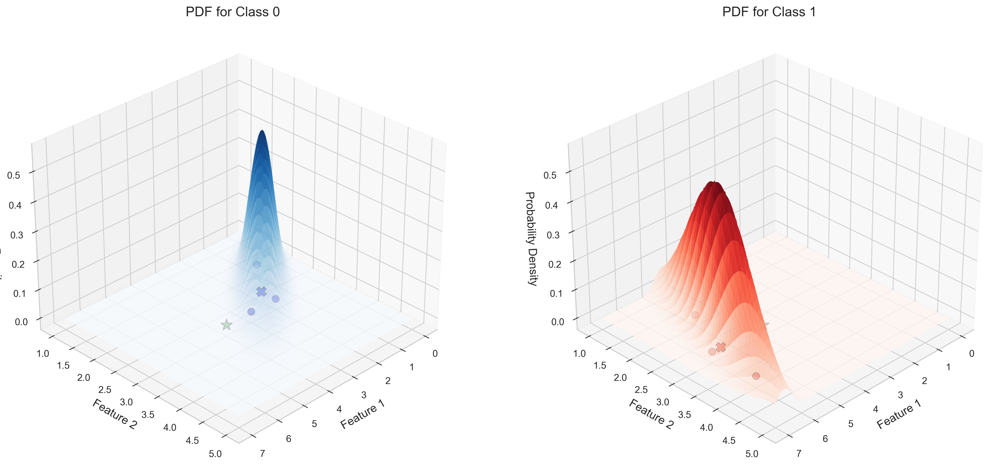
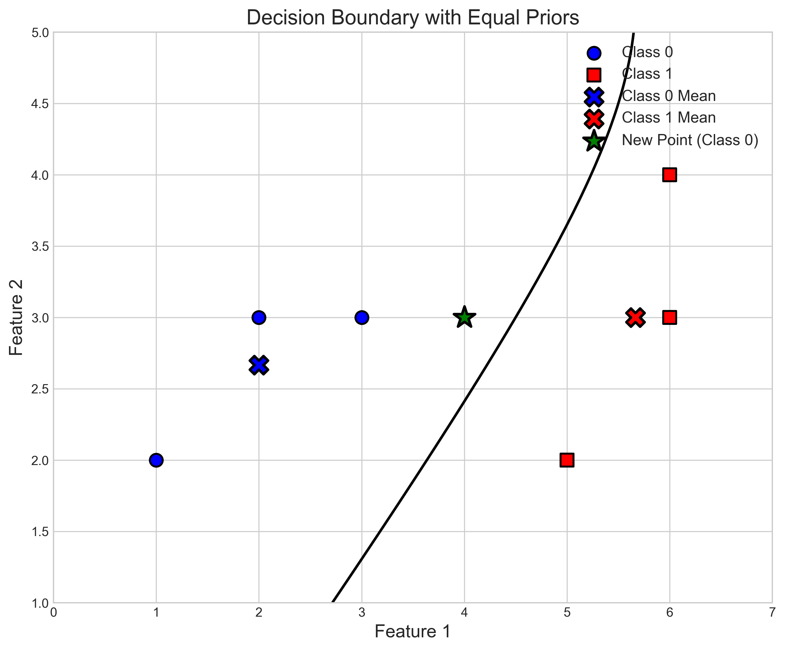
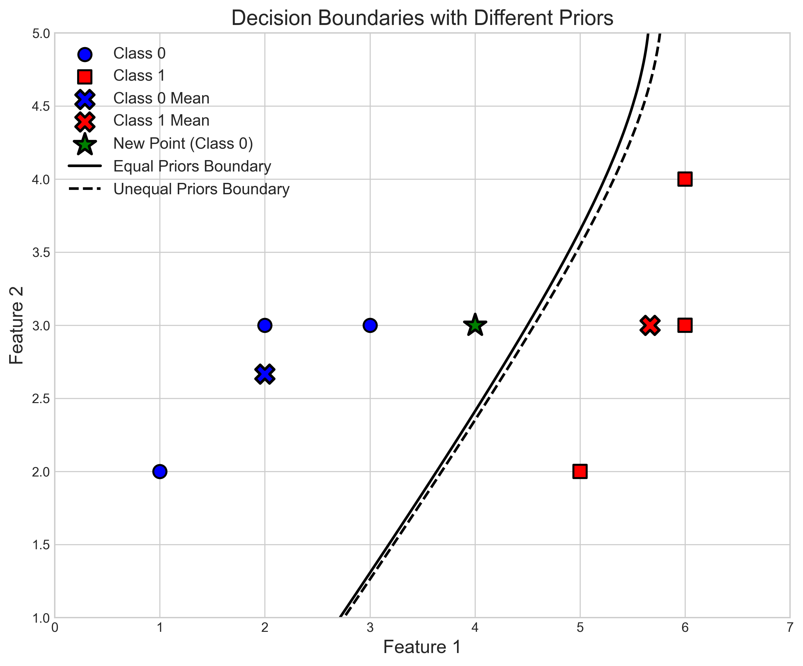
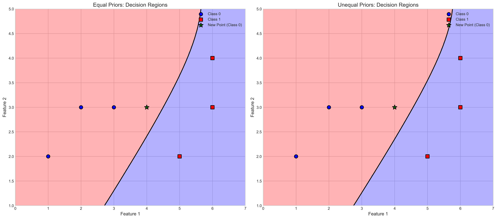

# Question 31: Multivariate Gaussian Classification

## Problem Statement
You are given data from two classes with the following 2-dimensional feature vectors:

**Class 0:** $x_1=[1,2]$, $x_2=[2,3]$, $x_3=[3,3]$  
**Class 1:** $x_1=[5,2]$, $x_2=[6,3]$, $x_3=[6,4]$

Assume that the feature vectors in each class follow a multivariate Gaussian distribution.

### Task
1. Calculate the mean vector and covariance matrix for each class
2. Using the multivariate Gaussian probability density function, derive expressions for $P(\mathbf{x}|\text{class 0})$ and $P(\mathbf{x}|\text{class 1})$
3. Assuming equal prior probabilities for both classes $P(\text{class 0}) = P(\text{class 1}) = 0.5$, apply Bayes' theorem to classify the new data point $\mathbf{x}_{new} = [4,3]$
4. How would your classification change if the prior probabilities were $P(\text{class 0}) = 0.8$ and $P(\text{class 1}) = 0.2$?

## Understanding the Problem

In this problem, we are dealing with a two-class classification task using Bayesian methods and multivariate Gaussian distributions. We have two-dimensional feature vectors for two classes, and we need to model each class using a multivariate Gaussian distribution. Then, we'll use these distributions along with Bayes' theorem to classify a new data point.

The multivariate Gaussian (or normal) distribution is a generalization of the one-dimensional normal distribution to higher dimensions. It is characterized by a mean vector and a covariance matrix, which describes not only the variances of individual dimensions but also the correlations between them.

## Solution

### Step 1: Calculate the Mean Vector and Covariance Matrix for Each Class

The mean vector for a class is calculated by taking the average of all feature vectors in that class:

$$\boldsymbol{\mu} = \frac{1}{n} \sum_{i=1}^{n} \mathbf{x}_i$$

For **Class 0**, we have:
```
Mean vector = (1/3)([1,2] + [2,3] + [3,3])
            = (1/3)([6,8])
            = [2, 2.667]
```

For **Class 1**, we have:
```
Mean vector = (1/3)([5,2] + [6,3] + [6,4])
            = (1/3)([17,9])
            = [5.667, 3]
```

The covariance matrix is calculated as:

$$\boldsymbol{\Sigma} = \frac{1}{n} \sum_{i=1}^{n} (\mathbf{x}_i - \boldsymbol{\mu})(\mathbf{x}_i - \boldsymbol{\mu})^T$$

For **Class 0**, we first compute the differences from the mean:
```
Point 1 - mean = [1,2] - [2,2.667] = [-1, -0.667]
Point 2 - mean = [2,3] - [2,2.667] = [0, 0.333]
Point 3 - mean = [3,3] - [2,2.667] = [1, 0.333]
```

Then we compute the outer products and average them:
```
Outer product for point 1:
[-1, -0.667] × [-1, -0.667]ᵀ = [[1, 0.667], [0.667, 0.444]]

Outer product for point 2:
[0, 0.333] × [0, 0.333]ᵀ = [[0, 0], [0, 0.111]]

Outer product for point 3:
[1, 0.333] × [1, 0.333]ᵀ = [[1, 0.333], [0.333, 0.111]]

Average of outer products:
Σ₀ = (1/3)(Outer product 1 + Outer product 2 + Outer product 3)
   = [[1, 0.5], [0.5, 0.333]]
```

Similarly, for **Class 1**, the covariance matrix is:
```
Σ₁ = [[0.333, 0.5], [0.5, 1]]
```



The covariance matrices can be visualized as heatmaps:



### Step 2: Derive Expressions for the Probability Density Functions

The multivariate Gaussian probability density function (PDF) is given by:

$$p(\mathbf{x}|\boldsymbol{\mu}, \boldsymbol{\Sigma}) = \frac{1}{(2\pi)^{d/2}|\boldsymbol{\Sigma}|^{1/2}} \exp\left(-\frac{1}{2}(\mathbf{x} - \boldsymbol{\mu})^T \boldsymbol{\Sigma}^{-1} (\mathbf{x} - \boldsymbol{\mu})\right)$$

where:
- $d$ is the dimension of the feature space (in our case, $d=2$)
- $|\boldsymbol{\Sigma}|$ is the determinant of the covariance matrix
- $\boldsymbol{\Sigma}^{-1}$ is the inverse of the covariance matrix

For both classes, we need to compute:

1. The determinant of the covariance matrix:
   - $|\boldsymbol{\Sigma}_0| = 0.083333$
   - $|\boldsymbol{\Sigma}_1| = 0.083333$

2. The inverse of the covariance matrix:
   - $\boldsymbol{\Sigma}_0^{-1} = \begin{bmatrix} 4 & -6 \\ -6 & 12 \end{bmatrix}$
   - $\boldsymbol{\Sigma}_1^{-1} = \begin{bmatrix} 12 & -6 \\ -6 & 4 \end{bmatrix}$

3. The normalization constant:
   - $\frac{1}{(2\pi)^{1}|\boldsymbol{\Sigma}|^{1/2}} = 0.551329$ (same for both classes)

Therefore, the PDF expressions are:

For **Class 0**:
$$p(\mathbf{x}|\text{class 0}) = 0.551329 \cdot \exp\left(-\frac{1}{2}(\mathbf{x} - [2, 2.667])^T \begin{bmatrix} 4 & -6 \\ -6 & 12 \end{bmatrix} (\mathbf{x} - [2, 2.667])\right)$$

For **Class 1**:
$$p(\mathbf{x}|\text{class 1}) = 0.551329 \cdot \exp\left(-\frac{1}{2}(\mathbf{x} - [5.667, 3])^T \begin{bmatrix} 12 & -6 \\ -6 & 4 \end{bmatrix} (\mathbf{x} - [5.667, 3])\right)$$

For the new point $\mathbf{x}_{new} = [4, 3]$, we calculate:

For **Class 0**:
```
x - μ₀ = [4, 3] - [2, 2.667] = [2, 0.333]
Quadratic form (x - μ₀)ᵀ Σ₀⁻¹ (x - μ₀) = 9.333
PDF value = 0.551329 × exp(-0.5 × 9.333) = 0.00518446
```

For **Class 1**:
```
x - μ₁ = [4, 3] - [5.667, 3] = [-1.667, 0]
Quadratic form (x - μ₁)ᵀ Σ₁⁻¹ (x - μ₁) = 33.333
PDF value = 0.551329 × exp(-0.5 × 33.333) = 0.00000003
```

The PDF values show that the new point is much more likely under the Class 0 distribution.




We can also visualize the PDFs in 3D to better understand their shapes:



### Step 3: Apply Bayes' Theorem with Equal Prior Probabilities

Bayes' theorem states:

$$P(\text{class}|\mathbf{x}) = \frac{P(\mathbf{x}|\text{class}) \cdot P(\text{class})}{P(\mathbf{x})}$$

where $P(\mathbf{x})$ is the evidence and can be calculated as:

$$P(\mathbf{x}) = \sum_{k} P(\mathbf{x}|\text{class}_k) \cdot P(\text{class}_k)$$

Given the prior probabilities $P(\text{class 0}) = P(\text{class 1}) = 0.5$, we calculate:

1. Class-conditional densities (from Step 2):
   - $P(\mathbf{x}_{new}|\text{class 0}) = 0.00518446$
   - $P(\mathbf{x}_{new}|\text{class 1}) = 0.00000003$
   - Likelihood ratio: $\frac{P(\mathbf{x}_{new}|\text{class 0})}{P(\mathbf{x}_{new}|\text{class 1})} \approx 162,755$

2. Evidence:
   - $P(\mathbf{x}_{new}) = 0.00518446 \times 0.5 + 0.00000003 \times 0.5 = 0.00259224$

3. Posterior probabilities:
   - $P(\text{class 0}|\mathbf{x}_{new}) = \frac{0.00518446 \times 0.5}{0.00259224} = 0.99999386$
   - $P(\text{class 1}|\mathbf{x}_{new}) = \frac{0.00000003 \times 0.5}{0.00259224} = 0.00000614$

Since $P(\text{class 0}|\mathbf{x}_{new}) > P(\text{class 1}|\mathbf{x}_{new})$, we classify the new point as **Class 0**.

The decision boundary is determined by the log likelihood ratio:
$$\ln\frac{P(\mathbf{x}|\text{class 1})}{P(\mathbf{x}|\text{class 0})} = 0$$

This means points are classified as Class 1 if the log-likelihood ratio is positive, and as Class 0 otherwise.



### Step 4: Classification with Different Prior Probabilities

Now, let's apply Bayes' theorem with the new priors $P(\text{class 0}) = 0.8$ and $P(\text{class 1}) = 0.2$:

1. Prior ratio: $\frac{P(\text{class 0})}{P(\text{class 1})} = \frac{0.8}{0.2} = 4$

2. New evidence:
   $$P(\mathbf{x}_{new}) = 0.00518446 \times 0.8 + 0.00000003 \times 0.2 = 0.00414757$$

3. New posterior probabilities:
   $$P(\text{class 0}|\mathbf{x}_{new}) = \frac{0.00518446 \times 0.8}{0.00414757} = 0.99999846$$
   $$P(\text{class 1}|\mathbf{x}_{new}) = \frac{0.00000003 \times 0.2}{0.00414757} = 0.00000154$$

The classification decision remains **Class 0**, but the posterior probability for Class 0 has increased from 0.99999386 to 0.99999846, showing even greater confidence in our classification.

With unequal priors, the decision boundary shifts. The new boundary is where:
$$\ln\frac{P(\mathbf{x}|\text{class 1})}{P(\mathbf{x}|\text{class 0})} = \ln\frac{P(\text{class 0})}{P(\text{class 1})} = \ln\frac{0.8}{0.2} \approx 1.386$$

This means we need stronger evidence (a higher likelihood for Class 1) to classify a point as Class 1 when we have a stronger prior belief in Class 0.



### Step 5: Decision Regions

To better visualize how the classification changes with different priors, we can plot the decision regions:



The blue regions represent areas where points would be classified as Class 0, and the red regions represent areas where points would be classified as Class 1. Notice how the Class 0 region expands when we increase the prior probability for Class 0.

## Key Insights

### Theoretical Foundations
- **Distribution Modeling**: The multivariate Gaussian distribution is a powerful model for continuous features in classification tasks, capturing both the central tendency and the spread/correlation of the data.
- **Bayes' Theorem**: Provides a principled way to combine prior knowledge with observed data to make optimal decisions.
- **Covariance Structure**: The covariance matrix captures both the variance of individual features and the correlation between features, which determines the shape and orientation of the distribution.

### Decision Boundaries
- **Equal Priors**: When prior probabilities are equal, the decision boundary is determined solely by the likelihood ratio. Points are classified based only on their relative likelihoods under each class model.
- **Unequal Priors**: When prior probabilities favor one class, the decision boundary shifts to make it easier to classify points as the favored class. This means we need stronger evidence (higher likelihood) to classify a point as the less favored class.
- **Mathematical Relationship**: 
  - Equal priors: Classify as Class 1 if $\ln\frac{P(\mathbf{x}|\text{class 1})}{P(\mathbf{x}|\text{class 0})} > 0$
  - Unequal priors: Classify as Class 1 if $\ln\frac{P(\mathbf{x}|\text{class 1})}{P(\mathbf{x}|\text{class 0})} > \ln\frac{P(\text{class 0})}{P(\text{class 1})}$

### Practical Implications
- **Prior Knowledge**: In real-world applications, priors should reflect the true class distribution in the population or our prior belief about class membership.
- **Confidence in Classification**: The posterior probabilities provide a measure of confidence in our classification decisions. In this example, we are extremely confident in classifying the new point as Class 0.
- **Class Separation**: When classes are well-separated (as in this example), the classification decision may be robust to changes in priors. However, for points near the decision boundary, changes in priors can potentially alter the classification outcome.

## Conclusion

In this problem, we have demonstrated a complete pipeline for Bayesian classification with multivariate Gaussian distributions:

1. Data Preparation: Calculating mean vectors and covariance matrices from the class data
2. Model Definition: Deriving the multivariate Gaussian PDF expressions for each class
3. Likelihood Computation: Evaluating the class-conditional densities for the new point
4. Bayesian Inference: Applying Bayes' theorem to compute posterior probabilities
5. Decision Making: Classifying based on the highest posterior probability
6. Sensitivity Analysis: Examining how changes in prior probabilities affect the classification

Despite the change in prior probabilities, our new point was classified as Class 0 in both scenarios. This is because the likelihood ratio strongly favored Class 0 (by a factor of about 162,755), making the classification decision robust to reasonable changes in the prior probabilities.

This example illustrates the fundamental principles of Bayesian classification and how it elegantly combines our prior beliefs with the evidence from the data to make optimal classification decisions. 