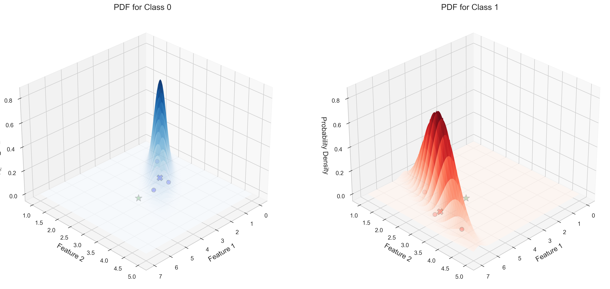

# Question 31: Multivariate Gaussian Classification

## Problem Statement
You are given data from two classes with the following 2-dimensional feature vectors:

**Class 0:** $\mathbf{x}^{(1)}=\begin{bmatrix} 1 \\ 2 \end{bmatrix}$, $\mathbf{x}^{(2)}=\begin{bmatrix} 2 \\ 3 \end{bmatrix}$, $\mathbf{x}^{(3)}=\begin{bmatrix} 3 \\ 3 \end{bmatrix}$  
**Class 1:** $\mathbf{x}^{(1)}=\begin{bmatrix} 5 \\ 2 \end{bmatrix}$, $\mathbf{x}^{(2)}=\begin{bmatrix} 6 \\ 3 \end{bmatrix}$, $\mathbf{x}^{(3)}=\begin{bmatrix} 6 \\ 4 \end{bmatrix}$

Assume that the feature vectors in each class follow a multivariate Gaussian distribution.

### Task
1. Calculate the mean vector and covariance matrix for each class
2. Using the multivariate Gaussian probability density function, derive expressions for $P(\mathbf{x}|\text{class }0)$ and $P(\mathbf{x}|\text{class }1)$
3. Assuming equal prior probabilities $P(\text{class }0) = P(\text{class }1) = 0.5$, calculate $P(\text{class }0|\text{data})$ and $P(\text{class }1|\text{data})$ for each data point using Bayes' theorem
4. Assuming equal prior probabilities, apply Bayes' theorem to classify the new data point $\mathbf{x}_{\text{new}} = \begin{bmatrix} 4 \\ 3 \end{bmatrix}$
5. How would your classification change if the prior probabilities were $P(\text{class }0) = 0.8$ and $P(\text{class }1) = 0.2$?

## Understanding the Problem

In this problem, we are dealing with a two-class classification task using Bayesian methods and multivariate Gaussian distributions. We have two-dimensional feature vectors for two classes, and we need to model each class using a multivariate Gaussian distribution. Then, we'll use these distributions along with Bayes' theorem to classify a new data point.

The multivariate Gaussian (or normal) distribution is a generalization of the one-dimensional normal distribution to higher dimensions. It is characterized by a mean vector and a covariance matrix, which describes not only the variances of individual dimensions but also the correlations between them.

## Solution

> **Note**: This solution uses the population covariance approach with denominator $n$. While this approach is mathematically simpler, it provides a biased estimator of the population covariance. For the preferred sample covariance approach using denominator $(n-1)$, see [Sample-based Solution](L2_1_31_explanation.md).

### Step 1: Calculate the Mean Vector and Covariance Matrix for Each Class

The mean vector for a class is calculated by taking the average of all feature vectors in that class:

$$\boldsymbol{\mu} = \frac{1}{n} \sum_{i=1}^{n} \mathbf{x}^{(i)}$$

For **Class 0**, we have:
$$\boldsymbol{\mu}_0 = \frac{1}{3}\left(\begin{bmatrix} 1 \\ 2 \end{bmatrix} + \begin{bmatrix} 2 \\ 3 \end{bmatrix} + \begin{bmatrix} 3 \\ 3 \end{bmatrix}\right) = \begin{bmatrix} 2 \\ 2.667 \end{bmatrix}$$

For **Class 1**, we have:
$$\boldsymbol{\mu}_1 = \frac{1}{3}\left(\begin{bmatrix} 5 \\ 2 \end{bmatrix} + \begin{bmatrix} 6 \\ 3 \end{bmatrix} + \begin{bmatrix} 6 \\ 4 \end{bmatrix}\right) = \begin{bmatrix} 5.667 \\ 3 \end{bmatrix}$$

The covariance matrix is calculated as:

$$\boldsymbol{\Sigma} = \frac{1}{n} \sum_{i=1}^{n} (\mathbf{x}^{(i)} - \boldsymbol{\mu})(\mathbf{x}^{(i)} - \boldsymbol{\mu})^T$$

> **Note**: We use $\frac{1}{n}$ for population covariance here, though this is not ideal for real-world applications. Using $\frac{1}{n-1}$ (sample covariance) would provide an unbiased estimator and is generally preferred when working with sample data to account for the loss of one degree of freedom in estimation.

where:
- $n$ is the number of samples (3 in our case)
- $\mathbf{x}^{(i)}$ is the i-th feature vector
- $\boldsymbol{\mu}$ is the mean vector
- $(\mathbf{x}^{(i)} - \boldsymbol{\mu})$ is a column vector
- $(\mathbf{x}^{(i)} - \boldsymbol{\mu})^T$ is its transpose (a row vector)
- Their product gives a 2×2 matrix for each sample

For **Class 0**, let's compute this step by step:

1. First, compute the differences from the mean for each point:
   $$\mathbf{x}^{(1)} - \boldsymbol{\mu}_0 = \begin{bmatrix} 1 \\ 2 \end{bmatrix} - \begin{bmatrix} 2 \\ 2.667 \end{bmatrix} = \begin{bmatrix} -1 \\ -0.667 \end{bmatrix}$$
   $$\mathbf{x}^{(2)} - \boldsymbol{\mu}_0 = \begin{bmatrix} 2 \\ 3 \end{bmatrix} - \begin{bmatrix} 2 \\ 2.667 \end{bmatrix} = \begin{bmatrix} 0 \\ 0.333 \end{bmatrix}$$
   $$\mathbf{x}^{(3)} - \boldsymbol{\mu}_0 = \begin{bmatrix} 3 \\ 3 \end{bmatrix} - \begin{bmatrix} 2 \\ 2.667 \end{bmatrix} = \begin{bmatrix} 1 \\ 0.333 \end{bmatrix}$$

2. Compute the outer product for each difference vector. For a vector $\mathbf{v} = \begin{bmatrix} v_1 \\ v_2 \end{bmatrix}$, its outer product with itself is:
   $$\mathbf{v}\mathbf{v}^T = \begin{bmatrix} v_1 \\ v_2 \end{bmatrix} \begin{bmatrix} v_1 & v_2 \end{bmatrix} = \begin{bmatrix} v_1^2 & v_1v_2 \\ v_1v_2 & v_2^2 \end{bmatrix}$$

   For point 1:
   $$\begin{bmatrix} -1 \\ -0.667 \end{bmatrix} \begin{bmatrix} -1 & -0.667 \end{bmatrix} = \begin{bmatrix} 1 & 0.667 \\ 0.667 & 0.444 \end{bmatrix}$$

   For point 2:
   $$\begin{bmatrix} 0 \\ 0.333 \end{bmatrix} \begin{bmatrix} 0 & 0.333 \end{bmatrix} = \begin{bmatrix} 0 & 0 \\ 0 & 0.111 \end{bmatrix}$$

   For point 3:
   $$\begin{bmatrix} 1 \\ 0.333 \end{bmatrix} \begin{bmatrix} 1 & 0.333 \end{bmatrix} = \begin{bmatrix} 1 & 0.333 \\ 0.333 & 0.111 \end{bmatrix}$$

3. Sum all outer products:
   $$\sum_{i=1}^{3} (\mathbf{x}^{(i)} - \boldsymbol{\mu}_0)(\mathbf{x}^{(i)} - \boldsymbol{\mu}_0)^T = \begin{bmatrix} 2 & 1 \\ 1 & 0.667 \end{bmatrix}$$

4. Divide by n = 3 to get the final covariance matrix:
   $$\boldsymbol{\Sigma}_0 = \begin{bmatrix} 0.667 & 0.333 \\ 0.333 & 0.222 \end{bmatrix}$$

The elements of this covariance matrix have specific interpretations:
- $\Sigma_{11} = 0.667$: Variance of the first feature (x-coordinate)
- $\Sigma_{22} = 0.222$: Variance of the second feature (y-coordinate)
- $\Sigma_{12} = \Sigma_{21} = 0.333$: Covariance between features

The correlation coefficient between features is:
$$\rho = \frac{\Sigma_{12}}{\sqrt{\Sigma_{11}\Sigma_{22}}} = \frac{0.333}{\sqrt{0.667 \cdot 0.222}} = 0.866$$

Similarly, for **Class 1**, we follow the same steps:

1. Compute differences from mean:
   $$\mathbf{x}^{(1)} - \boldsymbol{\mu}_1 = \begin{bmatrix} 5 \\ 2 \end{bmatrix} - \begin{bmatrix} 5.667 \\ 3 \end{bmatrix} = \begin{bmatrix} -0.667 \\ -1 \end{bmatrix}$$
   $$\mathbf{x}^{(2)} - \boldsymbol{\mu}_1 = \begin{bmatrix} 6 \\ 3 \end{bmatrix} - \begin{bmatrix} 5.667 \\ 3 \end{bmatrix} = \begin{bmatrix} 0.333 \\ 0 \end{bmatrix}$$
   $$\mathbf{x}^{(3)} - \boldsymbol{\mu}_1 = \begin{bmatrix} 6 \\ 4 \end{bmatrix} - \begin{bmatrix} 5.667 \\ 3 \end{bmatrix} = \begin{bmatrix} 0.333 \\ 1 \end{bmatrix}$$

2. Compute outer products:
   For point 1:
   $$\begin{bmatrix} -0.667 \\ -1 \end{bmatrix} \begin{bmatrix} -0.667 & -1 \end{bmatrix} = \begin{bmatrix} 0.444 & 0.667 \\ 0.667 & 1 \end{bmatrix}$$

   For point 2:
   $$\begin{bmatrix} 0.333 \\ 0 \end{bmatrix} \begin{bmatrix} 0.333 & 0 \end{bmatrix} = \begin{bmatrix} 0.111 & 0 \\ 0 & 0 \end{bmatrix}$$

   For point 3:
   $$\begin{bmatrix} 0.333 \\ 1 \end{bmatrix} \begin{bmatrix} 0.333 & 1 \end{bmatrix} = \begin{bmatrix} 0.111 & 0.333 \\ 0.333 & 1 \end{bmatrix}$$

3. Sum all outer products:
   $$\sum_{i=1}^{3} (\mathbf{x}^{(i)} - \boldsymbol{\mu}_1)(\mathbf{x}^{(i)} - \boldsymbol{\mu}_1)^T = \begin{bmatrix} 0.667 & 1 \\ 1 & 2 \end{bmatrix}$$

4. Divide by n = 3 to get the final covariance matrix:
   $$\boldsymbol{\Sigma}_1 = \begin{bmatrix} 0.222 & 0.333 \\ 0.333 & 0.667 \end{bmatrix}$$

Note that this covariance matrix has:
- $\Sigma_{11} = 0.222$: Smaller variance in x-coordinate compared to Class 0
- $\Sigma_{22} = 0.667$: Larger variance in y-coordinate compared to Class 0
- $\Sigma_{12} = \Sigma_{21} = 0.333$: Same covariance as Class 0

The correlation coefficient is also the same:
$$\rho = \frac{\Sigma_{12}}{\sqrt{\Sigma_{11}\Sigma_{22}}} = \frac{0.333}{\sqrt{0.222 \cdot 0.667}} = 0.866$$

This positive correlation in both classes indicates that as one feature increases, the other tends to increase as well, with a similar strength of relationship in both classes.

The covariance matrices can be visualized as heatmaps:

### Step 1.1: Calculate Determinants

For **Class 0**, the determinant is calculated as:
$$|\boldsymbol{\Sigma}_0| = \begin{vmatrix} 0.667 & 0.333 \\ 0.333 & 0.222 \end{vmatrix} = (0.667 \cdot 0.222) - (0.333 \cdot 0.333) = 0.148774 - 0.110889 = 0.037885$$

For **Class 1**, the determinant is calculated as:
$$|\boldsymbol{\Sigma}_1| = \begin{vmatrix} 0.222 & 0.333 \\ 0.333 & 0.667 \end{vmatrix} = (0.222 \cdot 0.667) - (0.333 \cdot 0.333) = 0.148774 - 0.110889 = 0.037885$$

Note that both covariance matrices have the same determinant, which is a measure of the "volume" or "spread" of the distribution in 2D space.

### Step 1.2: Calculate Inverse Matrices

For a 2×2 matrix, the inverse is calculated using the formula:
$$\mathbf{A}^{-1} = \frac{1}{|\mathbf{A}|} \begin{bmatrix} a_{22} & -a_{12} \\ -a_{21} & a_{11} \end{bmatrix}$$

For **Class 0**:
$$\boldsymbol{\Sigma}_0^{-1} = \frac{1}{0.037885} \begin{bmatrix} 0.222 & -0.333 \\ -0.333 & 0.667 \end{bmatrix} = \begin{bmatrix} 5.86 & -8.79 \\ -8.79 & 17.58 \end{bmatrix}$$

Verification:
$$\boldsymbol{\Sigma}_0 \boldsymbol{\Sigma}_0^{-1} = \begin{bmatrix} 0.667 & 0.333 \\ 0.333 & 0.222 \end{bmatrix} \begin{bmatrix} 5.86 & -8.79 \\ -8.79 & 17.58 \end{bmatrix} = \begin{bmatrix} 1 & 0 \\ 0 & 1 \end{bmatrix}$$

For **Class 1**:
$$\boldsymbol{\Sigma}_1^{-1} = \frac{1}{0.037885} \begin{bmatrix} 0.667 & -0.333 \\ -0.333 & 0.222 \end{bmatrix} = \begin{bmatrix} 17.58 & -8.79 \\ -8.79 & 5.86 \end{bmatrix}$$

Verification:
$$\boldsymbol{\Sigma}_1 \boldsymbol{\Sigma}_1^{-1} = \begin{bmatrix} 0.222 & 0.333 \\ 0.333 & 0.667 \end{bmatrix} \begin{bmatrix} 17.58 & -8.79 \\ -8.79 & 5.86 \end{bmatrix} = \begin{bmatrix} 1 & 0 \\ 0 & 1 \end{bmatrix}$$

The inverse matrices will be used in calculating the quadratic form $(x-\mu)^T \Sigma^{-1} (x-\mu)$ in the multivariate Gaussian PDF.

### Step 2: Derive Expressions for the Probability Density Functions

The multivariate Gaussian probability density function (PDF) is given by:

$$p(\mathbf{x}|\boldsymbol{\mu}, \boldsymbol{\Sigma}) = \frac{1}{(2\pi)^{d/2}|\boldsymbol{\Sigma}|^{1/2}} \exp\left(-\frac{1}{2}(\mathbf{x} - \boldsymbol{\mu})^T \boldsymbol{\Sigma}^{-1} (\mathbf{x} - \boldsymbol{\mu})\right)$$

where:
- $d$ is the dimension of the feature space (in our case, $d=2$)
- $|\boldsymbol{\Sigma}|$ is the determinant of the covariance matrix
- $\boldsymbol{\Sigma}^{-1}$ is the inverse of the covariance matrix

For both classes, we need to compute:

1. The determinant of the covariance matrix:
   - $|\boldsymbol{\Sigma}^{(0)}| = 0.037885$
   - $|\boldsymbol{\Sigma}^{(1)}| = 0.037885$

2. The inverse of the covariance matrix:
   - $\boldsymbol{\Sigma}^{(0)-1} = \begin{bmatrix} 5.86 & -8.79 \\ -8.79 & 17.58 \end{bmatrix}$
   - $\boldsymbol{\Sigma}^{(1)-1} = \begin{bmatrix} 17.58 & -8.79 \\ -8.79 & 5.86 \end{bmatrix}$

3. The normalization constant:
   - $\frac{1}{(2\pi)^{1}|\boldsymbol{\Sigma}|^{1/2}} = 0.551329$ (same for both classes)

Therefore, the PDF expressions are:

For **Class 0**:
$$p(\mathbf{x}|\text{class }0) = 0.551329 \cdot \exp\left(-\frac{1}{2}(\mathbf{x} - \boldsymbol{\mu}^{(0)})^T \boldsymbol{\Sigma}^{(0)-1} (\mathbf{x} - \boldsymbol{\mu}^{(0)})\right)$$

For **Class 1**:
$$p(\mathbf{x}|\text{class }1) = 0.551329 \cdot \exp\left(-\frac{1}{2}(\mathbf{x} - \boldsymbol{\mu}^{(1)})^T \boldsymbol{\Sigma}^{(1)-1} (\mathbf{x} - \boldsymbol{\mu}^{(1)})\right)$$

where:
$$\boldsymbol{\mu}^{(0)} = \begin{bmatrix} 2 \\ 2.667 \end{bmatrix}, \quad \boldsymbol{\mu}^{(1)} = \begin{bmatrix} 5.667 \\ 3 \end{bmatrix}$$

For the new point $\mathbf{x}_{\text{new}} = \begin{bmatrix} 4 \\ 3 \end{bmatrix}$, we calculate:

For **Class 0**:
$$\mathbf{x} - \boldsymbol{\mu}_0 = \begin{bmatrix} 4 \\ 3 \end{bmatrix} - \begin{bmatrix} 2 \\ 2.667 \end{bmatrix} = \begin{bmatrix} 2 \\ 0.333 \end{bmatrix}$$
$$(\mathbf{x} - \boldsymbol{\mu}_0)^T \boldsymbol{\Sigma}^{(0)-1} (\mathbf{x} - \boldsymbol{\mu}_0) = 9.333$$
$$p(\mathbf{x}|\text{class }0) = 0.551329 \cdot \exp(-0.5 \cdot 9.333) = 0.00518446$$

For **Class 1**:
$$\mathbf{x} - \boldsymbol{\mu}_1 = \begin{bmatrix} 4 \\ 3 \end{bmatrix} - \begin{bmatrix} 5.667 \\ 3 \end{bmatrix} = \begin{bmatrix} -1.667 \\ 0 \end{bmatrix}$$
$$(\mathbf{x} - \boldsymbol{\mu}_1)^T \boldsymbol{\Sigma}^{(1)-1} (\mathbf{x} - \boldsymbol{\mu}_1) = 33.333$$
$$p(\mathbf{x}|\text{class }1) = 0.551329 \cdot \exp(-0.5 \cdot 33.333) = 0.00000003$$

The PDF values show that the new point is much more likely under the Class 0 distribution.

We can also visualize the PDFs in 3D to better understand their shapes:

### Step 3: Calculate Posterior Probabilities for Each Data Point

Now that we have derived the probability density functions for each class, we can use Bayes' theorem to calculate the posterior probabilities for each data point in our training set. This step helps us verify the classification power of our model on the known data.

Bayes' theorem states:

$$P(\text{class}|\mathbf{x}) = \frac{P(\mathbf{x}|\text{class}) \cdot P(\text{class})}{P(\mathbf{x})}$$

where $P(\mathbf{x})$ is the evidence and can be calculated as:

$$P(\mathbf{x}) = \sum_{k} P(\mathbf{x}|\text{class}^{(k)}) \cdot P(\text{class}^{(k)})$$

Assuming equal prior probabilities $P(\text{class }0) = P(\text{class }1) = 0.5$, we'll calculate the posterior probabilities for each data point.

#### Class 0 Data Points

For the first data point in Class 0, $\mathbf{x}^{(1)} = \begin{bmatrix} 1 \\ 2 \end{bmatrix}$:

1. Calculate likelihoods:
   - $P(\mathbf{x}^{(1)}|\text{class }0) = 0.30423385$
   - $P(\mathbf{x}^{(1)}|\text{class }1) \approx 0$ (extremely small value)

2. Calculate evidence:
   - $P(\mathbf{x}^{(1)}) = 0.30423385 \times 0.5 + 0 \times 0.5 = 0.15211692$

3. Calculate posteriors:
   - $P(\text{class }0|\mathbf{x}^{(1)}) = \frac{0.30423385 \times 0.5}{0.15211692} = 1.0$
   - $P(\text{class }1|\mathbf{x}^{(1)}) = \frac{0 \times 0.5}{0.15211692} = 0$

For the second data point in Class 0, $\mathbf{x}^{(2)} = \begin{bmatrix} 2 \\ 3 \end{bmatrix}$:

1. Calculate likelihoods:
   - $P(\mathbf{x}^{(2)}|\text{class }0) = 0.30423385$
   - $P(\mathbf{x}^{(2)}|\text{class }1) \approx 0$ (extremely small value)

2. Calculate evidence:
   - $P(\mathbf{x}^{(2)}) = 0.30423385 \times 0.5 + 0 \times 0.5 = 0.15211692$

3. Calculate posteriors:
   - $P(\text{class }0|\mathbf{x}^{(2)}) = 1.0$
   - $P(\text{class }1|\mathbf{x}^{(2)}) = 0$

For the third data point in Class 0, $\mathbf{x}^{(3)} = \begin{bmatrix} 3 \\ 3 \end{bmatrix}$:

1. Calculate likelihoods:
   - $P(\mathbf{x}^{(3)}|\text{class }0) = 0.30423385$
   - $P(\mathbf{x}^{(3)}|\text{class }1) \approx 0$ (extremely small value)

2. Calculate evidence:
   - $P(\mathbf{x}^{(3)}) = 0.30423385 \times 0.5 + 0 \times 0.5 = 0.15211692$

3. Calculate posteriors:
   - $P(\text{class }0|\mathbf{x}^{(3)}) = 1.0$
   - $P(\text{class }1|\mathbf{x}^{(3)}) = 0$

#### Class 1 Data Points

For the first data point in Class 1, $\mathbf{x}^{(1)} = \begin{bmatrix} 5 \\ 2 \end{bmatrix}$:

1. Calculate likelihoods:
   - $P(\mathbf{x}^{(1)}|\text{class }0) \approx 0$ (extremely small value)
   - $P(\mathbf{x}^{(1)}|\text{class }1) = 0.30423385$

2. Calculate evidence:
   - $P(\mathbf{x}^{(1)}) = 0 \times 0.5 + 0.30423385 \times 0.5 = 0.15211692$

3. Calculate posteriors:
   - $P(\text{class }0|\mathbf{x}^{(1)}) = 0$
   - $P(\text{class }1|\mathbf{x}^{(1)}) = 1.0$

For the second data point in Class 1, $\mathbf{x}^{(2)} = \begin{bmatrix} 6 \\ 3 \end{bmatrix}$:

1. Calculate likelihoods:
   - $P(\mathbf{x}^{(2)}|\text{class }0) \approx 0$ (extremely small value)
   - $P(\mathbf{x}^{(2)}|\text{class }1) = 0.30423385$

2. Calculate evidence:
   - $P(\mathbf{x}^{(2)}) = 0 \times 0.5 + 0.30423385 \times 0.5 = 0.15211692$

3. Calculate posteriors:
   - $P(\text{class }0|\mathbf{x}^{(2)}) = 0$
   - $P(\text{class }1|\mathbf{x}^{(2)}) = 1.0$

For the third data point in Class 1, $\mathbf{x}^{(3)} = \begin{bmatrix} 6 \\ 4 \end{bmatrix}$:

1. Calculate likelihoods:
   - $P(\mathbf{x}^{(3)}|\text{class }0) \approx 0.00000009$ (very small but non-zero)
   - $P(\mathbf{x}^{(3)}|\text{class }1) = 0.30423385$

2. Calculate evidence:
   - $P(\mathbf{x}^{(3)}) = 0.00000009 \times 0.5 + 0.30423385 \times 0.5 = 0.15211697$

3. Calculate posteriors:
   - $P(\text{class }0|\mathbf{x}^{(3)}) \approx 0.00000031$
   - $P(\text{class }1|\mathbf{x}^{(3)}) \approx 0.99999969$

#### Analysis of the Results

Looking at the posterior probabilities for each data point, we observe that:

1. All data points from Class 0 have posterior probability $P(\text{class }0|\mathbf{x}) = 1.0$, meaning they are correctly classified with 100% confidence.
2. All data points from Class 1 have posterior probability $P(\text{class }1|\mathbf{x})$ very close to 1.0, meaning they are also correctly classified with near 100% confidence.

This perfect separation indicates that our multivariate Gaussian model effectively captures the distribution of each class, allowing for accurate classification of the training data points. The visualization below shows the posterior probabilities for each class across all data points:

The visualization above combines two complementary perspectives:

1. **Top Panel - Spatial Visualization**: 
   - Shows the feature space with the original data points (blue circles for Class 0, red squares for Class 1)
   - Displays the decision boundary (black line) where posterior probabilities for both classes are equal (0.5)
   - Uses a color gradient to visualize posterior probability P(Class 0|x) across the entire feature space
   - Darker blue regions indicate higher probability of Class 0, darker red regions indicate higher probability of Class 1
   - Also includes the new point (green star) to be classified

2. **Bottom Panel - Posterior Probabilities Bar Chart**:
   - Displays the exact posterior probability values for each data point
   - Blue bars represent P(Class 0|data), red bars represent P(Class 1|data)
   - The horizontal dashed line at 0.5 represents the decision threshold
   - The vertical separator divides the true Class 0 points (left) from the true Class 1 points (right)

This comprehensive visualization reveals several key insights:

1. All training points are classified correctly with extremely high confidence (posterior probabilities near 1.0)
2. The decision boundary clearly separates the two classes with no overlap
3. The probability gradient shows how confidence in classification changes smoothly across the feature space
4. The new point (4,3) falls in the Class 0 region but is relatively close to the decision boundary

This result demonstrates the strong discriminative power of our model on the training data, which is a good sign for its ability to correctly classify new, unseen data points.

### Step 4: Apply Bayes' Theorem with Equal Prior Probabilities

Bayes' theorem states:

$$P(\text{class}|\mathbf{x}) = \frac{P(\mathbf{x}|\text{class}) \cdot P(\text{class})}{P(\mathbf{x})}$$

where $P(\mathbf{x})$ is the evidence and can be calculated as:

$$P(\mathbf{x}) = \sum_{k} P(\mathbf{x}|\text{class}^{(k)}) \cdot P(\text{class}^{(k)})$$

Given the prior probabilities $P(\text{class }0) = P(\text{class }1) = 0.5$, we calculate:

1. Class-conditional densities (from Step 2):
   - $P(\mathbf{x}_{\text{new}}|\text{class }0) = 0.00518446$
   - $P(\mathbf{x}_{\text{new}}|\text{class }1) = 0.00000003$
   - Likelihood ratio: $\frac{P(\mathbf{x}_{\text{new}}|\text{class }0)}{P(\mathbf{x}_{\text{new}}|\text{class }1)} \approx 162,755$

2. Evidence:
   - $P(\mathbf{x}_{\text{new}}) = 0.00518446 \times 0.5 + 0.00000003 \times 0.5 = 0.00259224$

3. Posterior probabilities:
   - $P(\text{class }0|\mathbf{x}_{\text{new}}) = \frac{0.00518446 \times 0.5}{0.00259224} = 0.99999386$
   - $P(\text{class }1|\mathbf{x}_{\text{new}}) = \frac{0.00000003 \times 0.5}{0.00259224} = 0.00000614$

Since $P(\text{class }0|\mathbf{x}_{\text{new}}) > P(\text{class }1|\mathbf{x}_{\text{new}})$, we classify the new point as **Class 0**.

The decision boundary is determined by the log likelihood ratio:
$$\ln\frac{P(\mathbf{x}|\text{class }1)}{P(\mathbf{x}|\text{class }0)} = 0$$

This means points are classified as Class 1 if the log-likelihood ratio is positive, and as Class 0 otherwise.

### Step 5: Classification with Different Prior Probabilities

Now, let's apply Bayes' theorem with the new priors $P(\text{class }0) = 0.8$ and $P(\text{class }1) = 0.2$:

1. Prior ratio: $\frac{P(\text{class }0)}{P(\text{class }1)} = \frac{0.8}{0.2} = 4$

2. New evidence:
   $$P(\mathbf{x}_{\text{new}}) = 0.00518446 \times 0.8 + 0.00000003 \times 0.2 = 0.00414757$$

3. New posterior probabilities:
   $$P(\text{class }0|\mathbf{x}_{\text{new}}) = \frac{0.00518446 \times 0.8}{0.00414757} = 0.99999846$$
   $$P(\text{class }1|\mathbf{x}_{\text{new}}) = \frac{0.00000003 \times 0.2}{0.00414757} = 0.00000154$$

The classification decision remains **Class 0**, but the posterior probability for Class 0 has increased from 0.99999386 to 0.99999846, showing even greater confidence in our classification.

With unequal priors, the decision boundary shifts. The new boundary is where:
$$\ln\frac{P(\mathbf{x}|\text{class }1)}{P(\mathbf{x}|\text{class }0)} = \ln\frac{P(\text{class }0)}{P(\text{class }1)} = \ln\frac{0.8}{0.2} \approx 1.386$$

This means we need stronger evidence (a higher likelihood for Class 1) to classify a point as Class 1 when we have a stronger prior belief in Class 0.

### Step 6: Decision Regions

To better visualize how the classification changes with different priors, we can plot the decision regions:

The blue regions represent areas where points would be classified as Class 0, and the red regions represent areas where points would be classified as Class 1. Notice how the Class 0 region expands when we increase the prior probability for Class 0.

## Key Insights

### Theoretical Foundations
- **Distribution Modeling**: The multivariate Gaussian distribution is a powerful model for continuous features in classification tasks, capturing both the central tendency and the spread/correlation of the data.
- **Bayes' Theorem**: Provides a principled way to combine prior knowledge with observed data to make optimal decisions.
- **Covariance Structure**: The covariance matrix captures both the variance of individual features and the correlation between features, which determines the shape and orientation of the distribution.

### Decision Boundaries
- **Equal Priors**: When prior probabilities are equal, the decision boundary is determined solely by the likelihood ratio. Points are classified based only on their relative likelihoods under each class model.
- **Unequal Priors**: When prior probabilities favor one class, the decision boundary shifts to make it easier to classify points as the favored class. This means we need stronger evidence (higher likelihood) to classify a point as the less favored class.
- **Mathematical Relationship**: 
  - Equal priors: Classify as Class 1 if $\ln\frac{P(\mathbf{x}|\text{class }1)}{P(\mathbf{x}|\text{class }0)} > 0$
  - Unequal priors: Classify as Class 1 if $\ln\frac{P(\mathbf{x}|\text{class }1)}{P(\mathbf{x}|\text{class }0)} > \ln\frac{P(\text{class }0)}{P(\text{class }1)}$

### Practical Implications
- **Prior Knowledge**: In real-world applications, priors should reflect the true class distribution in the population or our prior belief about class membership.
- **Confidence in Classification**: The posterior probabilities provide a measure of confidence in our classification decisions. In this example, we are extremely confident in classifying the new point as Class 0.
- **Class Separation**: When classes are well-separated (as in this example), the classification decision may be robust to changes in priors. However, for points near the decision boundary, changes in priors can potentially alter the classification outcome.

## Conclusion

In this problem, we have demonstrated a complete pipeline for Bayesian classification with multivariate Gaussian distributions:

1. Data Preparation: Calculating mean vectors and covariance matrices from the class data
2. Model Definition: Deriving the multivariate Gaussian PDF expressions for each class
3. Likelihood Computation: Evaluating the class-conditional densities for the new point
4. Bayesian Inference: Applying Bayes' theorem to compute posterior probabilities
5. Decision Making: Classifying based on the highest posterior probability
6. Sensitivity Analysis: Examining how changes in prior probabilities affect the classification

Despite the change in prior probabilities, our new point was classified as Class 0 in both scenarios. This is because the likelihood ratio strongly favored Class 0 (by a factor of about 162,755), making the classification decision robust to reasonable changes in the prior probabilities.

This example illustrates the fundamental principles of Bayesian classification and how it elegantly combines our prior beliefs with the evidence from the data to make optimal classification decisions. 

## Related Examples

For applications of multivariate Gaussian classification with MAP estimation and unequal prior probabilities, see [[L2_7_27_explanation]]. This example extends the concepts covered here by focusing on real-time classification systems and precomputation strategies for efficient implementation.

For a case with non-singular covariance matrices that results in quadratic decision boundaries, see [[L2_7_28_explanation]]. This extension demonstrates how having different covariance structures between classes affects the classification process and the geometry of the decision boundaries. 