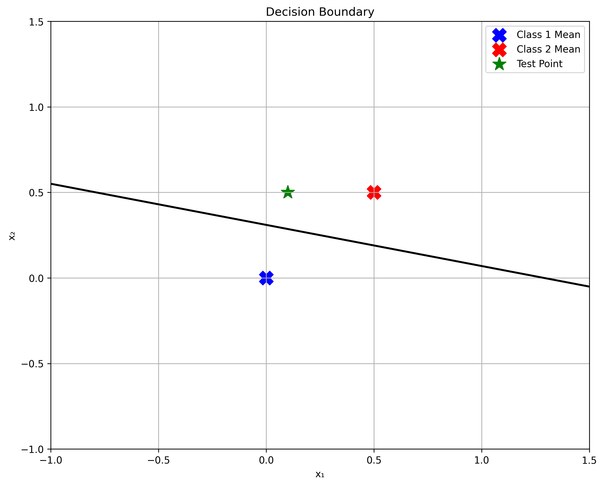
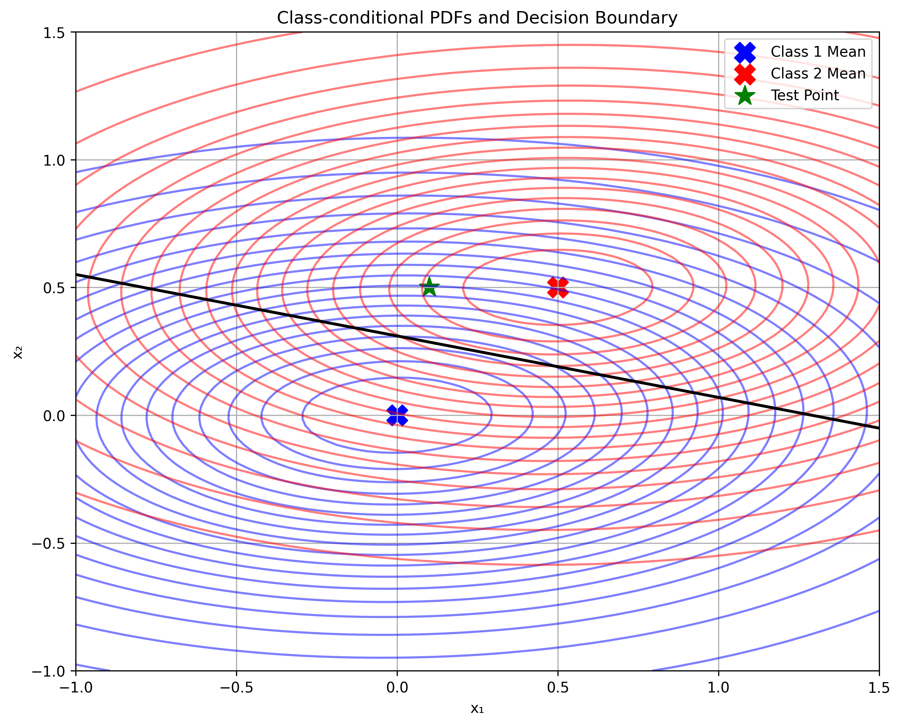
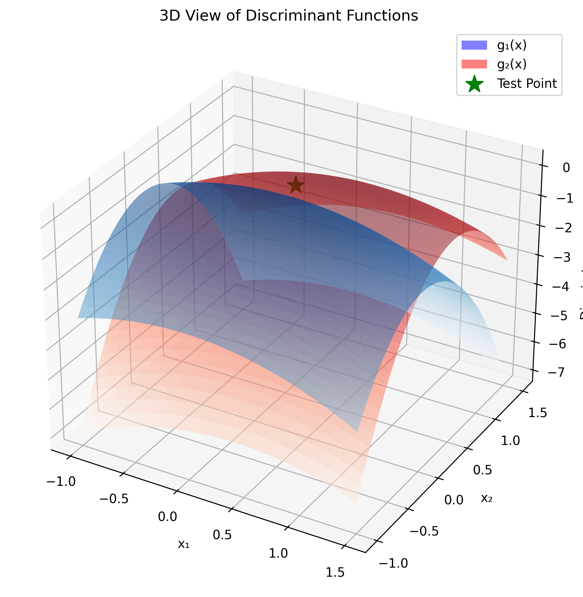

# Question 32: Two-Class Gaussian Classification with Equal Covariance

## Problem Statement
Consider the two-class problem where the two-dimensional feature vector $\mathbf{x} = \begin{bmatrix} x_1 \\ x_2 \end{bmatrix}$ obeys the following class conditional distributions:

$$f(\mathbf{x}|C_1) = N(\boldsymbol{\mu}_1, \boldsymbol{\Sigma}_1)$$
$$f(\mathbf{x}|C_2) = N(\boldsymbol{\mu}_2, \boldsymbol{\Sigma}_2)$$

where:
$$\boldsymbol{\mu}_1 = \begin{bmatrix} 0 \\ 0 \end{bmatrix}, \quad \boldsymbol{\mu}_2 = \begin{bmatrix} 0.5 \\ 0.5 \end{bmatrix}, \quad \boldsymbol{\Sigma}_1 = \boldsymbol{\Sigma}_2 = \begin{bmatrix} 0.8 & 0.01 \\ 0.01 & 0.2 \end{bmatrix}$$

Assuming apriori probabilities of the classes are same (i.e., $P(C_1) = P(C_2) = 0.5$)

### Task
1. Determine the discriminant function for class $C_1$
2. Determine the discriminant function for class $C_2$
3. Determine the decision boundary
4. Classify the given feature vector $\mathbf{x} = \begin{bmatrix} 0.1 \\ 0.5 \end{bmatrix}$

## Solution

### Understanding the Problem
For Gaussian distributions with equal covariance matrices, the discriminant functions take the form:

$g_i(\mathbf{x}) = -\frac{1}{2}(\mathbf{x} - \boldsymbol{\mu}_i)^T \boldsymbol{\Sigma}^{-1}(\mathbf{x} - \boldsymbol{\mu}_i) - \frac{1}{2}\ln|\boldsymbol{\Sigma}| + \ln P(C_i)$

### Step 1: Calculate Inverse Covariance Matrix
For a 2×2 matrix, the inverse is calculated as:

$$\boldsymbol{\Sigma}^{-1} = \frac{1}{|\boldsymbol{\Sigma}|} \begin{bmatrix} \Sigma_{22} & -\Sigma_{12} \\ -\Sigma_{21} & \Sigma_{11} \end{bmatrix}$$

First, let's calculate the determinant:

$$|\boldsymbol{\Sigma}| = \Sigma_{11}\Sigma_{22} - \Sigma_{12}\Sigma_{21}$$
$$= (0.8 \times 0.2) - (0.01 \times 0.01)$$
$$= 0.16 - 0.0001$$
$$= 0.1599$$

Now we can calculate the inverse:

$$\boldsymbol{\Sigma}^{-1} = \frac{1}{0.1599} \begin{bmatrix} 0.2 & -0.01 \\ -0.01 & 0.8 \end{bmatrix}$$

$$\boldsymbol{\Sigma}^{-1} = \begin{bmatrix} 1.25078174 & -0.06253909 \\ -0.06253909 & 5.00312695 \end{bmatrix}$$

### Step 2: Calculate Log-Determinant
The log-determinant is a key component of the discriminant function:

$$\ln|\boldsymbol{\Sigma}| = \ln(0.1599) = -1.8332067$$

### Step 3: Calculate Discriminant for Class 1
For the test point $\mathbf{x} = \begin{bmatrix} 0.1 \\ 0.5 \end{bmatrix}$:

a) Calculate difference vector $(\mathbf{x} - \boldsymbol{\mu}_1)$:
   $$\mathbf{x} - \boldsymbol{\mu}_1 = \begin{bmatrix} 0.1 - 0 \\ 0.5 - 0 \end{bmatrix} = \begin{bmatrix} 0.1 \\ 0.5 \end{bmatrix}$$

b) Calculate $(\mathbf{x} - \boldsymbol{\mu}_1)^T \boldsymbol{\Sigma}^{-1}$:
   $$\begin{bmatrix} 0.1 & 0.5 \end{bmatrix} \begin{bmatrix} 1.25078174 & -0.06253909 \\ -0.06253909 & 5.00312695 \end{bmatrix}$$
   $$= \begin{bmatrix} 0.09380863 & 2.49530957 \end{bmatrix}$$

c) Calculate quadratic term:
   $$(\mathbf{x} - \boldsymbol{\mu}_1)^T \boldsymbol{\Sigma}^{-1}(\mathbf{x} - \boldsymbol{\mu}_1)$$
   $$= \begin{bmatrix} 0.09380863 & 2.49530957 \end{bmatrix} \begin{bmatrix} 0.1 \\ 0.5 \end{bmatrix}$$
   $$= 1.25703565$$

d) Calculate discriminant function $g_1(\mathbf{x})$:
   $$g_1(\mathbf{x}) = -\frac{1}{2}(1.25703565) - \frac{1}{2}(-1.83320666) + \ln(0.5)$$
   $$= -0.62851782 + 0.91660333 - 0.69314718$$
   $$= -0.40506167$$

### Step 4: Calculate Discriminant for Class 2
For the same test point:

a) Calculate difference vector $(\mathbf{x} - \boldsymbol{\mu}_2)$:
   $$\mathbf{x} - \boldsymbol{\mu}_2 = \begin{bmatrix} 0.1 - 0.5 \\ 0.5 - 0.5 \end{bmatrix} = \begin{bmatrix} -0.4 \\ 0 \end{bmatrix}$$

b) Calculate $(\mathbf{x} - \boldsymbol{\mu}_2)^T \boldsymbol{\Sigma}^{-1}$:
   $$\begin{bmatrix} -0.4 & 0 \end{bmatrix} \begin{bmatrix} 1.25078174 & -0.06253909 \\ -0.06253909 & 5.00312695 \end{bmatrix}$$
   $$= \begin{bmatrix} -0.50031270 & 0.02501563 \end{bmatrix}$$

c) Calculate quadratic term:
   $$(\mathbf{x} - \boldsymbol{\mu}_2)^T \boldsymbol{\Sigma}^{-1}(\mathbf{x} - \boldsymbol{\mu}_2)$$
   $$= \begin{bmatrix} -0.50031270 & 0.02501563 \end{bmatrix} \begin{bmatrix} -0.4 \\ 0 \end{bmatrix}$$
   $$= 0.20012508$$

d) Calculate discriminant function $g_2(\mathbf{x})$:
   $$g_2(\mathbf{x}) = -\frac{1}{2}(0.20012508) - \frac{1}{2}(-1.83320666) + \ln(0.5)$$
   $$= -0.10006254 + 0.91660333 - 0.69314718$$
   $$= 0.12339361$$

### Step 5: Decision Boundary Analysis
The decision boundary is where $g_1(\mathbf{x}) = g_2(\mathbf{x})$. Due to equal covariance matrices and priors, this results in a linear boundary. The discriminant difference at our test point is:

$$g_2(\mathbf{x}) - g_1(\mathbf{x}) = 0.52845528$$

### Step 6: Classification and Posterior Probabilities
To calculate posterior probabilities, we use the softmax transformation:

1. Find maximum discriminant value: $\max_g = 0.12339361$
2. Calculate exponentials:
   - $\exp(g_1 - \max_g) = 0.58951490$
   - $\exp(g_2 - \max_g) = 1.00000000$
3. Sum of exponentials: $1.58951490$
4. Posterior probabilities:
   - $P(C_1|\mathbf{x}) = 0.37087724$ (37.09%)
   - $P(C_2|\mathbf{x}) = 0.62912276$ (62.91%)

Since $g_2(\mathbf{x}) > g_1(\mathbf{x})$, the test point is classified as Class 2 with 62.91% confidence.

## Visual Explanations

### 1. Decision Boundary Plot

This plot shows:
- The linear decision boundary (black line) between the two classes
- The mean points of each class (blue X for Class 1, red X for Class 2)
- The test point location (green star)
- The linearity of the boundary due to equal covariance matrices

### 2. Class-Conditional PDFs

This visualization shows:
- The contours of probability density functions for both classes
- Blue contours represent Class 1's PDF centered at $\boldsymbol{\mu}_1$
- Red contours represent Class 2's PDF centered at $\boldsymbol{\mu}_2$
- The black line shows the decision boundary
- The test point (green star) location relative to both distributions
- The overlap between the distributions indicating classification uncertainty

### 3. 3D Discriminant Functions

This 3D plot illustrates:
- The discriminant function $g_1(\mathbf{x})$ for Class 1 (blue surface)
- The discriminant function $g_2(\mathbf{x})$ for Class 2 (red surface)
- The intersection of these surfaces forms the decision boundary
- The test point location (green star)
- The relative values of discriminant functions at any point $(x_1, x_2)$

## Key Insights

### Theoretical Foundations
1. Equal covariance matrices lead to a linear decision boundary
2. The boundary's position is influenced by both mean differences and covariance structure
3. Equal priors result in a decision based purely on likelihood ratio

### Geometric Properties
1. The decision boundary is perpendicular to the line connecting class means
2. The boundary's position is shifted based on the covariance structure
3. The test point's position relative to the boundary determines its classification

### Numerical Properties
1. The determinant calculation is crucial for both the inverse covariance matrix and log-determinant term
2. Matrix operations must be performed in the correct order to maintain numerical stability
3. The softmax transformation ensures proper probability normalization

## Conclusion
The solution demonstrates how Gaussian discriminant analysis combines geometric properties with Bayesian decision theory to create an optimal classifier. Through detailed numerical calculations, we showed how the discriminant functions are computed and how they lead to a classification decision. The test point was classified as Class 2 with 62.91% confidence, reflecting its position relative to the decision boundary and the underlying probability distributions. The visualizations provide clear geometric intuition for the classification process, showing how the linear boundary separates the two classes in an optimal way given the equal covariance assumption. 