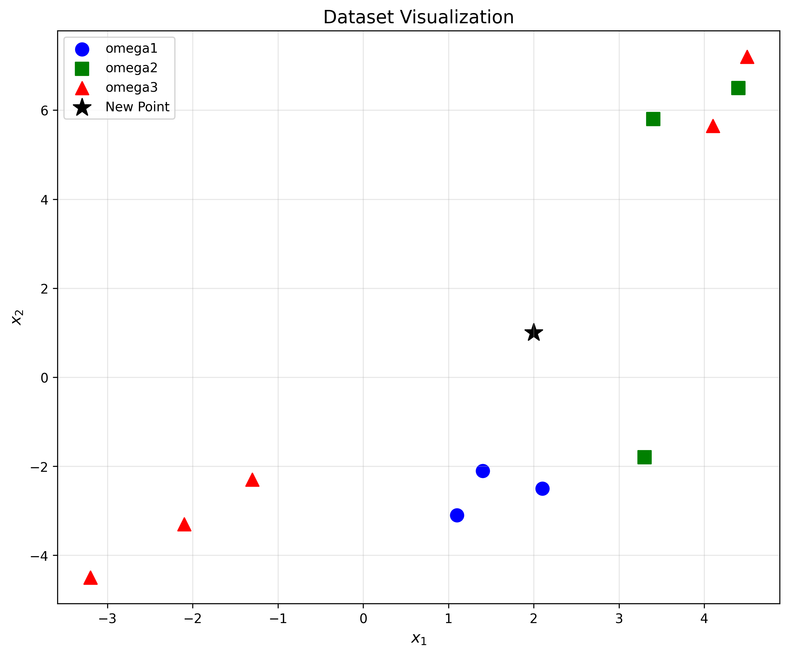
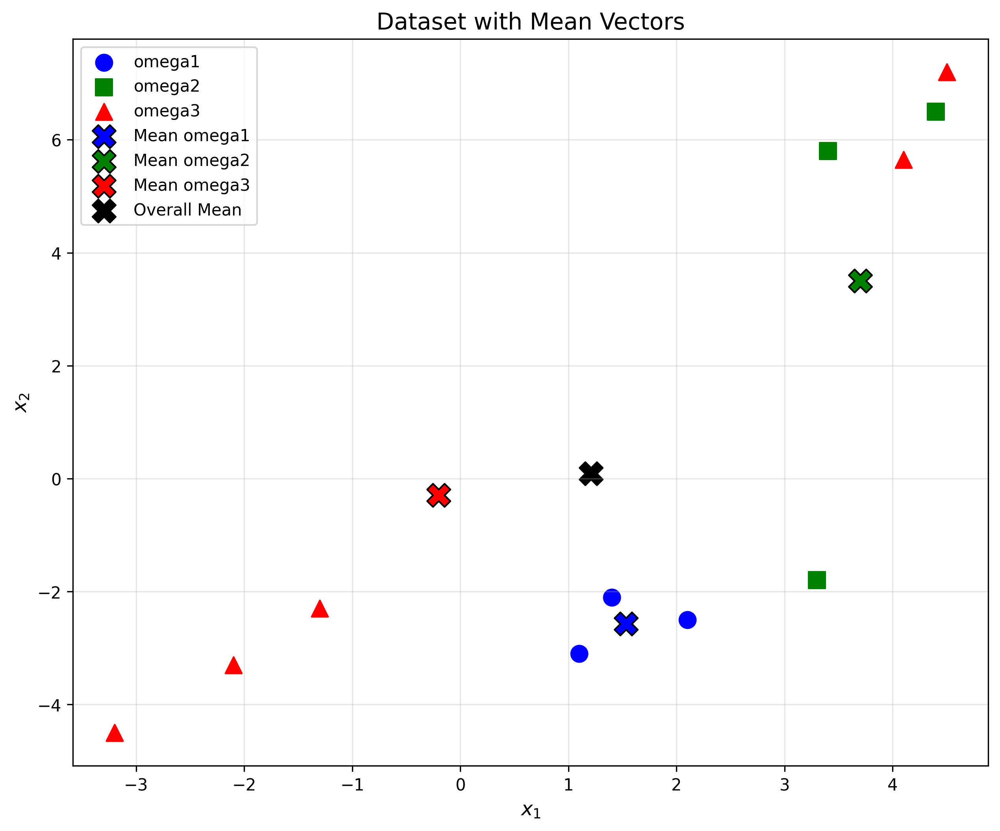
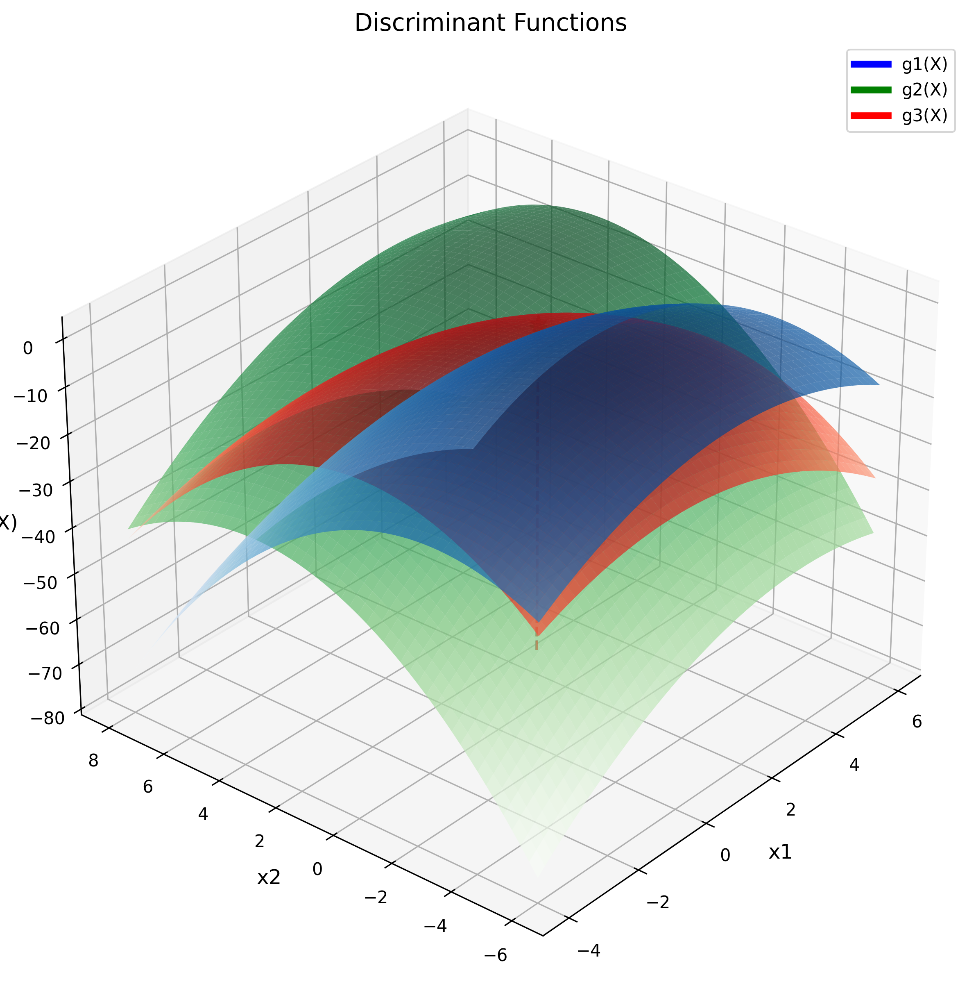
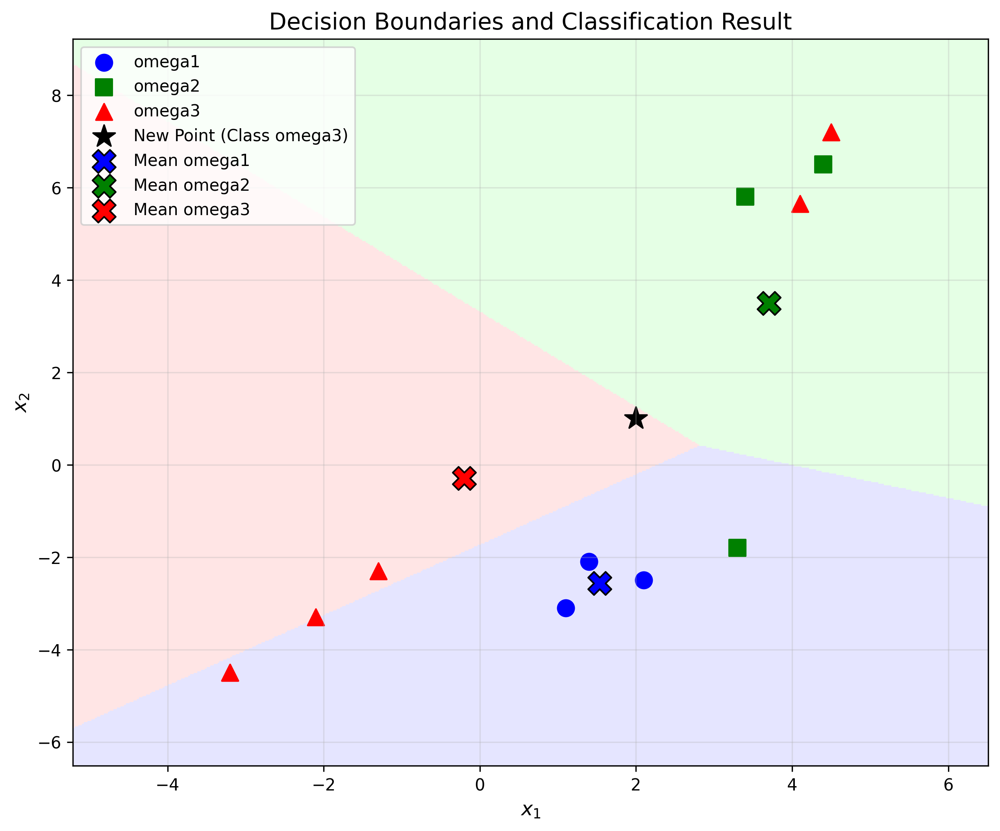

# Question 33: Discriminant Analysis

### Problem Statement
Given this data, where each feature vector $\mathbf{X}$ has 2 feature components $(x_1, x_2)$:

|       | $\omega_1$ |      |      | $\omega_2$ |     |     | $\omega_3$ |      |      |      |      |      |
| ----- | ---------- | ---- | ---- | ---------- | --- | --- | ---------- | ---- | ---- | ---- | ---- | ---- |
| $x_1$ | 2.1        | 1.1  | 1.4  | 3.3        | 4.4 | 3.4 | 4.5        | 4.1  | -1.3 | -3.2 | -3.2 | -2.1 |
| $x_2$ | -2.5       | -3.1 | -2.1 | -1.8       | 6.5 | 5.8 | 7.2        | 5.65 | -2.3 | -4.5 | -4.5 | -3.3 |

#### Task
1. Compute the mean vector $\boldsymbol{\mu}$ over all samples, and class means $\boldsymbol{\mu}_1$, $\boldsymbol{\mu}_2$ and $\boldsymbol{\mu}_3$:

$$\boldsymbol{\mu} = \frac{1}{N}\sum_{i=1}^N \mathbf{X}_i$$
$$\boldsymbol{\mu}_k = \frac{1}{N_k}\sum_{i=1}^{N_k} \mathbf{X}_i^{(k)}$$

2. Calculate the within-class scatter matrix $\mathbf{S}_w$ for class $\omega_1$ only (to simplify calculations):

$$\mathbf{S}_w^{(1)} = \sum_{i=1}^{N_1} (\mathbf{X}_i^{(1)} - \boldsymbol{\mu}_1)(\mathbf{X}_i^{(1)} - \boldsymbol{\mu}_1)^T$$

3. Given $P(\omega_1) = 0.4$, $P(\omega_2) = 0.35$, $P(\omega_3) = 0.25$, write expressions for the discriminant functions $g_1(\mathbf{X})$, $g_2(\mathbf{X})$, and $g_3(\mathbf{X})$ assuming:
   - Equal covariance matrices for all classes ($\mathbf{\Sigma}_1 = \mathbf{\Sigma}_2 = \mathbf{\Sigma}_3 = \mathbf{I}$)
   - Normal distributions
   - Using the identity matrix $\mathbf{I}$ as covariance matrix:

$$g_k(\mathbf{X}) = -\frac{1}{2}(\mathbf{X} - \boldsymbol{\mu}_k)^T(\mathbf{X} - \boldsymbol{\mu}_k) + \ln P(\omega_k)$$

4. For a new sample point $\mathbf{X} = \begin{bmatrix} 2.0 \\ 1.0 \end{bmatrix}$, determine which class it belongs to using your discriminant functions.

## Understanding the Problem

This problem focuses on discriminant analysis, a classification technique used in machine learning. We have data from three different classes (ω₁, ω₂, and ω₃), each represented by 2-dimensional feature vectors. The goal is to compute mean vectors and scatter matrices, define discriminant functions, and use them to classify a new data point.

The discriminant functions will be based on the assumption that all classes have the same covariance matrix (the identity matrix). This simplifies the discriminant functions to a form based on Euclidean distance from class means, adjusted by prior probabilities.

## Solution

### Step 1: Compute Mean Vectors

The overall mean vector is calculated as the average of all data points:

$$\boldsymbol{\mu} = \frac{1}{N}\sum_{i=1}^N \mathbf{X}_i$$

Let's first organize all our data points:

| Point | Class | Vector $(x_1, x_2)$ |
|-------|-------|---------------------|
| $\mathbf{X}_1$ | $\omega_1$ | $(2.1, -2.5)$ |
| $\mathbf{X}_2$ | $\omega_1$ | $(1.1, -3.1)$ |
| $\mathbf{X}_3$ | $\omega_1$ | $(1.4, -2.1)$ |
| $\mathbf{X}_4$ | $\omega_2$ | $(3.3, -1.8)$ |
| $\mathbf{X}_5$ | $\omega_2$ | $(4.4, 6.5)$ |
| $\mathbf{X}_6$ | $\omega_2$ | $(3.4, 5.8)$ |
| $\mathbf{X}_7$ | $\omega_3$ | $(4.5, 7.2)$ |
| $\mathbf{X}_8$ | $\omega_3$ | $(4.1, 5.65)$ |
| $\mathbf{X}_9$ | $\omega_3$ | $(-1.3, -2.3)$ |
| $\mathbf{X}_{10}$ | $\omega_3$ | $(-3.2, -4.5)$ |
| $\mathbf{X}_{11}$ | $\omega_3$ | $(-3.2, -4.5)$ |
| $\mathbf{X}_{12}$ | $\omega_3$ | $(-2.1, -3.3)$ |

The total number of data points $N = 12$.

To compute the overall mean vector, we need to:
1. Sum all $x_1$ values: 
   $$\sum_{i=1}^{N}x_{i1} = 2.1 + 1.1 + 1.4 + 3.3 + 4.4 + 3.4 + 4.5 + 4.1 + (-1.3) + (-3.2) + (-3.2) + (-2.1) = 14.5$$

2. Sum all $x_2$ values: 
   $$\sum_{i=1}^{N}x_{i2} = (-2.5) + (-3.1) + (-2.1) + (-1.8) + 6.5 + 5.8 + 7.2 + 5.65 + (-2.3) + (-4.5) + (-4.5) + (-3.3) = 1.05$$

3. Divide by the number of data points: 
   $$\boldsymbol{\mu} = \begin{bmatrix} \frac{14.5}{12} \\ \frac{1.05}{12} \end{bmatrix} = \begin{bmatrix} 1.208 \\ 0.0875 \end{bmatrix}$$

For class-specific mean vectors, we apply the same procedure but only to data points from each class:

$$\boldsymbol{\mu}_k = \frac{1}{N_k}\sum_{i=1}^{N_k} \mathbf{X}_i^{(k)}$$

#### Mean vector for $\omega_1$ (with $N_1 = 3$):
1. Sum of $x_1$ values: 
   $$\sum_{i=1}^{N_1}x_{i1}^{(1)} = 2.1 + 1.1 + 1.4 = 4.6$$

2. Sum of $x_2$ values: 
   $$\sum_{i=1}^{N_1}x_{i2}^{(1)} = (-2.5) + (-3.1) + (-2.1) = -7.7$$

3. Divide by the number of points in class $\omega_1$: 
   $$\boldsymbol{\mu}_1 = \begin{bmatrix} \frac{4.6}{3} \\ \frac{-7.7}{3} \end{bmatrix} = \begin{bmatrix} 1.533 \\ -2.567 \end{bmatrix}$$

#### Mean vector for $\omega_2$ (with $N_2 = 3$):
1. Sum of $x_1$ values: 
   $$\sum_{i=1}^{N_2}x_{i1}^{(2)} = 3.3 + 4.4 + 3.4 = 11.1$$

2. Sum of $x_2$ values: 
   $$\sum_{i=1}^{N_2}x_{i2}^{(2)} = (-1.8) + 6.5 + 5.8 = 10.5$$

3. Divide by the number of points in class $\omega_2$: 
   $$\boldsymbol{\mu}_2 = \begin{bmatrix} \frac{11.1}{3} \\ \frac{10.5}{3} \end{bmatrix} = \begin{bmatrix} 3.7 \\ 3.5 \end{bmatrix}$$

#### Mean vector for $\omega_3$ (with $N_3 = 6$):
1. Sum of $x_1$ values: 
   $$\sum_{i=1}^{N_3}x_{i1}^{(3)} = 4.5 + 4.1 + (-1.3) + (-3.2) + (-3.2) + (-2.1) = -1.2$$

2. Sum of $x_2$ values: 
   $$\sum_{i=1}^{N_3}x_{i2}^{(3)} = 7.2 + 5.65 + (-2.3) + (-4.5) + (-4.5) + (-3.3) = -1.75$$

3. Divide by the number of points in class $\omega_3$: 
   $$\boldsymbol{\mu}_3 = \begin{bmatrix} \frac{-1.2}{6} \\ \frac{-1.75}{6} \end{bmatrix} = \begin{bmatrix} -0.2 \\ -0.292 \end{bmatrix}$$

Summary of computed mean vectors:
- Overall mean vector: $\boldsymbol{\mu} = \begin{bmatrix} 1.208 \\ 0.0875 \end{bmatrix}$
- Mean vector for $\omega_1$: $\boldsymbol{\mu}_1 = \begin{bmatrix} 1.533 \\ -2.567 \end{bmatrix}$
- Mean vector for $\omega_2$: $\boldsymbol{\mu}_2 = \begin{bmatrix} 3.7 \\ 3.5 \end{bmatrix}$
- Mean vector for $\omega_3$: $\boldsymbol{\mu}_3 = \begin{bmatrix} -0.2 \\ -0.292 \end{bmatrix}$

The data and means can be visualized as follows:

And with the mean vectors highlighted:

### Step 2: Calculate the Within-Class Scatter Matrix for Class ω₁

The within-class scatter matrix represents the spread of data points within a class. For class $\omega_1$, it is calculated as:

$$\mathbf{S}_w^{(1)} = \sum_{i=1}^{N_1} (\mathbf{X}_i^{(1)} - \boldsymbol{\mu}_1)(\mathbf{X}_i^{(1)} - \boldsymbol{\mu}_1)^T$$

This calculation involves the following steps for each data point in class $\omega_1$:
1. Calculate the difference vector from the class mean: $(\mathbf{X}_i^{(1)} - \boldsymbol{\mu}_1)$
2. Compute the outer product of this difference with itself: $(\mathbf{X}_i^{(1)} - \boldsymbol{\mu}_1)(\mathbf{X}_i^{(1)} - \boldsymbol{\mu}_1)^T$
3. Sum these outer products over all points in the class

Let's go through the calculation for each data point:

#### First data point $\mathbf{X}_1^{(1)} = \begin{bmatrix} 2.1 \\ -2.5 \end{bmatrix}$:

Step 1: Calculate the difference from the mean:
$$\mathbf{X}_1^{(1)} - \boldsymbol{\mu}_1 = \begin{bmatrix} 2.1 \\ -2.5 \end{bmatrix} - \begin{bmatrix} 1.533 \\ -2.567 \end{bmatrix} = \begin{bmatrix} 0.567 \\ 0.067 \end{bmatrix}$$

Step 2: Compute the outer product:
$$(\mathbf{X}_1^{(1)} - \boldsymbol{\mu}_1)(\mathbf{X}_1^{(1)} - \boldsymbol{\mu}_1)^T = \begin{bmatrix} 0.567 \\ 0.067 \end{bmatrix} \begin{bmatrix} 0.567 & 0.067 \end{bmatrix}$$

$$= \begin{bmatrix} 
0.567 \times 0.567 & 0.567 \times 0.067 \\ 
0.067 \times 0.567 & 0.067 \times 0.067 
\end{bmatrix} = \begin{bmatrix} 
0.321 & 0.038 \\ 
0.038 & 0.004 
\end{bmatrix}$$

Step 3: Running sum of scatter matrix after this point:
$$\mathbf{S}_w^{(1)} = \begin{bmatrix} 
0.321 & 0.038 \\ 
0.038 & 0.004 
\end{bmatrix}$$

#### Second data point $\mathbf{X}_2^{(1)} = \begin{bmatrix} 1.1 \\ -3.1 \end{bmatrix}$:

Step 1: Calculate the difference from the mean:
$$\mathbf{X}_2^{(1)} - \boldsymbol{\mu}_1 = \begin{bmatrix} 1.1 \\ -3.1 \end{bmatrix} - \begin{bmatrix} 1.533 \\ -2.567 \end{bmatrix} = \begin{bmatrix} -0.433 \\ -0.533 \end{bmatrix}$$

Step 2: Compute the outer product:
$$(\mathbf{X}_2^{(1)} - \boldsymbol{\mu}_1)(\mathbf{X}_2^{(1)} - \boldsymbol{\mu}_1)^T = \begin{bmatrix} -0.433 \\ -0.533 \end{bmatrix} \begin{bmatrix} -0.433 & -0.533 \end{bmatrix}$$

$$= \begin{bmatrix} 
(-0.433) \times (-0.433) & (-0.433) \times (-0.533) \\ 
(-0.533) \times (-0.433) & (-0.533) \times (-0.533) 
\end{bmatrix} = \begin{bmatrix} 
0.188 & 0.231 \\ 
0.231 & 0.284 
\end{bmatrix}$$

Step 3: Update the running sum of the scatter matrix:
$$\mathbf{S}_w^{(1)} = \begin{bmatrix} 
0.321 & 0.038 \\ 
0.038 & 0.004 
\end{bmatrix} + \begin{bmatrix} 
0.188 & 0.231 \\ 
0.231 & 0.284 
\end{bmatrix} = \begin{bmatrix} 
0.509 & 0.269 \\ 
0.269 & 0.288 
\end{bmatrix}$$

#### Third data point $\mathbf{X}_3^{(1)} = \begin{bmatrix} 1.4 \\ -2.1 \end{bmatrix}$:

Step 1: Calculate the difference from the mean:
$$\mathbf{X}_3^{(1)} - \boldsymbol{\mu}_1 = \begin{bmatrix} 1.4 \\ -2.1 \end{bmatrix} - \begin{bmatrix} 1.533 \\ -2.567 \end{bmatrix} = \begin{bmatrix} -0.133 \\ 0.467 \end{bmatrix}$$

Step 2: Compute the outer product:
$$(\mathbf{X}_3^{(1)} - \boldsymbol{\mu}_1)(\mathbf{X}_3^{(1)} - \boldsymbol{\mu}_1)^T = \begin{bmatrix} -0.133 \\ 0.467 \end{bmatrix} \begin{bmatrix} -0.133 & 0.467 \end{bmatrix}$$

$$= \begin{bmatrix} 
(-0.133) \times (-0.133) & (-0.133) \times 0.467 \\ 
0.467 \times (-0.133) & 0.467 \times 0.467 
\end{bmatrix} = \begin{bmatrix} 
0.018 & -0.062 \\ 
-0.062 & 0.218 
\end{bmatrix}$$

Step 3: Calculate the final within-class scatter matrix by adding this contribution:
$$\mathbf{S}_w^{(1)} = \begin{bmatrix} 
0.509 & 0.269 \\ 
0.269 & 0.288 
\end{bmatrix} + \begin{bmatrix} 
0.018 & -0.062 \\ 
-0.062 & 0.218 
\end{bmatrix} = \begin{bmatrix} 
0.527 & 0.207 \\ 
0.207 & 0.506 
\end{bmatrix}$$

Thus, the final within-class scatter matrix for class $\omega_1$ is:

$$\mathbf{S}_w^{(1)} = \begin{bmatrix} 
0.527 & 0.207 \\ 
0.207 & 0.506 
\end{bmatrix}$$

This matrix provides information about the shape and spread of the data within class $\omega_1$. The diagonal elements represent the variances of each feature, while the off-diagonal elements represent their covariances.

### Step 3: Define Discriminant Functions

In discriminant analysis, we need to define functions that help us decide which class a new data point belongs to. For normal distributions with equal covariance matrices, the general form of the discriminant function for class $k$ is:

$$g_k(\mathbf{X}) = -\frac{1}{2}(\mathbf{X} - \boldsymbol{\mu}_k)^T\mathbf{\Sigma}^{-1}(\mathbf{X} - \boldsymbol{\mu}_k) + \ln P(\omega_k)$$

Where:
- $\mathbf{X}$ is the feature vector of the point we want to classify
- $\boldsymbol{\mu}_k$ is the mean vector of class $k$
- $\mathbf{\Sigma}^{-1}$ is the inverse of the covariance matrix (assumed equal for all classes)
- $P(\omega_k)$ is the prior probability of class $k$

Since we're assuming equal covariance matrices for all classes and using the identity matrix $\mathbf{I}$ as the covariance matrix, we have $\mathbf{\Sigma} = \mathbf{I}$ and $\mathbf{\Sigma}^{-1} = \mathbf{I}$.

This simplifies our discriminant function to:

$$g_k(\mathbf{X}) = -\frac{1}{2}(\mathbf{X} - \boldsymbol{\mu}_k)^T(\mathbf{X} - \boldsymbol{\mu}_k) + \ln P(\omega_k)$$

The term $(\mathbf{X} - \boldsymbol{\mu}_k)^T(\mathbf{X} - \boldsymbol{\mu}_k)$ is the squared Euclidean distance between the point $\mathbf{X}$ and the class mean $\boldsymbol{\mu}_k$:

$$g_k(\mathbf{X}) = -\frac{1}{2}||\mathbf{X} - \boldsymbol{\mu}_k||^2 + \ln P(\omega_k)$$

For our 2D feature space, this expands to:

$$g_k(\mathbf{X}) = -\frac{1}{2}[(x_1 - \mu_{k1})^2 + (x_2 - \mu_{k2})^2] + \ln P(\omega_k)$$

Let's derive the discriminant function for each class:

#### Discriminant function for class $\omega_1$ (with $P(\omega_1) = 0.4$):

Mean vector: $\boldsymbol{\mu}_1 = \begin{bmatrix} 1.533 \\ -2.567 \end{bmatrix}$
Prior probability: $P(\omega_1) = 0.4$
Natural logarithm of prior: $\ln(0.4) = -0.916$

The discriminant function is:
$$g_1(\mathbf{X}) = -\frac{1}{2}||\mathbf{X} - \begin{bmatrix} 1.533 \\ -2.567 \end{bmatrix}||^2 + (-0.916)$$

Expanding the distance term:
$$g_1(\mathbf{X}) = -\frac{1}{2}[(x_1 - 1.533)^2 + (x_2 - (-2.567))^2] - 0.916$$

Further expansion gives:
$$g_1(\mathbf{X}) = -\frac{1}{2}[x_1^2 - 2(1.533)x_1 + (1.533)^2 + x_2^2 - 2(-2.567)x_2 + (-2.567)^2] - 0.916$$

Simplifying:
$$g_1(\mathbf{X}) = -\frac{1}{2}(x_1^2 + x_2^2) + 1.533x_1 + (-2.567)x_2 - 5.386$$

This can be written in the form:
$$g_1(\mathbf{X}) = w_{10} + w_{11}x_1 + w_{12}x_2 - \frac{1}{2}(x_1^2 + x_2^2)$$

where $w_{10} = -5.386$, $w_{11} = 1.533$, and $w_{12} = -2.567$

#### Discriminant function for class $\omega_2$ (with $P(\omega_2) = 0.35$):

Mean vector: $\boldsymbol{\mu}_2 = \begin{bmatrix} 3.7 \\ 3.5 \end{bmatrix}$
Prior probability: $P(\omega_2) = 0.35$
Natural logarithm of prior: $\ln(0.35) = -1.050$

The discriminant function is:
$$g_2(\mathbf{X}) = -\frac{1}{2}||\mathbf{X} - \begin{bmatrix} 3.7 \\ 3.5 \end{bmatrix}||^2 + (-1.050)$$

Expanding the distance term:
$$g_2(\mathbf{X}) = -\frac{1}{2}[(x_1 - 3.7)^2 + (x_2 - 3.5)^2] - 1.050$$

Further expansion gives:
$$g_2(\mathbf{X}) = -\frac{1}{2}[x_1^2 - 2(3.7)x_1 + (3.7)^2 + x_2^2 - 2(3.5)x_2 + (3.5)^2] - 1.050$$

Simplifying:
$$g_2(\mathbf{X}) = -\frac{1}{2}(x_1^2 + x_2^2) + 3.7x_1 + 3.5x_2 - 14.020$$

This can be written in the form:
$$g_2(\mathbf{X}) = w_{20} + w_{21}x_1 + w_{22}x_2 - \frac{1}{2}(x_1^2 + x_2^2)$$

where $w_{20} = -14.020$, $w_{21} = 3.7$, and $w_{22} = 3.5$

#### Discriminant function for class $\omega_3$ (with $P(\omega_3) = 0.25$):

Mean vector: $\boldsymbol{\mu}_3 = \begin{bmatrix} -0.2 \\ -0.292 \end{bmatrix}$
Prior probability: $P(\omega_3) = 0.25$
Natural logarithm of prior: $\ln(0.25) = -1.386$

The discriminant function is:
$$g_3(\mathbf{X}) = -\frac{1}{2}||\mathbf{X} - \begin{bmatrix} -0.2 \\ -0.292 \end{bmatrix}||^2 + (-1.386)$$

Expanding the distance term:
$$g_3(\mathbf{X}) = -\frac{1}{2}[(x_1 - (-0.2))^2 + (x_2 - (-0.292))^2] - 1.386$$

Further expansion gives:
$$g_3(\mathbf{X}) = -\frac{1}{2}[x_1^2 - 2(-0.2)x_1 + (-0.2)^2 + x_2^2 - 2(-0.292)x_2 + (-0.292)^2] - 1.386$$

Simplifying:
$$g_3(\mathbf{X}) = -\frac{1}{2}(x_1^2 + x_2^2) - 0.2x_1 - 0.292x_2 - 1.449$$

This can be written in the form:
$$g_3(\mathbf{X}) = w_{30} + w_{31}x_1 + w_{32}x_2 - \frac{1}{2}(x_1^2 + x_2^2)$$

where $w_{30} = -1.449$, $w_{31} = -0.2$, and $w_{32} = -0.292$

These discriminant functions can be visualized as surfaces in 3D space:

The height of each surface at any point $(x_1, x_2)$ represents the value of the corresponding discriminant function at that point. The class with the highest discriminant value at a point is the class to which that point is assigned.

### Step 4: Classify the New Point

To classify a new data point, we evaluate each discriminant function at that point and assign the point to the class with the highest discriminant value. Let's classify the new point $\mathbf{X} = \begin{bmatrix} 2.0 \\ 1.0 \end{bmatrix}$:

#### For class $\omega_1$:

Step 1: Calculate the difference from the class mean:
$$\mathbf{X} - \boldsymbol{\mu}_1 = \begin{bmatrix} 2.0 \\ 1.0 \end{bmatrix} - \begin{bmatrix} 1.533 \\ -2.567 \end{bmatrix} = \begin{bmatrix} 0.467 \\ 3.567 \end{bmatrix}$$

Step 2: Compute the squared Euclidean distance:
$$||\mathbf{X} - \boldsymbol{\mu}_1||^2 = (0.467)^2 + (3.567)^2 = 0.218 + 12.724 = 12.942$$

Step 3: Evaluate the discriminant function:
$$g_1(\mathbf{X}) = -\frac{1}{2} \times 12.942 + \ln(0.4) = -6.471 - 0.916 = -7.387$$

#### For class $\omega_2$:

Step 1: Calculate the difference from the class mean:
$$\mathbf{X} - \boldsymbol{\mu}_2 = \begin{bmatrix} 2.0 \\ 1.0 \end{bmatrix} - \begin{bmatrix} 3.7 \\ 3.5 \end{bmatrix} = \begin{bmatrix} -1.7 \\ -2.5 \end{bmatrix}$$

Step 2: Compute the squared Euclidean distance:
$$||\mathbf{X} - \boldsymbol{\mu}_2||^2 = (-1.7)^2 + (-2.5)^2 = 2.89 + 6.25 = 9.14$$

Step 3: Evaluate the discriminant function:
$$g_2(\mathbf{X}) = -\frac{1}{2} \times 9.14 + \ln(0.35) = -4.57 - 1.050 = -5.62$$

#### For class $\omega_3$:

Step 1: Calculate the difference from the class mean:
$$\mathbf{X} - \boldsymbol{\mu}_3 = \begin{bmatrix} 2.0 \\ 1.0 \end{bmatrix} - \begin{bmatrix} -0.2 \\ -0.292 \end{bmatrix} = \begin{bmatrix} 2.2 \\ 1.292 \end{bmatrix}$$

Step 2: Compute the squared Euclidean distance:
$$||\mathbf{X} - \boldsymbol{\mu}_3||^2 = (2.2)^2 + (1.292)^2 = 4.84 + 1.669 = 6.509$$

Step 3: Evaluate the discriminant function:
$$g_3(\mathbf{X}) = -\frac{1}{2} \times 6.509 + \ln(0.25) = -3.254 - 1.386 = -4.640$$

#### Making the Classification Decision

Now, we compare the discriminant values:
- $g_1(\mathbf{X}) = -7.387$
- $g_2(\mathbf{X}) = -5.62$
- $g_3(\mathbf{X}) = -4.640$

Since $g_3(\mathbf{X})$ has the highest value ($-4.640 > -5.62 > -7.387$), the new point $\mathbf{X} = \begin{bmatrix} 2.0 \\ 1.0 \end{bmatrix}$ is classified as belonging to class $\omega_3$.

The decision boundaries and classification result can be visualized as:

## Visual Explanations

### Dataset Visualization

This visualization shows the data points from each class in a 2D feature space. Blue circles represent class ω₁, green squares represent class ω₂, and red triangles represent class ω₃. The black star marks the new point [2.0, 1.0] that we need to classify.

### Mean Vectors

This visualization shows the class-specific mean vectors (marked with X's) as well as the overall mean vector (black X). The means clearly show the central locations of each class in the feature space.

### Discriminant Functions

This 3D visualization shows the surfaces of the three discriminant functions across the feature space. The blue surface corresponds to g₁(X), the green surface to g₂(X), and the red surface to g₃(X). At any point (x₁, x₂), the height of each surface represents the value of the corresponding discriminant function. The vertical lines and stars show the discriminant values for the new point.

### Decision Boundaries and Classification

This visualization shows the decision boundaries between the three classes. The shaded regions represent areas where points would be classified into each class: light blue for class ω₁, light green for class ω₂, and light red for class ω₃. The new point (black star) falls within the region for class ω₃, confirming our classification result.

## Key Insights

### Theoretical Foundations
- **Mean Vectors**: The mean vector represents the central tendency of a class in feature space and plays a crucial role in discriminant analysis.
- **Scatter Matrices**: The within-class scatter matrix captures the spread of data points within a class and is used in more advanced discriminant analyses.
- **Discriminant Functions**: For Gaussian distributions with equal covariance matrices, the discriminant functions are based on Euclidean distance from class means, with an adjustment for prior probabilities.

### Practical Applications
- **Decision Boundaries**: The decision boundaries between classes are determined by points where discriminant functions of different classes are equal.
- **Effect of Priors**: The prior probabilities shift the decision boundaries - a higher prior for a class makes it more likely for points to be classified into that class.
- **Classification Strategy**: A point is classified into the class whose discriminant function gives the highest value at that point.

### Geometric Interpretation
- The discriminant function for each class creates a quadratic surface (in this case, a paraboloid) in the feature space.
- The decision boundaries are formed where these surfaces intersect.
- The shape of the decision boundaries depends on the covariance matrices - with identity matrices, the boundaries are linear.

## Conclusion

In this problem, we have demonstrated the application of discriminant analysis for a three-class classification problem:

1. We calculated the mean vectors for each class and visualized them in the feature space.
2. We computed the within-class scatter matrix for class ω₁, which would be used in more advanced discriminant analyses.
3. We defined discriminant functions based on the assumption of equal covariance matrices (identity matrix).
4. We evaluated these discriminant functions for a new point and classified it to class ω₃.

The classification was determined by which discriminant function had the highest value for the new point, showing that despite the new point being relatively close to class ω₁ in terms of the x₁ coordinate, its position in the overall feature space made it more likely to belong to class ω₃ when taking into account both features and the prior probabilities.

This example illustrates how discriminant analysis combines distance metrics and prior probabilities to make optimal classification decisions in a multi-class setting. 