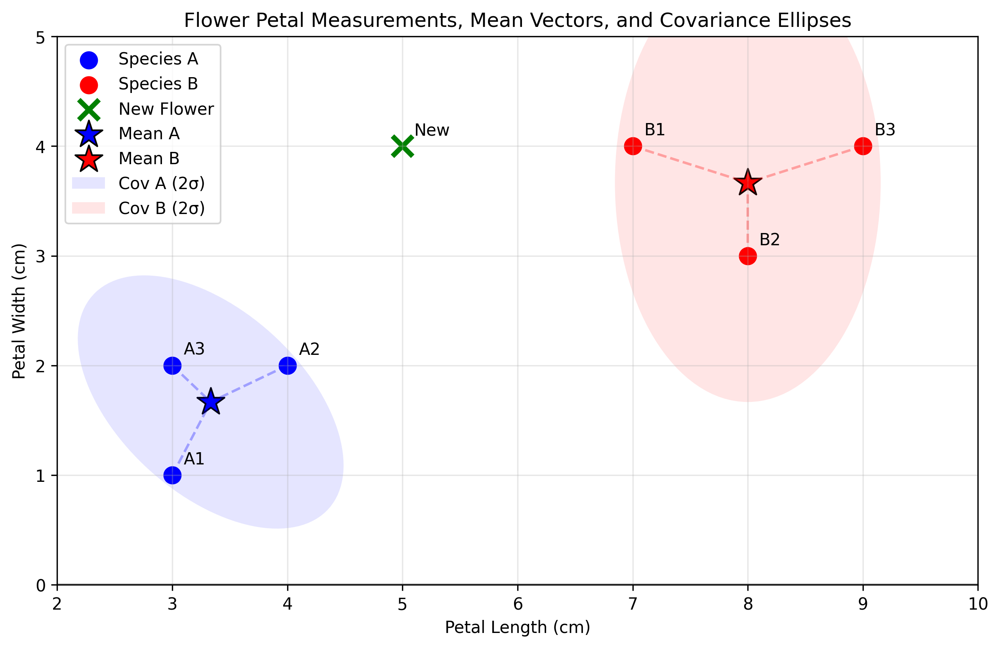
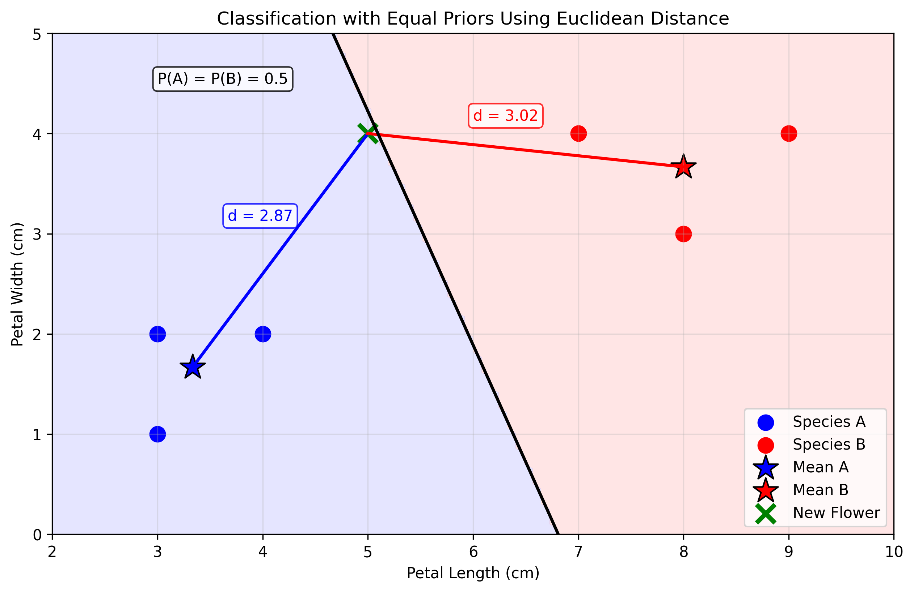
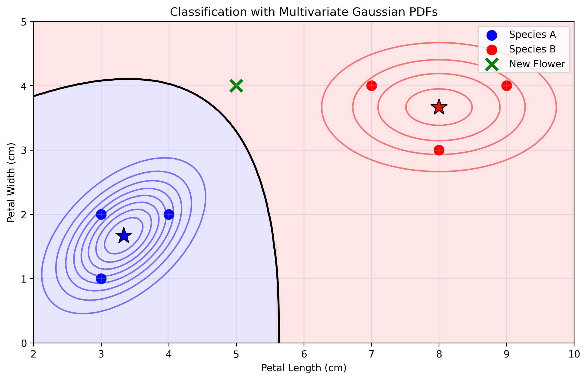
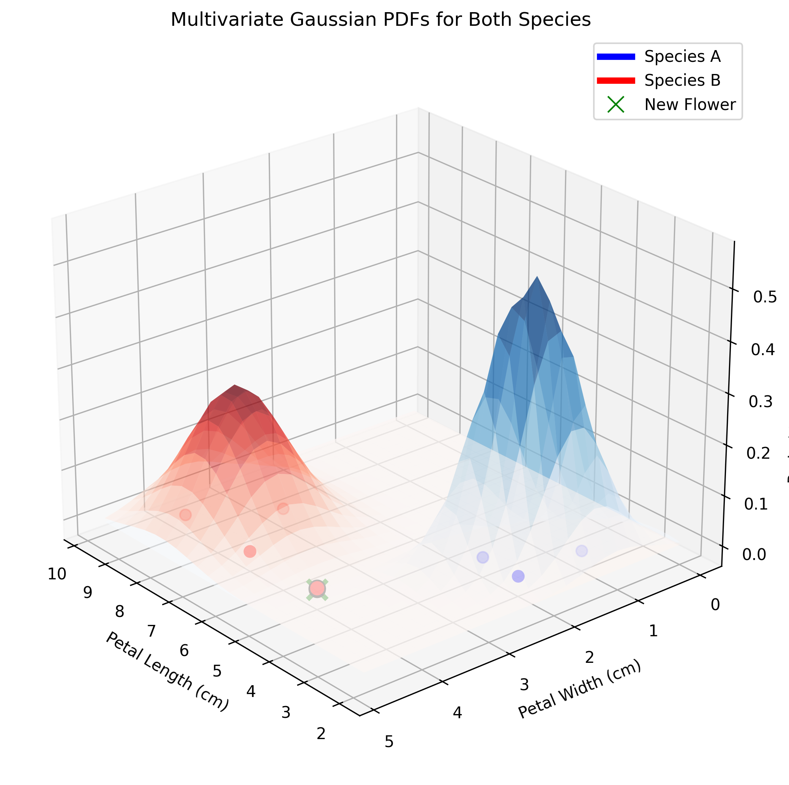
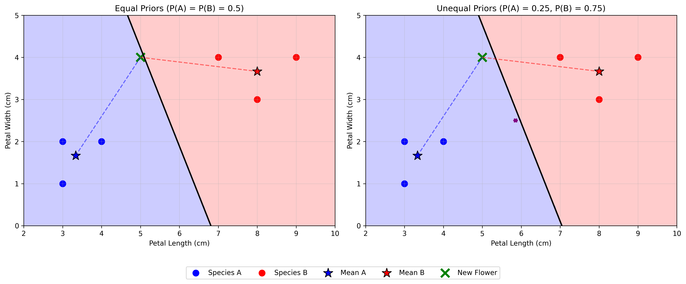
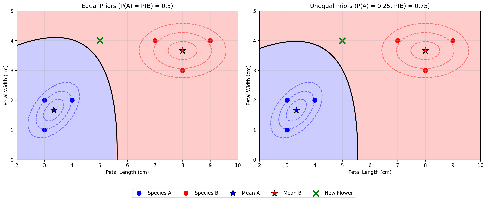

# Question 34: Flower Species Classification with Multivariate Gaussian

## Problem Statement
Consider two species of flowers with the following petal measurements (length, width) in centimeters:

**Species A:** $\mathbf{x}^{(1)}=\begin{bmatrix} 3 \\ 1 \end{bmatrix}$, $\mathbf{x}^{(2)}=\begin{bmatrix} 4 \\ 2 \end{bmatrix}$, $\mathbf{x}^{(3)}=\begin{bmatrix} 3 \\ 2 \end{bmatrix}$  
**Species B:** $\mathbf{x}^{(1)}=\begin{bmatrix} 7 \\ 4 \end{bmatrix}$, $\mathbf{x}^{(2)}=\begin{bmatrix} 8 \\ 3 \end{bmatrix}$, $\mathbf{x}^{(3)}=\begin{bmatrix} 9 \\ 4 \end{bmatrix}$

Assume these measurements follow a multivariate Gaussian distribution for each species.

### Task
1. Calculate the mean vector and covariance matrix for each species
2. Using just the mean vectors and assuming equal prior probabilities, classify a new flower with measurements $\mathbf{x}_{\text{new}} = \begin{bmatrix} 5 \\ 4 \end{bmatrix}$ by computing the Euclidean distance to each mean
3. Using the multivariate Gaussian probability density function, classify the new flower with equal prior probabilities
4. If Species B is three times more common than Species A in this region (i.e., $P(\text{Species A}) = 0.25$ and $P(\text{Species B}) = 0.75$), would your classification change using either method? Explain briefly.

## Understanding the Problem

In this problem, we need to classify a new flower specimen based on its petal measurements using two approaches: (1) the nearest mean approach with Euclidean distance and (2) the multivariate Gaussian model that accounts for the covariance structure of the data. We'll perform the classification first assuming equal prior probabilities, then consider the case where one species is more common than the other.

The problem involves concepts from:
- Feature representation in machine learning (using petal measurements)
- Mean vector and covariance matrix calculation
- Euclidean distance as a similarity measure
- Multivariate Gaussian probability density function
- Bayesian classification with prior probabilities

## Solution

### Step 1: Calculate the mean vectors and covariance matrices for each species

The mean vector for each species is calculated by taking the average of all feature vectors in that class:

$$\boldsymbol{\mu} = \frac{1}{n} \sum_{i=1}^{n} \mathbf{x}^{(i)}$$

For **Species A**, we have:
$$\boldsymbol{\mu}^{(A)} = \frac{1}{3}\left(\begin{bmatrix} 3 \\ 1 \end{bmatrix} + \begin{bmatrix} 4 \\ 2 \end{bmatrix} + \begin{bmatrix} 3 \\ 2 \end{bmatrix}\right) = \begin{bmatrix} 3.33 \\ 1.67 \end{bmatrix}$$

For **Species B**, we have:
$$\boldsymbol{\mu}^{(B)} = \frac{1}{3}\left(\begin{bmatrix} 7 \\ 4 \end{bmatrix} + \begin{bmatrix} 8 \\ 3 \end{bmatrix} + \begin{bmatrix} 9 \\ 4 \end{bmatrix}\right) = \begin{bmatrix} 8.00 \\ 3.67 \end{bmatrix}$$

The covariance matrix is calculated as:

$$\boldsymbol{\Sigma} = \frac{1}{n-1} \sum_{i=1}^{n} (\mathbf{x}^{(i)} - \boldsymbol{\mu})(\mathbf{x}^{(i)} - \boldsymbol{\mu})^T$$

For **Species A**, the covariance matrix is:
$$\boldsymbol{\Sigma}^{(A)} = \begin{bmatrix} 0.333 & 0.167 \\ 0.167 & 0.333 \end{bmatrix}$$

For **Species B**, the covariance matrix is:
$$\boldsymbol{\Sigma}^{(B)} = \begin{bmatrix} 1.000 & 0.000 \\ 0.000 & 0.333 \end{bmatrix}$$

These covariance matrices tell us about the spread and correlation of the features:
- For Species A, there is a positive correlation between length and width (0.167)
- For Species B, there is no correlation between length and width (0)
- Species B has greater variance in petal length (1.0) compared to Species A (0.333)
- Both species have the same variance in petal width (0.333)

The figure shows the data points for each species, their means (marked with stars), and the covariance ellipses (representing 2 standard deviations). Notice how the covariance ellipse for Species B is stretched horizontally, indicating higher variance in the x-direction (petal length) with no correlation, while Species A has a covariance ellipse tilted at an angle, indicating correlation between the variables.

### Step 2: Classification with Euclidean distance and equal prior probabilities

To classify the new flower using Euclidean distance, we calculate the distance between its feature vector and each species' mean vector:

$$d(\mathbf{x}, \boldsymbol{\mu}) = \sqrt{\sum_{i=1}^{n} (x_i - \mu_i)^2}$$

For our new flower $\mathbf{x}_{\text{new}} = \begin{bmatrix} 5 \\ 4 \end{bmatrix}$, we calculate:

Distance to Species A mean:
$$d(\mathbf{x}_{\text{new}}, \boldsymbol{\mu}^{(A)}) = \sqrt{(5 - 3.33)^2 + (4 - 1.67)^2} = \sqrt{1.67^2 + 2.33^2} = \sqrt{8.22} = 2.87$$

Distance to Species B mean:
$$d(\mathbf{x}_{\text{new}}, \boldsymbol{\mu}^{(B)}) = \sqrt{(5 - 8.00)^2 + (4 - 3.67)^2} = \sqrt{(-3.00)^2 + (0.33)^2} = \sqrt{9.11} = 3.02$$

Since $d(\mathbf{x}_{\text{new}}, \boldsymbol{\mu}^{(A)}) < d(\mathbf{x}_{\text{new}}, \boldsymbol{\mu}^{(B)})$, we classify the new flower as **Species A** when using Euclidean distance with equal prior probabilities. The difference in distances is small (3.02 - 2.87 = 0.15), but sufficient to make the classification.

With equal priors using the Euclidean distance approach, the decision boundary is where points are equidistant from both means. As seen in the visualization, the new flower falls on the Species A side of this boundary (blue region). The blue and red shaded regions correctly represent the areas where points would be classified as Species A and Species B respectively, based on which mean they are closer to.

### Step 3: Classification with multivariate Gaussian PDF and equal prior probabilities

The multivariate Gaussian probability density function (PDF) is given by:

$$p(\mathbf{x}|\boldsymbol{\mu}, \boldsymbol{\Sigma}) = \frac{1}{(2\pi)^{d/2}|\boldsymbol{\Sigma}|^{1/2}} \exp\left(-\frac{1}{2}(\mathbf{x} - \boldsymbol{\mu})^T \boldsymbol{\Sigma}^{-1} (\mathbf{x} - \boldsymbol{\mu})\right)$$

where:
- $d$ is the dimension of the feature vector (in our case, $d=2$)
- $|\boldsymbol{\Sigma}|$ is the determinant of the covariance matrix
- $\boldsymbol{\Sigma}^{-1}$ is the inverse of the covariance matrix
- The exponent term $(\mathbf{x} - \boldsymbol{\mu})^T \boldsymbol{\Sigma}^{-1} (\mathbf{x} - \boldsymbol{\mu})$ is known as the squared Mahalanobis distance

Unlike the Euclidean distance, the Mahalanobis distance accounts for the correlation between variables and the variance in each dimension, making it more appropriate when the features have different scales or are correlated.

For our new flower, we calculate:

PDF value for Species A:
$$p(\mathbf{x}_{\text{new}}|\boldsymbol{\mu}^{(A)}, \boldsymbol{\Sigma}^{(A)}) = 0.0000950$$

PDF value for Species B:
$$p(\mathbf{x}_{\text{new}}|\boldsymbol{\mu}^{(B)}, \boldsymbol{\Sigma}^{(B)}) = 0.0025922$$

Likelihood ratio (A:B): $\frac{p(\mathbf{x}_{\text{new}}|\boldsymbol{\mu}^{(A)}, \boldsymbol{\Sigma}^{(A)})}{p(\mathbf{x}_{\text{new}}|\boldsymbol{\mu}^{(B)}, \boldsymbol{\Sigma}^{(B)})} = 0.0366$

Since $p(\mathbf{x}_{\text{new}}|\boldsymbol{\mu}^{(A)}, \boldsymbol{\Sigma}^{(A)}) < p(\mathbf{x}_{\text{new}}|\boldsymbol{\mu}^{(B)}, \boldsymbol{\Sigma}^{(B)})$, we classify the new flower as **Species B** when using the multivariate Gaussian PDF with equal prior probabilities.

Interestingly, this gives us a different classification result than the Euclidean distance method. The Gaussian PDF method suggests that the flower is significantly more likely to belong to Species B (about 27 times more likely) despite being slightly closer to Species A's mean in terms of Euclidean distance.

The contour lines represent the probability density function of each class. The decision boundary (solid black line) is where the two PDFs are equal. Note that the decision boundary is quite different from the one obtained using Euclidean distance because it accounts for the different covariance structures of the two species. The new flower (green 'x') falls on the Species B side of this boundary (red region).

The 3D visualization of the probability density functions gives a clearer picture of how the multivariate Gaussian models represent the data:

Each surface represents the probability density function for one species, with height indicating the probability density at each point in the feature space. The new flower (green 'x') is positioned in a region where the PDF value for Species B is higher than for Species A.

### Step 4: Classification with unequal prior probabilities

When Species B is three times more common than Species A, we have:
- $P(\text{Species A}) = 0.25$
- $P(\text{Species B}) = 0.75$

To incorporate these priors into our classification, we use Bayes' theorem:

$$P(C_i|\mathbf{x}) \propto P(\mathbf{x}|C_i) \cdot P(C_i)$$

#### 4.1 Using Euclidean distance proxy

For the Euclidean distance method, we can use a common approach of modeling the likelihood with an exponential function of the negative squared distance:

$$P(\mathbf{x}|C_i) \propto \exp(-d(\mathbf{x}, \boldsymbol{\mu}^{(i)})^2)$$

Likelihood proxy for Species A: $\exp(-2.87^2) = 0.000269$
Likelihood proxy for Species B: $\exp(-3.02^2) = 0.000110$

Posterior probabilities:
$$P(\text{Species A}|\mathbf{x}_{\text{new}}) = \frac{0.000269 \times 0.25}{0.000269 \times 0.25 + 0.000110 \times 0.75} = 0.447760$$
$$P(\text{Species B}|\mathbf{x}_{\text{new}}) = \frac{0.000110 \times 0.75}{0.000269 \times 0.25 + 0.000110 \times 0.75} = 0.552240$$

With unequal priors using the Euclidean distance method, the new flower is classified as **Species B** with about 55% confidence.

The visualization shows how the decision boundary shifts when we consider unequal prior probabilities. The left panel shows the boundary with equal priors, where the new flower (green X) falls on the Species A side (blue region), as it is closer to the Species A mean (2.87 vs. 3.02). 

The right panel shows the boundary with unequal priors. When we factor in that Species B is three times more common, the decision boundary moves toward the Species A region, effectively shrinking it. This represents the Bayesian principle that we need stronger evidence (closer distance) to classify a sample as the less common class.

The decision rule with unequal priors becomes:
- Classify as Species A if: $d(\mathbf{x}, \boldsymbol{\mu}^{(A)})^2 - d(\mathbf{x}, \boldsymbol{\mu}^{(B)})^2 < 2\ln\left(\frac{P(\text{Species B})}{P(\text{Species A})}\right)$

With our prior ratio of 3:1, the threshold term on the right becomes $2\ln(3) \approx 2.2$. The squared distance difference for our new flower is approximately -0.89, which is less than the threshold of 2.2, so the classification changes from Species A (with equal priors) to Species B (with unequal priors). The posterior probability gives us approximately 55% confidence in this classification.

#### 4.2 Using multivariate Gaussian PDF

For the multivariate Gaussian method, we directly use the PDF values as likelihoods:

Posterior probabilities:
$$P(\text{Species A}|\mathbf{x}_{\text{new}}) = \frac{0.0000950 \times 0.25}{0.0000950 \times 0.25 + 0.0025922 \times 0.75} = 0.012063$$
$$P(\text{Species B}|\mathbf{x}_{\text{new}}) = \frac{0.0025922 \times 0.75}{0.0000950 \times 0.25 + 0.0025922 \times 0.75} = 0.987937$$

With unequal priors using the multivariate Gaussian PDF method, the new flower is classified as **Species B** with about 99% confidence.

This visualization demonstrates the impact of prior probabilities on our classification. The left panel shows that even with equal priors, the Gaussian PDF method classifies the new flower as Species B with high confidence, as the PDF value for Species B is approximately 27 times higher than for Species A.

When we change from equal priors to making Species B three times more common (right panel), the Gaussian PDF classification remains Species B but with even higher confidence (99% compared to about 97% with equal priors). The decision boundary shifts toward Species A, expanding the region classified as Species B (red region) to reflect our prior knowledge that Species B is more common.

The multivariate Gaussian PDFs for both species can be visualized in 3D, showing the probability density at each point in the feature space:

This 3D visualization shows why the new flower (green X) has a much higher probability under Species B's distribution. The blue surface represents the probability density function for Species A, while the red surface represents Species B. The vertical blue and red dashed lines from the new flower point up to the respective surfaces show the PDF values for each species. As can be seen, the PDF value at the new flower's location is about 27 times higher for Species B than for Species A, making the classification highly confident even before incorporating the unequal priors.

The key insight here is that while the Euclidean distance classification changed from Species A to Species B when incorporating the unequal priors, the Gaussian PDF method already strongly favored Species B even with equal priors, and this preference became even stronger with unequal priors. This highlights how the Gaussian model, by accounting for the covariance structure of the data, can provide more robust classification decisions that are less susceptible to changes in prior probabilities when the evidence is strong enough.

## Key Insights

### Theoretical Foundations
- **Multivariate Gaussian Model**: The multivariate Gaussian distribution provides a principled way to model the distribution of continuous features, accounting for their correlation structure and variance.
- **Euclidean vs. Mahalanobis Distance**: While Euclidean distance treats all dimensions equally, Mahalanobis distance (used in the multivariate Gaussian PDF) weights dimensions based on their variance and accounts for correlation.
- **Bayes' Theorem**: Allows us to combine prior knowledge about class frequencies with observed data to make optimal decisions.

### Practical Applications
- **Covariance Structure**: The covariance matrices revealed different patterns for each species - Species A has correlated features while Species B has uncorrelated features. This information is utilized in the multivariate Gaussian approach but ignored in the simple Euclidean distance approach.
- **Decision Boundaries**: 
  - With the Euclidean distance method, the decision boundary is a straight line (perpendicular bisector)
  - With the multivariate Gaussian method, the boundary can be curved, reflecting the different covariance structures
  - With unequal priors, both boundaries shift toward the less probable class
  - Different methods can lead to different classifications, especially for points near the decision boundary

### Critical Analysis
- **Conflicting Classifications**: This problem highlights how different classification methods can lead to different results. The new flower is classified as Species A using Euclidean distance but as Species B using the Gaussian PDF.
- **Impact of Feature Scale and Correlation**: The higher width value (4) of the new flower appears to be much better explained by Species B's distribution, which has greater flexibility in the width dimension due to its covariance pattern. This is captured by the Gaussian PDF but not by the simpler Euclidean distance.
- **Prior Probabilities vs. Likelihood**: Even a strong prior (0.75 vs 0.25) was not enough to overcome the strong likelihood ratio provided by the PDF model, demonstrating that with sufficient evidence, we can overcome strong prior beliefs.

### Mathematical Formulation
- The Euclidean distance classification rule with priors can be expressed as:
  - Classify as Species A if: $d(\mathbf{x}, \boldsymbol{\mu}^{(A)})^2 - d(\mathbf{x}, \boldsymbol{\mu}^{(B)})^2 < 2\ln\left(\frac{P(\text{Species B})}{P(\text{Species A})}\right)$
  
- The multivariate Gaussian classification rule with priors can be expressed as:
  - Classify as Species A if: $\ln\frac{p(\mathbf{x}|\boldsymbol{\mu}^{(A)}, \boldsymbol{\Sigma}^{(A)})}{p(\mathbf{x}|\boldsymbol{\mu}^{(B)}, \boldsymbol{\Sigma}^{(B)})} > \ln\frac{P(\text{Species B})}{P(\text{Species A})}$

## Conclusion

In this problem, we demonstrated two classification methods for multivariate Gaussian data:

1. **Euclidean Distance Method**:
   - We calculated the mean vectors for each species: $\boldsymbol{\mu}^{(A)} = \begin{bmatrix} 3.33 \\ 1.67 \end{bmatrix}$ and $\boldsymbol{\mu}^{(B)} = \begin{bmatrix} 8.00 \\ 3.67 \end{bmatrix}$
   - The distances from the new flower to each mean were: $d(\mathbf{x}_{\text{new}}, \boldsymbol{\mu}^{(A)}) = 2.87$ and $d(\mathbf{x}_{\text{new}}, \boldsymbol{\mu}^{(B)}) = 3.02$
   - With equal priors, this method classified the new flower as Species A (since 2.87 < 3.02)
   - With unequal priors (Species B is three times more common), this method classified the new flower as Species B with 55% confidence

2. **Multivariate Gaussian PDF Method**:
   - We calculated both mean vectors and covariance matrices: $\boldsymbol{\Sigma}^{(A)} = \begin{bmatrix} 0.333 & 0.167 \\ 0.167 & 0.333 \end{bmatrix}$ and $\boldsymbol{\Sigma}^{(B)} = \begin{bmatrix} 1.000 & 0.000 \\ 0.000 & 0.333 \end{bmatrix}$
   - The PDF values for the new flower were: $p(\mathbf{x}_{\text{new}}|\text{Species A}) = 0.0000950$ and $p(\mathbf{x}_{\text{new}}|\text{Species B}) = 0.0025922$
   - With equal priors, this method classified the new flower as Species B (as the PDF for B is about 27 times higher)
   - With unequal priors, this method classified the new flower as Species B with 99% confidence

When we incorporated the unequal prior probabilities (Species B being three times more common), the classification from the Euclidean distance method changed from Species A to Species B, with moderate confidence (55%). For the Gaussian PDF method, the classification remained Species B but with even higher confidence (99%).

This example demonstrates several important concepts:

1. **Different Decision Boundaries**: 
   - The Euclidean distance method creates a boundary where points are equidistant from both means
   - The Gaussian PDF method creates a more complex boundary that accounts for the covariance structure of each class
   - These different approaches can lead to different classifications for the same point

2. **Effect of Priors on Decision Boundaries**: 
   - When we introduce unequal priors, both decision boundaries shift toward the less probable class (Species A)
   - This shift reflects the Bayesian principle that we need stronger evidence to classify a sample as belonging to a less common class
   - For our example, this shift was significant enough to change the Euclidean distance classification

3. **Role of Covariance Structure**:
   - The multivariate Gaussian approach accounts for the different variance and correlation patterns in each species
   - Species A has correlated features, while Species B has uncorrelated features with higher variance in petal length
   - This information helps explain why the new flower, despite being closer to Species A's mean in Euclidean space, is more likely to belong to Species B according to the PDF method

This example demonstrates how incorporating the full covariance structure and prior probabilities provides a more nuanced and potentially more accurate classification approach compared to simple distance-based methods. 

## Related Examples

For the foundational approach to multivariate Gaussian classification with equal prior probabilities, see [[L2_1_31_explanation_population]], which was covered in our class lectures. This example introduces the basic concepts of Bayesian classification with multivariate Gaussian distributions using a simpler scenario.

For applications of multivariate Gaussian classification with MAP estimation and unequal prior probabilities, see [[L2_7_27_explanation]]. This example extends these concepts by focusing on real-time classification systems and precomputation strategies for efficient implementation.

For a case with non-singular covariance matrices that results in quadratic decision boundaries, see [[L2_7_28_explanation]]. This extension demonstrates how having different covariance structures between classes affects the classification process and the geometry of the decision boundaries. 