# Question 35: Covariance Concepts True/False

## Problem Statement
Evaluate whether each of the following statements is TRUE or FALSE. Justify your answer with a brief explanation.

## Task
1. For a multivariate normal distribution, a diagonal covariance matrix implies that the variables are uncorrelated, resulting in probability density contours that are axis-aligned ellipses (or circles if variances are equal).
2. Covariance measures the tendency of two random variables to vary together; a positive value indicates they tend to increase or decrease together, while a negative value indicates one tends to increase as the other decreases.
3. All valid covariance matrices must be positive semi-definite, meaning $\text{Var}(a^T X) = a^T \Sigma a \geq 0$ for any vector $a$.
4. A covariance matrix is strictly positive definite if and only if all its eigenvalues are strictly positive; this condition guarantees the matrix is invertible.
5. Covariance only quantifies the strength and direction of the *linear* relationship between two random variables.
6. Zero covariance ($\text{Cov}(X,Y) = 0$) guarantees that the random variables X and Y are statistically independent.
7. The covariance between X and Y can be calculated using the formula $\text{Cov}(X,Y) = E[(X - E[X])(Y - E[Y])] = E[XY] - E[X]E[Y]$.
8. The covariance of a random variable X with itself, $\text{Cov}(X,X)$, is equal to its variance, $\text{Var}(X)$.
9. In a bivariate normal distribution, negative correlation corresponds to probability density contours being tilted primarily along the line $y = -x$.
10. The principal axes of the probability density contours for a multivariate normal distribution align with the eigenvectors of its covariance matrix.
11. Contour lines on a probability density plot connect points having the same probability density value.
12. For any $n \times n$ covariance matrix with eigenvalues $\lambda_1 \geq \lambda_2 \geq \cdots \geq \lambda_n$, the volume of the ellipsoid representing the region within one standard deviation is directly proportional to $\sum_{i=1}^{n} \lambda_i$ rather than $\prod_{i=1}^{n} \lambda_i$.
13. In a multivariate normal distribution, the angle of rotation of probability density contours in a 2D plane is always given by $\theta = \frac{1}{2}\tan^{-1}\left(\frac{2\sigma_{xy}}{\sigma_x^2-\sigma_y^2}\right)$, regardless of whether $\sigma_x^2 = \sigma_y^2$.

## Solution

### Statement 1: Diagonal Covariance Matrix and Axis-Aligned Contours

#### Analysis
When a covariance matrix is diagonal (all off-diagonal elements are zero):
- The variables are uncorrelated
- The probability density contours are aligned with the coordinate axes
- If diagonal elements are equal, contours form circles
- If diagonal elements are unequal, contours form axis-aligned ellipses
- When off-diagonal elements are non-zero, contours form tilted ellipses

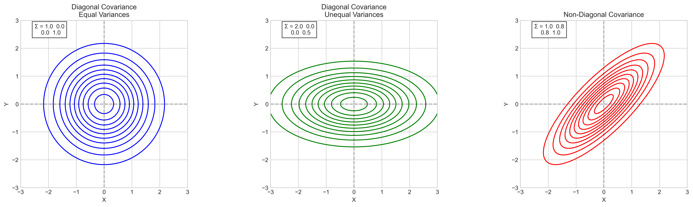

In this figure:
- The left plot shows a diagonal covariance matrix with equal variances, resulting in circular contours
- The middle plot shows a diagonal covariance matrix with unequal variances, resulting in axis-aligned elliptical contours
- The right plot shows a non-diagonal covariance matrix, resulting in tilted elliptical contours

A diagonal covariance matrix means that the variables are uncorrelated, which geometrically results in probability density contours that are aligned with the coordinate axes. If the diagonal elements are equal, these contours form circles; otherwise, they form axis-aligned ellipses with the semi-major and semi-minor axes proportional to the square roots of the variances.

#### Verdict
Statement 1 is **TRUE**. A diagonal covariance matrix implies uncorrelated variables and results in axis-aligned elliptical contours (or circular contours if the diagonal elements are equal).

### Statement 2: Covariance and Variable Relationships

#### Analysis
Covariance measures how two random variables change together:
- Positive covariance: Variables tend to increase or decrease together
  * When $X$ increases, $Y$ tends to increase
  * When $X$ decreases, $Y$ tends to decrease
  * The trend follows a line with positive slope
- Negative covariance: Variables tend to change in opposite directions
  * When $X$ increases, $Y$ tends to decrease
  * When $X$ decreases, $Y$ tends to increase
  * The trend follows a line with negative slope
- Zero covariance: No linear relationship between variables
  * Changes in $X$ are not linearly associated with changes in $Y$
  * The variables appear to be scattered randomly

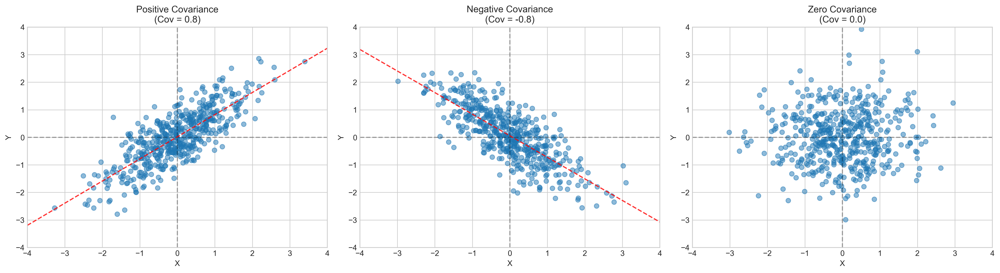

As shown in the figure:
- Left plot: Positive covariance - the variables tend to increase or decrease together
- Middle plot: Negative covariance - when one variable increases, the other tends to decrease
- Right plot: Zero covariance - no linear relationship between the variables

The magnitude of the covariance indicates the strength of the linear relationship, but it is scale-dependent. For a standardized measure, correlation coefficient (which ranges from -1 to 1) is often preferred.

#### Verdict
Statement 2 is **TRUE**. Covariance measures the tendency of variables to vary together, with the sign indicating the direction of the relationship.

### Statement 3: Positive Semi-Definiteness of Covariance Matrices

#### Analysis
For a matrix to be a valid covariance matrix, it must be positive semi-definite:
- Positive definite matrix:
  * All eigenvalues are positive
  * For any non-zero vector $a$, $a^T \Sigma a > 0$
  * The quadratic form creates a paraboloid that never crosses below zero
- Positive semi-definite matrix:
  * All eigenvalues are non-negative (some can be zero)
  * For any vector $a$, $a^T \Sigma a \geq 0$
  * The quadratic form creates a paraboloid that touches but never goes below zero
- Indefinite matrix:
  * Some eigenvalues are negative
  * For some vectors $a$, $a^T \Sigma a < 0$
  * The quadratic form crosses below zero
  * Cannot be a valid covariance matrix since variance cannot be negative

This property ensures that $\text{Var}(a^T X) = a^T \Sigma a \geq 0$ for any linear combination of random variables.

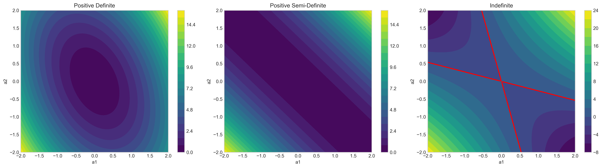

The figure shows:
- Left: A positive definite matrix where $a^T \Sigma a > 0$ for all non-zero $a$
- Middle: A positive semi-definite matrix where $a^T \Sigma a \geq 0$ for all $a$
- Right: An indefinite matrix that cannot be a valid covariance matrix because $a^T \Sigma a < 0$ for some $a$

A key characteristic of positive semi-definite matrices is that all their eigenvalues are non-negative. Indefinite matrices, with some negative eigenvalues, cannot be valid covariance matrices.

#### Verdict
Statement 3 is **TRUE**. All valid covariance matrices must be positive semi-definite to ensure non-negative variances for all linear combinations of random variables.

### Statement 4: Positive Definiteness and Invertibility

#### Analysis
A covariance matrix is strictly positive definite if and only if all its eigenvalues are strictly positive:
- Positive definite matrix:
  * All eigenvalues are strictly positive
  * The determinant is non-zero (product of eigenvalues)
  * The matrix is invertible
  * The probability density contours form a non-degenerate ellipse
  * The eigenvectors show the principal axes of the ellipse
- Positive semi-definite matrix (not positive definite):
  * At least one eigenvalue equals zero
  * The determinant is zero
  * The matrix is not invertible
  * The probability density contours are degenerate (flattened in one direction)

A matrix is invertible if and only if all eigenvalues are non-zero. The determinant equals the product of all eigenvalues, so positive eigenvalues ensure a non-zero determinant.

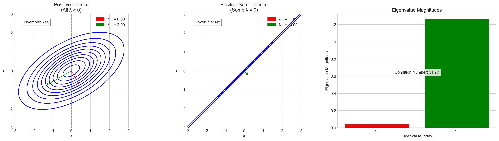

The figure illustrates:
- Left: A positive definite matrix with all eigenvalues strictly positive, resulting in an invertible matrix
- Middle: A positive semi-definite matrix with some zero eigenvalues, which is not invertible
- Right: Visualization of eigenvalue magnitudes and their relationship to invertibility

Invertibility is crucial in many statistical applications, such as calculating the probability density function of a multivariate normal distribution, which requires the inverse of the covariance matrix.

#### Verdict
Statement 4 is **TRUE**. A covariance matrix is strictly positive definite if and only if all its eigenvalues are strictly positive, which guarantees the matrix is invertible.

### Statement 5: Covariance and Linear Relationships

#### Analysis
Covariance only quantifies the strength and direction of linear relationships between variables:
- Linear relationship: 
  * Strong linear trend with high covariance and correlation
  * Covariance/correlation effectively captures the relationship
- Non-linear relationship: 
  * Strong non-linear dependence but low covariance and correlation
  * Covariance misses the non-linear structure completely

How covariance is calculated:
- Green points (in quadrants 1 and 3) contribute positively to covariance
- Red points (in quadrants 2 and 4) contribute negatively to covariance
- For linear relationships, positive contributions (green) dominate
- For non-linear cases, positive and negative contributions often cancel out

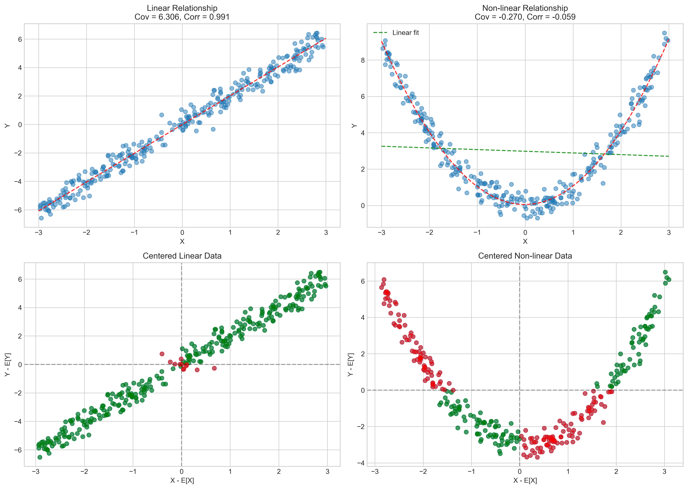

This figure demonstrates:
- Top left: A linear relationship with strong covariance
- Top right: A non-linear (quadratic) relationship with near-zero covariance
- Bottom: Visualization of how covariance is computed as the average product of centered variables, with positive and negative contributions from different quadrants

Covariance measures the average product of centered variables: $E[(X-E[X])(Y-E[Y])]$. Positive contributions come from quadrants where both variables are above or below their means, while negative contributions come from quadrants where one variable is above while the other is below its mean.

For the quadratic relationship shown, despite a clear deterministic relationship between the variables, the covariance is close to zero because the positive and negative contributions cancel out.

#### Verdict
Statement 5 is **TRUE**. Covariance only quantifies the strength and direction of linear relationships between random variables and may miss non-linear dependencies.

### Statement 6: Zero Covariance and Independence

#### Analysis
Zero covariance between $X$ and $Y$ does not guarantee they are statistically independent:
- Truly independent variables:
  * $X$ and $Y$ are independent random variables
  * Their covariance is close to zero
  * No pattern is visible in the scatter plot
- Dependent variables with zero covariance:
  * $Y$ depends on $X$ through a non-linear relationship (e.g., $Y \approx X^2$)
  * Their covariance is close to zero
  * A clear non-linear pattern is visible
  * These variables are strongly dependent despite zero covariance

For independent variables, the joint probability distribution equals the product of the marginal distributions: $P(X,Y) = P(X)P(Y)$. For dependent variables with zero covariance, the joint distribution differs from the product of marginals.

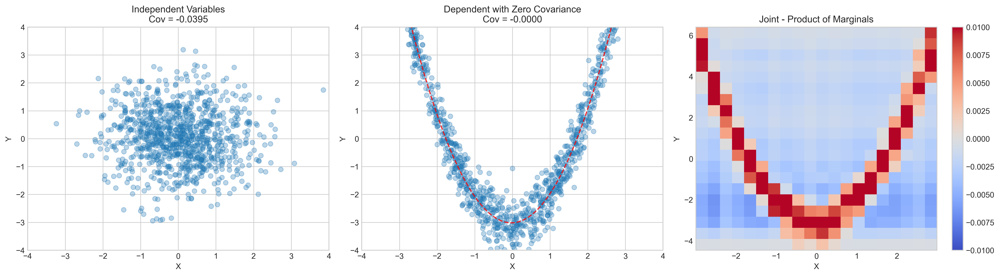

The figure shows:
- Left: Truly independent variables with zero covariance
- Middle: Dependent variables with zero covariance (quadratic relationship)
- Right: Difference between joint distribution and product of marginals (should be zero everywhere for independence)

Only for multivariate normal distributions does zero covariance imply independence.

#### Verdict
Statement 6 is **FALSE**. Zero covariance does not generally guarantee that random variables are statistically independent. It only indicates the absence of a linear relationship.

### Statement 7: Covariance Formula

#### Analysis
The covariance between random variables $X$ and $Y$ can be expressed in two equivalent forms:

1. $\text{Cov}(X,Y) = E[(X - E[X])(Y - E[Y])]$
2. $\text{Cov}(X,Y) = E[XY] - E[X]E[Y]$

The mathematical proof of this equivalence is straightforward:

$$\begin{align}
E[(X - E[X])(Y - E[Y])] &= E[XY - Y\cdot E[X] - X \cdot E[Y] + E[X]E[Y]]\\
&= E[XY] - E[Y \cdot E[X]] - E[X \cdot E[Y]] + E[X]E[Y]\\
&= E[XY] - E[Y] \cdot E[X] - E[X] \cdot E[Y] + E[X]E[Y]\\
&= E[XY] - E[X]E[Y]
\end{align}$$

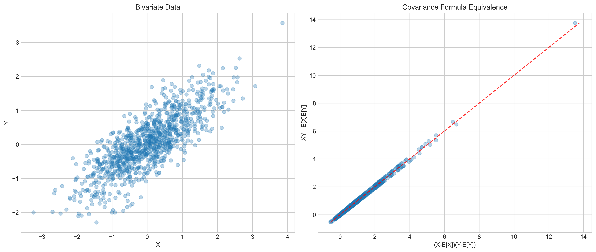

The figure demonstrates the equivalence of these formulations:
- Left: Bivariate data scatter plot
- Right: Scatter plot showing the perfect equivalence between the two formulations (points fall on the y=x line)

#### Verdict
Statement 7 is **TRUE**. The covariance between $X$ and $Y$ can be calculated using either formula: $\text{Cov}(X,Y) = E[(X - E[X])(Y - E[Y])] = E[XY] - E[X]E[Y]$.

### Statement 8: Self-Covariance and Variance

#### Analysis
When calculating the covariance of a random variable with itself, we get the variance:

$$\text{Cov}(X,X) = E[(X-E[X])(X-E[X])] = E[(X-E[X])^2] = \text{Var}(X)$$

Alternative form: 
$$\text{Cov}(X,X) = E[XX] - E[X]E[X] = E[X^2] - (E[X])^2 = \text{Var}(X)$$

The variance is simply a special case of covariance when the two variables are identical.

#### Verdict
Statement 8 is **TRUE**. The covariance of a random variable with itself equals its variance.

### Statement 9: Negative Correlation and Contour Orientation

#### Analysis
In a bivariate normal distribution, the correlation coefficient determines the orientation of the probability density contours.

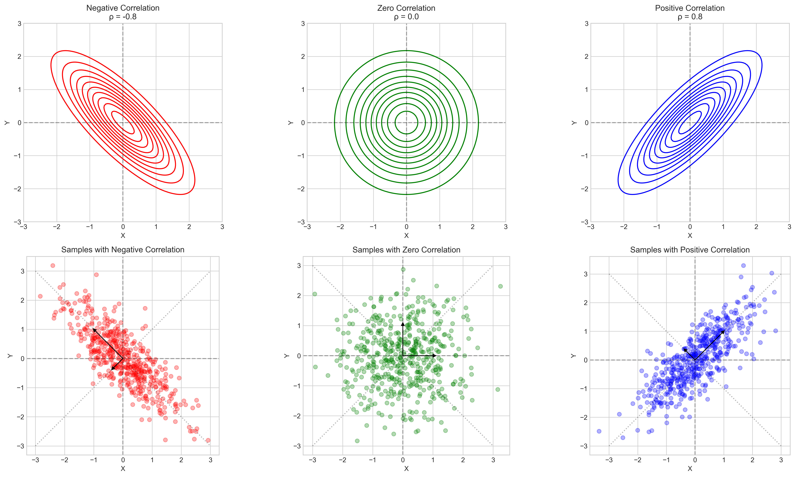

As shown in the figure:
- Left column: Negative correlation ($\rho = -0.8$)
  * Contours are tilted along the line $y = -x$
  * When $X$ increases, $Y$ tends to decrease (negative relationship)
  * Principal axes (eigenvectors) align with the contour ellipse axes
- Middle column: Zero correlation ($\rho = 0.0$)
  * Contours are axis-aligned (no tilt)
  * $X$ and $Y$ vary independently
  * Principal axes align with the coordinate axes
- Right column: Positive correlation ($\rho = 0.8$)
  * Contours are tilted along the line $y = x$
  * When $X$ increases, $Y$ tends to increase (positive relationship)
  * Principal axes align with the contour ellipse axes

With negative correlation, when one variable increases, the other tends to decrease, leading to contours that are elongated in the direction from top-left to bottom-right (along $y = -x$).

#### Verdict
Statement 9 is **TRUE**. In a bivariate normal distribution, negative correlation corresponds to probability density contours being tilted primarily along the line $y = -x$.

### Statement 10: Principal Axes and Eigenvectors

#### Analysis
The principal axes of the probability density contours for a multivariate normal distribution align with the eigenvectors of its covariance matrix.

As shown in the previous figure, the black arrows in the bottom row represent the eigenvectors of the covariance matrix, which align perfectly with the major and minor axes of the elliptical contours.

Eigenvectors point in the directions of maximum and minimum variance, and eigenvalues represent the amount of variance in those directions. The eigenvector corresponding to the largest eigenvalue points in the direction of maximum variance, which is the major axis of the elliptical contours.

#### Verdict
Statement 10 is **TRUE**. The principal axes of the probability density contours for a multivariate normal distribution align with the eigenvectors of its covariance matrix.

### Statement 11: Contour Lines and Probability Density

#### Analysis
Contour lines on a probability density plot connect points that have the same probability density value.

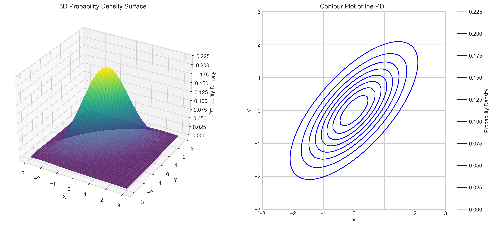

The figure demonstrates:
- Left: 3D surface of a probability density function
- Right: Contour plot showing lines of equal probability density

These contours can be thought of as horizontal "slices" through the 3D probability density surface at constant heights. Each contour represents a set of points with equal probability density.

For a multivariate normal distribution, these contours form ellipses (or circles in special cases).

#### Verdict
Statement 11 is **TRUE**. Contour lines on a probability density plot connect points having the same probability density value.

### Statement 12: Volume of Standard Deviation Ellipsoid

#### Analysis
For an $n \times n$ covariance matrix $\Sigma$ with eigenvalues $\lambda_1, \lambda_2, \ldots, \lambda_n$, the volume of the ellipsoid representing the region within one standard deviation is proportional to the square root of the determinant of the covariance matrix:

$$\text{Volume} \propto \sqrt{\det(\Sigma)} = \sqrt{\prod_{i=1}^{n} \lambda_i}$$

This is because the principal semi-axes of the ellipsoid are proportional to the square roots of the eigenvalues of $\Sigma$. The volume of an ellipsoid with semi-axes $a_1, a_2, \ldots, a_n$ is proportional to $\prod_{i=1}^{n} a_i$, which, in this case, is proportional to $\prod_{i=1}^{n} \sqrt{\lambda_i} = \sqrt{\prod_{i=1}^{n} \lambda_i}$.

The statement incorrectly suggests that the volume is proportional to the sum of eigenvalues, $\sum_{i=1}^{n} \lambda_i$, which is the trace of the covariance matrix. The trace represents the total variance across all dimensions, but does not determine the volume of the standard deviation ellipsoid.

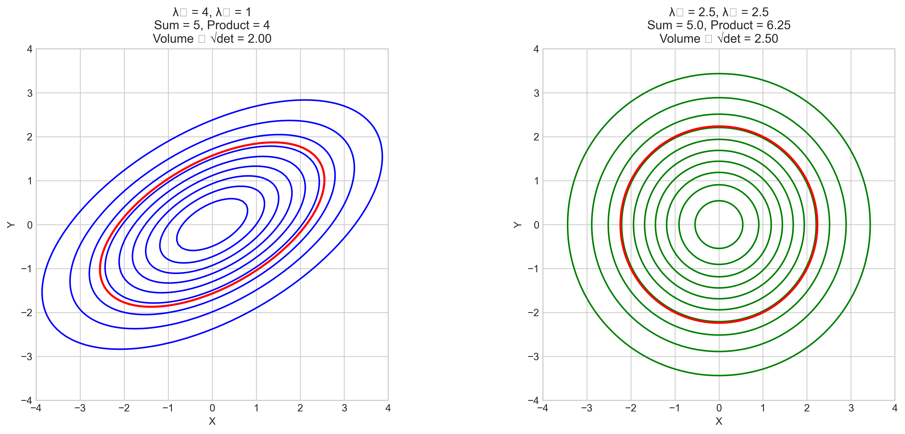

The figure illustrates how the volume of the ellipsoid is affected by the product, not the sum, of eigenvalues. Two ellipsoids with the same sum of eigenvalues but different products have different volumes:
- Left ellipse: eigenvalues $\lambda_1 = 4$, $\lambda_2 = 1$
  * Sum of eigenvalues = 5
  * Product of eigenvalues = 4
  * Volume proportional to $\sqrt{\lambda_1 \cdot \lambda_2} = 2.00$
- Right ellipse: eigenvalues $\lambda_1 = 2.5$, $\lambda_2 = 2.5$
  * Sum of eigenvalues = 5.0
  * Product of eigenvalues = 6.25
  * Volume proportional to $\sqrt{\lambda_1 \cdot \lambda_2} = 2.50$

#### Verdict
Statement 12 is **FALSE**. The volume of the ellipsoid representing the region within one standard deviation is proportional to the square root of the product of eigenvalues (determinant), not the sum of eigenvalues (trace).

### Statement 13: Angle of Rotation of Probability Density Contours

#### Analysis
For a bivariate normal distribution with covariance matrix 
$$\Sigma = \begin{bmatrix} \sigma_x^2 & \sigma_{xy} \\ \sigma_{xy} & \sigma_y^2 \end{bmatrix}$$

the angle of rotation of the probability density contours is given by:

$$\theta = \frac{1}{2}\tan^{-1}\left(\frac{2\sigma_{xy}}{\sigma_x^2-\sigma_y^2}\right)$$

However, this formula is only valid when $\sigma_x^2 \neq \sigma_y^2$. When $\sigma_x^2 = \sigma_y^2$ (i.e., the variances are equal), the formula becomes undefined due to division by zero.

In the special case where variances are equal, the orientation depends only on the sign of the covariance:
- If $\sigma_{xy} > 0$, $\theta = 45°$ (along $y = x$)
- If $\sigma_{xy} < 0$, $\theta = 135°$ (along $y = -x$)
- If $\sigma_{xy} = 0$, contours are circular with no preferred orientation

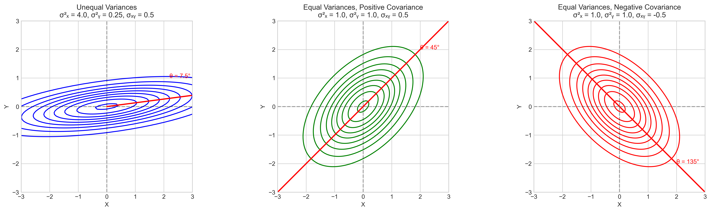

The figure shows:
- Left: Unequal variances case where the formula can be applied
- Middle: Equal variances with positive covariance (45° orientation)
- Right: Equal variances with negative covariance (135° orientation)

#### Verdict
Statement 13 is **FALSE**. The given formula for the angle of rotation is not valid when $\sigma_x^2 = \sigma_y^2$. In this special case, the orientation is determined only by the sign of $\sigma_{xy}$.

## Summary

Out of the 13 statements, 10 are TRUE and 3 are FALSE:

| Statement | Verdict | Explanation |
|-----------|---------|-------------|
| 1 | TRUE | A diagonal covariance matrix means zero correlation between variables, resulting in axis-aligned contours. |
| 2 | TRUE | Covariance measures linear relationships between variables with the sign indicating direction. |
| 3 | TRUE | All valid covariance matrices must be positive semi-definite to ensure non-negative variances. |
| 4 | TRUE | A matrix is positive definite if and only if all eigenvalues are positive, which guarantees invertibility. |
| 5 | TRUE | Covariance only captures linear relationships, not more complex nonlinear dependencies. |
| 6 | FALSE | Zero covariance only implies no linear relationship. Variables can still be dependent in nonlinear ways. |
| 7 | TRUE | These two formulas for covariance are mathematically equivalent. |
| 8 | TRUE | The variance is a special case of covariance when the two variables are identical. |
| 9 | TRUE | Negative correlation results in contours aligned along the negative slope diagonal. |
| 10 | TRUE | Eigenvectors of the covariance matrix define the directions of maximum and minimum variance. |
| 11 | TRUE | Contour lines represent 'slices' of constant height through the probability density function. |
| 12 | FALSE | The volume of standard deviation ellipsoid is proportional to the square root of the product, not the sum, of eigenvalues. |
| 13 | FALSE | The given formula for rotation angle is undefined when variances are equal, not valid in all cases. |

## Key Insights

1. **Covariance and Correlation**: 
   - Covariance measures linear relationships between variables
   - The sign indicates direction (positive/negative relationship)
   - The magnitude indicates strength, but is scale-dependent
   - Correlation is a standardized measure of covariance

2. **Geometric Interpretation**:
   - Diagonal covariance matrices result in axis-aligned elliptical contours
   - Positive correlation tilts contours along $y = x$
   - Negative correlation tilts contours along $y = -x$
   - Principal axes align with eigenvectors of the covariance matrix

3. **Matrix Properties**:
   - Valid covariance matrices must be positive semi-definite (all eigenvalues $\geq 0$)
   - Are invertible if and only if positive definite (all eigenvalues $> 0$)
   - Diagonal elements are variances of individual variables
   - Off-diagonal elements are covariances between pairs of variables

4. **Limitations**:
   - Covariance only captures linear relationships
   - Zero covariance does not imply independence (except for multivariate normal distributions)
   - Non-linear dependencies require other measures beyond covariance

5. **Mathematical Relationships**:
   - $\text{Cov}(X,Y) = E[(X-E[X])(Y-E[Y])] = E[XY] - E[X]E[Y]$
   - $\text{Cov}(X,X) = \text{Var}(X)$
   - For a linear combination $Y = a^T X$, $\text{Var}(Y) = a^T \Sigma a$

Understanding these concepts is crucial for multivariate statistical analysis, machine learning algorithms, and interpreting the relationships between variables in complex datasets. 