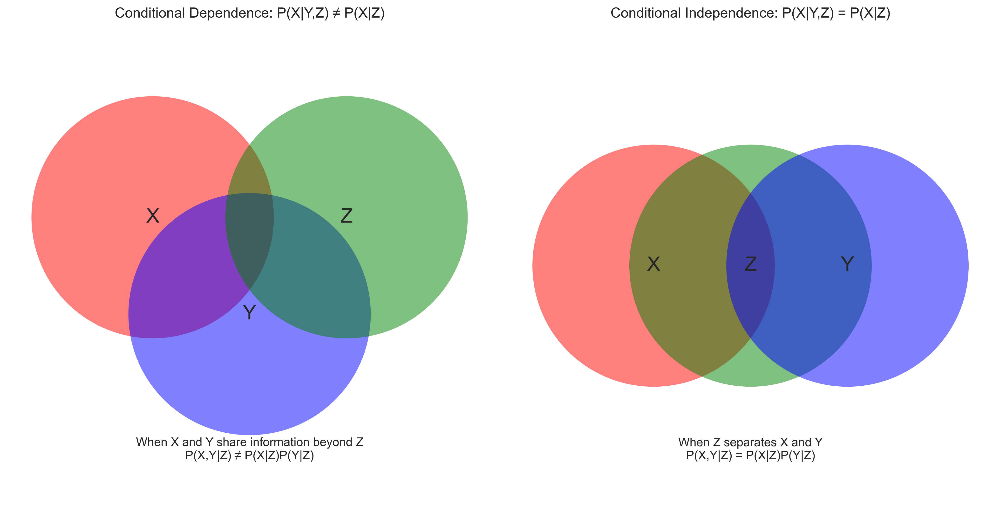
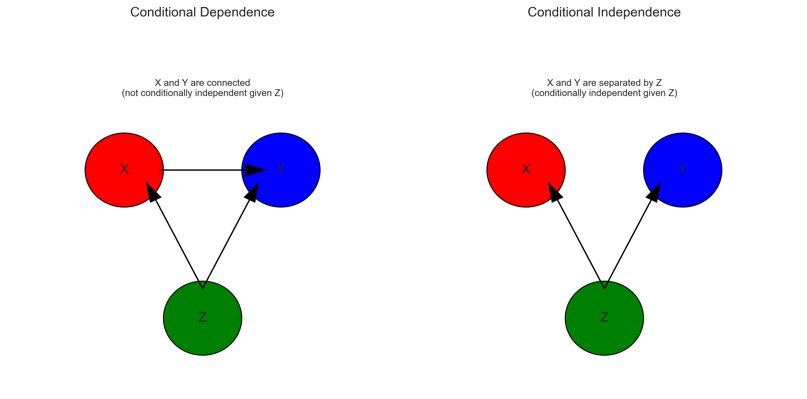
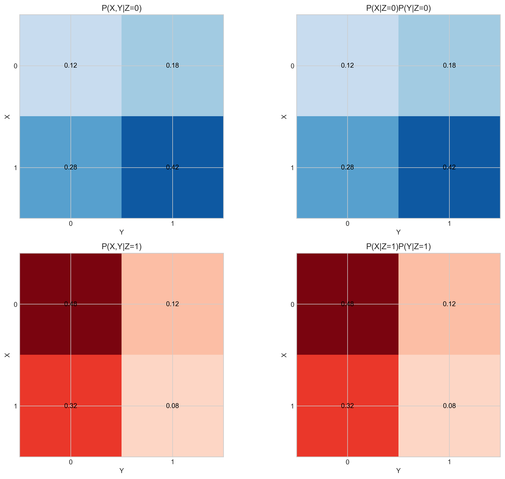

# Question 36: Conditional Independence Property

## Problem Statement
Prove the following property of conditional independence.

### Task
Show that $P(X,Y|Z) = P(X|Z)P(Y|Z)$ if $P(X|Y,Z) = P(X|Z)$.

## Understanding the Problem
The problem asks us to prove a fundamental property of conditional independence. When two random variables X and Y are conditionally independent given Z, their joint probability conditioned on Z can be factored into the product of their individual conditional probabilities. This property is crucial in probabilistic modeling, Bayesian networks, and causal inference.

## Solution

### Step 1: Understand the Definitions
To solve this problem, we need to recall some basic definitions from probability theory:

1. Conditional probability: $P(A|B) = \frac{P(A,B)}{P(B)}$
2. Joint probability conditioned on another variable: $P(A,B|C) = \frac{P(A,B,C)}{P(C)}$
3. Chain rule of probability: $P(A,B) = P(A|B)P(B) = P(B|A)P(A)$

### Step 2: Start with the Left Side
We begin with the left side of the equation we want to prove:
$P(X,Y|Z)$

By the definition of conditional probability, this equals:
$$P(X,Y|Z) = \frac{P(X,Y,Z)}{P(Z)}$$

### Step 3: Apply the Chain Rule
We can rewrite the joint probability $P(X,Y,Z)$ using the chain rule:
$$P(X,Y,Z) = P(X|Y,Z)P(Y,Z)$$

Substituting this into our expression:
$$P(X,Y|Z) = \frac{P(X|Y,Z)P(Y,Z)}{P(Z)}$$

### Step 4: Use the Given Condition
We're given that $P(X|Y,Z) = P(X|Z)$. Substituting this into our expression:
$$P(X,Y|Z) = \frac{P(X|Z)P(Y,Z)}{P(Z)}$$

### Step 5: Complete the Proof
We can further simplify by recognizing that:
$$\frac{P(Y,Z)}{P(Z)} = P(Y|Z)$$

Therefore:
$$P(X,Y|Z) = P(X|Z)P(Y|Z)$$

This completes our proof.

### Common Mistake
Common mistake: $\Pr(X|Y,Z) = \Pr(X|Z) \Rightarrow X \perp Y$ given $Z$
$\Rightarrow \Pr(X,Y|Z) = \Pr(X|Z)\Pr(Y|Z)$

The first $\Rightarrow$ does not hold if the equation is not for all possible values of $X, Y, Z$.

## Visual Explanations

### Conditional Independence Visualization

The left diagram shows a case of conditional dependence, where X and Y share information beyond what Z provides. The right diagram shows conditional independence, where Z effectively separates the information between X and Y.

### Bayesian Network Representation

In Bayesian networks, conditional independence is illustrated by the graph structure. The left network shows a case where X and Y are connected (not conditionally independent given Z). The right network shows X and Y separated by Z, indicating conditional independence.

### Numerical Example Visualization

These heatmaps compare $P(X,Y|Z)$ (left column) with $P(X|Z)P(Y|Z)$ (right column) for Z=0 (top row) and Z=1 (bottom row). The identical patterns in each row confirm that $P(X,Y|Z) = P(X|Z)P(Y|Z)$ when X and Y are conditionally independent given Z.

## Key Insights

### Theoretical Foundations
- Conditional independence is formally defined as $P(X|Y,Z) = P(X|Z)$, meaning that once Z is known, Y provides no additional information about X.
- When X and Y are conditionally independent given Z, their joint probability conditioned on Z can be factored: $P(X,Y|Z) = P(X|Z)P(Y|Z)$.
- This property simplifies probabilistic models by reducing the number of parameters needed to specify joint distributions.

### Practical Applications
- Bayesian networks use conditional independence to represent complex joint probability distributions efficiently.
- In causal inference, conditional independence properties help identify causal relationships between variables.
- Machine learning algorithms like Naive Bayes classifiers leverage conditional independence assumptions to make classification tractable.

### Mathematical Implications
- Conditional independence doesn't imply marginal independence (i.e., $P(X|Y,Z) = P(X|Z)$ doesn't mean $P(X|Y) = P(X)$).
- The factorization of joint probabilities enables efficient computation in large probabilistic models.
- When building graphical models, conditional independence properties guide the structure of the graph.

## Conclusion
- We've proven that if $P(X|Y,Z) = P(X|Z)$, then $P(X,Y|Z) = P(X|Z)P(Y|Z)$, confirming a fundamental property of conditional independence.
- Our numerical example demonstrated this property for binary random variables, showing that the joint probability factors exactly when the conditional independence criterion is met.
- This property is crucial for probabilistic modeling, enabling the construction of complex models with manageable parameter spaces through appropriate independence assumptions. 