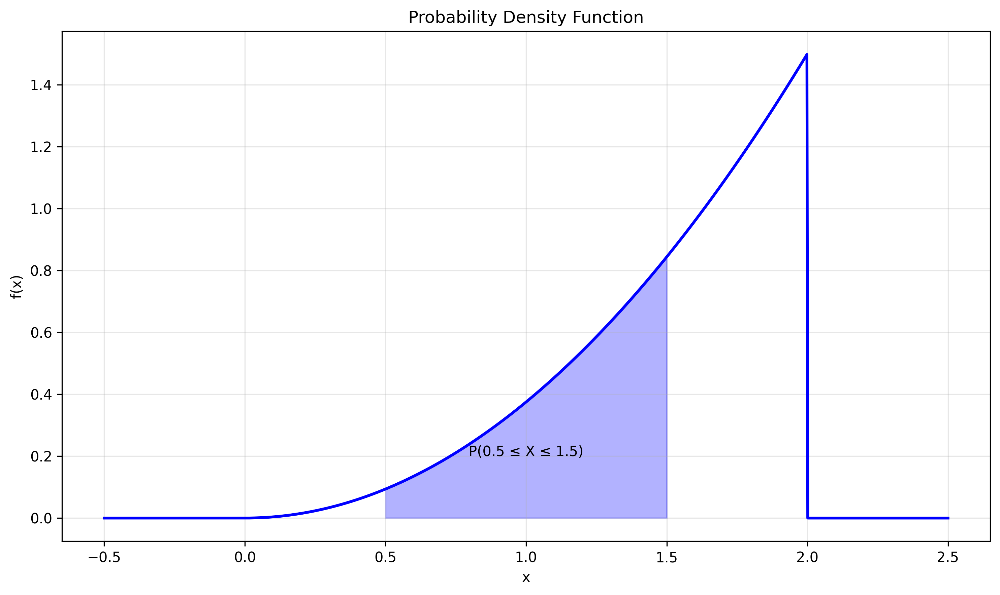
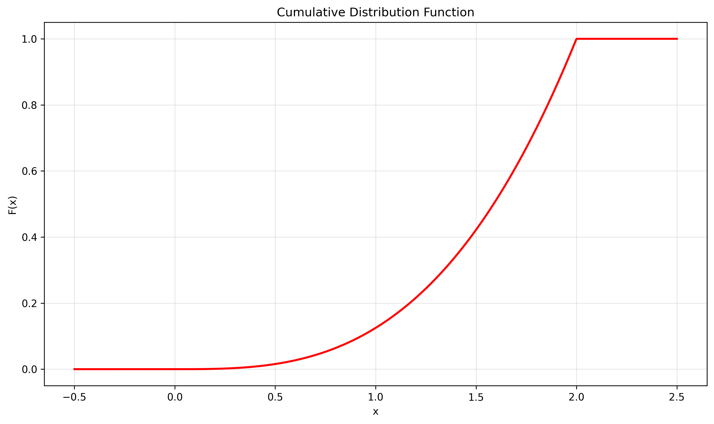

# Question 3: Continuous Random Variable Analysis

## Problem Statement
Consider a continuous random variable $X$ with probability density function (PDF):

$$f_X(x) = \begin{cases} 
cx^2 & \text{for } 0 \leq x \leq 2 \\
0 & \text{otherwise}
\end{cases}$$

### Task
1. Find the value of constant $c$ that makes $f_X(x)$ a valid PDF
2. Calculate $P(0.5 \leq X \leq 1.5)$
3. Find the cumulative distribution function (CDF) $F_X(x)$
4. Calculate the expected value $E[X]$ and variance $Var(X)$

## Understanding the Problem
The given PDF is a power law distribution with support $[0, 2]$, quadratic shape $(x^2)$, and normalization constant $c$.

For $f_X(x)$ to be a valid PDF, it must satisfy two conditions:
1. Non-negativity: $f_X(x) \geq 0$ for all $x$
2. Normalization: $\int f_X(x)dx = 1$ over the support

We need to determine the constant $c$, calculate probabilities for specific intervals, derive the CDF, and find summary statistics like mean and variance.

## Solution

We will find the required elements by applying calculus techniques to the given PDF, including integration to find $c$, probabilities, and moments.

### Step 1: Finding the Constant $c$
To find $c$, we set the integral of the PDF over its support equal to 1:

$$\int_0^2 cx^2 dx = 1$$

Solving this:
$$c \int_0^2 x^2 dx = 1$$
$$c \left[\frac{x^3}{3}\right]_0^2 = 1$$
$$c \left(\frac{8}{3} - 0\right) = 1$$
$$c = \frac{3}{8}$$

### Step 2: Calculating $P(0.5 \leq X \leq 1.5)$
Using the PDF with $c = 3/8$:

$$P(0.5 \leq X \leq 1.5) = \int_{0.5}^{1.5} \frac{3}{8}x^2 dx$$
$$= \frac{3}{8} \left[\frac{x^3}{3}\right]_{0.5}^{1.5}$$
$$= \frac{3}{8} \left(\frac{3.375}{3} - \frac{0.125}{3}\right)$$
$$= \frac{3}{8} \times \frac{3.25}{3} = \frac{3.25}{8} \approx 0.40625$$

### Step 3: Finding the CDF
The CDF $F_X(x)$ is the integral of the PDF from $-\infty$ to $x$:

$$F_X(x) = \begin{cases} 
0 & \text{for } x < 0 \\
\int_0^x \frac{3}{8}t^2 dt = \frac{3}{8} \left[\frac{t^3}{3}\right]_0^x = \frac{x^3}{8} & \text{for } 0 \leq x \leq 2 \\
1 & \text{for } x > 2
\end{cases}$$

### Step 4: Calculating Expected Value and Variance

1. **Expected Value ($E[X]$)**:
$$E[X] = \int_0^2 x \cdot \frac{3}{8}x^2 dx = \frac{3}{8} \int_0^2 x^3 dx$$
$$= \frac{3}{8} \left[\frac{x^4}{4}\right]_0^2 = \frac{3}{8} \times 4 = 1.5$$

2. **Variance ($Var(X)$)**:
First, calculate $E[X^2]$:
$$E[X^2] = \int_0^2 x^2 \cdot \frac{3}{8}x^2 dx = \frac{3}{8} \int_0^2 x^4 dx$$
$$= \frac{3}{8} \left[\frac{x^5}{5}\right]_0^2 = \frac{3}{8} \times \frac{32}{5} = 2.4$$

Then:
$$Var(X) = E[X^2] - (E[X])^2 = 2.4 - (1.5)^2 = 0.15$$

## Visual Explanations

### Probability Density Function

The PDF is shown above with:
- The blue curve representing $f_X(x) = (3/8)x^2$
- The shaded area showing $P(0.5 \leq X \leq 1.5)$
- The support clearly marked from 0 to 2

### Cumulative Distribution Function

The CDF is shown above with:
- The red curve representing $F_X(x) = x^3/8$ for $0 \leq x \leq 2$
- The characteristic S-shape of a power law distribution
- Clear boundaries at 0 and 1

## Key Insights

### PDF Properties
- The PDF is zero outside $[0, 2]$
- The quadratic form means higher probabilities for larger $x$ values
- The area under the curve must equal 1

### CDF Characteristics
- Starts at 0 for $x < 0$
- Increases smoothly from 0 to 1
- Reaches 1 at $x = 2$ and stays there

### Probability Calculations
- The probability of any interval can be found by integrating the PDF
- The CDF provides a direct way to find $P(X \leq x)$
- The expected value shows where the distribution is centered

### Variance Interpretation
- The relatively small variance (0.15) indicates that values are concentrated around the mean
- The distribution is not symmetric, as evidenced by the quadratic form

## Conclusion

The complete solution gives us:
- Normalization constant: $c = 3/8$
- $P(0.5 \leq X \leq 1.5) \approx 0.40625$
- CDF: $F_X(x) = x^3/8$ for $0 \leq x \leq 2$
- Expected value: $E[X] = 1.5$
- Variance: $Var(X) = 0.15$

These results show that the random variable $X$ is more likely to take values closer to 2 than to 0, with an average value of 1.5 and relatively low variability around this mean. 