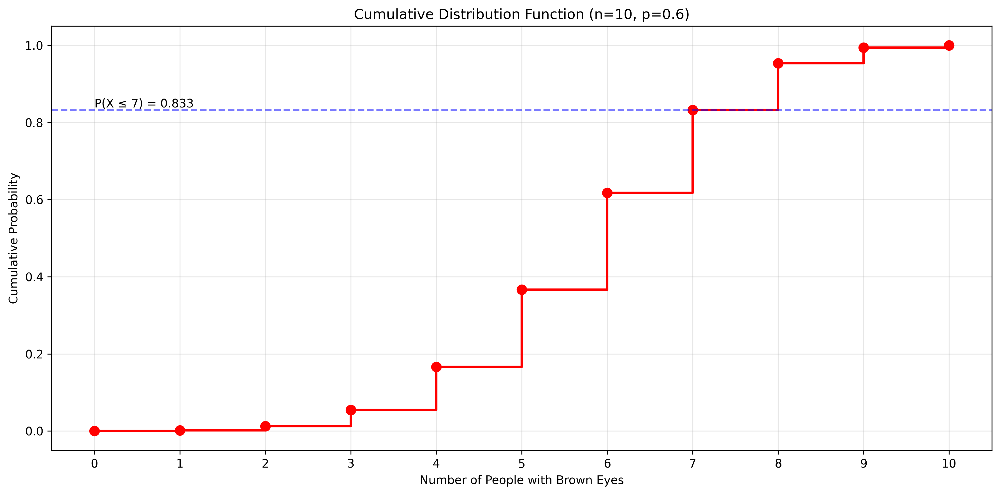

# Question 4: Binomial Distribution Analysis

## Problem Statement
In a certain population, 60% of people have brown eyes. A researcher randomly selects 10 people from this population.

### Task
1. What is the probability that exactly 7 people have brown eyes?
2. What is the probability that at least 8 people have brown eyes?
3. What is the expected number of people with brown eyes in the sample?
4. What is the standard deviation of the number of people with brown eyes?

## Understanding the Problem
This is a classic binomial distribution problem where:
- n = 10 (number of trials/people)
- p = 0.6 (probability of success/having brown eyes)
- X ~ Binomial(n=10, p=0.6)

The probability mass function (PMF) of a binomial distribution is:
$$P(X = k) = \binom{n}{k} p^k (1-p)^{n-k}$$

This problem involves analyzing different aspects of this distribution: finding specific probabilities, calculating expected value, and determining the standard deviation.

## Solution

We'll use the binomial distribution formulas to solve each part of the problem systematically.

### Step 1: Find the probability that exactly 7 people have brown eyes
To find P(X = 7), we use the binomial PMF formula:

$$P(X = 7) = \binom{10}{7} (0.6)^7 (0.4)^3$$
$$= 120 \times 0.0279936 \times 0.064$$
$$\approx 0.2150$$

### Step 2: Find the probability that at least 8 people have brown eyes
For P(X ≥ 8), we calculate:

$$P(X \geq 8) = P(X = 8) + P(X = 9) + P(X = 10)$$
$$= \binom{10}{8} (0.6)^8 (0.4)^2 + \binom{10}{9} (0.6)^9 (0.4)^1 + \binom{10}{10} (0.6)^{10} (0.4)^0$$
$$\approx 0.1209 + 0.0403 + 0.0060$$
$$\approx 0.1672$$

### Step 3: Calculate the expected number of people with brown eyes
The expected value (mean) of a binomial distribution is given by:

$$E[X] = n \times p = 10 \times 0.6 = 6$$

### Step 4: Determine the standard deviation
The standard deviation of a binomial distribution is:

$$\sigma = \sqrt{n \times p \times (1-p)} = \sqrt{10 \times 0.6 \times 0.4} \approx 1.5492$$

## Visual Explanations

### Probability Mass Function

This bar chart shows:
- The probability of each possible outcome (0 to 10 people with brown eyes)
- Highlighted bars for exactly 7 people (light blue) and at least 8 people (light green)
- The most likely outcomes are around the expected value of 6

### Cumulative Distribution Function

The CDF shows:
- The step function nature of the discrete distribution
- The probability of having 7 or fewer people with brown eyes (blue dashed line)
- The complement of this gives P(X ≥ 8)

### Normal Approximation

The plot shows:
- The binomial PMF (blue bars)
- The normal approximation (red curve)
- The mean (green dashed line)
- One standard deviation from the mean (orange dotted lines)

While n=10 is a bit small for a perfect normal approximation, we can see that the distribution is roughly bell-shaped and centered around the mean.

## Key Insights

### Distribution Properties
- The distribution is slightly right-skewed
- The most likely outcomes are around the mean of 6
- The probability decreases as we move away from the mean

### Probability Interpretation
- The probability of exactly 7 people is about 21.5%
- The probability of at least 8 people is about 16.7%
- These probabilities can be calculated using the binomial formula or looked up in tables

### Statistical Measures
- On average, we expect 6 people to have brown eyes
- This makes sense as 60% of 10 is 6
- The standard deviation of about 1.55 tells us how much variation to expect
- Most outcomes will be within 2 standard deviations of the mean (between 3 and 9 people)

## Conclusion

The complete solution gives us:
- P(Exactly 7) ≈ 0.2150
- P(At least 8) ≈ 0.1672
- Expected Value = 6
- Standard Deviation ≈ 1.5492

These results demonstrate the application of binomial distribution concepts to a real-world random sampling problem. The distribution is reasonably symmetric around the mean of 6, with the highest probability at the expected value and decreasing probabilities as we move away from the center. 