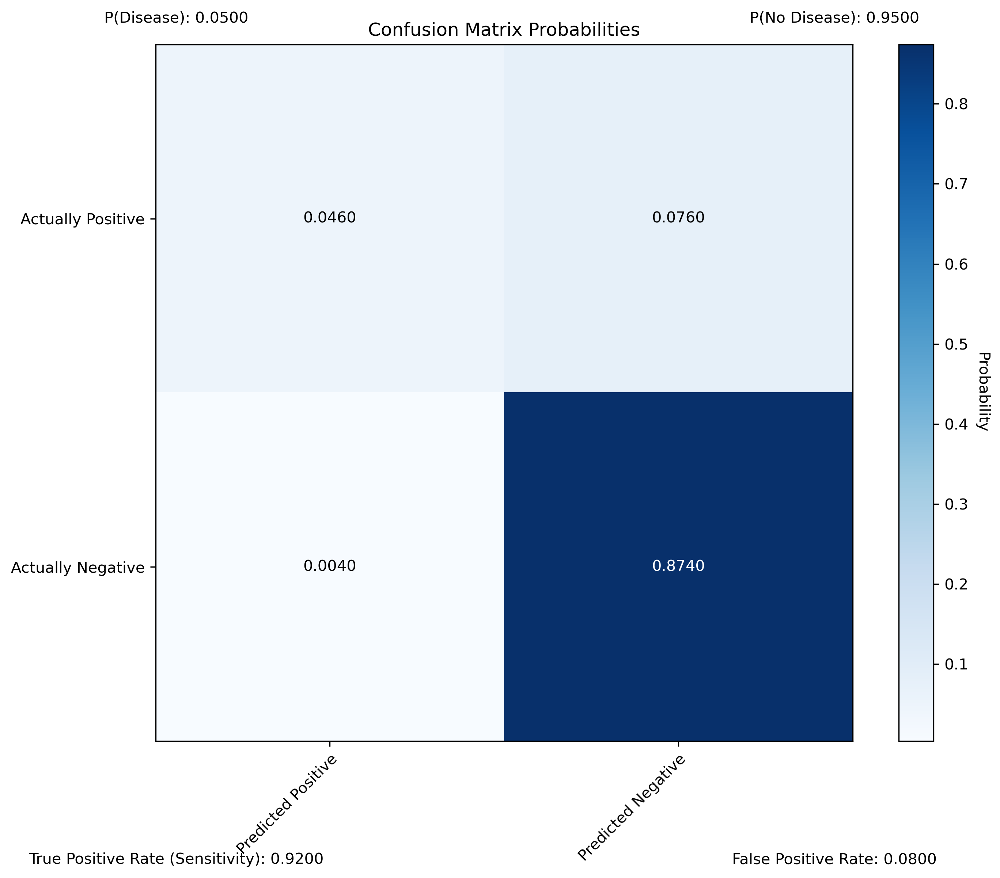
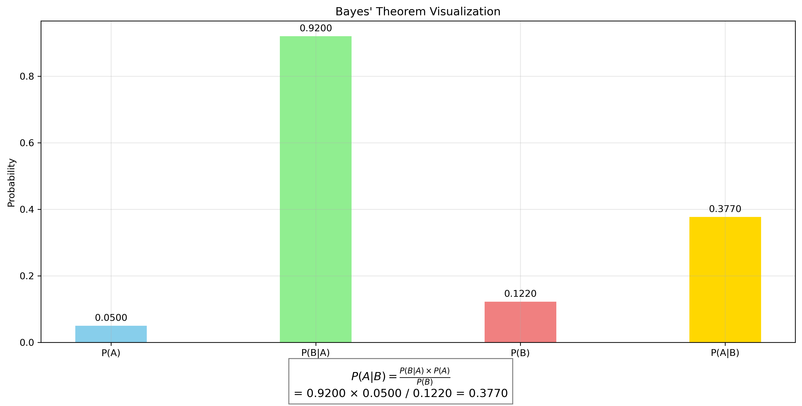
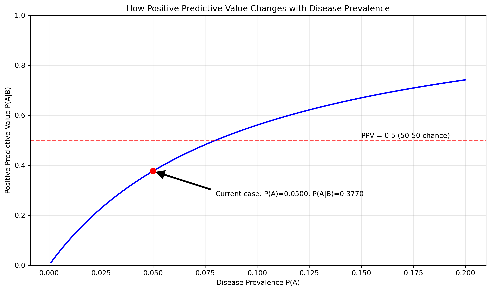

# Question 5: Medical Diagnostics Probability

## Problem Statement
A machine learning model is trained on a dataset containing medical records. Let event A be "the patient has disease X" with $P(A) = 0.05$. Let event B be "the model predicts the patient has disease X". The model has a true positive rate (sensitivity) of 0.92 and a false positive rate of 0.08.

### Task
1. Express the true positive rate and false positive rate using conditional probability notation
2. Calculate P(B)
3. Calculate P(A|B) (the probability that a patient actually has the disease given a positive prediction)
4. Is the model reliable for diagnostic purposes? Explain why or why not.

## Understanding the Problem
This problem examines the application of conditional probability and Bayes' theorem in medical diagnostics. We need to evaluate the reliability of a machine learning model for disease detection by calculating the positive predictive value, which is the probability that a patient with a positive test result actually has the disease.

## Solution

The solution involves applying Bayes' theorem to calculate the positive predictive value from the given information about disease prevalence and test characteristics.

### Step 1: Express probabilities using conditional probability notation
- True positive rate (sensitivity): P(B|A) = 0.92
  This is the probability that the model predicts disease X (B) given that the patient actually has disease X (A).
  
- False positive rate: P(B|not A) = 0.08
  This is the probability that the model predicts disease X (B) given that the patient does not have disease X (not A).

### Step 2: Calculate P(B) using the law of total probability
P(B) = P(B|A)P(A) + P(B|not A)P(not A)
P(B) = 0.92 × 0.05 + 0.08 × 0.95
P(B) = 0.046 + 0.076 = 0.122

The probability of a positive test result is 0.122 or 12.2%.

### Step 3: Calculate P(A|B) using Bayes' theorem
P(A|B) = [P(B|A) × P(A)] / P(B)
P(A|B) = (0.92 × 0.05) / 0.122
P(A|B) = 0.046 / 0.122 = 0.377

The positive predictive value (PPV) is 0.377 or 37.7%.

### Step 4: Evaluate the model's reliability
With a positive predictive value of 37.7%, the model is not reliable for diagnostic purposes. This means that only about 38% of patients who receive a positive test result actually have the disease. In other words, if the model predicts a patient has disease X, there's a 62.3% chance this is a false alarm. For a diagnostic test, we generally want the PPV to be at least greater than 0.5 (50%), ideally much higher.

## Visual Explanations

### Confusion Matrix Probabilities

This visualization shows the joint probabilities of true disease status and test predictions. The upper-left cell (0.0460) represents the probability of a true positive result, while the upper-right cell (0.0760) represents false positives. Note that despite the high sensitivity (92%), the overall probability of a true positive is low because the disease is rare.

### Bayes' Theorem Application

This figure illustrates the application of Bayes' theorem to calculate P(A|B). The four bars represent the key probabilities: P(A), P(B|A), P(B), and P(A|B). The formula at the bottom shows exactly how P(A|B) is calculated from the other three values.

### Positive Predictive Value vs. Disease Prevalence

This graph demonstrates how the positive predictive value (PPV) changes as the disease prevalence changes. The red dot marks our current scenario (P(A) = 0.05, PPV = 0.377). Note that even with high sensitivity and specificity, the PPV remains low when the disease is rare. The horizontal dashed line at 0.5 indicates the threshold where positive test results are more likely to be true than false.

## Key Insights

### Relationship Between Prevalence and Predictive Value
- For rare diseases (low prevalence), even highly sensitive and specific tests can have poor positive predictive values
- The PPV of 37.7% is less than 50%, meaning most positive results are actually false positives
- This is a fundamental challenge in screening for rare conditions

### Base Rate Fallacy
- This problem illustrates the base rate fallacy: the tendency to ignore base rate information (disease prevalence) when evaluating probabilistic information
- Even though the sensitivity is high (92%), the rarity of the disease (5% prevalence) dramatically affects the interpretation of positive results

### Practical Applications in Machine Learning
- When developing ML models for medical diagnosis, optimizing just for sensitivity and specificity is insufficient
- The prevalence of the condition in the target population must be considered when evaluating model performance
- For rare conditions, additional confirmatory tests are often needed after a positive result

## Conclusion
- True positive rate: P(B|A) = 0.92
- False positive rate: P(B|not A) = 0.08
- Probability of positive test: P(B) = 0.122
- Positive predictive value: P(A|B) = 0.377
- The model is not reliable for diagnostic purposes because the PPV is only 37.7%

This example shows why statistical understanding is crucial for properly interpreting machine learning models in medical contexts. Despite having good sensitivity and specificity, the model's practical usefulness is limited by the low disease prevalence, leading to many false positives. In real clinical scenarios, additional testing would be required after a positive result. 