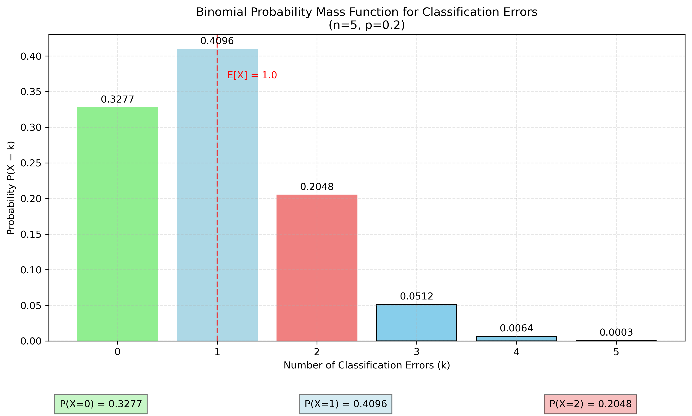
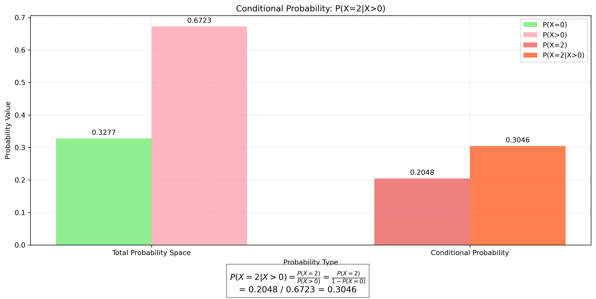
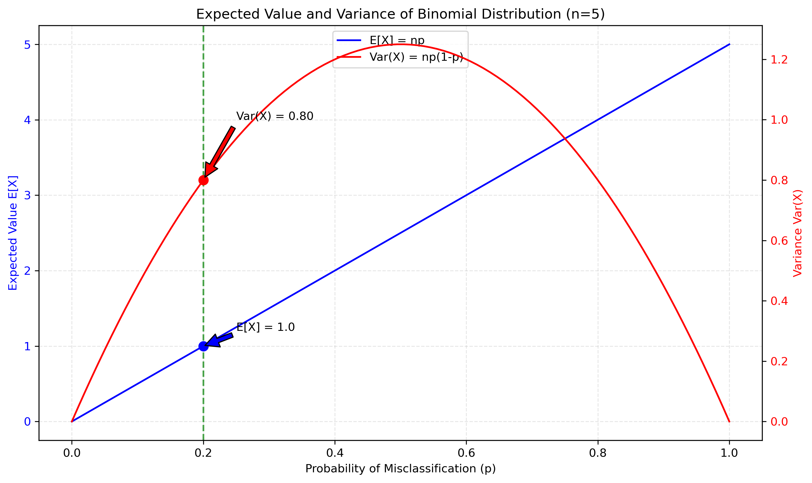
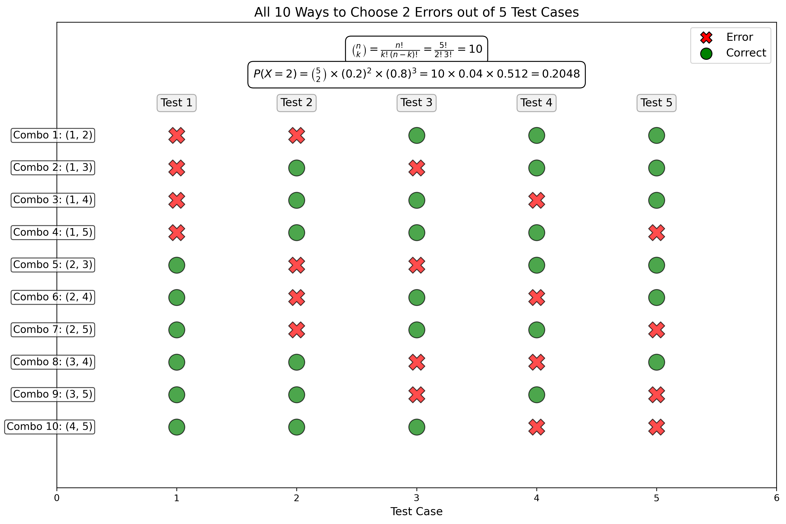

# Question 6: Classification Error Analysis

## Problem Statement
Consider a discrete random variable X representing the number of classification errors made by a machine learning algorithm on a sample of 5 test cases. The probability mass function (PMF) of X is given by:

$$P(X = k) = \binom{5}{k} p^k (1-p)^{5-k}$$

Where p = 0.2 is the probability of misclassification on any single test case.

### Task
1. Calculate $P(X = 0)$, $P(X = 1)$, and $P(X = 2)$
2. Calculate the expected value $E[X]$
3. Calculate the variance Var(X)
4. Given that at least one error occurred, what is the probability that there were exactly 2 errors?

## Understanding the Problem
This problem examines the binomial distribution, which models the number of successes (in this case, errors) in a fixed number of independent trials. Here, we have 5 test cases, each with a 20% probability of being misclassified. We need to calculate specific probabilities and statistics about the distribution of errors.

## Solution

### Step 1: Calculate individual probabilities
We use the binomial probability mass function (PMF) to calculate the probabilities:

$$P(X = k) = \binom{5}{k} (0.2)^k (0.8)^{5-k}$$

For $k = 0$ (no errors):
$$P(X = 0) = \binom{5}{0} (0.2)^0 (0.8)^5 = 1 \times 1 \times 0.32768 = 0.32768$$

For $k = 1$ (exactly one error):
$$P(X = 1) = \binom{5}{1} (0.2)^1 (0.8)^4 = 5 \times 0.2 \times 0.4096 = 0.4096$$

For $k = 2$ (exactly two errors):
$$P(X = 2) = \binom{5}{2} (0.2)^2 (0.8)^3 = 10 \times 0.04 \times 0.512 = 0.2048$$

Our calculated probabilities are:
- $P(X = 0) = 0.3277$
- $P(X = 1) = 0.4096$
- $P(X = 2) = 0.2048$

### Step 2: Calculate the expected value
For a binomial distribution, the expected value is given by:
$$E[X] = np$$

Where $n$ is the number of trials and $p$ is the probability of success in each trial.
$$E[X] = 5 \times 0.2 = 1$$

The expected number of classification errors is 1.

### Step 3: Calculate the variance
For a binomial distribution, the variance is given by:
$$Var(X) = np(1-p)$$

$$Var(X) = 5 \times 0.2 \times 0.8 = 0.8$$

The standard deviation is:
$$\sigma = \sqrt{Var(X)} = \sqrt{0.8} \approx 0.8944$$

### Step 4: Calculate the conditional probability
We need to find $P(X = 2 | X > 0)$, which is the probability of exactly 2 errors, given that at least one error occurred.

Using the conditional probability formula:
$$P(X = 2 | X > 0) = \frac{P(X = 2 \cap X > 0)}{P(X > 0)} = \frac{P(X = 2)}{P(X > 0)}$$

Since $X = 2$ implies $X > 0$, we have $P(X = 2 \cap X > 0) = P(X = 2)$.

Also, $P(X > 0) = 1 - P(X = 0) = 1 - 0.3277 = 0.6723$

Therefore:
$$P(X = 2 | X > 0) = \frac{0.2048}{0.6723} = 0.3046$$

The probability of exactly 2 errors, given that at least one error occurred, is approximately 30.46%.

## Visual Explanations

### Binomial Probability Mass Function

This visualization shows the probability mass function for the number of classification errors. Each bar represents the probability of a specific number of errors, with highlighted bars for 0, 1, and 2 errors. The expected value ($E[X] = 1$) is indicated by the red dashed line.

### Conditional Probability Visualization

This figure illustrates the conditional probability calculation. The left pair of bars shows P(X=0) and P(X>0), which together sum to 1. The right pair shows P(X=2) and P(X=2|X>0). The conditional probability is calculated by dividing P(X=2) by P(X>0).

### Expected Value and Variance

This graph shows how the expected value and variance of the binomial distribution change as the probability of misclassification p varies from 0 to 1. The current case (p = 0.2) is marked with a vertical line, showing $E[X] = 1$ and $Var(X) = 0.8$.

### Combinatorial Illustration

This visualization illustrates all 10 possible ways to select 2 errors from 5 test cases. Each row shows a different combination, with red X marks indicating errors and green circles indicating correct classifications. The binomial coefficient calculation and the full probability calculation for P(X=2) are shown above.

## Key Insights

### Binomial Distribution Properties
- The binomial distribution is appropriate for modeling the number of successes in independent trials with constant probability
- The distribution is discrete and can take values from 0 to n (in this case, 0 to 5)
- The distribution is symmetric when p = 0.5 and becomes increasingly skewed as p approaches 0 or 1

### Expected Value and Variance Relationship
- The expected value increases linearly with the probability p
- The variance reaches its maximum when p = 0.5 and decreases as p approaches 0 or 1
- In this case (p = 0.2), the distribution is right-skewed, with the peak at X = 1

### Conditional Probability Interpretation
- The probability of observing 2 errors among all possible outcomes (0.2048) is different from the probability of observing 2 errors given that at least one error occurred (0.3046)
- This difference arises because conditioning on X > 0 removes the possibility of 0 errors, redistributing that probability among the remaining outcomes
- In practical terms, if we already know a model made at least one error, the probability of exactly 2 errors increases from about 20% to about 30%

## Conclusion
- $P(X = 0) = 0.3277$, $P(X = 1) = 0.4096$, $P(X = 2) = 0.2048$
- Expected value $E[X] = 1$
- Variance $Var(X) = 0.8$
- $P(X = 2 | X > 0) = 0.3046$

This example demonstrates the application of the binomial distribution to model classification errors in machine learning. Understanding these probabilistic concepts is essential for evaluating model performance, especially when dealing with small test sets where random variations can have significant impacts on measured accuracy. 