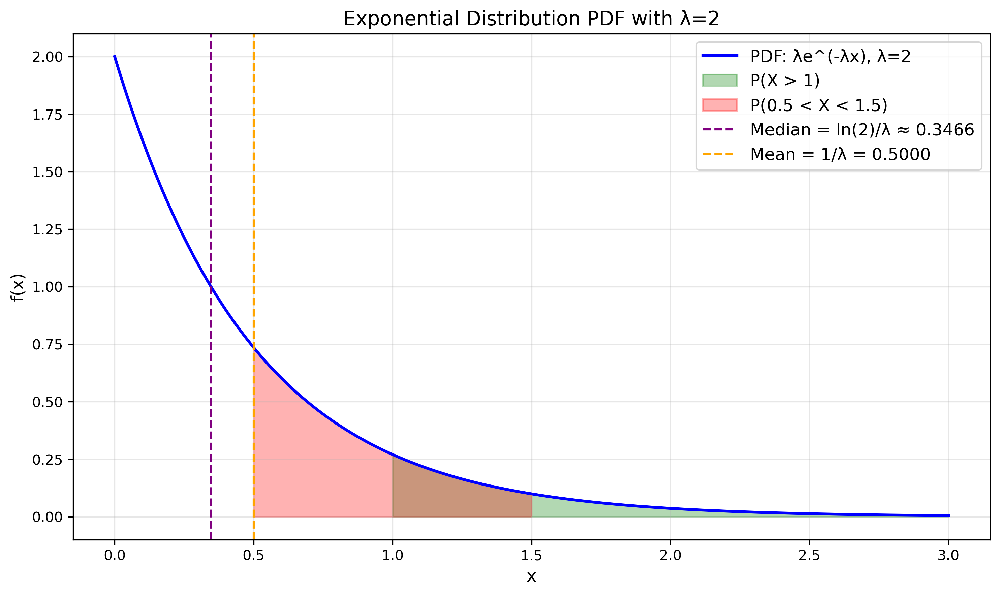
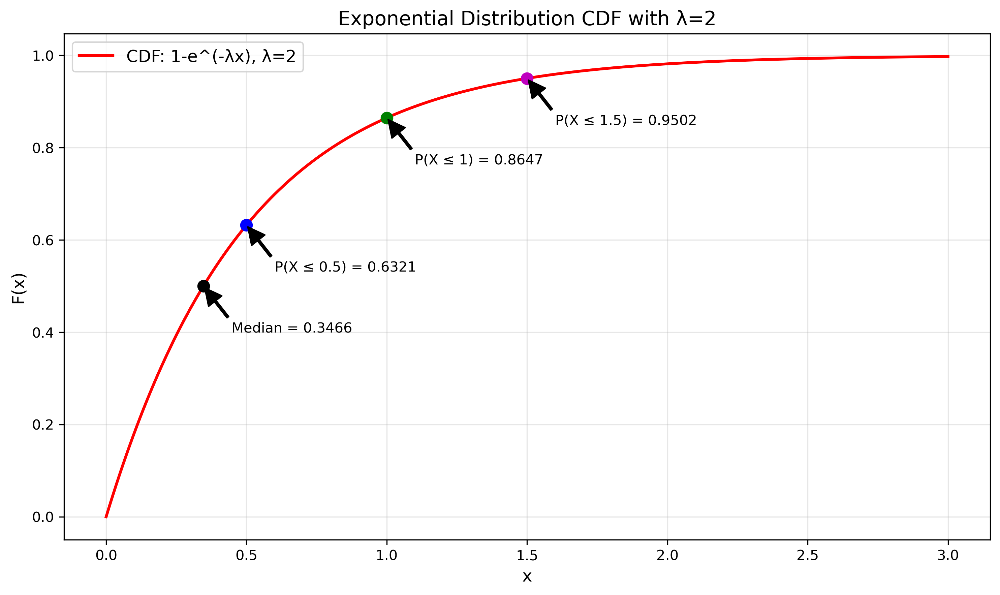
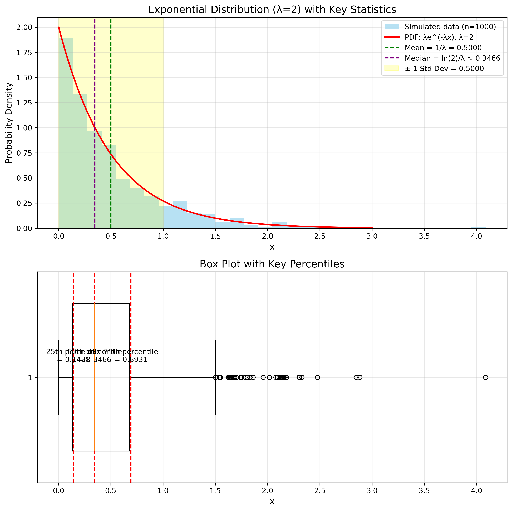

# Question 7: Exponential Distribution Analysis

## Problem Statement
Let X be a continuous random variable with probability density function (PDF):

$$f_X(x) = \begin{cases} 
\lambda e^{-\lambda x} & \text{for } x \geq 0 \\
0 & \text{otherwise}
\end{cases}$$

This is the exponential distribution with parameter λ = 2, commonly used to model the time between events.

### Task
1. Verify that this is a valid PDF by showing that it integrates to 1
2. Calculate $P(X > 1)$
3. Calculate $P(0.5 < X < 1.5)$
4. Find the expected value $E[X]$ and variance $Var(X)$
5. Calculate the median of $X$

## Understanding the Problem
The exponential distribution is a continuous probability distribution that is often used to model the time between events in a Poisson process. It's characterized by a single parameter λ (lambda), which represents the rate parameter. In this problem, we have λ = 2, and we need to analyze various properties of this distribution.

## Solution

### Step 1: Verify that the PDF integrates to 1
For a valid probability density function, we need to show that:

$$\int_{-\infty}^{\infty} f_X(x) dx = \int_{0}^{\infty} \lambda e^{-\lambda x} dx = 1$$

Since $f_X(x) = 0$ for $x < 0$, we only need to evaluate the integral from 0 to infinity:

$$\int_{0}^{\infty} \lambda e^{-\lambda x} dx = \lambda \int_{0}^{\infty} e^{-\lambda x} dx$$

This is a standard integral with the solution:

$$\lambda \int_{0}^{\infty} e^{-\lambda x} dx = \lambda \cdot \left[ -\frac{1}{\lambda} e^{-\lambda x} \right]_{0}^{\infty} = \lambda \cdot \left( 0 - \left(-\frac{1}{\lambda}\right) \right) = 1$$

Therefore, $f_X(x)$ is a valid PDF as it integrates to 1.

### Step 2: Calculate $P(X > 1)$
For the exponential distribution, the cumulative distribution function (CDF) is:

$$F_X(x) = 1 - e^{-\lambda x}$$

Therefore:

$$P(X > 1) = 1 - P(X \leq 1) = 1 - F_X(1) = 1 - (1 - e^{-\lambda \cdot 1}) = e^{-\lambda \cdot 1} = e^{-2} \approx 0.1353$$

### Step 3: Calculate $P(0.5 < X < 1.5)$
We can find this probability by using the CDF:

$$P(0.5 < X < 1.5) = F_X(1.5) - F_X(0.5) = (1 - e^{-\lambda \cdot 1.5}) - (1 - e^{-\lambda \cdot 0.5})$$
$$= e^{-\lambda \cdot 0.5} - e^{-\lambda \cdot 1.5} = e^{-2 \cdot 0.5} - e^{-2 \cdot 1.5} = e^{-1} - e^{-3} \approx 0.3181$$

### Step 4: Find the expected value $E[X]$ and variance $Var(X)$
For the exponential distribution with parameter λ, the expected value and variance are:

$$E[X] = \frac{1}{\lambda} = \frac{1}{2} = 0.5$$

$$Var(X) = \frac{1}{\lambda^2} = \frac{1}{2^2} = \frac{1}{4} = 0.25$$

### Step 5: Calculate the median of $X$
For the exponential distribution, the median is given by:

$$\text{Median} = \frac{\ln(2)}{\lambda} = \frac{\ln(2)}{2} \approx 0.3466$$

We can verify this by finding the value of $x$ for which $F_X(x) = 0.5$:

$$F_X(x) = 1 - e^{-\lambda x} = 0.5$$
$$e^{-\lambda x} = 0.5$$
$$-\lambda x = \ln(0.5) = -\ln(2)$$
$$x = \frac{\ln(2)}{\lambda} = \frac{\ln(2)}{2} \approx 0.3466$$

## Visual Explanations

### Exponential Probability Density Function

This graph shows the probability density function (PDF) of the exponential distribution with λ = 2. The key areas are highlighted:
- The green shaded region represents $P(X > 1) \approx 0.1353$
- The red shaded region represents $P(0.5 < X < 1.5) \approx 0.3181$
- The purple vertical line shows the median at $x \approx 0.3466$
- The orange vertical line shows the mean at $x = 0.5$

### Exponential Cumulative Distribution Function

This graph displays the cumulative distribution function (CDF) of the exponential distribution with λ = 2. The CDF gives the probability $P(X \leq x)$ for any value $x$. Key points are marked:
- $P(X \leq 0.5) \approx 0.6321$
- $P(X \leq 1) \approx 0.8647$
- $P(X \leq 1.5) \approx 0.9502$
- The median point where $F_X(x) = 0.5$ occurs at $x \approx 0.3466$

### Distribution Moments and Quantiles

The top graph shows a histogram of 1000 simulated samples from the exponential distribution with λ = 2, overlaid with the theoretical PDF. The key statistics are marked:
- Mean = 0.5 (green line)
- Median ≈ 0.3466 (purple line)
- Standard deviation = 0.5 (yellow shaded region around the mean)

The bottom graph shows a box plot of the same data with key percentiles marked.

## Key Insights

### Properties of the Exponential Distribution
- The exponential distribution is completely characterized by a single parameter λ
- It has a "memoryless" property: $P(X > t+s | X > t) = P(X > s)$
- The mean is always larger than the median for the exponential distribution
- The density is highest at x = 0 and decreases exponentially as x increases

### Practical Applications
- Modeling time between events in a Poisson process
- Survival analysis and reliability engineering
- Modeling waiting times or service times
- Decay processes in physics and chemistry

### Mathematical Properties
- The sum of independent exponential random variables with the same parameter follows a gamma distribution
- The exponential distribution is the continuous analogue of the geometric distribution
- It has a constant hazard rate, meaning the failure rate does not change over time

## Conclusion

For the exponential distribution with λ = 2:
- It is a valid PDF (integrates to 1)
- $P(X > 1) = e^{-2} \approx 0.1353$
- $P(0.5 < X < 1.5) = e^{-1} - e^{-3} \approx 0.3181$
- $E[X] = 0.5$ and $Var(X) = 0.25$
- Median = $\frac{\ln(2)}{2} \approx 0.3466$

The exponential distribution is fundamental in probability theory and has numerous applications in modeling random processes where events occur continuously and independently at a constant average rate. 