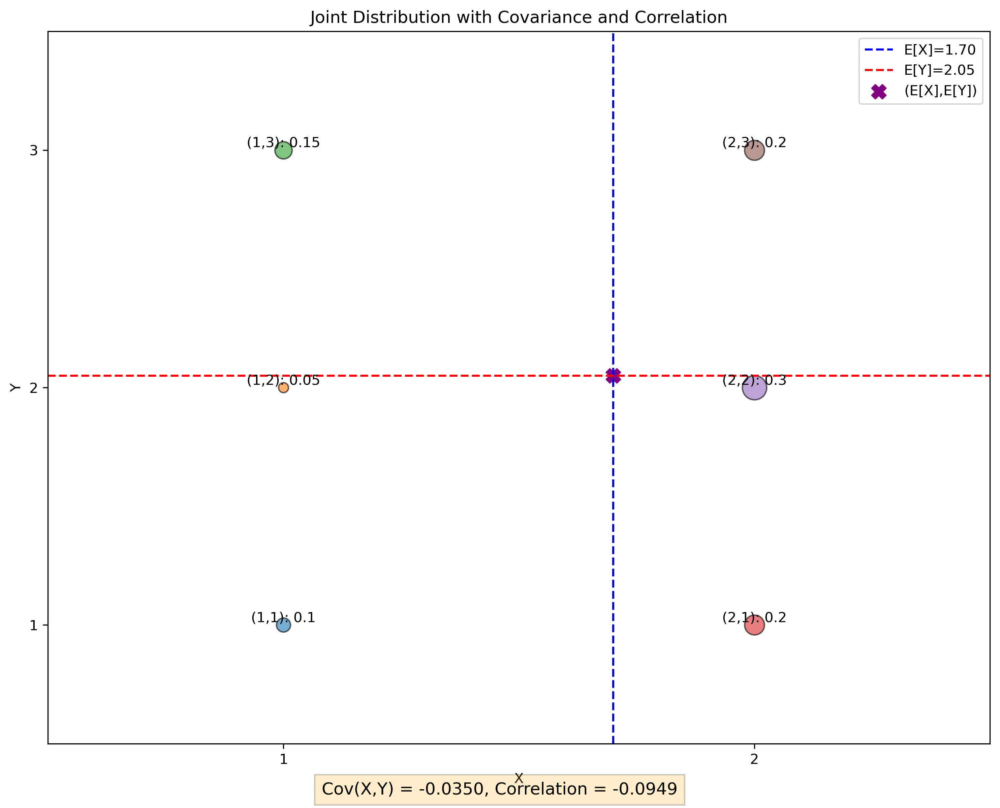

# Question 8: Joint Probability and Correlation

## Problem Statement
A data scientist is analyzing the relationship between two features in a dataset. Let random variables X and Y have the following joint probability mass function:

$$P(X=x, Y=y) = \begin{pmatrix} 
& Y=1 & Y=2 & Y=3 \\
X=1 & 0.10 & 0.05 & 0.15 \\
X=2 & 0.20 & 0.30 & 0.20
\end{pmatrix}$$

### Task
1. Find the marginal distributions $P(X)$ and $P(Y)$
2. Calculate the conditional distributions $P(Y|X=1)$ and $P(X|Y=2)$
3. Are X and Y independent? Justify your answer mathematically.
4. Calculate the covariance $Cov(X,Y)$ and correlation coefficient $ρ(X,Y)$

## Understanding the Problem
This problem deals with a joint probability distribution of two discrete random variables X and Y. The joint probability mass function (PMF) gives the probability of each possible combination of values for X and Y. We need to analyze various aspects of this joint distribution, including marginal and conditional distributions, independence, covariance, and correlation.

## Solution

### Step 1: Find the marginal distributions $P(X)$ and $P(Y)$
The marginal distribution of X is obtained by summing the joint probabilities over all values of Y:

$$P(X=x) = \sum_y P(X=x, Y=y)$$

Similarly, the marginal distribution of Y is obtained by summing the joint probabilities over all values of X:

$$P(Y=y) = \sum_x P(X=x, Y=y)$$

Calculating $P(X)$:
- $P(X=1) = P(X=1,Y=1) + P(X=1,Y=2) + P(X=1,Y=3) = 0.10 + 0.05 + 0.15 = 0.30$
- $P(X=2) = P(X=2,Y=1) + P(X=2,Y=2) + P(X=2,Y=3) = 0.20 + 0.30 + 0.20 = 0.70$

Calculating $P(Y)$:
- $P(Y=1) = P(X=1,Y=1) + P(X=2,Y=1) = 0.10 + 0.20 = 0.30$
- $P(Y=2) = P(X=1,Y=2) + P(X=2,Y=2) = 0.05 + 0.30 = 0.35$
- $P(Y=3) = P(X=1,Y=3) + P(X=2,Y=3) = 0.15 + 0.20 = 0.35$

### Step 2: Calculate the conditional distributions $P(Y|X=1)$ and $P(X|Y=2)$

The conditional probability $P(Y|X)$ is given by:

$$P(Y=y|X=x) = \frac{P(X=x, Y=y)}{P(X=x)}$$

Similarly, $P(X|Y)$ is given by:

$$P(X=x|Y=y) = \frac{P(X=x, Y=y)}{P(Y=y)}$$

Calculating $P(Y|X=1)$:
- $P(Y=1|X=1) = \frac{P(X=1,Y=1)}{P(X=1)} = \frac{0.10}{0.30} = \frac{1}{3} \approx 0.333$
- $P(Y=2|X=1) = \frac{P(X=1,Y=2)}{P(X=1)} = \frac{0.05}{0.30} = \frac{1}{6} \approx 0.167$
- $P(Y=3|X=1) = \frac{P(X=1,Y=3)}{P(X=1)} = \frac{0.15}{0.30} = \frac{1}{2} = 0.5$

Calculating $P(X|Y=2)$:
- $P(X=1|Y=2) = \frac{P(X=1,Y=2)}{P(Y=2)} = \frac{0.05}{0.35} = \frac{1}{7} \approx 0.143$
- $P(X=2|Y=2) = \frac{P(X=2,Y=2)}{P(Y=2)} = \frac{0.30}{0.35} = \frac{6}{7} \approx 0.857$

### Step 3: Determine if X and Y are independent

Two random variables X and Y are independent if and only if:

$$P(X=x, Y=y) = P(X=x) \cdot P(Y=y)$$

for all possible values of x and y. Let's check this condition for each combination:

- For $X=1, Y=1$: $P(X=1, Y=1) = 0.10$, $P(X=1) \cdot P(Y=1) = 0.30 \cdot 0.30 = 0.09$
- For $X=1, Y=2$: $P(X=1, Y=2) = 0.05$, $P(X=1) \cdot P(Y=2) = 0.30 \cdot 0.35 = 0.105$
- For $X=1, Y=3$: $P(X=1, Y=3) = 0.15$, $P(X=1) \cdot P(Y=3) = 0.30 \cdot 0.35 = 0.105$
- For $X=2, Y=1$: $P(X=2, Y=1) = 0.20$, $P(X=2) \cdot P(Y=1) = 0.70 \cdot 0.30 = 0.21$
- For $X=2, Y=2$: $P(X=2, Y=2) = 0.30$, $P(X=2) \cdot P(Y=2) = 0.70 \cdot 0.35 = 0.245$
- For $X=2, Y=3$: $P(X=2, Y=3) = 0.20$, $P(X=2) \cdot P(Y=3) = 0.70 \cdot 0.35 = 0.245$

Since $P(X=x, Y=y) \neq P(X=x) \cdot P(Y=y)$ for at least one pair of values (in fact, for all pairs except X=1, Y=1), X and Y are not independent.

The maximum difference between $P(X=x, Y=y)$ and $P(X=x) \cdot P(Y=y)$ is 0.055, which occurs for the pairs (X=1, Y=3) and (X=2, Y=3).

### Step 4: Calculate the covariance $Cov(X,Y)$ and correlation coefficient $ρ(X,Y)$

The covariance between X and Y is defined as:

$$Cov(X,Y) = E[XY] - E[X]E[Y]$$

First, let's calculate the expected values:

$E[X] = \sum_x x \cdot P(X=x) = 1 \cdot 0.30 + 2 \cdot 0.70 = 1.70$

$E[Y] = \sum_y y \cdot P(Y=y) = 1 \cdot 0.30 + 2 \cdot 0.35 + 3 \cdot 0.35 = 2.05$

Next, we calculate $E[XY]$:

$E[XY] = \sum_x \sum_y x \cdot y \cdot P(X=x,Y=y)$
$= 1 \cdot 1 \cdot 0.10 + 1 \cdot 2 \cdot 0.05 + 1 \cdot 3 \cdot 0.15 + 2 \cdot 1 \cdot 0.20 + 2 \cdot 2 \cdot 0.30 + 2 \cdot 3 \cdot 0.20$
$= 0.10 + 0.10 + 0.45 + 0.40 + 1.20 + 1.20 = 3.45$

Now we can calculate the covariance:

$Cov(X,Y) = E[XY] - E[X]E[Y] = 3.45 - 1.70 \cdot 2.05 = 3.45 - 3.485 = -0.035$

To calculate the correlation coefficient, we also need the variances of X and Y:

$Var(X) = E[X^2] - (E[X])^2$
$= (1^2 \cdot 0.30 + 2^2 \cdot 0.70) - 1.70^2$
$= (0.30 + 2.80) - 2.89 = 3.10 - 2.89 = 0.21$

$Var(Y) = E[Y^2] - (E[Y])^2$
$= (1^2 \cdot 0.30 + 2^2 \cdot 0.35 + 3^2 \cdot 0.35) - 2.05^2$
$= (0.30 + 1.40 + 3.15) - 4.2025 = 4.85 - 4.2025 = 0.6475$

The correlation coefficient is:

$ρ(X,Y) = \frac{Cov(X,Y)}{\sqrt{Var(X) \cdot Var(Y)}} = \frac{-0.035}{\sqrt{0.21 \cdot 0.6475}} = \frac{-0.035}{0.369} \approx -0.095$

## Visual Explanations

### Joint Probability Mass Function

This heatmap visualizes the joint probability mass function $P(X,Y)$. The color intensity indicates the probability value, with darker colors representing higher probabilities. The highest probability is 0.30 for the combination (X=2, Y=2).

### Marginal Distributions

The left plot shows the marginal distribution of X, with P(X=1) = 0.30 and P(X=2) = 0.70. The right plot shows the marginal distribution of Y, with P(Y=1) = 0.30, P(Y=2) = 0.35, and P(Y=3) = 0.35.

### Conditional Distributions

The left plot shows the conditional distributions $P(Y|X)$ for X=1 and X=2. The right plot shows the conditional distributions $P(X|Y)$ for Y=1, Y=2, and Y=3. These distributions illustrate how the probabilities of one variable change when we fix the value of the other variable.

### Independence Check

This visualization compares the joint distribution $P(X,Y)$ (left) with the product of marginals $P(X)P(Y)$ (right). For independent variables, these would be identical. The differences visible here confirm that X and Y are not independent.

### Covariance and Correlation

This scatter plot represents the joint distribution, with the size of each point proportional to its probability. The expected values of X and Y are shown as dashed lines, and their intersection marks the point (E[X], E[Y]). The negative covariance and correlation indicate a slight negative relationship between X and Y.

## Key Insights

### Probability Distributions
- The marginal distributions tell us the probability of each value of X or Y, regardless of the other variable
- The conditional distributions show how the probability of one variable changes when we fix the value of the other
- When variables are not independent, knowing the value of one variable affects the probability distribution of the other

### Independence
- Two variables are independent if and only if their joint probability equals the product of their marginals
- Independence can be verified by checking if P(Y|X) = P(Y) for all values, or equivalently, if P(X|Y) = P(X) for all values
- In this case, X and Y are not independent, which means there is some relationship between them

### Correlation and Covariance
- Covariance measures the direction of linear relationship between two variables
- The correlation coefficient normalizes the covariance to a value between -1 and 1
- A correlation coefficient close to 0 (like -0.095 in this case) indicates a very weak linear relationship
- Correlation only captures linear relationships; two variables could have a strong non-linear relationship even with zero correlation

## Conclusion

For the discrete random variables X and Y with the given joint PMF:
- The marginal distributions are P(X=1) = 0.30, P(X=2) = 0.70 and P(Y=1) = 0.30, P(Y=2) = 0.35, P(Y=3) = 0.35
- The conditional distributions P(Y|X=1) and P(X|Y=2) show how the probabilities change when one variable is fixed
- X and Y are not independent, as verified by comparing P(X,Y) with P(X)P(Y)
- The covariance Cov(X,Y) = -0.035 and correlation coefficient ρ(X,Y) = -0.095 indicate a weak negative linear relationship

This analysis demonstrates the fundamental concepts of joint, marginal, and conditional probability distributions, as well as measures of dependence between random variables. 