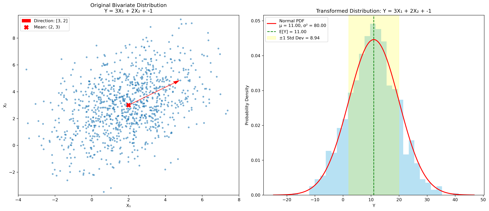

# Question 9: Multivariate Analysis

## Problem Statement
Consider a random vector $X = [X₁, X₂]$ with mean vector $μ = [2, 3]$ and covariance matrix:

$$\Sigma = \begin{bmatrix} 
4 & 2 \\
2 & 5
\end{bmatrix}$$

### Task
1. What is the variance of $X₁$ and $X₂$?
2. Calculate the correlation coefficient between $X₁$ and $X₂$
3. Let $Y = 3X₁ + 2X₂ - 1$. Calculate $E[Y]$ and $Var(Y)$
4. Are $X₁$ and $X₂$ independent? Explain your reasoning.

## Understanding the Problem
This problem focuses on a bivariate random vector and its properties. The random vector is characterized by its mean vector and covariance matrix. We need to analyze the variances of the individual components, their correlation, properties of a linear transformation, and whether the components are independent.

## Solution

### Step 1: Determine the variances of $X₁$ and $X₂$
The covariance matrix $\Sigma$ of a random vector has variances of individual components along its diagonal elements:

$$\Sigma = \begin{bmatrix} 
Var(X₁) & Cov(X₁, X₂) \\
Cov(X₂, X₁) & Var(X₂)
\end{bmatrix}$$

From the given covariance matrix:

$$\Sigma = \begin{bmatrix} 
4 & 2 \\
2 & 5
\end{bmatrix}$$

We can directly read:
- $Var(X₁) = 4$
- $Var(X₂) = 5$

### Step 2: Calculate the correlation coefficient
The correlation coefficient between $X₁$ and $X₂$ is defined as:

$$\rho(X₁, X₂) = \frac{Cov(X₁, X₂)}{\sqrt{Var(X₁) \cdot Var(X₂)}}$$

Given the covariance matrix, we have:
- $Cov(X₁, X₂) = 2$
- $Var(X₁) = 4$
- $Var(X₂) = 5$

Substituting these values:

$$\rho(X₁, X₂) = \frac{2}{\sqrt{4 \cdot 5}} = \frac{2}{\sqrt{20}} = \frac{2}{2\sqrt{5}} = \frac{1}{\sqrt{5}} \approx 0.4472$$

### Step 3: Calculate $E[Y]$ and $Var(Y)$ for the linear transformation
For a linear transformation $Y = 3X₁ + 2X₂ - 1$, we can use the properties of expectation and variance:

**Expected value:**
$E[Y] = E[3X₁ + 2X₂ - 1] = 3E[X₁] + 2E[X₂] - 1$

Given $E[X₁] = 2$ and $E[X₂] = 3$ from the mean vector, we have:
$E[Y] = 3 \cdot 2 + 2 \cdot 3 - 1 = 6 + 6 - 1 = 11$

**Variance:**
For a linear combination of random variables, the variance is given by:
$Var(aX + bY) = a^2 Var(X) + b^2 Var(Y) + 2ab \cdot Cov(X, Y)$

Applying this to our case:
$Var(Y) = Var(3X₁ + 2X₂ - 1) = 9 \cdot Var(X₁) + 4 \cdot Var(X₂) + 2 \cdot 3 \cdot 2 \cdot Cov(X₁, X₂)$

Substituting the values:
$Var(Y) = 9 \cdot 4 + 4 \cdot 5 + 12 \cdot 2 = 36 + 20 + 24 = 80$

Note that the constant term $-1$ doesn't affect the variance.

### Step 4: Determine if $X₁$ and $X₂$ are independent
For two random variables to be independent, their covariance should be zero. Equivalently, their correlation coefficient should also be zero.

From the covariance matrix, we have $Cov(X₁, X₂) = 2 \neq 0$. Also, we calculated $\rho(X₁, X₂) \approx 0.4472 \neq 0$.

Therefore, $X₁$ and $X₂$ are not independent. This positive covariance and correlation indicate that when $X₁$ increases, $X₂$ tends to increase as well, and vice versa.

## Visual Explanations

### Bivariate Normal Distribution

This graph shows a scatter plot of samples from the bivariate normal distribution with the given mean vector and covariance matrix. The key elements of the plot include:
- The mean point at (2, 3) is marked with a red X
- Ellipses show the 1σ, 2σ, and 3σ contours of the distribution
- The ellipses are tilted due to the positive correlation between $X₁$ and $X₂$
- The variances of $X₁$ (4) and $X₂$ (5) determine the width and height of the ellipses

### Linear Transformation

The left plot shows the original bivariate distribution with an arrow indicating the direction of the linear transformation $Y = 3X₁ + 2X₂ - 1$. The right plot shows the resulting distribution of $Y$:
- $Y$ follows a normal distribution with mean $E[Y] = 11$ and variance $Var(Y) = 80$
- The standard deviation of $Y$ is $\sqrt{80} \approx 8.94$
- The histogram shows the empirical distribution from the simulated data
- The red curve shows the theoretical normal distribution

## Key Insights

### Covariance Matrix Properties
- The diagonal elements of the covariance matrix represent the variances of individual random variables
- The off-diagonal elements represent the covariances between pairs of random variables
- A covariance matrix is always symmetric: $Cov(X₁, X₂) = Cov(X₂, X₁)$
- A covariance matrix is positive semi-definite, which constrains the possible values of variances and covariances

### Correlation and Independence
- Correlation measures the linear relationship between two random variables
- Correlation coefficient values range from -1 to 1
- Zero correlation is a necessary but not sufficient condition for independence (for non-normal distributions)
- For multivariate normal distributions, zero correlation implies independence
- In this case, the positive correlation (~0.45) indicates a moderate positive linear relationship

### Linear Transformations
- The expected value of a linear transformation is the linear transformation of the expected values
- The variance of a linear combination includes terms for the variances and the covariances
- The covariance term (2abCov(X,Y)) can either increase or decrease the total variance depending on the sign of the covariance and the coefficients
- In this case, the positive covariance (2) increased the variance of the linear combination

## Conclusion

For the random vector $X = [X₁, X₂]$ with the given mean vector and covariance matrix:
- The variances are $Var(X₁) = 4$ and $Var(X₂) = 5$
- The correlation coefficient is $\rho(X₁, X₂) = \frac{1}{\sqrt{5}} \approx 0.4472$
- For the linear transformation $Y = 3X₁ + 2X₂ - 1$: $E[Y] = 11$ and $Var(Y) = 80$
- $X₁$ and $X₂$ are not independent because their covariance (2) is non-zero

These concepts of multivariate distributions, correlation, and linear transformations are fundamental in many machine learning algorithms, including Principal Component Analysis (PCA), regression analysis, and feature engineering. 