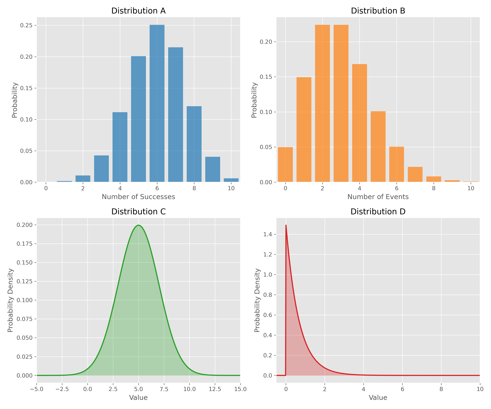
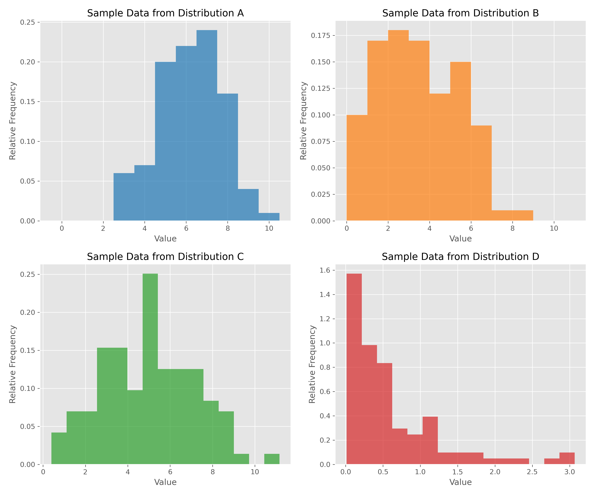
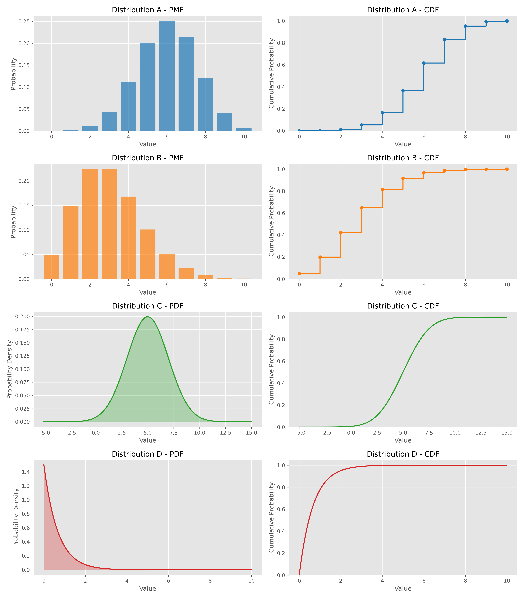
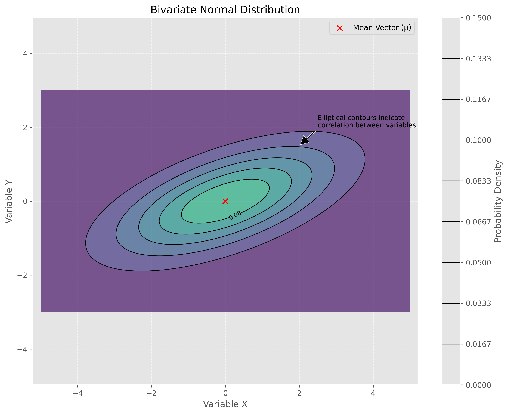

# Lecture 2.1: Probability Fundamentals Quiz

## Overview
This quiz contains 36 questions from different topics covered in section 2.1 of the lectures on Probability Fundamentals.

## Question 1

### Problem Statement
Consider a random experiment where we roll two fair six-sided dice. Let event A be "the sum of the dice equals 7" and event B be "at least one die shows a 6."

#### Task
Calculate:
1. [📚] P(A)
2. [📚] P(B)
3. [📚] P(A ∩ B)
4. [📚] P(A ∪ B)
5. [📚] Are events A and B independent? Justify your answer.

For a detailed explanation of this problem, including step-by-step calculations, visual aids, and key insights, see [Question 1: Dice Probability Fundamentals](L2_1_1_explanation.md).

## Question 2

### Problem Statement
Suppose we have a bag containing 5 red balls, 3 blue balls, and 2 green balls. We randomly draw 2 balls from the bag without replacement.

#### Task
Calculate the probability of:
1. Drawing 2 red balls
2. Drawing exactly 1 blue ball
3. Drawing no green balls
4. Drawing at least one ball of each color

For a detailed explanation of this problem, including combinatorial analysis, visual representations, and probability breakdowns, see [Question 2: Ball Drawing Probabilities](L2_1_2_explanation.md).

## Question 3

### Problem Statement
Consider a continuous random variable $X$ with probability density function (PDF):

$$f_X(x) = \begin{cases} 
cx^2 & \text{for } 0 \leq x \leq 2 \\
0 & \text{otherwise}
\end{cases}$$

#### Task
1. Find the value of constant $c$ that makes $f_X(x)$ a valid PDF
2. Calculate $P(0.5 \leq X \leq 1.5)$
3. Find the cumulative distribution function (CDF) $F_X(x)$
4. Calculate the expected value $E[X]$ and variance $Var(X)$

For a detailed explanation of this problem, including PDF analysis, CDF derivation, and moment calculations, see [Question 3: Continuous Random Variable Analysis](L2_1_3_explanation.md).

## Question 4

### Problem Statement
In a certain population, 60% of people have brown eyes. A researcher randomly selects 10 people from this population.

#### Task
1. What is the probability that exactly 7 people have brown eyes?
2. What is the probability that at least 8 people have brown eyes?
3. What is the expected number of people with brown eyes in the sample?
4. What is the standard deviation of the number of people with brown eyes?

For a detailed explanation of this problem, including binomial distribution analysis, probability calculations, and normal approximation, see [Question 4: Binomial Distribution Analysis](L2_1_4_explanation.md).

## Question 5

### Problem Statement
A machine learning model is trained on a dataset containing medical records. Let event A be "the patient has disease X" with $P(A) = 0.05$. Let event B be "the model predicts the patient has disease X". The model has a true positive rate (sensitivity) of 0.92 and a false positive rate of 0.08.

#### Task
1. Express the true positive rate and false positive rate using conditional probability notation
2. Calculate P(B)
3. Calculate P(A|B) (the probability that a patient actually has the disease given a positive prediction)
4. Is the model reliable for diagnostic purposes? Explain why or why not.

For a detailed explanation of this problem, including Bayes' theorem application and medical diagnostic analysis, see [Question 5: Medical Diagnostics Probability](L2_1_5_explanation.md).

## Question 6

### Problem Statement
Consider a discrete random variable X representing the number of classification errors made by a machine learning algorithm on a sample of 5 test cases. The probability mass function (PMF) of X is given by:

$$P(X = k) = \binom{5}{k} p^k (1-p)^{5-k}$$

Where p = 0.2 is the probability of misclassification on any single test case.

#### Task
1. Calculate $P(X = 0)$, $P(X = 1)$, and $P(X = 2)$
2. Calculate the expected value $E[X]$
3. Calculate the variance Var(X)
4. Given that at least one error occurred, what is the probability that there were exactly 2 errors?

For a detailed explanation of this problem, including binomial distribution properties and conditional probability, see [Question 6: Classification Error Analysis](L2_1_6_explanation.md).

## Question 7

### Problem Statement
Let X be a continuous random variable with probability density function (PDF):

$$f_X(x) = \begin{cases} 
\lambda e^{-\lambda x} & \text{for } x \geq 0 \\
0 & \text{otherwise}
\end{cases}$$

This is the exponential distribution with parameter λ = 2, commonly used to model the time between events.

#### Task
1. Verify that this is a valid PDF by showing that it integrates to 1
2. Calculate $P(X > 1)$
3. Calculate $P(0.5 < X < 1.5)$
4. Find the expected value $E[X]$ and variance $Var(X)$
5. Calculate the median of $X$

For a detailed explanation of this problem, including exponential distribution properties and integration methods, see [Question 7: Exponential Distribution Analysis](L2_1_7_explanation.md).

## Question 8

### Problem Statement
A data scientist is analyzing the relationship between two features in a dataset. Let random variables X and Y have the following joint probability mass function:

$$P(X=x, Y=y) = \begin{pmatrix} 
& Y=1 & Y=2 & Y=3 \\
X=1 & 0.10 & 0.05 & 0.15 \\
X=2 & 0.20 & 0.30 & 0.20
\end{pmatrix}$$

#### Task
1. [📚] Find the marginal distributions $P(X)$ and $P(Y)$
2. [📚] Calculate the conditional distributions $P(Y|X=1)$ and $P(X|Y=2)$
3. [📚] Are X and Y independent? Justify your answer mathematically.
4. [📚] Calculate the covariance $Cov(X,Y)$ and correlation coefficient $ρ(X,Y)$

For a detailed explanation of this problem, including joint probability concepts and independence testing, see [Question 8: Joint Probability and Correlation](L2_1_8_explanation.md).

## Question 9

### Problem Statement
Consider a random vector $X = [X₁, X₂]$ with mean vector $μ = [2, 3]$ and covariance matrix:

$$\Sigma = \begin{bmatrix} 
4 & 2 \\
2 & 5
\end{bmatrix}$$

#### Task
1. What is the variance of $X₁$ and $X₂$?
2. Calculate the correlation coefficient between $X₁$ and $X₂$
3. Let $Y = 3X₁ + 2X₂ - 1$. Calculate $E[Y]$ and $Var(Y)$
4. Are $X₁$ and $X₂$ independent? Explain your reasoning.

For a detailed explanation of this problem, including multivariate random variables and linear transformations, see [Question 9: Multivariate Analysis](L2_1_9_explanation.md).

## Question 10

### Problem Statement
A machine learning engineer is working with a dataset where each data point has a 0.1 probability of being an outlier. The engineer decides to randomly sample 20 data points for a preliminary analysis.

#### Task
1. What is the probability that the sample contains exactly 3 outliers?
2. What is the probability that the sample contains at least 1 outlier?
3. What is the expected number of outliers in the sample?
4. Calculate the probability that the sample contains between 1 and 3 outliers, inclusive

For a detailed explanation of this problem, including binomial probability calculations and outlier detection implications, see [Question 10: Outlier Probability](L2_1_10_explanation.md).

## Question 11

### Problem Statement
A spam filter analyzes incoming emails. Based on historical data, 20% of all incoming emails are spam. The filter correctly identifies spam emails 95% of the time (true positive rate) and correctly identifies non-spam emails 98% of the time (true negative rate).

#### Task
1. [📚] If an email is classified as spam by the filter, what is the probability that it is actually spam?
2. [📚] If an email is classified as non-spam by the filter, what is the probability that it is actually spam?
3. [📚] What is the overall accuracy of the filter?
4. [📚] How does changing the prior probability of spam to 50% affect the probability in task 1?

For a detailed explanation of this problem, including Bayes' theorem application and confusion matrix analysis, see [Question 11: Spam Filter Probability](L2_1_11_explanation.md).

## Question 12

### Problem Statement
A dataset for a credit scoring system contains information on borrowers. Historical data shows that:
- 20% of loan applicants have low income
- 30% have medium income
- 50% have high income
- The probability of default is 25% for low income, 10% for medium income, and 5% for high income applicants.

#### Task
1. Calculate the overall probability of default for a randomly selected loan applicant
2. If a borrower has defaulted, what is the probability they were from the low income category?
3. If a borrower has defaulted, what is the probability they were from the high income category?
4. What is the expected default rate if we only approve loans to medium and high income applicants?

For a detailed explanation of this problem, including Bayes' theorem application and the Law of Total Expectation, see [Question 12: Conditional Probability in Finance](L2_1_12_explanation.md).

## Question 13

### Problem Statement
A data scientist is analyzing the weights of packages shipped by a company. The weights follow a uniform distribution between 1kg and 5kg. The company randomly samples 36 packages daily for quality control.

#### Task
1. What is the expected value and variance of a single package weight?
2. What is the approximate distribution of the sample mean weight for the 36 sampled packages?
3. Calculate the probability that the sample mean weight is between 2.8kg and 3.2kg
4. If the company wants to be 95% confident that the sample mean is within 0.2kg of the true population mean, how many packages should they sample?

For a detailed explanation of this problem, including Central Limit Theorem application and confidence interval calculation, see [Question 13: Central Limit Theorem Application](L2_1_13_explanation.md).

## Question 14

### Problem Statement
The heights of adult females in a certain population are normally distributed with a mean of 165 cm and a standard deviation of 6 cm. A clothing company designs dresses for women.

#### Task
1. What percentage of women in the population have heights between 160 cm and 170 cm?
2. The company wants to design a dress that fits at least 90% of women. If they design for heights from $x_{min}$ to $x_{max}$ symmetrically around the mean, what values should $x_{min}$ and $x_{max}$ be?
3. If 100 women are randomly selected, what is the probability that their average height exceeds 166 cm?
4. The company decides to define "tall" as being in the top 5% of the height distribution. What is the minimum height to be considered "tall"?

For a detailed explanation of this problem, including normal distribution properties and applications, see [Question 14: Normal Distribution Application](L2_1_14_explanation.md).

## Question 15

### Problem Statement
A machine learning algorithm uses a dataset where the feature values have unknown distribution. The only information available is that the feature X has a mean of 50 and a standard deviation of 10.

#### Task
1. Using Chebyshev's inequality, calculate an upper bound on the probability that a randomly selected data point has a feature value that deviates from the mean by more than 20 units
2. Using Markov's inequality and assuming X is non-negative, calculate an upper bound on the probability that a randomly selected data point has a feature value greater than 100
3. How would you interpret these bounds in the context of outlier detection?
4. If we know the distribution is actually normal, calculate the exact probability for the scenario in task 1 and compare it to the Chebyshev bound

For a detailed explanation of this problem, including probability inequality applications and comparisons, see [Question 15: Probability Inequalities in ML](L2_1_15_explanation.md).

## Question 16

### Problem Statement
A machine learning system receives requests at a rate of 3 requests per minute on average, following a Poisson distribution.

#### Task
1. What is the probability of receiving exactly 5 requests in a 2-minute interval?
2. What is the probability of receiving no requests in a 1-minute interval?
3. What is the expected number of requests in a 10-minute interval?
4. If the system can handle at most 8 requests in a 2-minute interval, what is the probability that the system becomes overloaded?

For a detailed explanation of this problem, including Poisson distribution calculations and applications, see [Question 16: Poisson Distribution Application](L2_1_16_explanation.md).

## Question 17

### Problem Statement
In a reinforcement learning environment, an agent attempts to reach a goal state. Each attempt has a 0.3 probability of success, independent of previous attempts.

#### Task
1. What is the probability that the agent succeeds on exactly the 4th attempt?
2. What is the probability that the agent succeeds within the first 5 attempts?
3. What is the expected number of attempts needed to reach the goal state?
4. If the agent has already failed 3 times, what is the probability it will succeed on the next attempt?

For a detailed explanation of this problem, including Geometric distribution properties and applications in ML, see [Question 17: Geometric Distribution in RL](L2_1_17_explanation.md).

## Question 18

### Problem Statement
A machine learning model is trained on a dataset where 60% of the samples are from class A and 40% are from class B. When predicting on samples from class A, the model has an accuracy of 0.85. When predicting on samples from class B, the model has an accuracy of 0.75.

#### Task
1. What is the overall expected accuracy of the model on the entire dataset?
2. If a prediction is correct, what is the probability that the sample was from class A?
3. Using the Law of Total Variance, calculate the variance of the model's accuracy if the variance within each class is 0.02.
4. If we balance the dataset to have 50% samples from each class, what would be the new expected accuracy?

For a detailed explanation of this problem, including the application of the Law of Total Expectation and Law of Total Variance, see [Question 18: Expected Model Performance](L2_1_18_explanation.md). 

## Question 19

### Problem Statement
Consider a random sample $X_1, X_2, \ldots, X_n$ from a normal population $N(\mu, 1)$.

#### Task
What is the expected value of the following statistic?

**Options:**
A) $\mu^2 + 1$
B) $\mu + 1$
C) $\mu^2$
D) $\mu - 1$

For a detailed explanation, see [Question 19: Expected Value of Statistics in Normal Distribution](L2_1_19_explanation.md). 

## Question 20

### Problem Statement
Evaluate whether each of the following statements is TRUE or FALSE. Justify your answer with a brief explanation.

#### Task
1. If two events $A$ and $B$ are independent, then $P(A \cap B) = P(A) \times P(B)$.
2. The variance of a random variable can be negative.
3. For any continuous random variable $X$, $P(X = a) = 0$ for any specific value $a$.
4. If the correlation coefficient between random variables $X$ and $Y$ is 0, then $X$ and $Y$ must be independent.
5. The Law of Large Numbers guarantees that as sample size increases, the sample mean will exactly equal the population mean.

For a detailed explanation of these true/false questions, see [Question 20: Probability Fundamentals True/False](L2_1_20_explanation.md).

## Question 21

### Problem Statement
For each question, select the single best answer.

#### Task
1. Which of the following random variables is most likely to be modeled using a Poisson distribution?
   A) The number of customers arriving at a store in one hour
   B) The height of adult males in a population
   C) The time until a radioactive particle decays
   D) The proportion of defective items in a manufacturing batch

2. The property of a statistical estimator that states its expected value equals the true parameter value is called:
   A) Consistency
   B) Efficiency
   C) Unbiasedness
   D) Sufficiency

3. When calculating the probability of a union of three events $P(A \cup B \cup C)$, which of the following must be subtracted to avoid double-counting?
   A) $P(A \cap B)$, $P(B \cap C)$, and $P(A \cap C)$
   B) Only $P(A \cap B \cap C)$
   C) $P(A \cap B)$, $P(B \cap C)$, $P(A \cap C)$, and then add $P(A \cap B \cap C)$
   D) The expected value of all three events

For a detailed explanation of these multiple choice questions, see [Question 21: Probability Multiple Choice](L2_1_21_explanation.md).

## Question 22

### Problem Statement
Complete each statement with the appropriate mathematical expression or term.

#### Task
1. The probability density function of a standard normal distribution is given by $\_\_\_\_\_\_\_\_\_\_\_\_\_\_$.
2. [📚] For two independent random variables $X$ and $Y$, the variance of their sum $X + Y$ equals $\_\_\_\_\_\_\_\_\_\_\_\_\_\_$.
3. If $X$ follows a binomial distribution with parameters $n$ and $p$, then the expected value of $X$ is $\_\_\_\_\_\_\_\_\_\_\_\_\_\_$ and its variance is $\_\_\_\_\_\_\_\_\_\_\_\_\_\_$.
4. [📚] The conditional probability $P(A|B)$ can be expressed in terms of $P(B|A)$ using $\_\_\_\_\_\_\_\_\_\_\_\_\_\_$ theorem.
5. [📚] The covariance between random variables $X$ and $Y$ can be calculated using the formula $\_\_\_\_\_\_\_\_\_\_\_\_\_\_$.

For a detailed explanation of these fill-in-the-blank questions, see [Question 22: Probability Fill-in-the-Blank](L2_1_22_explanation.md).

## Question 23

### Problem Statement
Provide brief answers to the following questions about concentration inequalities.

#### Task
1. State the Markov inequality and explain its practical implications.
2. How does Chebyshev's inequality improve upon Markov's inequality?
3. What does Hoeffding's inequality tell us about the convergence of sample means?
4. How can concentration inequalities be applied to evaluate the generalization error in machine learning models?
5. Compare and contrast the assumptions required for applying the Law of Large Numbers versus the Central Limit Theorem.

For a detailed explanation of these short answer questions, see [Question 23: Concentration Inequalities](L2_1_23_explanation.md).

## Question 24

### Problem Statement
Match each probability distribution with its most appropriate application scenario.

#### Task
**Distributions:**
A) Bernoulli
B) Binomial
C) Geometric
D) Poisson
E) Exponential
F) Normal
G) Uniform
H) Beta

**Application Scenarios:**
1. Modeling the number of rare events occurring in a fixed time interval
2. Representing the probability of success in a single trial
3. Modeling the number of trials needed until the first success
4. Representing the distribution of errors in physical measurements
5. Modeling the prior distribution of a probability parameter
6. Representing the waiting time between events in a Poisson process
7. Modeling the number of successes in a fixed number of independent trials
8. Representing a random variable that is equally likely to take any value in a range

For a detailed explanation of this matching exercise, see [Question 24: Distribution Applications](L2_1_24_explanation.md).

## Question 25

### Problem Statement
Provide a mathematical proof for each of the following statements:

#### Task
1. The sum of two independent normally distributed random variables is also normally distributed.
2. For any random variable $X$ with finite mean $\mu$ and variance $\sigma^2$, prove that $E[(X - \mu)^2] = \sigma^2$.
3. Prove that if random variables $X$ and $Y$ are independent, then $\text{Cov}(X, Y) = 0$.
4. Derive the formula for the variance of a binomial random variable with parameters $n$ and $p$.

For a detailed explanation of these proof exercises, see [Question 25: Probability Proofs](L2_1_25_explanation.md).

## Question 26

### Problem Statement
Random variables $X$ and $Y$ have the following joint probability mass function:

$$P(X=x, Y=y) = \begin{cases}
c(x+y) & \text{for } x \in \{0,1,2\} \text{ and } y \in \{0,1\} \\
0 & \text{otherwise}
\end{cases}$$

#### Task
1. [📚] Find the value of the constant $c$.
2. [📚] Calculate the marginal probability mass functions for $X$ and $Y$.
3. [📚] Determine if $X$ and $Y$ are independent.
4. [📚] Calculate the conditional probability mass function $P(Y|X=1)$.
5. [📚] Compute $E[X|Y=1]$ and interpret its meaning.

For a detailed explanation of this problem, see [Question 26: Joint Distributions Analysis](L2_1_26_explanation.md).

## Question 27

### Problem Statement
In a machine learning context, consider three events:
- $A$: "The input feature $X$ exceeds threshold $t$"
- $B$: "The model prediction is positive"
- $C$: "The true label is positive"

#### Task
1. Explain what it means for events $A$ and $B$ to be conditionally independent given event $C$.
2. If $A$ and $B$ are conditionally independent given $C$, write the mathematical equation expressing this relationship.
3. In a classification scenario, provide an example where conditional independence might be a reasonable assumption.
4. How does conditional independence differ from marginal independence?
5. How might violating a conditional independence assumption impact a machine learning model's performance?

For a detailed explanation of this problem, see [Question 27: Conditional Independence in ML](L2_1_27_explanation.md).

## Question 28

### Problem Statement
A neural network is trained on batches of data, where each batch contains 64 samples. The loss for a single sample has a mean of 0.5 and a standard deviation of 0.2.

#### Task
1. Using the Law of Large Numbers, what happens to the average batch loss as the number of training iterations approaches infinity?
2. Apply the Central Limit Theorem to characterize the distribution of the average loss per batch.
3. Calculate the probability that the average loss for a batch is less than 0.48.
4. If we increase the batch size to 256, how does this affect the standard deviation of the average batch loss?
5. Explain how the Central Limit Theorem relates to the concept of reducing variance in stochastic gradient descent.

For a detailed explanation of this problem, see [Question 28: Limit Theorems in Neural Networks](L2_1_28_explanation.md).

## Question 29

### Problem Statement
Below are visualizations of four different probability distributions (A-D) that are commonly used in machine learning. Each distribution has distinct characteristics and properties that make it suitable for different modeling tasks.

The following figure shows samples drawn from each of these distributions:

And the figure below shows the PMF/PDF and CDF for each distribution:

#### Task
1. Identify each of the distributions A, B, C, and D. Name the distribution and specify its key parameters.
2. For each distribution, write the formula for its PMF or PDF.
3. Calculate the mean and variance for each distribution using the parameters you identified.
4. Match each distribution with its most appropriate application from the following list:
   - Modeling the number of classification errors in a fixed number of predictions
   - Modeling the time between system failures
   - Modeling the arrival of rare events (e.g., fraudulent transactions)
   - Modeling measurement errors in a physical system
5. For each distribution, explain one key property that distinguishes it from the others (e.g., support, symmetry, relationship between mean and variance).

For a detailed explanation of this problem, including distribution identification, property analysis, and applications, see [Question 29: Probability Distribution Identification and Properties](L2_1_29_explanation.md).

## Question 30

### Problem Statement
Consider the following contour plot of a bivariate probability density function:

The contour plot shows elliptical contours of a bivariate normal distribution.

#### Task
1. [📚] Based on the orientation of the contour ellipses, determine whether the correlation between the two variables is positive, negative, or zero.
2. If the innermost contour is labeled as 0.15 and represents the highest density region, what does this tell you about the location of the mean vector of this distribution?
3. If the contours are more stretched along the x-axis than the y-axis, what can you conclude about the variances of the two variables?
4. Draw a rough sketch of how the contour plot would change if the correlation between the variables became zero.

For a detailed explanation of this problem, including properties of bivariate normal distributions and contour plot interpretation, see [Question 30: Contour Plot Interpretation](L2_1_30_explanation.md).

## [⭐] Question 31

### Problem Statement
You are given data from two classes with the following 2-dimensional feature vectors:

**Class 0:** $\mathbf{x}^{(1)}=\begin{bmatrix} 1 \\ 2 \end{bmatrix}$, $\mathbf{x}^{(2)}=\begin{bmatrix} 2 \\ 3 \end{bmatrix}$, $\mathbf{x}^{(3)}=\begin{bmatrix} 3 \\ 3 \end{bmatrix}$  
**Class 1:** $\mathbf{x}^{(1)}=\begin{bmatrix} 5 \\ 2 \end{bmatrix}$, $\mathbf{x}^{(2)}=\begin{bmatrix} 6 \\ 3 \end{bmatrix}$, $\mathbf{x}^{(3)}=\begin{bmatrix} 6 \\ 4 \end{bmatrix}$

Assume that the feature vectors in each class follow a multivariate Gaussian distribution.

#### Task
1. Calculate the mean vector and covariance matrix for each class
2. Using the multivariate Gaussian probability density function, derive expressions for $P(\mathbf{x}|\text{class }0)$ and $P(\mathbf{x}|\text{class }1)$
3. Assuming equal prior probabilities $P(\text{class }0) = P(\text{class }1) = 0.5$, apply Bayes' theorem to classify the new data point $\mathbf{x}_{\text{new}} = \begin{bmatrix} 4 \\ 3 \end{bmatrix}$
4. How would your classification change if the prior probabilities were $P(\text{class }0) = 0.8$ and $P(\text{class }1) = 0.2$?

#### Solution Approaches
This problem can be tackled using multiple approaches:

For a detailed explanation using the sample covariance formula (n-1 denominator), which provides an unbiased estimator, see [Question 31: Sample-based Solution](L2_1_31_explanation.md).

For an alternative approach using the population covariance formula (n denominator), which was used in our class lectures, see [Alternative Solution: Population-based Approach](L2_1_31_explanation_population.md).

Note that while the numerical values differ between these approaches, the fundamental concepts and final classification decisions remain the same, as the relative relationships between variables are preserved.

## Question 32

### Problem Statement
Consider the two-class problem where the two-dimensional feature vector $\mathbf{x} = \begin{bmatrix} x_1 \\ x_2 \end{bmatrix}$ obeys the following class conditional distributions:

$$f(\mathbf{x}|C_1) = N(\boldsymbol{\mu}_1, \boldsymbol{\Sigma}_1)$$
$$f(\mathbf{x}|C_2) = N(\boldsymbol{\mu}_2, \boldsymbol{\Sigma}_2)$$

where:
$$\boldsymbol{\mu}_1 = \begin{bmatrix} 0 \\ 0 \end{bmatrix}, \quad \boldsymbol{\mu}_2 = \begin{bmatrix} 0.5 \\ 0.5 \end{bmatrix}, \quad \boldsymbol{\Sigma}_1 = \boldsymbol{\Sigma}_2 = \begin{bmatrix} 0.8 & 0.01 \\ 0.01 & 0.2 \end{bmatrix}$$

Assuming apriori probabilities of the classes are same (i.e., $P(C_1) = P(C_2) = 0.5$)

#### Task
1. Determine the discriminant function for class $C_1$
2. Determine the discriminant function for class $C_2$
3. Determine the decision boundary
4. Classify the given feature vector $\mathbf{x} = \begin{bmatrix} 0.1 \\ 0.5 \end{bmatrix}$

For a detailed explanation of this problem, including discriminant function derivation, decision boundary analysis, and distance metric comparison, see [Question 32: Two-Class Gaussian Classification](L2_1_32_explanation.md).

## Question 33

### Problem Statement
Given this data, where each feature vector $\mathbf{X}$ has 2 feature components $(x_1, x_2)$:

|       | $\omega_1$ |      |      | $\omega_2$ |     |     | $\omega_3$ |      |      |      |      |      |
| ----- | ---------- | ---- | ---- | ---------- | --- | --- | ---------- | ---- | ---- | ---- | ---- | ---- |
| $x_1$ | 2.1        | 1.1  | 1.4  | 3.3        | 4.4 | 3.4 | 4.5        | 4.1  | -1.3 | -3.2 | -3.2 | -2.1 |
| $x_2$ | -2.5       | -3.1 | -2.1 | -1.8       | 6.5 | 5.8 | 7.2        | 5.65 | -2.3 | -4.5 | -4.5 | -3.3 |

#### Task
1. Compute the mean vector $\boldsymbol{\mu}$ over all samples, and class means $\boldsymbol{\mu}_1$, $\boldsymbol{\mu}_2$ and $\boldsymbol{\mu}_3$:

$$\boldsymbol{\mu} = \frac{1}{N}\sum_{i=1}^N \mathbf{X}_i$$
$$\boldsymbol{\mu}_k = \frac{1}{N_k}\sum_{i=1}^{N_k} \mathbf{X}_i^{(k)}$$

2. Calculate the within-class scatter matrix $\mathbf{S}_w$ for class $\omega_1$ only (to simplify calculations):

$$\mathbf{S}_w^{(1)} = \sum_{i=1}^{N_1} (\mathbf{X}_i^{(1)} - \boldsymbol{\mu}_1)(\mathbf{X}_i^{(1)} - \boldsymbol{\mu}_1)^T$$

3. Given $P(\omega_1) = 0.4$, $P(\omega_2) = 0.35$, $P(\omega_3) = 0.25$, write expressions for the discriminant functions $g_1(\mathbf{X})$, $g_2(\mathbf{X})$, and $g_3(\mathbf{X})$ assuming:
   - Equal covariance matrices for all classes ($\mathbf{\Sigma}_1 = \mathbf{\Sigma}_2 = \mathbf{\Sigma}_3 = \mathbf{I}$)
   - Normal distributions
   - Using the identity matrix $\mathbf{I}$ as covariance matrix:

$$g_k(\mathbf{X}) = -\frac{1}{2}(\mathbf{X} - \boldsymbol{\mu}_k)^T(\mathbf{X} - \boldsymbol{\mu}_k) + \ln P(\omega_k)$$

4. For a new sample point $\mathbf{X} = \begin{bmatrix} 2.0 \\ 1.0 \end{bmatrix}$, determine which class it belongs to using your discriminant functions.

For a detailed explanation of this problem, including mean vector calculations, scatter matrix analysis, and discriminant function derivation, see [Question 33: Discriminant Analysis](L2_1_33_explanation.md).

## Question 34

### Problem Statement
Consider two species of flowers with the following petal measurements (length, width) in centimeters:

**Species A:** $\mathbf{x}^{(1)}=\begin{bmatrix} 3 \\ 1 \end{bmatrix}$, $\mathbf{x}^{(2)}=\begin{bmatrix} 4 \\ 2 \end{bmatrix}$, $\mathbf{x}^{(3)}=\begin{bmatrix} 3 \\ 2 \end{bmatrix}$  
**Species B:** $\mathbf{x}^{(1)}=\begin{bmatrix} 7 \\ 4 \end{bmatrix}$, $\mathbf{x}^{(2)}=\begin{bmatrix} 8 \\ 3 \end{bmatrix}$, $\mathbf{x}^{(3)}=\begin{bmatrix} 9 \\ 4 \end{bmatrix}$

Assume these measurements follow a multivariate Gaussian distribution for each species.

#### Task
1. [📚] Calculate the mean vector and covariance matrix for each species
2. [📚] Using just the mean vectors and assuming equal prior probabilities, classify a new flower with measurements $\mathbf{x}_{\text{new}} = \begin{bmatrix} 5 \\ 4 \end{bmatrix}$ by computing the Euclidean distance to each mean
3. [📚] Using the multivariate Gaussian probability density function, classify the new flower with equal prior probabilities
4. If Species B is three times more common than Species A in this region (i.e., $P(\text{Species A}) = 0.25$ and $P(\text{Species B}) = 0.75$), would your classification change using either method? Explain briefly.

For a detailed explanation of this problem, including nearest centroid classification and Bayesian decision theory, see [Question 34: Quick Flower Classification](L2_1_34_explanation.md).

## Question 35

## Problem Statement
Evaluate whether each of the following statements is TRUE or FALSE. Justify your answer with a brief explanation.

## Task
1. [🔍] For a multivariate normal distribution, a diagonal covariance matrix implies that the variables are uncorrelated, resulting in probability density contours that are axis-aligned ellipses (or circles if variances are equal).
2. [🔍] Covariance measures the tendency of two random variables to vary together; a positive value indicates they tend to increase or decrease together, while a negative value indicates one tends to increase as the other decreases.
3. [🔍] All valid covariance matrices must be positive semi-definite, meaning $\text{Var}(a^T X) = a^T \Sigma a \geq 0$ for any vector $a$.
4. [🔍] A covariance matrix is strictly positive definite if and only if all its eigenvalues are strictly positive; this condition guarantees the matrix is invertible.
5. [🔍] Covariance only quantifies the strength and direction of the *linear* relationship between two random variables.
6. [🔍] Zero covariance ($\text{Cov}(X,Y) = 0$) guarantees that the random variables X and Y are statistically independent.
7. [🔍] The covariance between X and Y can be calculated using the formula $\text{Cov}(X,Y) = E[(X - E[X])(Y - E[Y])] = E[XY] - E[X]E[Y]$.
8. [🔍] The covariance of a random variable X with itself, $\text{Cov}(X,X)$, is equal to its variance, $\text{Var}(X)$.
9. [🔍] In a bivariate normal distribution, negative correlation corresponds to probability density contours being tilted primarily along the line $y = -x$.
10. [🔍] The principal axes of the probability density contours for a multivariate normal distribution align with the eigenvectors of its covariance matrix.
11. [🔍] Contour lines on a probability density plot connect points having the same probability density value.
12. [🔍] For any $n \times n$ covariance matrix with eigenvalues $\lambda_1 \geq \lambda_2 \geq \cdots \geq \lambda_n$, the volume of the ellipsoid representing the region within one standard deviation is directly proportional to $\sum_{i=1}^{n} \lambda_i$ rather than $\prod_{i=1}^{n} \lambda_i$.
13. [🔍] In a multivariate normal distribution, the angle of rotation of probability density contours in a 2D plane is always given by $\theta = \frac{1}{2}\tan^{-1}\left(\frac{2\sigma_{xy}}{\sigma_x^2-\sigma_y^2}\right)$, regardless of whether $\sigma_x^2 = \sigma_y^2$.

For a detailed explanation of these true/false questions about covariance and contours, see [Question 35: Covariance Concepts True/False](L2_1_35_explanation.md).

## [⭐] Question 36

### Problem Statement
Prove the following property of conditional independence.

#### Task
Show that $P(X,Y|Z) = P(X|Z)P(Y|Z)$ if $P(X|Y,Z) = P(X|Z)$.

For a detailed explanation of this problem, see [Question 36: Conditional Independence Property](L2_1_36_explanation.md).
