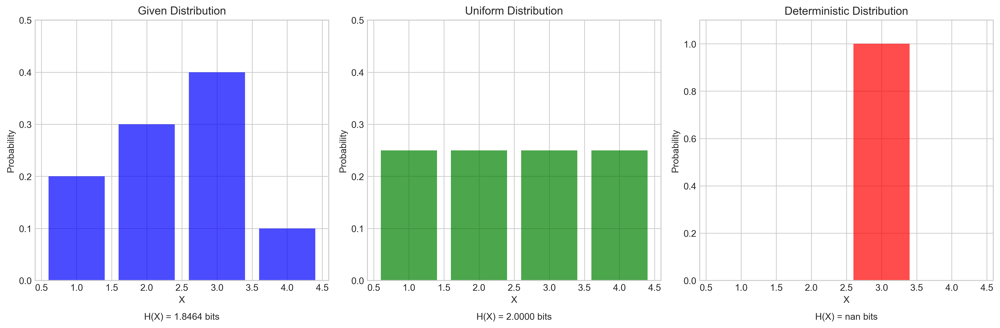
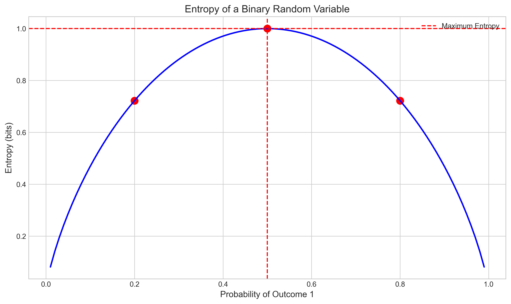

# Question 1: Entropy Calculations and Properties

## Problem Statement
Consider a discrete random variable $X$ with the following probability distribution:
- $P(X = 1) = 0.2$
- $P(X = 2) = 0.3$
- $P(X = 3) = 0.4$
- $P(X = 4) = 0.1$

### Task
1. Calculate the entropy $H(X)$ of this distribution
2. What would be the entropy if the distribution were uniform over these four values?
3. If we have another random variable $Y$ with the same possible values but is deterministic (i.e., one outcome has probability 1), what is its entropy?
4. Explain why the uniform distribution has maximum entropy among all distributions over the same set of values

## Solution

### Step 1: Understanding the Given Distribution
First, let's visualize the given probability distribution:

The left plot shows our given distribution with probabilities:
- $P(X = 1) = 0.2$
- $P(X = 2) = 0.3$
- $P(X = 3) = 0.4$
- $P(X = 4) = 0.1$

### Step 2: Calculating Entropy of Given Distribution
The entropy $H(X)$ is calculated using:
$$H(X) = -\sum_{x} p(x) \log_2 p(x)$$

For our distribution:
$$H(X) = -(0.2 \log_2 0.2 + 0.3 \log_2 0.3 + 0.4 \log_2 0.4 + 0.1 \log_2 0.1)$$
$$H(X) = 1.8464 \text{ bits}$$

This represents the average information content needed to describe an outcome from this distribution.

### Step 3: Calculating Entropy of Uniform Distribution
For a uniform distribution over four values:
$$P(X = 1) = P(X = 2) = P(X = 3) = P(X = 4) = 0.25$$

The entropy becomes:
$$H(X) = -4 \times (0.25 \log_2 0.25) = 2.0000 \text{ bits}$$

This is shown in the middle plot of our visualization, demonstrating the maximum possible entropy for four values.

### Step 4: Calculating Entropy of Deterministic Distribution
For a deterministic distribution where one outcome has probability 1:
$$P(X = 3) = 1, \quad P(X = \text{other}) = 0$$

The entropy is:
$$H(X) = 0 \text{ bits}$$

This is shown in the right plot of our visualization, representing zero uncertainty.

### Step 5: Understanding Maximum Entropy
The uniform distribution has maximum entropy because:

1. **Equal Uncertainty**: All outcomes are equally likely, maximizing uncertainty.

2. **No Bias**: The distribution doesn't favor any outcome, making it the most "spread out" possible.

3. **Mathematical Proof**: Using Lagrange multipliers, we can prove the uniform distribution maximizes entropy under the constraint that probabilities sum to 1.

This is visualized in our entropy vs probability plot:

The plot shows that for a binary random variable, entropy is maximized when both outcomes are equally likely (p = 0.5). This principle extends to distributions with more outcomes.

## Key Insights

1. **Entropy Range**: For n values:
   - Minimum entropy (0 bits): Deterministic distribution
   - Maximum entropy (log₂n bits): Uniform distribution

2. **Information Content**: Higher entropy means more uncertainty and more information needed to describe outcomes.

3. **Distribution Shape**: The shape of the probability distribution directly affects its entropy:
   - More "peaked" distributions have lower entropy
   - More "spread out" distributions have higher entropy

4. **Practical Implications**: Entropy is crucial for:
   - Data compression
   - Feature selection
   - Decision tree construction
   - Measuring information gain

## Conclusion

The calculations and visualizations demonstrate that:
- The given distribution has entropy of 1.8464 bits
- The uniform distribution has the maximum entropy of 2 bits
- The deterministic distribution has minimum entropy of 0 bits

This confirms the fundamental property that the uniform distribution has maximum entropy among all distributions over the same set of values, as it represents the state of maximum uncertainty.

## Additional Resources

For more information about entropy and its applications in machine learning, see:
- [Information Theory Basics](https://en.wikipedia.org/wiki/Information_theory)
- [Entropy in Machine Learning](https://en.wikipedia.org/wiki/Entropy_(information_theory)#Applications)
- [Maximum Entropy Principle](https://en.wikipedia.org/wiki/Principle_of_maximum_entropy) 