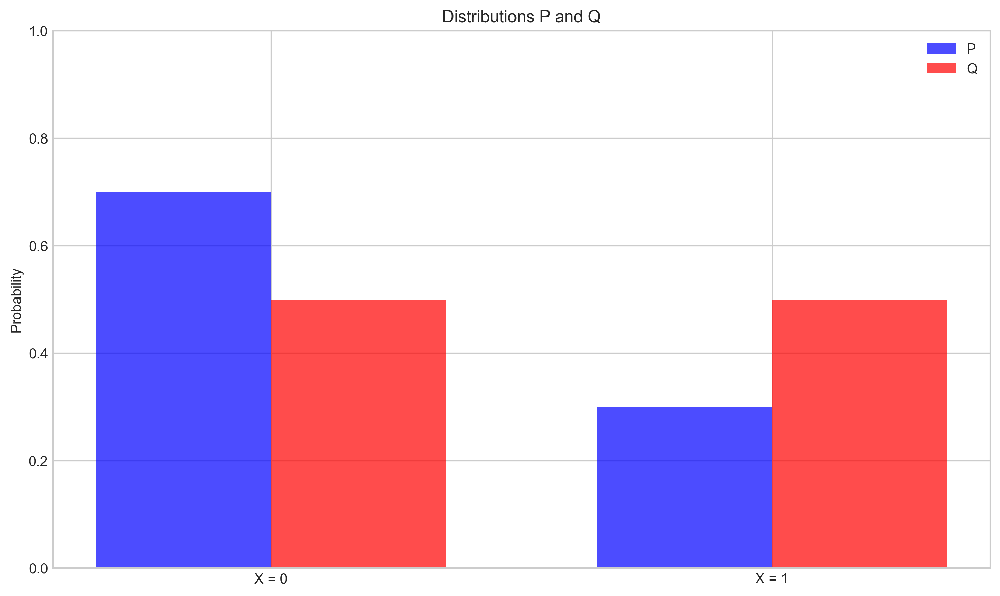
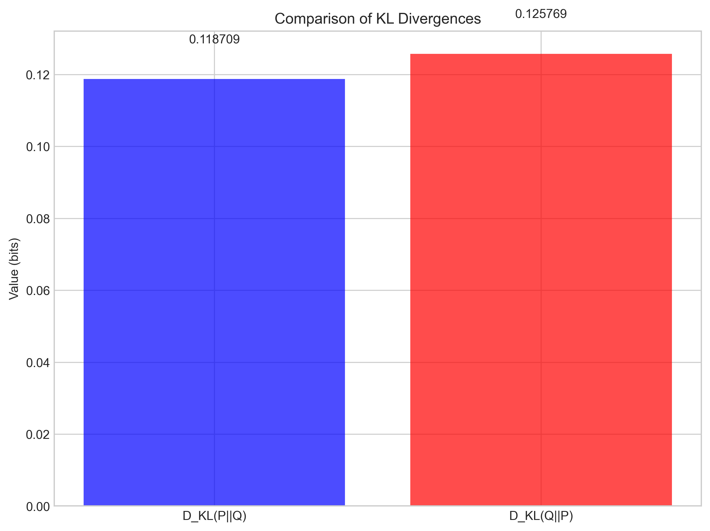
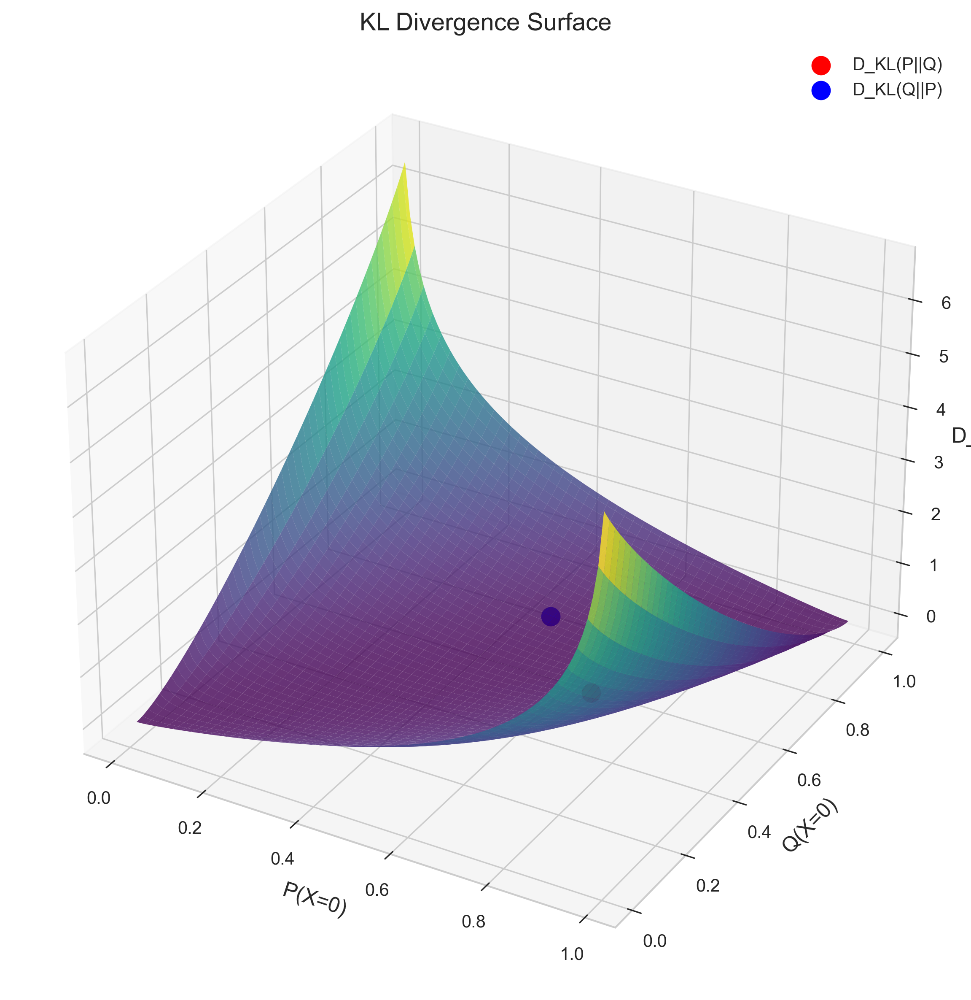

# Question 2: KL Divergence and Cross-Entropy

## Problem Statement
Consider two distributions $P$ and $Q$ over the same discrete random variable $X$:
- $P$: $P(X = 0) = 0.7$, $P(X = 1) = 0.3$
- $Q$: $Q(X = 0) = 0.5$, $Q(X = 1) = 0.5$

### Task
1. Calculate the KL divergence $D_{KL}(P||Q)$
2. Calculate the KL divergence $D_{KL}(Q||P)$
3. Calculate the cross-entropy $H(P, Q)$
4. Explain why $D_{KL}(P||Q) \neq D_{KL}(Q||P)$ and what this means in practice

## Understanding the Problem
The Kullback-Leibler (KL) divergence is a measure of the difference between two probability distributions. It quantifies how much information is lost when using one distribution to approximate another. Cross-entropy is a related concept that measures the average number of bits needed to encode data from one distribution using a code optimized for another distribution.

## Solution

### Step 1: Distribution Analysis
Let's first visualize and understand the two distributions we are working with:

*Figure 1: Visual comparison of distributions P and Q. Distribution P is skewed towards 0, while Q is uniform.*

*Figure 2: Detailed comparison showing the relative differences between P and Q.*

### Task 1: Calculate the KL Divergence $D_{KL}(P||Q)$

The Kullback-Leibler (KL) divergence from $P$ to $Q$ is defined as:

$$D_{KL}(P||Q) = \sum_{x} P(x) \log \frac{P(x)}{Q(x)}$$

Let's calculate this step by step:

For $x = 0$:
$P(X = 0) \log_2\frac{P(X = 0)}{Q(X = 0)} = 0.7 \times \log_2\frac{0.7}{0.5} = 0.7 \times \log_2(1.4) = 0.7 \times 0.4855 = 0.3399$

For $x = 1$:
$P(X = 1) \log_2\frac{P(X = 1)}{Q(X = 1)} = 0.3 \times \log_2\frac{0.3}{0.5} = 0.3 \times \log_2(0.6) = 0.3 \times (-0.7370) = -0.2211$

Adding these terms:
$D_{KL}(P||Q) = 0.3399 + (-0.2211) = 0.1187$ bits

Therefore, $D_{KL}(P||Q) = 0.1187$ bits.

### Task 2: Calculate the KL Divergence $D_{KL}(Q||P)$

For the reverse KL divergence, we calculate:

$$D_{KL}(Q||P) = \sum_{x} Q(x) \log \frac{Q(x)}{P(x)}$$

For $x = 0$:
$Q(X = 0) \log_2\frac{Q(X = 0)}{P(X = 0)} = 0.5 \times \log_2\frac{0.5}{0.7} = 0.5 \times \log_2(0.7143) = 0.5 \times (-0.4854) = -0.2427$

For $x = 1$:
$Q(X = 1) \log_2\frac{Q(X = 1)}{P(X = 1)} = 0.5 \times \log_2\frac{0.5}{0.3} = 0.5 \times \log_2(1.6667) = 0.5 \times 0.7370 = 0.3685$

Adding these terms:
$D_{KL}(Q||P) = (-0.2427) + 0.3685 = 0.1258$ bits

Therefore, $D_{KL}(Q||P) = 0.1258$ bits.

### Task 3: Calculate the Cross-Entropy $H(P, Q)$

The cross-entropy between distributions $P$ and $Q$ is defined as:

$$H(P, Q) = -\sum_{x} P(x) \log Q(x)$$

Let's calculate this step by step:

For $x = 0$:
$-P(X = 0) \log_2 Q(X = 0) = -0.7 \times \log_2(0.5) = 0.7 \times 1 = 0.7$

For $x = 1$:
$-P(X = 1) \log_2 Q(X = 1) = -0.3 \times \log_2(0.5) = 0.3 \times 1 = 0.3$

Adding these terms:
$H(P, Q) = 0.7 + 0.3 = 1.0$ bits

Therefore, $H(P, Q) = 1.0$ bits.

We can also verify the important relationship that $H(P, Q) = H(P) + D_{KL}(P||Q)$, where $H(P)$ is the entropy of distribution $P$:

$$H(P) = -\sum_{x} P(x) \log P(x)$$

Calculating $H(P)$:
$H(P) = -0.7 \times \log_2(0.7) - 0.3 \times \log_2(0.3) = 0.8813$ bits

Verifying the relationship:
$H(P) + D_{KL}(P||Q) = 0.8813 + 0.1187 = 1.0$ bits

This confirms that $H(P, Q) = H(P) + D_{KL}(P||Q)$.

### Task 4: Explain why $D_{KL}(P||Q) \neq D_{KL}(Q||P)$ and what this means in practice

From our calculations, we see that:
- $D_{KL}(P||Q) = 0.1187$ bits
- $D_{KL}(Q||P) = 0.1258$ bits

The difference is $0.0071$ bits, demonstrating that KL divergence is not symmetric.

#### Explanation:

The KL divergence is fundamentally asymmetric because it measures the additional information needed to encode samples from distribution $P$ using an optimal code designed for distribution $Q$, rather than using the optimal code for $P$ itself.

Some key insights about why this asymmetry matters in practice:

1. **Different Encoding Costs**: 
   - $D_{KL}(P||Q)$ represents the extra bits needed when using distribution $Q$ to encode samples from $P$
   - $D_{KL}(Q||P)$ represents the extra bits needed when using distribution $P$ to encode samples from $Q$
   - These two scenarios involve different encoding strategies and thus result in different inefficiencies

2. **Implications for Machine Learning**:
   - In machine learning, we often approximate complex distributions with simpler ones
   - The choice of minimizing $D_{KL}(P||Q)$ versus $D_{KL}(Q||P)$ leads to different approximations
   - $D_{KL}(P||Q)$ tends to make $Q$ cover all modes of $P$ (mode-covering behavior)
   - $D_{KL}(Q||P)$ tends to make $Q$ focus on the major mode of $P$ (mode-seeking behavior)

3. **Practical Applications**:
   - In variational inference, minimizing $D_{KL}(Q||P)$ is common (where $Q$ is the approximation and $P$ is the target)
   - In maximum likelihood estimation, minimizing $D_{KL}(P||Q)$ is common (where $P$ is the data distribution and $Q$ is the model)
   - The choice depends on whether we prefer underestimating or overestimating the variance of the true distribution

This asymmetry is important to understand when choosing which direction of KL divergence to minimize in applications like variational inference, generative modeling, and reinforcement learning.

## Conclusion

We've successfully calculated:
1. $D_{KL}(P||Q) = 0.1187$ bits
2. $D_{KL}(Q||P) = 0.1258$ bits
3. $H(P, Q) = 1.0$ bits

And we've explained why KL divergence is asymmetric, verifying that $D_{KL}(P||Q) \neq D_{KL}(Q||P)$, and discussed the practical implications of this asymmetry in machine learning applications.

We also verified the important relationship: $H(P, Q) = H(P) + D_{KL}(P||Q)$, which connects cross-entropy, entropy, and KL divergence.