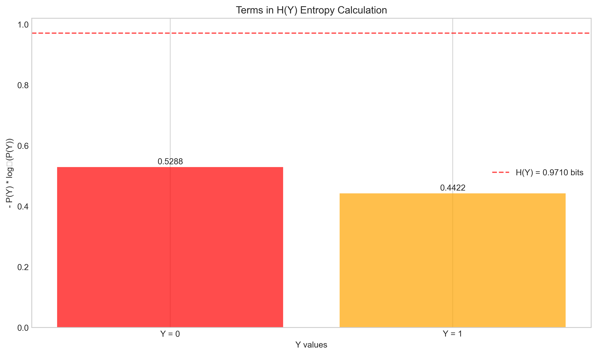

# Question 3: Joint Entropy and Mutual Information

## Problem Statement
Consider two discrete random variables $X$ and $Y$ with the following joint probability distribution:

|       | $Y = 0$ | $Y = 1$ |
|-------|---------|---------|
| $X = 0$ | 0.3     | 0.2     |
| $X = 1$ | 0.1     | 0.4     |

## Tasks
1. Calculate the entropy of $X$, $H(X)$
2. Calculate the entropy of $Y$, $H(Y)$
3. Calculate the joint entropy $H(X, Y)$
4. Calculate the mutual information $I(X; Y)$ and interpret what it means about the relationship between $X$ and $Y$

## Solution

### Joint and Marginal Distributions

First, let's understand the joint distribution and derive the marginal distributions:

The joint probability distribution $P(X, Y)$ gives us:
- $P(X = 0, Y = 0) = 0.3$
- $P(X = 0, Y = 1) = 0.2$
- $P(X = 1, Y = 0) = 0.1$
- $P(X = 1, Y = 1) = 0.4$

To find the marginal distributions, we sum over the respective variables:

**Marginal distribution of $X$:**
- $P(X = 0) = P(X = 0, Y = 0) + P(X = 0, Y = 1) = 0.3 + 0.2 = 0.5$
- $P(X = 1) = P(X = 1, Y = 0) + P(X = 1, Y = 1) = 0.1 + 0.4 = 0.5$

**Marginal distribution of $Y$:**
- $P(Y = 0) = P(X = 0, Y = 0) + P(X = 1, Y = 0) = 0.3 + 0.1 = 0.4$
- $P(Y = 1) = P(X = 0, Y = 1) + P(X = 1, Y = 1) = 0.2 + 0.4 = 0.6$

### Task 1: Calculate the Entropy of $X$, $H(X)$

The entropy of a discrete random variable $X$ is defined as:

$$H(X) = -\sum_{x} P(x) \log_2 P(x)$$

For our distribution:

$$H(X) = -P(X = 0) \log_2 P(X = 0) - P(X = 1) \log_2 P(X = 1)$$
$$H(X) = -0.5 \log_2 0.5 - 0.5 \log_2 0.5$$
$$H(X) = -0.5 \times (-1) - 0.5 \times (-1)$$
$$H(X) = 0.5 + 0.5 = 1$$

Therefore, $H(X) = 1$ bit.

This makes sense because $X$ has a uniform distribution (both values have probability 0.5), and the maximum entropy for a binary variable is 1 bit.

### Task 2: Calculate the Entropy of $Y$, $H(Y)$

Similarly, we calculate the entropy of $Y$:

$$H(Y) = -\sum_{y} P(y) \log_2 P(y)$$
$$H(Y) = -P(Y = 0) \log_2 P(Y = 0) - P(Y = 1) \log_2 P(Y = 1)$$
$$H(Y) = -0.4 \log_2 0.4 - 0.6 \log_2 0.6$$
$$H(Y) = -0.4 \times (-1.322) - 0.6 \times (-0.737)$$
$$H(Y) = 0.529 + 0.442 = 0.971$$

Therefore, $H(Y) \approx 0.971$ bits.

The entropy of $Y$ is slightly less than 1 bit because $Y$ has a non-uniform distribution, with probabilities 0.4 and 0.6.

### Task 3: Calculate the Joint Entropy $H(X, Y)$

The joint entropy is defined as:

$$H(X, Y) = -\sum_{x} \sum_{y} P(x, y) \log_2 P(x, y)$$

For our joint distribution:

$$H(X, Y) = -\sum_{i=0}^{1} \sum_{j=0}^{1} P(X = i, Y = j) \log_2 P(X = i, Y = j)$$

Computing each term:
- $-P(X = 0, Y = 0) \log_2 P(X = 0, Y = 0) = -0.3 \log_2 0.3 = 0.521$ bits
- $-P(X = 0, Y = 1) \log_2 P(X = 0, Y = 1) = -0.2 \log_2 0.2 = 0.464$ bits
- $-P(X = 1, Y = 0) \log_2 P(X = 1, Y = 0) = -0.1 \log_2 0.1 = 0.332$ bits
- $-P(X = 1, Y = 1) \log_2 P(X = 1, Y = 1) = -0.4 \log_2 0.4 = 0.529$ bits

Adding these terms:
$$H(X, Y) = 0.521 + 0.464 + 0.332 + 0.529 = 1.846$$

Therefore, $H(X, Y) \approx 1.846$ bits.

### Task 4: Calculate the Mutual Information $I(X; Y)$

Mutual information can be calculated using the formula:

$$I(X; Y) = H(X) + H(Y) - H(X, Y)$$

From our previous calculations:
- $H(X) = 1$ bit
- $H(Y) = 0.971$ bits
- $H(X, Y) = 1.846$ bits

Therefore:
$$I(X; Y) = 1 + 0.971 - 1.846 = 0.125$$ bits

We can also calculate mutual information directly using:

$$I(X; Y) = \sum_{x} \sum_{y} P(x, y) \log_2 \frac{P(x, y)}{P(x)P(y)}$$

This calculation yields the same result of approximately 0.125 bits.

### Information Measures Visualization

The following visualization shows the relationships between different information measures:

The Venn diagram representation illustrates how the mutual information represents the overlap between $H(X)$ and $H(Y)$:

### Interpretation of Mutual Information

The mutual information value $I(X; Y) = 0.125$ bits tells us:

1. **Variables are dependent**: Since $I(X; Y) > 0$, the variables $X$ and $Y$ are statistically dependent. If they were independent, the mutual information would be zero.

2. **Quantification of dependence**: The value 0.125 bits quantifies how much information is shared between $X$ and $Y$. It represents the reduction in uncertainty (entropy) about one variable when we know the value of the other.

3. **Normalized context**: When normalized by the minimum entropy of either variable, we get $I(X; Y) / \min(H(X), H(Y)) = 0.125 / 0.971 \approx 12.8\%$, which means knowing one variable reduces uncertainty about the other by about 12.8%.

4. **Practical interpretation**: In practical terms, this mutual information indicates a moderate statistical dependence between $X$ and $Y$. Knowing the value of $X$ gives us some information about $Y$ and vice versa, but the relationship is not extremely strong.

We can visualize the comprehensive relationship between $X$ and $Y$ with conditional probabilities:

## Conclusion

We have calculated:
1. $H(X) = 1$ bit
2. $H(Y) = 0.971$ bits
3. $H(X, Y) = 1.846$ bits
4. $I(X; Y) = 0.125$ bits

The mutual information of 0.125 bits indicates that $X$ and $Y$ share information and are not independent. This means knowing the value of one variable reduces our uncertainty about the other by approximately 12.8%. This insight is valuable in various applications, from data compression to feature selection in machine learning, where understanding the relationships between variables is crucial. 