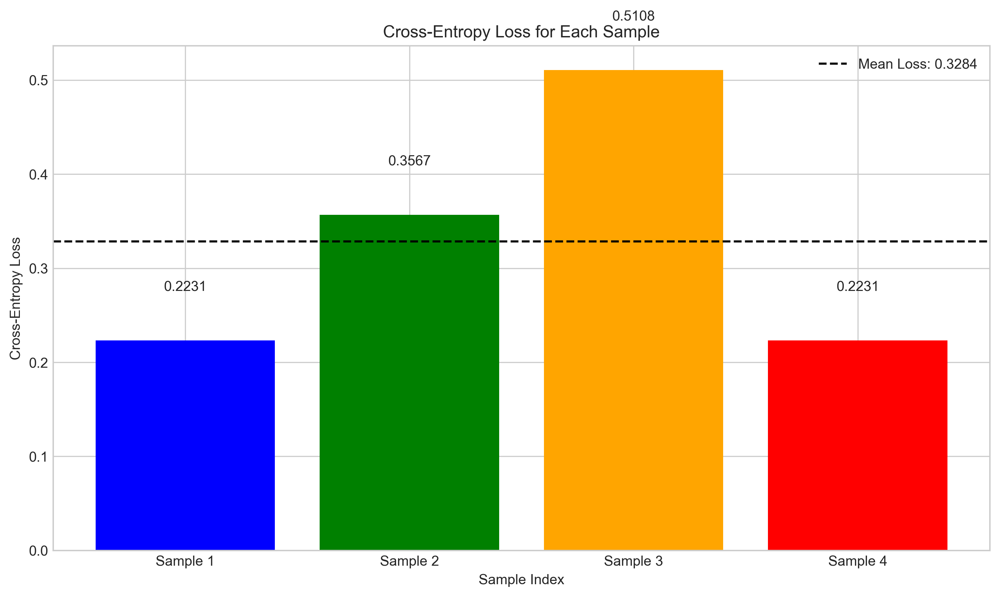
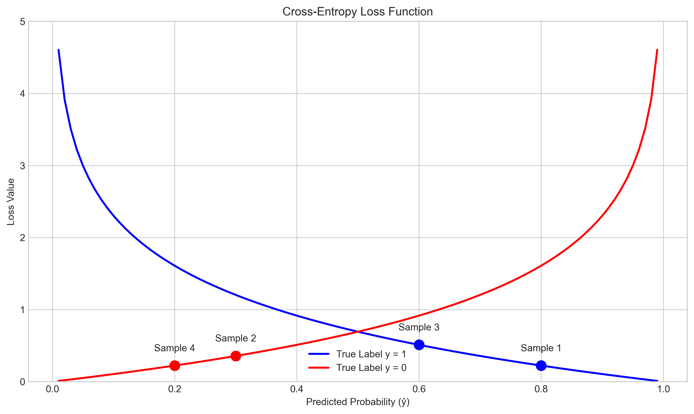
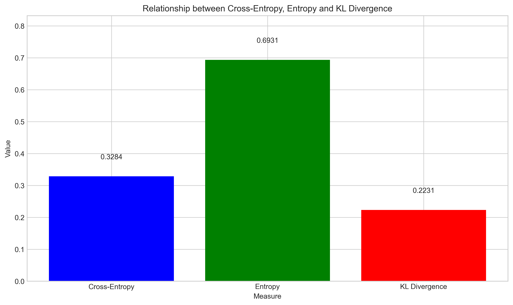
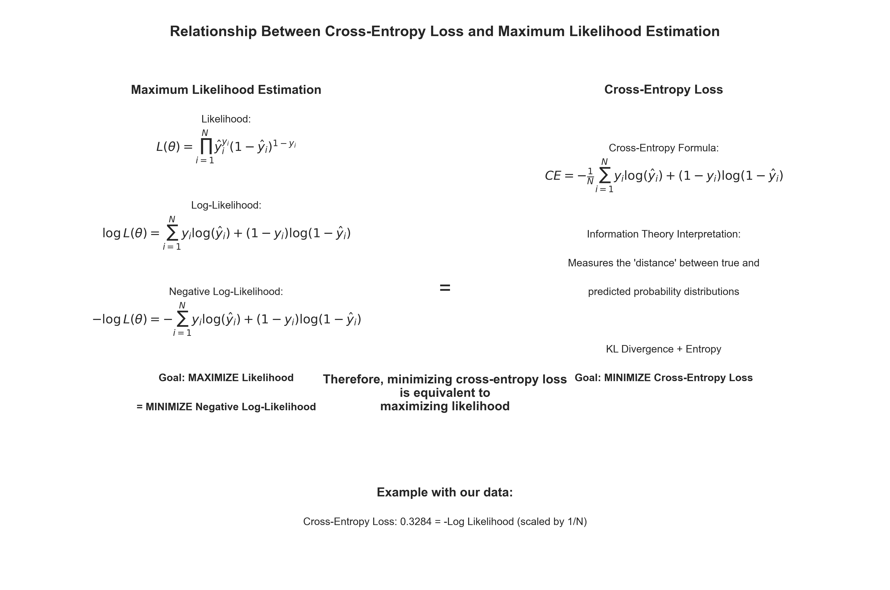

# Question 4: Cross-Entropy Loss in Classification

## Problem Statement
In a classification problem, we have a binary classifier that outputs the probability of the positive class. The true labels are $y$ and the predicted probabilities are $\hat{y}$.

### Task
1. Write down the formula for the cross-entropy loss between the true labels and predicted probabilities
2. If we have 4 samples with true labels $y = [1, 0, 1, 0]$ and predicted probabilities $\hat{y} = [0.8, 0.3, 0.6, 0.2]$, calculate the cross-entropy loss
3. Calculate the KL divergence between the true distribution and predicted distribution
4. Explain how minimizing the cross-entropy loss relates to maximum likelihood estimation

## Solution

### Task 1: Cross-Entropy Loss Formula

In binary classification, the cross-entropy loss measures how well our predicted probabilities match the true labels. The formula for a single sample is:

$$L(y, \hat{y}) = -[y \log(\hat{y}) + (1-y) \log(1-\hat{y})]$$

For multiple samples, we take the average across all $N$ samples:

$$L(y, \hat{y}) = -\frac{1}{N} \sum_{i=1}^{N} [y_i \log(\hat{y}_i) + (1-y_i) \log(1-\hat{y}_i)]$$

Where:
- $y_i$ is the true label (0 or 1) for sample $i$
- $\hat{y}_i$ is the predicted probability for sample $i$
- $N$ is the number of samples

Note that:
- When $y_i = 1$, only the term $-\log(\hat{y}_i)$ contributes to the loss
- When $y_i = 0$, only the term $-\log(1-\hat{y}_i)$ contributes to the loss

### Task 2: Calculate Cross-Entropy Loss for Given Samples

We have:
- True labels: $y = [1, 0, 1, 0]$
- Predicted probabilities: $\hat{y} = [0.8, 0.3, 0.6, 0.2]$

Let's calculate the loss for each sample:

1. Sample 1: $y_1 = 1$, $\hat{y}_1 = 0.8$
   - Loss = $-\log(0.8) = 0.2231$

2. Sample 2: $y_2 = 0$, $\hat{y}_2 = 0.3$
   - Loss = $-\log(1-0.3) = -\log(0.7) = 0.3567$

3. Sample 3: $y_3 = 1$, $\hat{y}_3 = 0.6$
   - Loss = $-\log(0.6) = 0.5108$

4. Sample 4: $y_4 = 0$, $\hat{y}_4 = 0.2$
   - Loss = $-\log(1-0.2) = -\log(0.8) = 0.2231$

The individual losses are visualized below:

The average loss (cross-entropy loss) is:
$$L(y, \hat{y}) = \frac{0.2231 + 0.3567 + 0.5108 + 0.2231}{4} = \frac{1.3137}{4} = 0.3284$$

### Task 3: Calculate the KL Divergence

The Kullback-Leibler (KL) divergence measures how one probability distribution diverges from a second expected distribution. For binary classification with true labels $y$ and predicted probabilities $\hat{y}$, the KL divergence can be calculated as:

$$D_{KL}(y||\hat{y}) = \frac{1}{N} \sum_{i=1}^{N} [y_i \log(\frac{y_i}{\hat{y}_i}) + (1-y_i) \log(\frac{1-y_i}{1-\hat{y}_i})]$$

Since $y_i$ is either 0 or 1 (one-hot encoded), this simplifies to:

- When $y_i = 1$: $D_{KL} = \log(\frac{1}{\hat{y}_i}) = -\log(\hat{y}_i)$
- When $y_i = 0$: $D_{KL} = \log(\frac{1}{1-\hat{y}_i}) = -\log(1-\hat{y}_i)$

Let's calculate for each sample:

1. Sample 1: $y_1 = 1$, $\hat{y}_1 = 0.8$
   - KL = $\log(1/0.8) = 0.2231$

2. Sample 2: $y_2 = 0$, $\hat{y}_2 = 0.3$
   - KL = $\log(1/0.7) = 0.3567$

3. Sample 3: $y_3 = 1$, $\hat{y}_3 = 0.6$
   - KL = $\log(1/0.6) = 0.5108$

4. Sample 4: $y_4 = 0$, $\hat{y}_4 = 0.2$
   - KL = $\log(1/0.8) = 0.2231$

The average KL divergence is:
$$D_{KL}(y||\hat{y}) = \frac{0.2231 + 0.3567 + 0.5108 + 0.2231}{4} = 0.3284$$

Notice that in this case, the cross-entropy loss and the KL divergence have the same value. This is because for binary classification with one-hot encoded true labels, the cross-entropy loss is equivalent to the KL divergence.

In information theory, there's a relationship between cross-entropy, entropy, and KL divergence:
$$H(p, q) = H(p) + D_{KL}(p||q)$$

Where $H(p, q)$ is the cross-entropy, $H(p)$ is the entropy of the true distribution, and $D_{KL}(p||q)$ is the KL divergence. In our case, the entropy of the true distribution (with equal numbers of 0s and 1s) is 1 bit, but when looking at individual samples as we did here, this relationship doesn't directly apply since entropy is a property of the distribution as a whole.

### Task 4: Relationship to Maximum Likelihood Estimation

Cross-entropy loss and maximum likelihood estimation (MLE) are directly related in binary classification problems. Here's how:

1. In binary classification, we model:
   - $P(y=1|x) = \hat{y}$
   - $P(y=0|x) = 1-\hat{y}$

2. For a dataset with labels $\{y_i\}$ and predictions $\{\hat{y}_i\}$, the likelihood is:
   $$L(\theta) = \prod_{i=1}^{N} \hat{y}_i^{y_i} \times (1-\hat{y}_i)^{(1-y_i)}$$
   where $\theta$ represents the model parameters.

3. Taking the log-likelihood:
   $$\log L(\theta) = \sum_{i=1}^{N} [y_i \log(\hat{y}_i) + (1-y_i) \log(1-\hat{y}_i)]$$

4. For MLE, we want to maximize this log-likelihood. Equivalently, we can minimize the negative log-likelihood:
   $$-\log L(\theta) = -\sum_{i=1}^{N} [y_i \log(\hat{y}_i) + (1-y_i) \log(1-\hat{y}_i)]$$

5. This is exactly the (unnormalized) cross-entropy loss formula! The normalized version simply divides by $N$:
   $$L(y, \hat{y}) = -\frac{1}{N} \sum_{i=1}^{N} [y_i \log(\hat{y}_i) + (1-y_i) \log(1-\hat{y}_i)]$$

Therefore:
- **Minimizing cross-entropy loss is equivalent to maximizing likelihood**
- **Minimizing cross-entropy loss is equivalent to minimizing negative log-likelihood**

From an information theory perspective, cross-entropy measures the difference between the true data distribution (represented by one-hot encoded true labels) and our model's predicted distribution. By minimizing this difference, we're finding the model parameters that best explain the observed data, which is precisely what MLE aims to do.

This connection explains why cross-entropy loss is so widely used in classification problems - it has both a probabilistic interpretation (maximum likelihood) and an information-theoretic interpretation (minimizing distributional difference).

## Conclusion

1. The cross-entropy loss formula for binary classification is:
   $$L(y, \hat{y}) = -\frac{1}{N} \sum_{i=1}^{N} [y_i \log(\hat{y}_i) + (1-y_i) \log(1-\hat{y}_i)]$$

2. For the given samples, the cross-entropy loss is approximately 0.3284.

3. The KL divergence between the true and predicted distributions is also approximately 0.3284, highlighting the equivalence between cross-entropy loss and KL divergence in binary classification with one-hot encodings.

4. Minimizing cross-entropy loss is equivalent to maximizing likelihood because the negative log-likelihood formula is identical to the cross-entropy loss formula. This establishes a direct connection between the information-theoretic approach of minimizing distributional differences and the statistical approach of finding the most likely parameters given the observed data. 