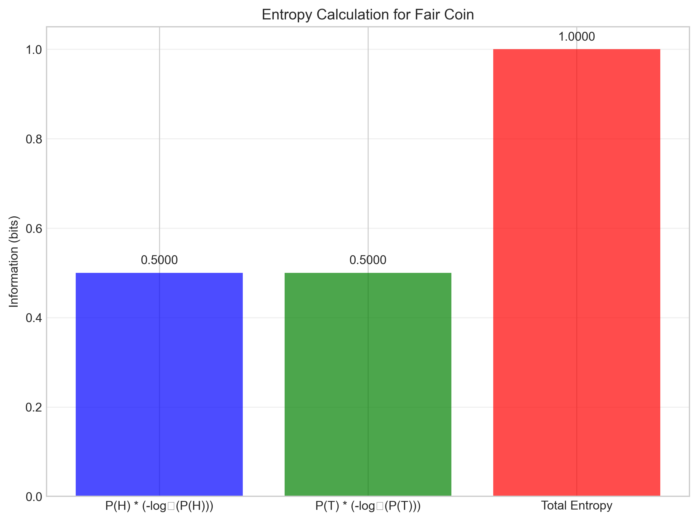
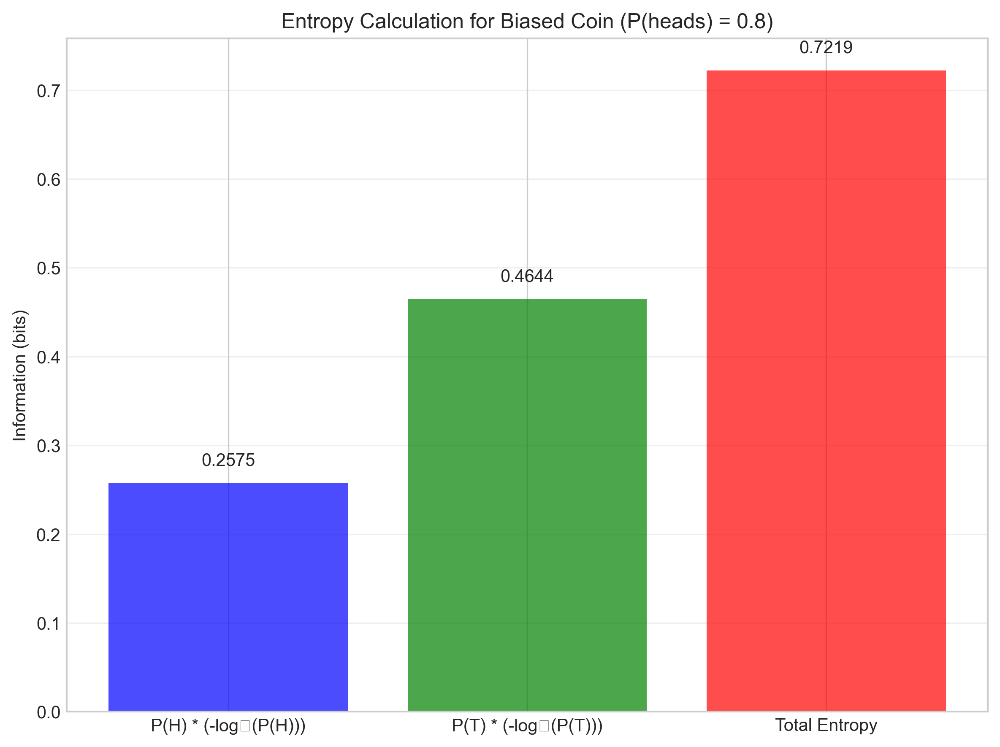
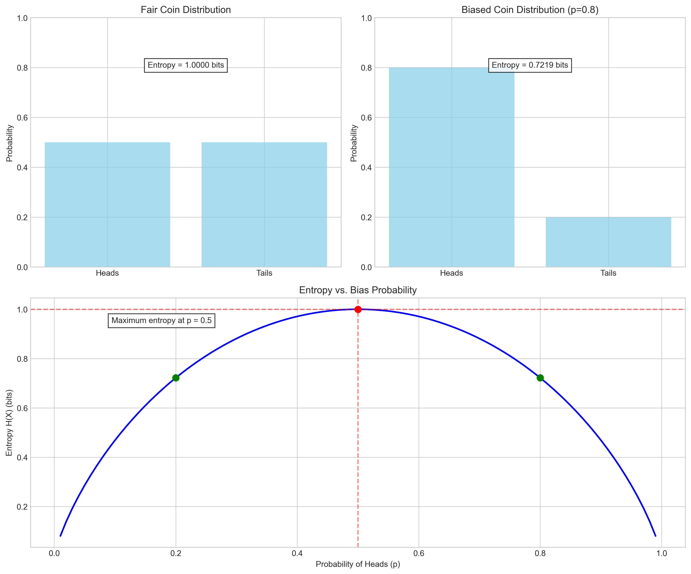
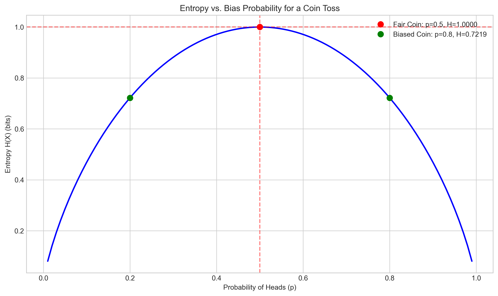
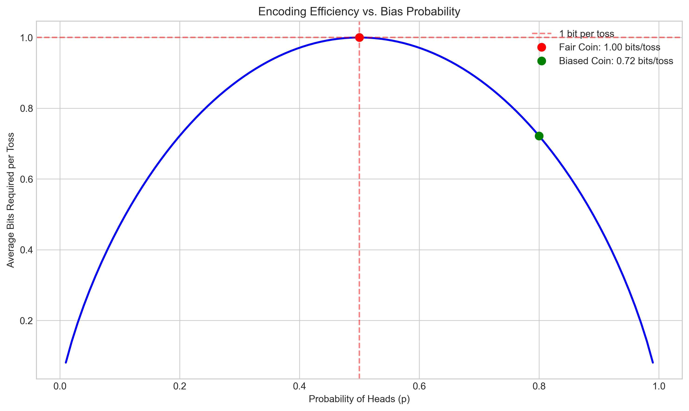
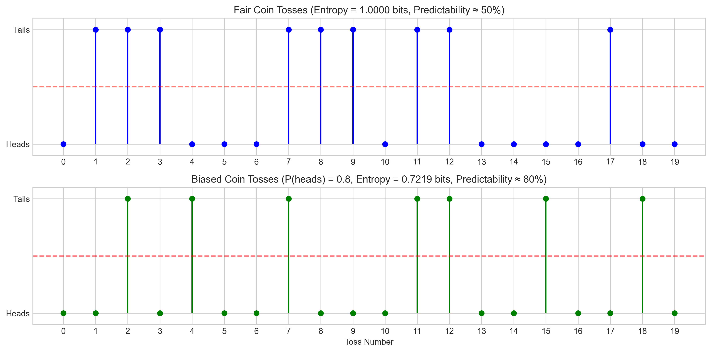

# L2.2 Quiz - Question 5: Entropy in Coin Tosses

## Problem Statement

We are examining entropy in binary random variables using coin tosses:
- A fair coin has P(heads) = 0.5, P(tails) = 0.5
- A biased coin has P(heads) = 0.8, P(tails) = 0.2

### Tasks

1. Calculate the entropy of the fair coin distribution.
2. Calculate the entropy of the biased coin distribution.
3. Explain why the fair coin has higher entropy than the biased coin.

## Solution

### Task 1: Entropy of Fair Coin

The entropy of a binary random variable (like a coin toss) is given by:

$$H(X) = -\sum_{i} p(x_i) \log_2 p(x_i) = -p \log_2 p - (1-p) \log_2 (1-p)$$

For a fair coin with P(heads) = 0.5 and P(tails) = 0.5:

$$H(X) = -0.5 \log_2 0.5 - 0.5 \log_2 0.5$$
$$H(X) = -0.5 \times (-1) - 0.5 \times (-1)$$
$$H(X) = 0.5 + 0.5 = 1 \text{ bit}$$

Therefore, the entropy of a fair coin is exactly 1 bit, which is the maximum possible entropy for a binary random variable.

### Task 2: Entropy of Biased Coin

For a biased coin with P(heads) = 0.8 and P(tails) = 0.2:

$$H(X) = -0.8 \log_2 0.8 - 0.2 \log_2 0.2$$
$$H(X) = -0.8 \times (-0.322) - 0.2 \times (-2.322)$$
$$H(X) = 0.258 + 0.464 = 0.722 \text{ bits}$$

Therefore, the entropy of this biased coin is approximately 0.722 bits, which is less than the entropy of the fair coin.

### Task 3: Why Fair Coin Has Higher Entropy

The fair coin has higher entropy than the biased coin for several key reasons:

#### 1. Entropy measures uncertainty or information content

Entropy quantifies the average amount of "surprise" or "information" we receive when observing the outcome of a random variable. Higher entropy indicates more uncertainty about the outcome before it occurs.

#### 2. Maximum uncertainty with equal probabilities

The fair coin has maximum uncertainty:
- With P(heads) = P(tails) = 0.5, both outcomes are equally likely
- This makes prediction most difficult - our best strategy (always guess heads) only gives 50% accuracy
- The entropy is maximized at 1 bit, which is the theoretical maximum for a binary variable

#### 3. Biased coin has reduced uncertainty

The biased coin has less uncertainty:
- With P(heads) = 0.8, P(tails) = 0.2, outcomes are not equally likely
- We can make better predictions (always guess heads) giving 80% accuracy
- This reduced uncertainty is reflected in the lower entropy of 0.722 bits

#### 4. Mathematical proof

It can be proven that for any probability distribution, entropy is maximized when all outcomes are equally likely. For a binary variable, this means P = 0.5, and any deviation reduces entropy.

#### 5. Information-theoretic perspective

From an information theory standpoint, entropy represents the average minimum number of bits needed to encode the outcomes of a random variable:

- For a fair coin: We need exactly 1 bit per toss (e.g., 0 for heads, 1 for tails)
- For a biased coin: We can use an optimal coding scheme (like Huffman coding) that uses fewer bits on average by assigning shorter codes to more frequent outcomes

This is demonstrated in the following visualization, showing that the biased coin requires fewer bits on average when optimally encoded:

#### 6. Practical demonstration

We can simulate coin tosses to see the difference in predictability:

As shown in the simulation:
- Fair coin: Best prediction strategy gives ~50% accuracy
- Biased coin: Best prediction strategy gives ~80% accuracy

The biased coin is more predictable, thus containing less information (lower entropy).

## Conclusion

The entropy of a random variable is a measure of its uncertainty or information content. For a binary random variable like a coin toss:

1. **Fair coin entropy:** 1 bit (maximum possible for binary variable)
2. **Biased coin entropy:** 0.722 bits (lower than maximum)

The fair coin has higher entropy because it has maximum uncertainty with equally likely outcomes, making prediction most difficult. The biased coin has more predictable outcomes, reducing uncertainty and entropy. This relationship between probability distribution and entropy is a fundamental concept in information theory, with applications in data compression, machine learning, and communication systems.

From a machine learning perspective, this concept is crucial for understanding concepts like cross-entropy loss, which measures the difference between a model's predicted probability distribution and the true distribution. 