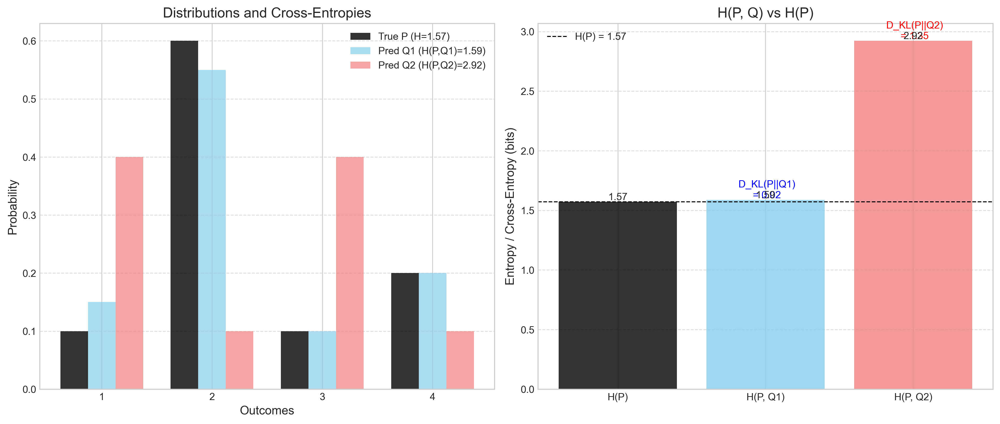

# Question 6: Information Theory True/False

## Problem Statement
Evaluate whether each of the following statements is TRUE or FALSE. Justify your answer with a brief explanation.

### Task
1. The KL divergence between two identical probability distributions is always zero.
2. The entropy of a uniform distribution is always higher than any other distribution over the same set of values.
3. For any two random variables $X$ and $Y$, the mutual information $I(X;Y)$ is always non-negative.
4. The cross-entropy between two distributions is always greater than or equal to the entropy of the true distribution.
5. If the entropy of a random variable $X$ is zero, then $X$ must be deterministic.

## Understanding the Problem
This problem tests fundamental concepts from information theory. For each statement, we need to:
- Apply the correct mathematical definition (KL Divergence, Entropy, Mutual Information, Cross-Entropy)
- Provide clear reasoning based on information-theoretic principles
- Determine if the statement is true or false

Key Concepts:
- **KL Divergence $D_{KL}(P || Q)$**: Measures the difference between two probability distributions $P$ and $Q$.
- **Entropy $H(P)$**: Measures the uncertainty or average information content of a random variable following distribution $P$.
- **Mutual Information $I(X;Y)$**: Measures the amount of information obtained about one random variable by observing another.
- **Cross-Entropy $H(P, Q)$**: Measures the average number of bits needed to encode data from $P$ using a code optimized for $Q$.

## Solution

### Statement 1: KL divergence between identical distributions

**Statement:** The KL divergence between two identical probability distributions is always zero.

**Verdict: TRUE**

**Explanation:**

The Kullback-Leibler (KL) divergence between two discrete probability distributions $P$ and $Q$ is defined as:
$$ D_{KL}(P || Q) = \sum_x P(x) \log_2 \frac{P(x)}{Q(x)} $$

If the two distributions are identical, then $P(x) = Q(x)$ for all possible outcomes $x$. Substituting $Q(x) = P(x)$ into the formula:
$$ D_{KL}(P || P) = \sum_x P(x) \log_2 \frac{P(x)}{P(x)} = \sum_x P(x) \log_2(1) $$

Since $\log_2(1) = 0$, the expression becomes:
$$ D_{KL}(P || P) = \sum_x P(x) \times 0 = 0 $$

Thus, the KL divergence between any probability distribution and itself is always zero. This aligns with the interpretation of KL divergence as a measure of how one distribution differs from another; if they are the same, the difference is zero.

**Numerical Verification:**
Consider $P = [0.1, 0.2, 0.3, 0.4]$. If $Q = P$, then:
```
Distribution P: [0.1 0.2 0.3 0.4]
Distribution Q: [0.1 0.2 0.3 0.4]
KL Divergence D_KL(P || Q): 0.0000
```

---

### Statement 2: Maximum entropy of uniform distribution

**Statement:** The entropy of a uniform distribution is always higher than any other distribution over the same set of values.

**Verdict: TRUE**

**Explanation:**

Entropy, $H(P) = - \sum_x P(x) \log_2 P(x)$, measures the average uncertainty or surprise associated with a random variable's outcomes. The maximum entropy principle states that, given a set of possible outcomes, the probability distribution that best represents the current state of knowledge is the one with the largest entropy. For a discrete variable with $K$ possible outcomes, this is the uniform distribution, where $P(x) = 1/K$ for all $x$.

Any deviation from uniformity implies some outcomes are more likely than others, reducing the overall uncertainty and thus lowering the entropy. The maximum possible entropy is $\log_2(K)$, achieved only by the uniform distribution.

**Numerical Verification ($K=5$):**
- Uniform: $P = [0.2, 0.2, 0.2, 0.2, 0.2]$, $H(P) = 2.3219$ bits (Max = $\log_2(5) \approx 2.3219$)
- Non-Uniform 1: $P = [0.4, 0.2, 0.2, 0.1, 0.1]$, $H(P) = 2.1219$ bits
- Non-Uniform 2: $P = [0.7, 0.1, 0.1, 0.05, 0.05]$, $H(P) = 1.4568$ bits

As the distribution becomes less uniform (more skewed), the entropy decreases.

---

### Statement 3: Non-negativity of mutual information

**Statement:** For any two random variables $X$ and $Y$, the mutual information $I(X;Y)$ is always non-negative.

**Verdict: TRUE**

**Explanation:**

Mutual information $I(X;Y)$ measures the mutual dependence between two random variables $X$ and $Y$. It quantifies the amount of information obtained about one variable through observing the other. It is defined as:
$$ I(X;Y) = \sum_{x,y} P(x,y) \log_2 \frac{P(x,y)}{P(x)P(y)} $$

This expression is exactly the KL divergence between the joint distribution $P(X,Y)$ and the product of the marginal distributions $P(X)P(Y)$:
$$ I(X;Y) = D_{KL}( P(X,Y) \parallel P(X)P(Y) ) $$

We know from Gibbs' inequality that the KL divergence $D_{KL}(P \parallel Q)$ is always non-negative ($D_{KL}(P \parallel Q) \ge 0$), with equality if and only if $P = Q$. Therefore, $I(X;Y) \ge 0$.

Equality $I(X;Y) = 0$ holds if and only if $P(X,Y) = P(X)P(Y)$, which is the condition for the independence of $X$ and $Y$.

**Numerical Verification:**
- Example 1 (Dependent): $I(X;Y) = 0.2564 > 0$
- Example 2 (Independent): $I(X;Y) = 0.0000 = 0$
- Example 3 (Partially Dependent): $I(X;Y) = 0.1245 > 0$

---

### Statement 4: Cross-entropy vs. Entropy

**Statement:** The cross-entropy between two distributions is always greater than or equal to the entropy of the true distribution.

**Verdict: TRUE**

**Explanation:**

Cross-entropy $H(P, Q) = - \sum_x P(x) \log_2 Q(x)$ measures the average number of bits needed to identify an event drawn from distribution $P$ when the coding scheme is optimized for an estimated distribution $Q$. Entropy $H(P) = - \sum_x P(x) \log_2 P(x)$ is the minimum average number of bits required when the coding scheme is optimal for $P$.

The relationship between entropy, cross-entropy, and KL divergence is:
$$ H(P, Q) = H(P) + D_{KL}(P \parallel Q) $$

This can be shown by:
$$D_{KL}(P \parallel Q) = \sum_x P(x) \log_2 \frac{P(x)}{Q(x)} = \sum_x P(x) (\log_2 P(x) - \log_2 Q(x))$$
$$D_{KL}(P \parallel Q) = -H(P) - \sum_x P(x) \log_2 Q(x) = -H(P) + H(P, Q)$$
Rearranging gives $H(P, Q) = H(P) + D_{KL}(P \parallel Q)$.

Since $D_{KL}(P \parallel Q) \ge 0$ (Gibbs' inequality), it directly follows that:
$$ H(P, Q) \ge H(P) $$

Equality holds if and only if $D_{KL}(P \parallel Q) = 0$, which means $P = Q$.

**Numerical Verification:**
- $P = [0.1, 0.6, 0.1, 0.2]$, $H(P) = 1.5710$
- $Q1$ (close) = $[0.15, 0.55, 0.1, 0.2]$, $H(P, Q1) = 1.5878$, $D_{KL}(P || Q1) = 0.0168$. Check: $1.5710 + 0.0168 = 1.5878$. Inequality: $1.5878 \ge 1.5710$ (True)
- $Q2$ (far) = $[0.4, 0.1, 0.4, 0.1]$, $H(P, Q2) = 2.9219$, $D_{KL}(P || Q2) = 1.3510$. Check: $1.5710 + 1.3510 = 2.9219$. Inequality: $2.9219 \ge 1.5710$ (True)

---

### Statement 5: Zero entropy and deterministic variables

**Statement:** If the entropy of a random variable $X$ is zero, then $X$ must be deterministic.

**Verdict: TRUE**

**Explanation:**

Entropy is defined as $H(P) = - \sum_x P(x) \log_2 P(x)$. For the entropy to be zero, every term in the sum $P(x) \log_2 P(x)$ must be zero.

Consider a single term $f(p) = -p \log_2 p$.
- If $p=1$, then $f(1) = -1 \log_2 1 = -1 \times 0 = 0$.
- If $p=0$, using the convention $0 \log_2 0 = 0$, then $f(0) = 0$.
- If $0 < p < 1$, then $\log_2 p < 0$, so $f(p) = -p \log_2 p > 0$.

Therefore, for the total entropy $H(P) = \sum f(P(x))$ to be zero, every individual probability $P(x)$ must be either 0 or 1. Since the probabilities must sum to 1 ($\sum P(x) = 1$), exactly one outcome $x_i$ must have $P(x_i) = 1$, and all other outcomes $x_j$ (for $j \ne i$) must have $P(x_j) = 0$.

This precisely describes a deterministic random variable, where the outcome is known with certainty (probability 1), and there is no uncertainty.

**Numerical Verification:**
- Deterministic: $P = [0., 1., 0., 0.]$, $H(P) = 0.0000$
- Near-Deterministic: $P = [0.01, 0.97, 0.01, 0.01]$, $H(P) = 0.2419 > 0$
- Uniform: $P = [0.25, 0.25, 0.25, 0.25]$, $H(P) = 2.0000 > 0$

## Visual Explanations

### Figure 1: Identical Distributions (KL Divergence)

*Visualization of two identical distributions $P$ and $Q$. The KL divergence between them is 0, signifying no difference.*

### Figure 2: Maximum Entropy Principle

*Left: Comparison of uniform and non-uniform distributions over 5 outcomes, showing the uniform distribution has the highest entropy. Right: Entropy of a binary variable peaks at $p=0.5$ (uniform) and decreases towards $p=0$ or $p=1$.*

### Figure 3: Mutual Information (via KL Divergence)

*Comparison of joint distributions $P(X,Y)$ (top row) with the product of their marginals $P(X)P(Y)$ (bottom row) for dependent (Ex 1, 3) and independent (Ex 2) variables. Mutual Information is the non-negative KL divergence between the joint distribution and the product of marginals.*

### Figure 4: Cross-Entropy vs Entropy

*Left: Distributions $P$, $Q1$, $Q2$. Right: Comparison of $H(P)$ with cross-entropies $H(P, Q1)$ and $H(P, Q2)$. The difference $H(P,Q) - H(P)$ is the non-negative KL divergence $D_{KL}(P || Q)$.*

### Figure 5: Zero Entropy Condition

*Left: A deterministic distribution (probability 1 for one outcome, 0 for others) has zero entropy. Right: For a binary variable, entropy is zero only when $p=0$ or $p=1$ (deterministic cases), otherwise it is positive.*

## Key Insights

### KL Divergence Properties
- $D_{KL}(P || Q)$ measures the "information gain" when moving from prior $Q$ to posterior $P$, or the inefficiency of using code for $Q$ when data follows $P$.
- $D_{KL}(P || Q) \ge 0$ (Gibbs' Inequality), with equality if and only if $P = Q$.
- KL Divergence is not symmetric: $D_{KL}(P || Q) \neq D_{KL}(Q || P)$ generally.

### Entropy and Uncertainty
- Entropy $H(P)$ quantifies the average level of "information", "surprise", or "uncertainty" inherent in a variable's possible outcomes.
- The uniform distribution maximizes entropy for a given set of outcomes, representing the state of maximum uncertainty.
- Lower entropy implies a more predictable variable; zero entropy implies a deterministic variable.

### Mutual Information and Dependence
- $I(X;Y)$ measures the reduction in uncertainty about $X$ due to knowing $Y$ (or vice versa).
- $I(X;Y) = H(X) - H(X|Y) = H(Y) - H(Y|X) = H(X) + H(Y) - H(X,Y)$.
- As $I(X;Y) = D_{KL}(P(X,Y) || P(X)P(Y))$, it inherits the non-negativity property of KL divergence.
- $I(X;Y) = 0$ if and only if $X$ and $Y$ are independent.

### Cross-Entropy in Practice
- $H(P, Q)$ represents the average message length per datum if a code optimal for $Q$ is used for data drawn from $P$.
- Since $H(P, Q) = H(P) + D_{KL}(P || Q)$, minimizing cross-entropy (often used as a loss function in ML) is equivalent to minimizing KL divergence between the predicted distribution $Q$ and the true distribution $P$.
- The cross-entropy is always greater than or equal to the true entropy $H(P)$, with equality only if the modeled distribution $Q$ matches the true distribution $P$.

### Deterministic Variables
- A deterministic variable has only one possible outcome with probability 1.
- Zero entropy is a defining characteristic of deterministic variables, indicating no uncertainty.

## Conclusion
Based on the definitions and properties of fundamental information-theoretic measures:

| Statement                                                                                             | Truth Value | Justification                                                           |
| :---------------------------------------------------------------------------------------------------- | :---------- | :---------------------------------------------------------------------- |
| 1. The KL divergence between two identical probability distributions is always zero.                  | TRUE        | $D_{KL}(P || P) = \sum P(x) \log(P(x)/P(x)) = \sum P(x) \log(1) = 0$      |
| 2. The entropy of a uniform distribution is always higher than any other distribution over the same set. | TRUE        | Maximum Entropy Principle; any deviation reduces uncertainty.           |
| 3. Mutual information $I(X;Y)$ is always non-negative.                                                | TRUE        | $I(X;Y) = D_{KL}(P(X,Y) || P(X)P(Y)) \ge 0$ by Gibbs' inequality.     |
| 4. Cross-entropy is always greater than or equal to the entropy of the true distribution.             | TRUE        | $H(P,Q) = H(P) + D_{KL}(P || Q)$, and $D_{KL}(P || Q) \ge 0$.          |
| 5. If the entropy of a random variable $X$ is zero, then $X$ must be deterministic.                   | TRUE        | $H(P)=0$ only if one $P(x_i)=1$ and all others are 0.                 |

All five statements are TRUE, reflecting core properties of KL divergence, entropy, mutual information, and cross-entropy. 