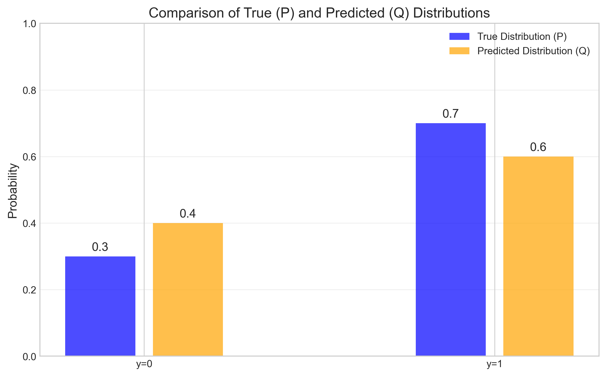
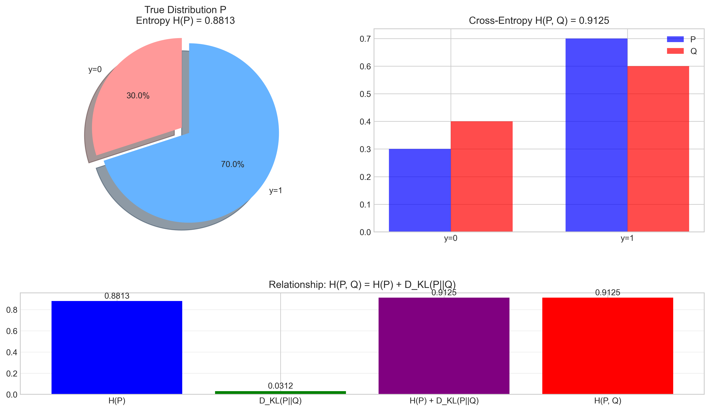
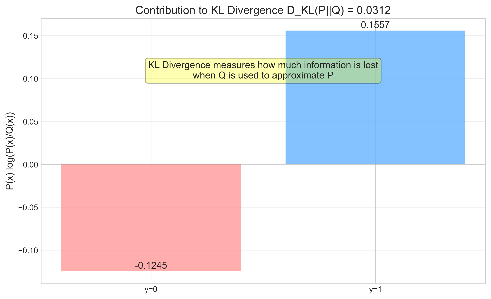

# Question 7: Cross-Entropy, Entropy, and KL Divergence Relationship

## Problem Statement
Consider a simple binary classification problem where:
- The true distribution $P$ has $P(y=1) = 0.7$ and $P(y=0) = 0.3$
- The predicted distribution $Q$ has $Q(y=1) = 0.6$ and $Q(y=0) = 0.4$

## Task
1. Calculate the cross-entropy $H(P, Q)$
2. Calculate the entropy $H(P)$
3. Calculate the KL divergence $D_{KL}(P||Q)$
4. Verify that $H(P, Q) = H(P) + D_{KL}(P||Q)$ 

## Correct Answer

### 1. Cross-entropy $H(P, Q) = 0.912454$
### 2. Entropy $H(P) = 0.881291$
### 3. KL divergence $D_{KL}(P||Q) = 0.031163$
### 4. $H(P) + D_{KL}(P||Q) = 0.881291 + 0.031163 = 0.912454 = H(P, Q)$ ✓

## Solution

### Step 1: Understanding the Problem Setup

Let's first visualize the true distribution $P$ and predicted distribution $Q$:

We can see that:
- The true distribution $P$ has a higher probability for class 1 ($P(y=1) = 0.7$) compared to the predicted distribution $Q$ ($Q(y=1) = 0.6$)
- Conversely, $Q$ assigns a higher probability to class 0 ($Q(y=0) = 0.4$) than $P$ does ($P(y=0) = 0.3$)

### Step 2: Calculating Cross-entropy $H(P, Q)$

The cross-entropy between distributions $P$ and $Q$ is defined as:

$$H(P, Q) = -\sum_{x} P(x) \log Q(x)$$

For our binary classification problem:

$$H(P, Q) = -[P(y=1) \log Q(y=1) + P(y=0) \log Q(y=0)]$$

Substituting the values:

$$H(P, Q) = -[0.7 \times \log_2(0.6) + 0.3 \times \log_2(0.4)]$$
$$H(P, Q) = -[0.7 \times (-0.736966) + 0.3 \times (-1.321928)]$$
$$H(P, Q) = -[(-0.515876) + (-0.396578)]$$
$$H(P, Q) = -(-0.912454)$$
$$H(P, Q) = 0.912454$$

### Step 3: Calculating Entropy $H(P)$

The entropy of distribution $P$ is defined as:

$$H(P) = -\sum_{x} P(x) \log P(x)$$

For our binary classification problem:

$$H(P) = -[P(y=1) \log P(y=1) + P(y=0) \log P(y=0)]$$

Substituting the values:

$$H(P) = -[0.7 \times \log_2(0.7) + 0.3 \times \log_2(0.3)]$$
$$H(P) = -[0.7 \times (-0.514573) + 0.3 \times (-1.736966)]$$
$$H(P) = -[(-0.360201) + (-0.521090)]$$
$$H(P) = -(-0.881291)$$
$$H(P) = 0.881291$$

### Step 4: Calculating KL Divergence $D_{KL}(P||Q)$

The KL Divergence between distributions $P$ and $Q$ is defined as:

$$D_{KL}(P||Q) = \sum_{x} P(x) \log\frac{P(x)}{Q(x)}$$

For our binary classification problem:

$$D_{KL}(P||Q) = P(y=1) \log\frac{P(y=1)}{Q(y=1)} + P(y=0) \log\frac{P(y=0)}{Q(y=0)}$$

Substituting the values:

$$D_{KL}(P||Q) = 0.7 \times \log_2\frac{0.7}{0.6} + 0.3 \times \log_2\frac{0.3}{0.4}$$
$$D_{KL}(P||Q) = 0.7 \times \log_2(1.1667) + 0.3 \times \log_2(0.75)$$
$$D_{KL}(P||Q) = 0.7 \times 0.222392 + 0.3 \times (-0.415037)$$
$$D_{KL}(P||Q) = 0.155675 + (-0.124511)$$
$$D_{KL}(P||Q) = 0.031163$$

### Step 5: Verifying the Relationship $H(P, Q) = H(P) + D_{KL}(P||Q)$

Now we can verify the relationship by adding our calculated values for $H(P)$ and $D_{KL}(P||Q)$:

$$H(P) + D_{KL}(P||Q) = 0.881291 + 0.031163 = 0.912454$$

Since $H(P, Q) = 0.912454$, we have:

$$H(P) + D_{KL}(P||Q) = H(P, Q)$$

The relationship is verified!

### Step 6: Understanding the Components of KL Divergence

It's helpful to examine the contribution of each term to the KL divergence:

We can see that:
- For class $y=1$, $P$ assigns a higher probability than $Q$, resulting in a positive contribution to the KL divergence
- For class $y=0$, $P$ assigns a lower probability than $Q$, resulting in a negative contribution
- The overall KL divergence is positive, indicating that $Q$ is not a perfect approximation of $P$

## Key Insights

1. **Entropy $H(P)$**: Represents the theoretical minimum average number of bits needed to encode events from the true distribution $P$. In our case, $H(P) = 0.881291$ bits.

2. **Cross-entropy $H(P, Q)$**: Measures the average number of bits needed if we use distribution $Q$ to encode events that actually come from distribution $P$. In our case, $H(P, Q) = 0.912454$ bits.

3. **KL Divergence $D_{KL}(P||Q)$**: Quantifies the information lost when using $Q$ to approximate $P$. It can be interpreted as the "extra bits" needed on average when using the wrong distribution. In our case, $D_{KL}(P||Q) = 0.031163$ bits.

4. **The Relationship**: The equation $H(P, Q) = H(P) + D_{KL}(P||Q)$ decomposes the cross-entropy into:
   - The theoretical minimum bits needed ($H(P)$)
   - The extra bits needed due to using the wrong distribution ($D_{KL}(P||Q)$)

5. **Asymmetry of KL Divergence**: $D_{KL}(P||Q) \neq D_{KL}(Q||P)$ in general. The divergence measures the information lost when approximating $P$ with $Q$, not vice versa.

## Conclusion

We have successfully calculated all the required values and verified the fundamental relationship between cross-entropy, entropy, and KL divergence. This relationship is central to information theory and has important applications in machine learning, particularly in classification problems where cross-entropy is commonly used as a loss function.

The KL divergence being relatively small (0.031163) indicates that distribution $Q$ is a reasonably good approximation of $P$, but not perfect. This is consistent with the visual comparison of the distributions, where we can see that the probabilities are close but not identical. 