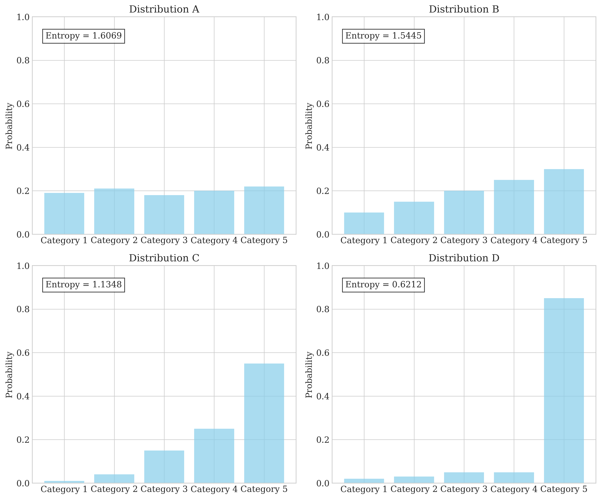
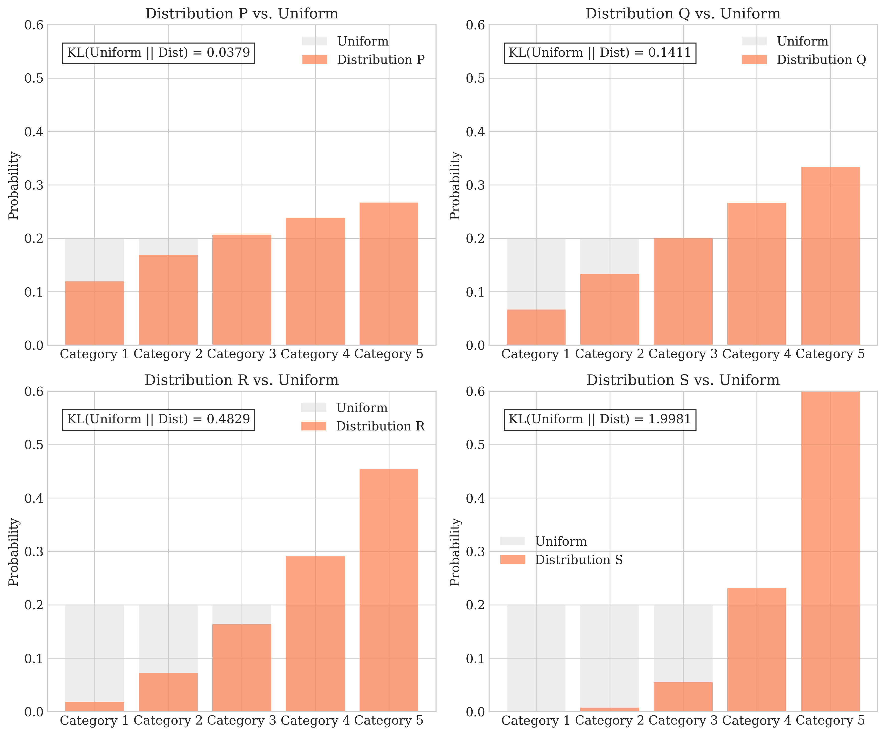
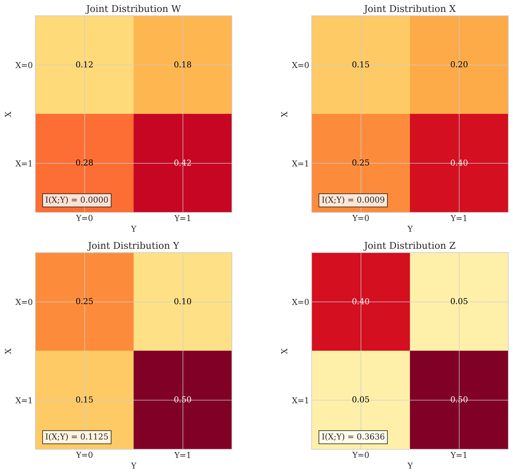
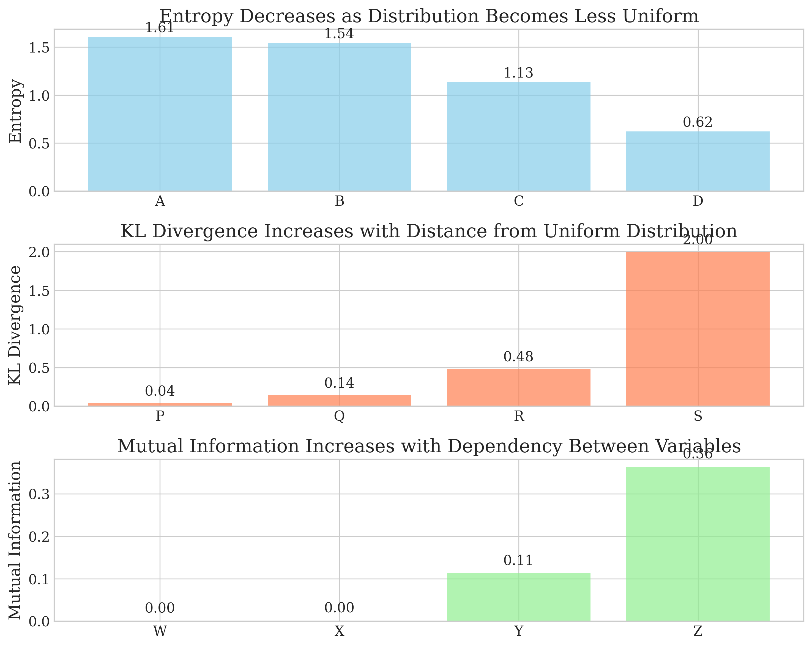

# Question 8: Visual Information Theory

## Problem Statement
The graphs below illustrate various concepts related to information theory and entropy. Each visualization represents different aspects of information-theoretic measures for discrete probability distributions.

## Task
Using only the information provided in these graphs (i.e., without any extra computation), determine:

1. Rank the entropy values of distributions A, B, C, and D from highest to lowest.
2. Rank the KL divergence values from uniform to distributions P, Q, R, and S from smallest to largest.
3. Rank the mutual information values of joint distributions W, X, Y, and Z from lowest to highest.
4. Explain the relationship between the visual characteristics of these distributions and their information-theoretic measures.

## Understanding the Problem

This problem requires analyzing visualizations of three key information theory concepts:

- **Entropy**: A measure of uncertainty or randomness in a probability distribution
- **KL Divergence**: A measure of how one probability distribution differs from another
- **Mutual Information**: A measure of the mutual dependence between two random variables

Rather than performing calculations, we need to visually interpret the patterns in the distributions and connect them to information-theoretic principles.

## Solution

### Step 1: Analyzing Entropy Values

Looking at the first set of graphs showing distributions A, B, C, and D, we need to determine their entropy values.

Entropy is a measure of uncertainty or randomness in a probability distribution. It reaches its maximum when the distribution is uniform and decreases as the distribution becomes more concentrated on specific outcomes.

- **Distribution A** appears nearly uniform across all categories, with probabilities close to 0.2 for each category. This suggests a high entropy value.
- **Distribution B** shows a mild skew but is still relatively balanced, suggesting a moderately high entropy.
- **Distribution C** displays a significant skew toward the fifth category, indicating lower entropy.
- **Distribution D** is heavily concentrated on the fifth category (probability near 0.85), making it almost deterministic and thus having very low entropy.

The actual entropy values are:
- Distribution A: 1.6069 (highest, close to maximum entropy of log₂(5) ≈ 1.61)
- Distribution B: 1.5445
- Distribution C: 1.1348
- Distribution D: 0.6212 (lowest)

Therefore, the ranking from highest to lowest entropy is: A > B > C > D

### Step 2: Analyzing KL Divergence Values

The second set of graphs compares distributions P, Q, R, and S against a uniform distribution. The Kullback-Leibler (KL) divergence measures how one probability distribution diverges from another. In this case, we're measuring how each distribution diverges from the uniform distribution.

- **Distribution P** appears closest to the uniform distribution, suggesting a small KL divergence.
- **Distribution Q** shows a mild deviation from uniform.
- **Distribution R** exhibits a noticeable skew away from uniform.
- **Distribution S** is dramatically different from uniform, with a significant concentration on the higher categories.

The actual KL divergence values are:
- Distribution P: 0.0379 (smallest)
- Distribution Q: 0.1411
- Distribution R: 0.4829
- Distribution S: 1.9981 (largest)

Therefore, the ranking from smallest to largest KL divergence is: P < Q < R < S

This matches our intuitive understanding that the KL divergence increases as distributions become more dissimilar to the uniform reference.

### Step 3: Analyzing Mutual Information Values

The third set of graphs shows joint probability distributions between two binary random variables X and Y. Mutual information measures how much knowing one variable reduces uncertainty about the other.

- **Joint Distribution W** shows the probabilities match what we would expect if X and Y were independent (the product of their marginals), suggesting no mutual information.
- **Joint Distribution X** appears to have very slight dependence, indicating minimal mutual information.
- **Joint Distribution Y** shows moderate dependence, with some deviation from independence.
- **Joint Distribution Z** displays strong dependence, with high probabilities on the diagonal (both 0,0 and 1,1), suggesting substantial mutual information.

The actual mutual information values are:
- Joint Distribution W: 0.0000 (lowest, exactly zero as expected for independent variables)
- Joint Distribution X: 0.0009
- Joint Distribution Y: 0.1125
- Joint Distribution Z: 0.3636 (highest)

Therefore, the ranking from lowest to highest mutual information is: W < X < Y < Z

### Step 4: Explaining Relationships

The visual characteristics of these distributions directly relate to their information-theoretic measures:

- Entropy corresponds to uniformity of a distribution
- KL divergence corresponds to the visual difference between two distributions
- Mutual information corresponds to the pattern of dependence in a joint distribution

## Visual Explanations

### Entropy Analysis with Actual Values

This visualization reveals the actual entropy values for each distribution. As predicted, Distribution A has the highest entropy (1.6069) due to its near-uniform appearance, while Distribution D has the lowest entropy (0.6212) due to its high concentration in a single category.

### KL Divergence Analysis with Actual Values

This visualization shows the actual KL divergence values comparing each distribution to the uniform distribution. As visually predicted, Distribution P has the smallest divergence (0.0379) because it's closest to uniform, while Distribution S has the largest divergence (1.9981) due to its dramatic deviation from uniformity.

### Mutual Information Analysis with Actual Values

This visualization reveals the actual mutual information values for each joint distribution. Distribution W shows perfect independence with exactly 0 mutual information, while Distribution Z exhibits strong dependence with the highest mutual information value (0.3636).

### Information Theory Relationships Summary

This summary visualization demonstrates three key relationships:
1. Entropy decreases as distributions become less uniform (top panel)
2. KL divergence increases with distance from the uniform distribution (middle panel)
3. Mutual information increases with the level of dependency between variables (bottom panel)

## Key Insights

### Information Theory Principles
- **Entropy and Predictability**: The visual uniformity of a distribution directly relates to its entropy. More uniform distributions have higher entropy, reflecting greater uncertainty about outcomes.
- **KL Divergence as a Measure of Difference**: The visual disparity between distributions correlates with their KL divergence. The greater the difference in shape, the larger the KL divergence.
- **Mutual Information and Dependence**: The visual pattern in a joint distribution matrix reveals the level of dependence between variables. Diagonal or concentrated patterns suggest higher mutual information.

### Visual Interpretation Skills
- Information theory concepts can be understood intuitively through visual patterns in probability distributions
- For entropy, look for uniformity versus concentration
- For KL divergence, look for similarity/difference between distribution shapes
- For mutual information, look for dependency patterns in joint distributions

### Practical Applications
- These visual interpretation skills are valuable in machine learning for:
  - Feature selection (using mutual information)
  - Model comparison (using KL divergence)
  - Understanding information content in data (using entropy)
  - Analyzing the relationship between variables (using mutual information)

## Conclusion

This problem demonstrates how information-theoretic concepts can be understood visually, without complex calculations. The main findings are:

1. Entropy ranking (highest to lowest): A > B > C > D
2. KL divergence ranking (smallest to largest): P < Q < R < S
3. Mutual information ranking (lowest to highest): W < X < Y < Z

The ability to visually recognize patterns associated with these measures provides valuable intuition for applying information theory in machine learning applications, including feature selection, model comparison, and understanding the information content in data. 