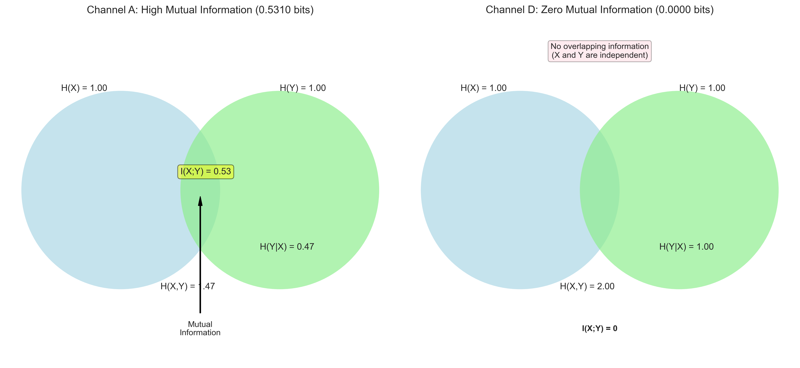
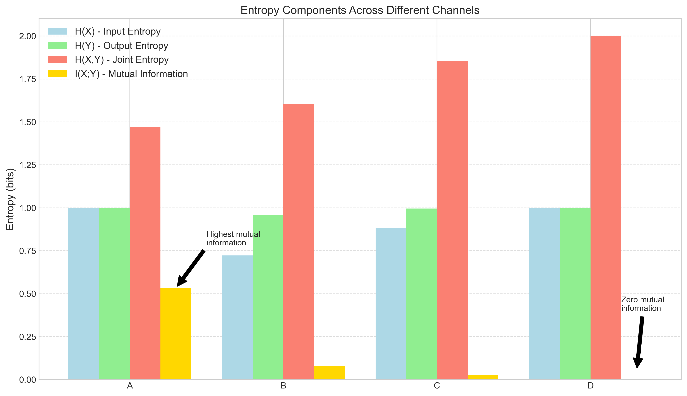
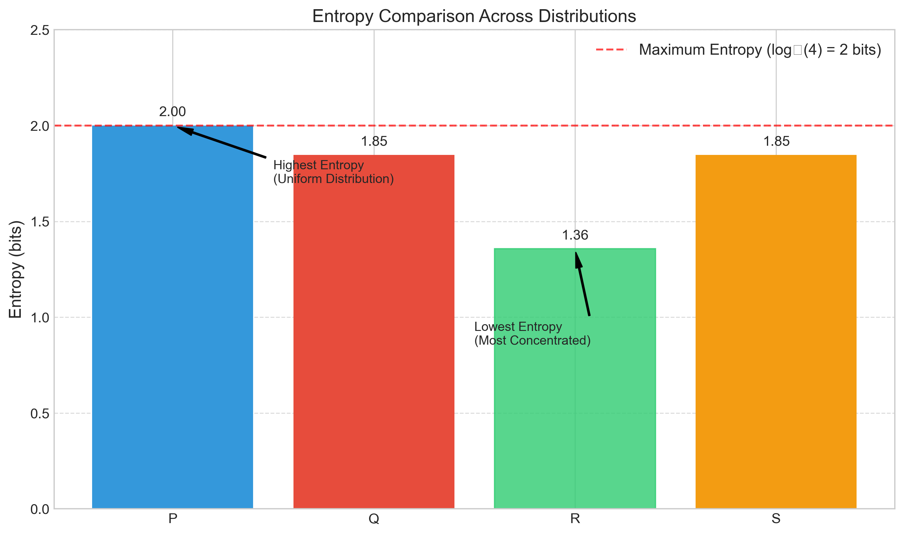
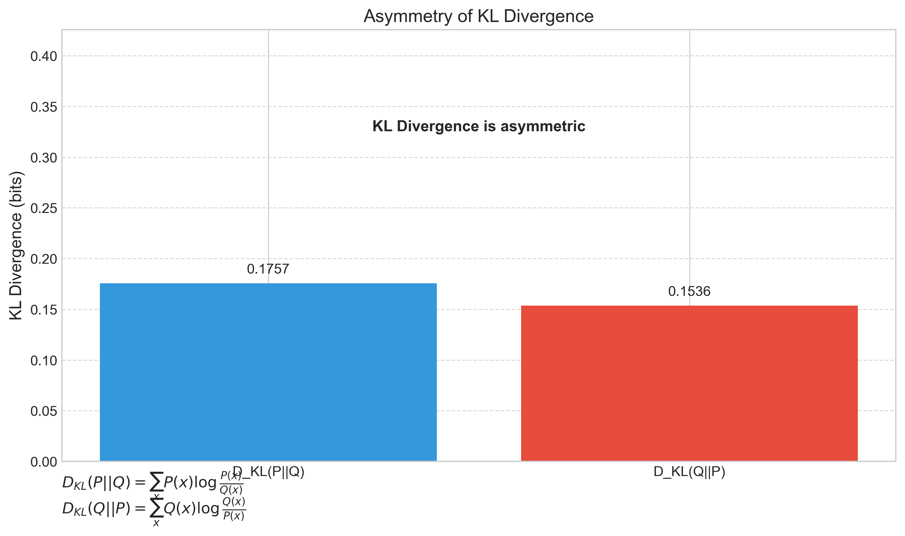
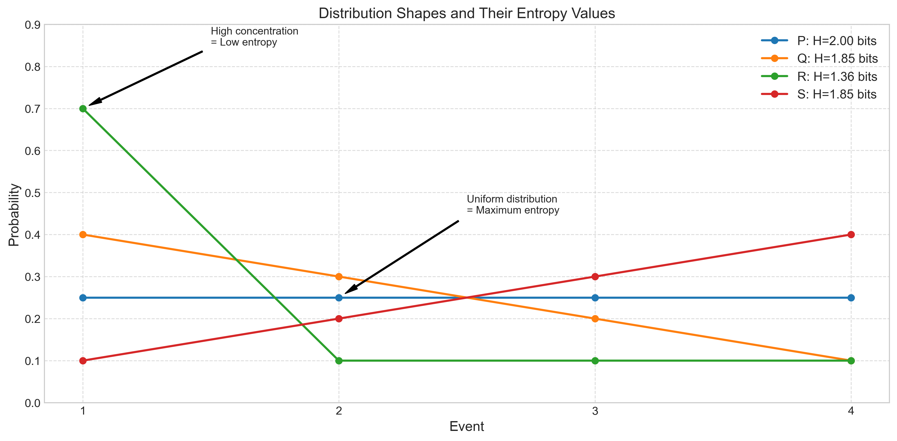

# Question 9: Information Theory in Communication Channels

## Problem Statement
The visualizations below illustrate various concepts from information theory applied to binary communication channels and probability distributions. Each visualization represents different aspects of entropy, mutual information, cross-entropy, and KL divergence.

### Task
Using only the information provided in these visualizations, answer the following questions:

1. Identify the channel (A, B, C, or D) with the highest information transmission capacity and explain why.
2. Rank the four channels in terms of their mutual information values from highest to lowest.
3. For distribution R, explain why it has the lowest entropy among all distributions P, Q, R, and S.
4. Explain why the KL divergence $D_{KL}(P||Q)$ is not equal to $D_{KL}(Q||P)$ based on the visualization.
5. Identify which channel can be described as a "completely random" channel, and explain your reasoning.

## Understanding the Problem

This problem tests understanding of key information theory concepts:

- **Mutual Information**: A measure of the mutual dependence between two variables, quantifying how much information one variable provides about another
- **Entropy**: A measure of uncertainty or randomness in a random variable
- **KL Divergence**: A measure of how one probability distribution differs from another
- **Channel Capacity**: The maximum rate at which information can be transmitted through a channel

The visualizations show binary communication channels with different noise levels and probability distributions with different entropy and divergence values.

## Solution

### Step 1: Analyzing Channel Information Capacity

From the channel visualization and information measures in the first image, we can extract the following key information:

#### Channel Properties
| Channel | $P(Y=0\|X=0)$ | $P(Y=1\|X=0)$ | $P(Y=0\|X=1)$ | $P(Y=1\|X=1)$ | Mutual Info | Cond. Entropy |
|---------|---------------|---------------|---------------|---------------|-------------|---------------|
| A       | 0.90          | 0.10          | 0.10          | 0.90          | 0.5310      | 0.4690        |
| B       | 0.70          | 0.30          | 0.30          | 0.70          | 0.0768      | 0.8813        |
| C       | 0.60          | 0.40          | 0.40          | 0.60          | 0.0244      | 0.9710        |
| D       | 0.50          | 0.50          | 0.50          | 0.50          | 0.0000      | 1.0000        |

The mutual information between input $X$ and output $Y$ is calculated as:

$$I(X;Y) = H(Y) - H(Y|X)$$

Where $H(Y)$ is the entropy of the output and $H(Y|X)$ is the conditional entropy of the output given the input.

#### 1. Highest Information Transmission Capacity: Channel A
- **Mutual Information**: 0.5310 bits
- Channel A has the highest mutual information because it has the strongest probability (0.9) of correctly transmitting bits. This means that observing the output provides substantial information about what the input was.
- Mutual information quantifies how much information about $X$ is gained by observing $Y$. Higher values indicate better information transmission.

### Step 2: Ranking Channels by Mutual Information

The channels can be ranked by their mutual information values from highest to lowest:

1. Channel A: 0.5310 bits
2. Channel B: 0.0768 bits
3. Channel C: 0.0244 bits
4. Channel D: 0.0000 bits

This ranking directly correlates with how "reliable" each channel is in transmitting information. As the diagonal probabilities in the transition matrices decrease (from 0.9 to 0.5), the mutual information also decreases, indicating poorer information transmission.

### Step 3: Analyzing Distribution Entropy

From the second visualization showing probability distributions and KL divergence:

#### Distribution Properties
| Distribution | Event 1 | Event 2 | Event 3 | Event 4 | Entropy |
|--------------|---------|---------|---------|---------|---------|
| P            | 0.25    | 0.25    | 0.25    | 0.25    | 2.0000  |
| Q            | 0.40    | 0.30    | 0.20    | 0.10    | 1.8464  |
| R            | 0.70    | 0.10    | 0.10    | 0.10    | 1.3568  |
| S            | 0.10    | 0.20    | 0.30    | 0.40    | 1.8464  |

Entropy is calculated using the formula:

$$H(X) = -\sum_{i} p(x_i) \log_2 p(x_i)$$

#### 3. Why Distribution R Has the Lowest Entropy
- **Entropy**: 1.3568 bits
- Distribution R $[0.7, 0.1, 0.1, 0.1]$ has the lowest entropy because:
  - It is the most 'certain' or least uniform distribution, with probability 0.7 concentrated on a single outcome (Event 1).
  - It has less uncertainty than the other distributions.
  - Entropy measures the average information content or 'surprise' in a probability distribution. More concentrated distributions have lower entropy.

In contrast, Distribution P has the highest entropy (2.0000 bits) because it's a uniform distribution with equal probabilities for all outcomes, representing maximum uncertainty.

### Step 4: Understanding KL Divergence Asymmetry

From the KL Divergence Matrix in the visualization:

| $D_{KL}(row\|\|col)$ | P      | Q      | R      | S      |
|----------------------|--------|--------|--------|--------|
| P                    | 0.0000 | 0.1757 | 0.6201 | 0.1757 |
| Q                    | 0.1536 | 0.0000 | 0.3525 | 0.6585 |
| R                    | 0.6432 | 0.3067 | 0.0000 | 1.5067 |
| S                    | 0.1536 | 0.6585 | 1.1948 | 0.0000 |

The KL divergence is calculated using:

$$D_{KL}(P||Q) = \sum_{x} P(x) \log\frac{P(x)}{Q(x)}$$

- **$D_{KL}(P\|\|Q)$** = 0.1757 bits
- **$D_{KL}(Q\|\|P)$** = 0.1536 bits

#### 4. Asymmetry of KL Divergence

The KL divergence is asymmetric because it measures the extra bits needed to encode samples from distribution P using an optimal code designed for distribution Q. This is fundamentally an asymmetric operation.

Mathematically, the two divergences are calculated differently:
- $D_{KL}(P\|\|Q) = \sum_{x} P(x) \log\frac{P(x)}{Q(x)}$
- $D_{KL}(Q\|\|P) = \sum_{x} Q(x) \log\frac{Q(x)}{P(x)}$

These are different calculations that generally yield different results. The asymmetry can be interpreted as:
- $D_{KL}(P\|\|Q)$: How well Q approximates P
- $D_{KL}(Q\|\|P)$: How well P approximates Q

This asymmetry is clearly visible in the KL divergence matrix, where off-diagonal elements across the main diagonal have different values.

### Step 5: Identifying the Random Channel

Channel D has the following properties:
- **Mutual Information**: 0.0000 bits
- **Conditional Entropy**: 1.0000 bit
- **Transition Probabilities**: All equal to 0.5

#### 5. The Completely Random Channel: Channel D

Channel D can be described as 'completely random' because:
  - Its transition probabilities are all 0.5, meaning the output $Y$ is equally likely to be 0 or 1 regardless of the input $X$.
  - Its mutual information is exactly 0 bits, indicating that knowing the output $Y$ provides absolutely no information about what the input $X$ was.
  - Its conditional entropy $H(Y|X)$ is 1.0000 bit, which is the maximum possible entropy for a binary variable.

In information-theoretic terms, this represents a channel where the output is completely independent of the input, essentially adding maximum noise to the signal. No information is preserved when transmitting through this channel.

## Visual Explanations

### Mutual Information as Overlapping Information

This visualization shows mutual information as the overlap between the entropy of $X$ and the entropy of $Y$. For Channel A (left), there is significant overlap, indicating high mutual information. For Channel D (right), there is no overlap, indicating zero mutual information and complete independence between input and output.

### Entropy Components Across Channels

This bar chart compares different entropy components across all four channels. Notice how mutual information (gold bars) decreases from Channel A to D, while conditional entropy increases. Channel D has zero mutual information, meaning no information is transmitted through the channel.

### Entropy Comparison Across Distributions

This chart compares the entropy values of the four distributions. Distribution P (uniform) has the maximum possible entropy of 2 bits, while Distribution R (highly concentrated) has the lowest entropy. This illustrates how concentration affects uncertainty.

### KL Divergence Asymmetry

This visualization demonstrates the asymmetry of KL divergence between distributions P and Q. The values $D_{KL}(P\|\|Q) = 0.1757$ and $D_{KL}(Q\|\|P) = 0.1536$ are different, confirming that KL divergence is not a symmetric measure.

### Distribution Shapes and Their Entropy

This plot shows the probability mass functions of the four distributions along with their entropy values. The uniform distribution P has the highest entropy, while the highly concentrated distribution R has the lowest entropy.

## Key Insights

### Theoretical Foundations
- Mutual information $I(X;Y)$ quantifies how much uncertainty about $X$ is reduced by observing $Y$.
- Entropy $H(X)$ measures the uncertainty in a random variable and reaches its maximum when the distribution is uniform.
- KL divergence $D_{KL}(P\|\|Q)$ measures the extra bits needed to encode samples from distribution P using a code optimized for Q.

### Relationships and Properties
- Mutual information and channel capacity: Higher mutual information indicates better information transmission capability.
- Noise and mutual information: As noise increases, mutual information decreases and conditional entropy increases.
- Entropy and concentration: More concentrated distributions have lower entropy than more uniform distributions.
- KL divergence asymmetry: $D_{KL}(P\|\|Q) \neq D_{KL}(Q\|\|P)$ because they measure different aspects of the relationship between distributions.

### Practical Applications
- Channel D represents a worst-case scenario in communication, where the receiver gains no information about the transmitted signal.
- The maximum entropy principle suggests that without additional constraints, the uniform distribution (P) is the least biased assumption.
- KL divergence asymmetry matters in machine learning when comparing models or optimizing distributions.
- These concepts directly relate to Claude Shannon's original application of information theory to communication channels, examining how much information can be reliably transmitted through noisy channels.

## Conclusion
This problem demonstrates how visualizations can help understand complex information-theoretic concepts and their practical implications. By examining channel properties, entropy values, and divergence measures, we gain insight into fundamental principles of information transmission, uncertainty, and distribution comparison that form the foundation of machine learning and communication theory. 